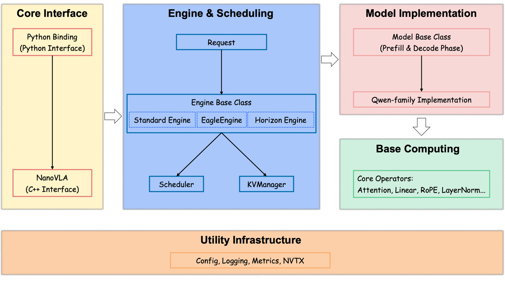
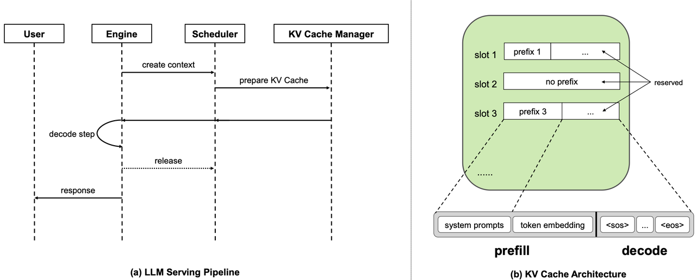
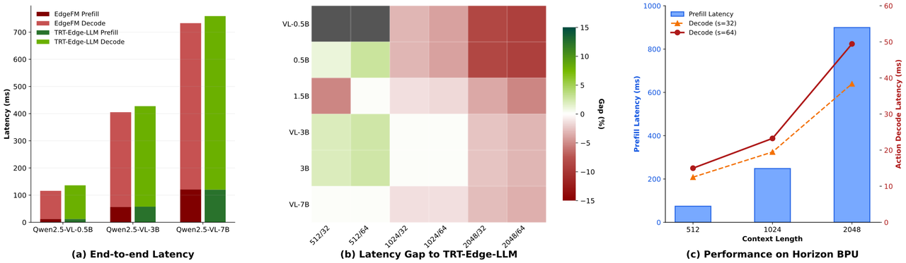

# EdgeFM

[](LICENSE)
[](https://cmake.org/)
[](https://en.cppreference.com/)
[](https://developer.nvidia.com/cuda-toolkit)

**🌐 Language / 语言**: English (current) | [中文](README.md)

EdgeFM (Edge Foundation Model) is a general-purpose large-model inference engine optimized specifically for edge-side scenarios. Tailored to the unique requirements of edge inference, EdgeFM provides efficient multimodal understanding, language generation, and decision reasoning capabilities. It is widely used in edge intelligence systems such as autonomous driving, embodied intelligence, and robot control, enabling the rapid deployment of edge-side large-model applications.

📄 **Paper**: [EdgeFM: Efficient Edge Inference for Vision-Language Models](https://arxiv.org/abs/2604.27476)

## EdgeFM Pipeline

<p align="center">
  
  <br><br>
  
</p>

## Features

- 🎯 **Minimalist design**: Tailored to the unique requirements of edge-side large-model inference, the inference framework design is greatly simplified. Compared with the complex continuous-batching and dynamic prefix-matching mechanisms used in the cloud, EdgeFM adopts fixed prefix caching and a single-request processing model, significantly reducing system complexity and improving maintainability
- ⚡ **Extreme performance**: Deeply integrates high-performance operator libraries such as FlashInfer, and supports cutting-edge efficient LLM operators such as SageAttention and MLA (Multi-head Latent Attention). It performs dedicated operator optimizations for the special shapes of edge-side large models (such as multimodal token sequence lengths) to fully exploit hardware compute power
- 🛠️ **Easy to use**: Inference parameters (such as sampling strategy, KV cache configuration, etc.) are managed uniformly through a configuration file, simplifying the `generate` interface call. It also provides Python bindings based on pybind11, supporting rapid validation and convenient integration
- 🔌 **Good extensibility**: Adopts a modular architecture design and supports cross-platform deployment. The currently primary maintained platforms are NVIDIA RTX 3060, NVIDIA A800, Jetson Orin, and Horizon J6M.

## Hardware Support

| Hardware Platform | Status | Description |
|---------|------|------|
| x86 (NVIDIA RTX 3060 / A800) | ✅ Supported | Based on a unified CUDA/x86 build environment, with target platforms distinguished by `PLATFORM=3060|a800` |
| NVIDIA Jetson Orin | ✅ Supported | arm64 Docker build environment based on `nvcr.io/nvidia/l4t-jetpack:r36.4.0` |
| Horizon J6M | 🔄 Build verification in progress | Horizon J6M compilation preparation path and Docker build environment |

## System Requirements

- **CMake**: 3.15 or higher
- **C++ compiler**: Supporting the C++17 standard (GCC 7+, Clang 5+, MSVC 2017+)
- **Python**: 3.10+ (for Python bindings and tests)

### Platform-Specific Requirements

- **CUDA/x86 platforms (3060, a800)**:
  - **CUDA**: Requires the CUDA 12.6.3 toolchain
  - **cuDNN**: Requires the cuDNN library
  - **TensorRT**:
    - By default, CMake looks for it under `/usr/local/TensorRT`
    - By default, `scripts/docker/build_cuda.sh` reads TensorRT from the host's `/usr/local/TensorRT-10.15.1.29` and bakes it into the container at `/usr/local/TensorRT`
    - The CUDA/x86 TRT-Edge-LLM path requires TensorRT `>= 10.15`
    - The script checks the path, header files, library files, and version of `EDGE_FM_HOST_TRT_DIR` before launching Docker; if the requirements are not met, it reports an error and exits directly
- **Horizon J6M platform**:
  - Platform-specific dependencies (to be added)
  - `examples/config/platform/j6m/` currently only materializes `engine_default.json`, and the platform-side `operator_impl_table*.json` is no longer maintained

## Installation

### Prerequisites

Install the corresponding dependencies according to the target platform:

#### CUDA/x86 platforms (3060, a800)

1. **CUDA Toolkit**
   ```bash
   # Check whether CUDA is installed
   nvcc --version
   ```

#### Horizon J6M platform

Platform-specific dependencies (to be added)

### Build Steps

1. **Clone the repository and initialize submodules**
   ```bash
   git clone git@github.com:MenglingD/edge-fm.git
   cd edge-fm
   git submodule update --init --recursive
   ```

2. **Configure and build**

   Using the default platform (a800):
   ```bash
   cmake --preset a800
   cmake --build --preset a800 --parallel $(nproc)
   cmake --install build-a800
   ```

   Specifying the target platform:
   ```bash
   cmake --preset 3060         # NVIDIA RTX 3060
   # or
   cmake --preset a800         # NVIDIA A800
   # or
   cmake --preset orin         # NVIDIA Jetson Orin
   # or
   cmake --preset j6m          # Horizon J6M
   cmake --build --preset <preset> --parallel $(nproc)
   cmake --install build-<platform>
   ```

   Do not run `cmake .` or `cmake -S . -B .` in the source root directory. The project is fixed to use the out-of-source directories `build-3060`, `build-a800`, `build-orin`, and `build-j6m`.

   Supported platform options:
   - `3060`: NVIDIA RTX 3060 (x86_64)
   - `a800`: NVIDIA A800 (x86_64 / SM80)
   - `orin`: NVIDIA Jetson Orin (aarch64)
   - `j6m`: Horizon Journey J6M compilation preparation platform

### Jetson Orin Docker Build

The repository provides 3 Docker build entry points consolidated by platform family:

```bash
# CUDA/x86 family, defaults to 3060; can be overridden with EDGE_FM_PLATFORM=a800
EDGE_FM_HOST_TRT_DIR=/usr/local/TensorRT-10.15.1.29 bash scripts/docker/build_cuda.sh image
EDGE_FM_HOST_TRT_DIR=/usr/local/TensorRT-10.15.1.29 bash scripts/docker/build_cuda.sh verify

# Orin
bash scripts/docker/build_orin.sh image
EDGE_FM_BUILD_JOBS=1 bash scripts/docker/build_orin.sh verify

# Horizon / J6M
bash scripts/docker/build_hrz.sh configure
```

- CUDA/x86 Dockerfile: `docker/cuda12.6.3_cudnn_trt10.15.dockerfile`
- Orin Dockerfile: `docker/orin-l4t-jetpack-r36.4.0.dockerfile`
- Horizon Dockerfile: `docker/hrz-j6m.dockerfile`
- All Docker entry scripts are located in `scripts/docker/`

Notes on `build_cuda.sh`:

- `EDGE_FM_HOST_TRT_DIR` defaults to `/usr/local/TensorRT-10.15.1.29`
- The script requires that directory to contain at least:
  - `include/NvInfer.h`
  - `include/NvOnnxParser.h`
  - `lib/libnvinfer.so*`
  - `lib/libnvonnxparser.so*`
- The script parses the version from `NvInferVersion.h` and prints:
  - The current TensorRT path
  - The current TensorRT version
  - The minimum version required for CUDA/x86
- If the version is lower than `10.15`, the script will prompt and exit before the Docker build, for example:

```text
ERROR: TensorRT 10.3.x found in /path/to/TensorRT,
       but CUDA/x86 build_cuda.sh requires TensorRT >= 10.15.
       Update EDGE_FM_HOST_TRT_DIR to a newer TensorRT package and retry.
```

Notes on the `TensorRT-Edge-LLM` benchmark:

- `tests/scripts/setup_trt_edgellm_benchmark.sh` now only initializes `3rdParty/nlohmannJson`
- `3rdParty/NVTX` is no longer explicitly pulled in by the main-repo script, because the current default path does not enable `ENABLE_NVTX_PROFILING`
- If you need NVTX markers for profiling, separately initialize `3rdParty/NVTX` on the `third_party/TensorRT-Edge-LLM` side and enable that option

### Python Bindings

After the build completes, the Python module will be generated in the `build-<platform>/install/python/` directory, for example `build-a800/install/python/`.

Add the Python module path to `PYTHONPATH`:
```bash
export PYTHONPATH=$PYTHONPATH:/path/to/edge-fm/build-a800/install/python
```

## Usage Examples

### C++ Interface

```cpp
#include <edge-fm/edge-fm.h>
#include <vector>

using namespace edge_fm;

// Initialize the inference engine
EdgeFM engine("examples/qwen2.5-vl/config.json");

// Create a request (text only)
std::vector<int32_t> token_ids = {151643, 151644, 198, 2610, 525, 198};
Request request(0, token_ids);

// Generate a response
Response response = engine.generate(request);

// Get the generated token IDs
const auto& generated_tokens = response.token_ids();
```

### Python Interface

```python
import edge_fm

# Initialize the inference engine
engine = edge_fm.EdgeFM("examples/qwen2.5-vl/config.json")

# Create a request (text only)
token_ids = [151643, 151644, 198, 2610, 525, 198]
request = edge_fm.Request(request_id=0, token_ids=token_ids)

# Generate a response
response = engine.generate(request)

# Get the generated token IDs
generated_tokens = response.token_ids()
```

### Qwen2.5-VL Usage Example

The repository provides a complete Qwen2.5-VL usage example, located in the `examples/qwen2.5-vl/` directory:

1. **Download the model** (if needed):
   ```bash
   cd examples/qwen2.5-vl
   ./download.sh
   ```

2. **Run inference**:
   ```bash
   # Python example
   python3 generate.py
   ```

3. **Configuration file**: `examples/qwen2.5-vl/config.json` contains a complete configuration example, including:
   - Two-stage model path configuration (prefill/decode)
   - Speculative sampling configuration (EAGLE3)
   - KV cache configuration (including prefix token ids)
   - Sampling parameter configuration

### Inference Configuration File (JSON)

The configuration file is in JSON format. Description of the core fields:

- **`prefill_model_path` / `decode_model_path`**: Two-stage model path configuration
- **`speculative`**: Speculative Sampling configuration
- **`runtime`**: Engine runtime / execution strategy configuration
- **`kvcache`**: KV cache management strategy, including compression configuration and request slot configuration
- **`sampling`**: Sampling parameter configuration (temperature, top_k, top_p, max_new_tokens)

For more detailed configuration descriptions, please refer to `examples/qwen2.5-vl/config.json` and `examples/config/base/engine_default.json`.

## Supported Models List

| Model Series | Status | Description |
|---------|------|------|
| Qwen2.5 | ✅ Supported | Tongyi Qianwen 2.5 series models<br>Supports model file format conversion (refer to `scripts/convert_qwen3.py`) |
| Qwen3.5 | ✅ Runtime supported | Supports `examples/qwen3.5-0.8b` and `examples/qwen3.5-2b` text-only greedy generation; CUDA graph decode is enabled |
| More models | 🔄 Planned support | Support for more models is under development... |

## Performance Testing

### Inference Performance Overview

The detailed performance tables are consolidated in [edge_fm_benchmark_tables.md](doc/edge_fm_benchmark_tables.md). The README only keeps the key conclusions, to avoid having the multi-hardware, multi-model matrix make the homepage too long.

<p align="center">
  
  <br><em>Performance metric comparison (x86 / Orin / J6M)</em>
</p>

| Platform / Model | Key Conclusion |
|---|---|
| RTX 3060 / Qwen2.5 LLM | In the current matrix, EdgeFM CUDA graph is faster than TRT-Edge-LLM on `16/18` shapes |
| A800 / Qwen2.5-VL | Faster than TRT-Edge-LLM on most long-context decode cases; see the document for the full table |
| Jetson Orin / Qwen2.5-VL-0.5B | End-to-end latency for `512/32` and `1024/32` has been recorded; EdgeFM total latency is about `27.7% - 32.8%` faster |
| Horizon J6M / SmolVLA-0.45B | Prefill and Action Expert decode latency has been recorded, used for edge-platform regression |

**Latest key Qwen3.5 EdgeFM-only metrics** (RTX 3060, CUDA graph on, text-only greedy, in ms; TRT comparison still awaits the TensorRT-Edge-LLM Qwen3.5 port):

| Model | Shape | Total avg | Prefill | Decode step |
|---|---:|---:|---:|---:|
| Qwen3.5-0.8B | 128/32 | 188.130 | 19.647 | 5.430 |
| Qwen3.5-0.8B | 1024/128 | 830.181 | 127.535 | 5.530 |
| Qwen3.5-2B | 128/32 | 405.948 | 33.126 | 12.020 |
| Qwen3.5-2B | 1024/128 | 1748.435 | 202.427 | 12.171 |

The full Qwen3.5 graph-on/off matrix can be found in [doc/edge_fm_benchmark_tables.md](doc/edge_fm_benchmark_tables.md).

### Running Performance Tests

You can use the performance testing tools provided by the project for benchmarking:

```bash
# Python performance test
cd tests/benchmark
python test_attn.py --model <model_path> --config <config_path>
```

## Project Structure

```
edge-fm/
├── cmake/                  # CMake modules and tools
├── include/                # Public header files
│   └── edge-fm/
│       ├── core.h        # Core type definitions
│       └── edge-fm.h    # Main interface
├── src/                  # Source code
│   ├── engine/           # EdgeFM facade, configuration, engine factory and task engines
│   │   ├── tasks/
│   │   │   ├── token_generation/     # generate(), KVManager, scheduler, compact vocab
│   │   │   ├── trajectory_planning/  # plan(), PlannerStateManager, planner policy
│   │   │   └── stage_execution/      # run_stage() and named stage test runner
│   │   └── experimental/speculative/ # Speculative sampling prototype
│   ├── backends/         # Horizon artifact/cache/runtime backend boundary
│   ├── layers/           # Model layer semantics, weight layout and layer-level calls
│   ├── operators/        # operator registry, implementation tables, CUDA/CUTLASS/FlashInfer kernels
│   ├── models/           # Model implementations
│   │   └── qwen2_5/      # Qwen2.5-VL model
│   ├── python/           # Python bindings
│   ├── utils/            # Utility functions
│   └── edge-fm.cpp      # Main implementation
├── examples/             # Usage examples
│   ├── config/           # Configuration file examples
│   ├── qwen2.5-vl/       # Qwen2.5-VL example
│   └── qwen3.5-*/        # Qwen3.5 checkpoint download and EdgeFM/HF smoke examples
├── tests/                # Test files
│   ├── benchmark/        # Performance tests
│   └── models/           # Model tests
├── scripts/              # Utility scripts
├── third_party/          # Third-party dependencies (Git submodules)
```

## Performance Optimization

For edge-side large-model inference scenarios, EdgeFM applies deep optimization across multiple dimensions to achieve extreme performance:

### Tuning Approaches

EdgeFM supports layered tuning, avoiding mixing runtime selection, platform configuration, and offline kernel search together:

- **Built-in config-driven tuning**: The CUDA Qwen2.5 / Qwen2.5-VL path can generate a lightweight
  `cuda_operator_tuning` cache, `operator_impl_table.json`, and
  `tuning_report.json` via `engine.tune()` or by configuring `tuning.enabled=true`. The current built-in tuner only
  covers candidates that do not require recompilation,
  mainly including FlashInfer attention parameters and the cuBLASLt linear `algo_index`.
- **Operator table consolidating choices**: Platform configuration can use `operator_impl_table`
  to fix already-validated operator implementations and parameters by model, hardware profile, stage, and shape.
  The runtime only consumes these records and does not generate or compile kernels on the fly.
- **Offline CUDA/CUTLASS continuous optimization**: CUTLASS/source-op kernel tuning typically involves
  code generation, template instantiation, compilation, NSYS/NCU profiling, and multiple rounds of correctness /
  benchmark verification, and is not the responsibility of the EdgeFM runtime automatic tuner. Such optimization should be done
  offline using `$edge-fm-cuda-kernel-optimizer`, and accepted results are then migrated back to
  `src/operators`, `src/layers`, or `operator_impl_table`.

The CUDA/CUTLASS kernel tuning workflow for new hardware platforms is described in
[EdgeFM CUDA Kernel Optimizer User Guide](doc/cuda_kernel_optimizer_guide.md).
This guide covers skill installation, the GPU profiling environment, EdgeFM vs TRT-Edge-LLM
alignment benchmarks, NSYS/NCU attribution, operator table/source-op tuning, and the
Humanize + KernelPilot long loop.

The J6M/Horizon build keeps dependencies minimal: by default it only configures core common dependencies, and does not discover or introduce
CUDA, CUTLASS, FlashInfer, safetensors-cpp, TensorRT, or Python binding-related dependencies.
The CUDA platform still retains CUTLASS/source-op as the offline optimization and migration route for high-performance kernels.

### Efficient Operator Implementations

- **High-performance operator library integration**: Deeply integrates industry-leading high-performance operator libraries such as FlashInfer, providing optimized attention mechanisms and matrix operations
- **Cutting-edge operator support**: Supports cutting-edge efficient LLM operators such as SageAttention and MLA (Multi-head Latent Attention), fully exploiting hardware compute power
- **Multimodal optimization**: Performs dedicated operator optimizations for the special shapes of edge-side large models (such as multimodal token sequence lengths), supporting multiple modalities such as vision, language, and action

### Simplified Logic Design

- **Single-request processing model**: Targeting edge-side single-user scenarios, it abandons the complex continuous-batching and dynamic scheduling mechanisms, greatly simplifying system complexity
- **Fixed prefix caching**: Adopts a fixed prefix KV cache mechanism to pre-cache common request prefixes, avoiding redundant computation and significantly improving inference efficiency
- **Lightweight architecture**: Removes unnecessary batching and parallel scheduling logic, focusing on single-request low-latency inference

### Extreme Performance Optimization

- **Two-stage quantization strategy**: Supports configuring different quantization models for the prefill and decode stages, choosing the optimal quantization precision for the computational characteristics of each stage, balancing first-token latency and continuation throughput
- **Task-specific optimization**: For specific application scenarios such as autonomous driving and embodied intelligence, it reduces the model parameter count and computation through techniques such as vocabulary pruning and model compression, improving inference speed
- **Efficient speculative sampling**: Integrates efficient speculative sampling models (such as EAGLE3), which use a draft model to quickly generate candidate token sequences, significantly improving generation throughput
- **KV compression algorithms**: Supports cutting-edge KV cache compression algorithms such as FlashMLA, greatly reducing memory usage while maintaining inference quality and improving system resource utilization

## Contributing

Issues and Pull Requests are welcome!

## License

This project is licensed under the MIT License. See the [LICENSE](LICENSE) file for details.

## Contact

If you have any questions or suggestions, please contact us via Issues, or scan the QR code to join the community discussion group:

<p align="center">
  
</p>
