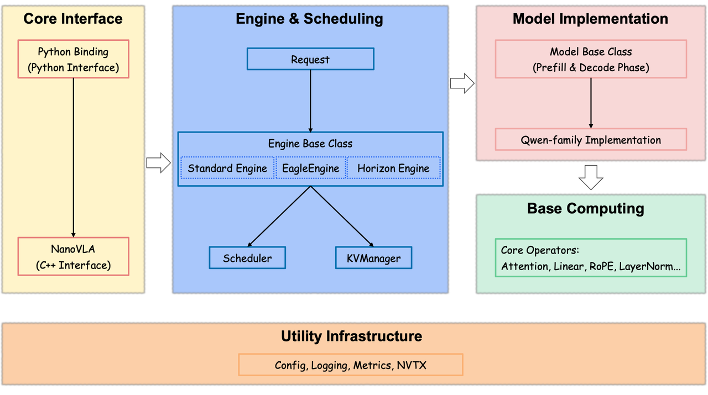
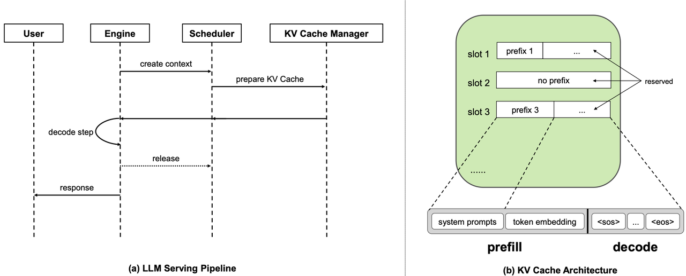
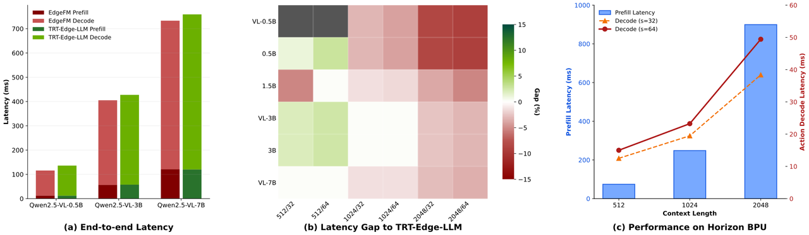

# EdgeFM

[](LICENSE)
[](https://cmake.org/)
[](https://en.cppreference.com/)
[](https://developer.nvidia.com/cuda-toolkit)

EdgeFM（Edge Foundation Model）是一个专为边缘端场景优化的通用大模型推理引擎。EdgeFM 针对边缘端推理的独特需求，提供高效的多模态理解、语言生成和决策推理能力，广泛应用于自动驾驶、具身智能、机器人控制等边缘端智能系统，助力边缘端大模型应用的快速部署。

📄 **论文**：[EdgeFM: Efficient Edge Inference for Vision-Language Models](https://arxiv.org/abs/2604.27476)

## EdgeFM Pipeline

<p align="center">
  
  <br><br>
  
</p>

## 特性

- 🎯 **极简设计**：针对边缘端大模型推理的独特需求，大幅简化推理框架设计。相比云端复杂的 continuous-batching 和动态前缀匹配机制，EdgeFM 采用固定前缀缓存和单请求处理模式，显著降低系统复杂度，提升可维护性
- ⚡ **极致性能**：深度集成 FlashInfer 等高性能算子库，并支持 SageAttention、MLA（Multi-head Latent Attention）等前沿高效 LLM 算子。针对边缘端大模型的特殊尺寸（如多模态 token 序列长度）进行专门的算子优化，充分发挥硬件算力
- 🛠️ **简单易用**：通过配置文件统一管理推理参数（如采样策略、KV cache 配置等），简化 `generate` 接口调用。同时提供基于 pybind11 的 Python 绑定，支持快速验证和便捷集成
- 🔌 **良好扩展性**：采用模块化架构设计，支持跨平台部署。目前主维护平台为 NVIDIA RTX 3060、NVIDIA A800、Jetson Orin 和地平线 J6M。

## 硬件支持

| 硬件平台 | 状态 | 说明 |
|---------|------|------|
| x86 (NVIDIA RTX 3060 / A800) | ✅ 已支持 | 基于统一的 CUDA/x86 构建环境，按 `PLATFORM=3060|a800` 区分目标平台 |
| NVIDIA Jetson Orin | ✅ 已支持 | 基于 `nvcr.io/nvidia/l4t-jetpack:r36.4.0` 的 arm64 Docker 构建环境 |
| 地平线 J6M | 🔄 构建验证中 | Horizon J6M 编译准备路径和 Docker 构建环境 |

## 系统要求

- **CMake**: 3.15 或更高版本
- **C++ 编译器**: 支持 C++17 标准（GCC 7+, Clang 5+, MSVC 2017+）
- **Python**: 3.10+（用于 Python 绑定和测试）

### 平台特定要求

- **CUDA/x86 平台（3060、a800）**：
  - **CUDA**: 需要 CUDA 12.6.3 工具链
  - **cuDNN**: 需要 cuDNN 库
  - **TensorRT**:
    - CMake 默认从 `/usr/local/TensorRT` 查找
    - `scripts/docker/build_cuda.sh` 默认从宿主机 `/usr/local/TensorRT-10.15.1.29` 读取 TensorRT，并烘焙到容器内 `/usr/local/TensorRT`
    - CUDA/x86 的 TRT-Edge-LLM 路径要求 TensorRT `>= 10.15`
    - 脚本会在启动 Docker 之前检查 `EDGE_FM_HOST_TRT_DIR` 的路径、头文件、库文件和版本；不满足要求会直接报错退出
- **地平线 J6M 平台**：
  - 平台特定依赖（待补充）
  - `examples/config/platform/j6m/` 当前只物化 `engine_default.json`，不再维护平台侧 `operator_impl_table*.json`

## 安装

### 前置依赖

根据目标平台安装相应依赖：

#### CUDA/x86 平台（3060、a800）

1. **CUDA 工具包**
   ```bash
   # 检查 CUDA 是否安装
   nvcc --version
   ```

#### 地平线 J6M 平台

平台特定依赖（待补充）

### 构建步骤

1. **克隆仓库并初始化子模块**
   ```bash
   git clone git@github.com:MenglingD/edge-fm.git
   cd edge-fm
   git submodule update --init --recursive
   ```

2. **配置和构建**

   使用默认平台（a800）：
   ```bash
   cmake --preset a800
   cmake --build --preset a800 --parallel $(nproc)
   cmake --install build-a800
   ```

   指定目标平台：
   ```bash
   cmake --preset 3060         # NVIDIA RTX 3060
   # 或
   cmake --preset a800         # NVIDIA A800
   # 或
   cmake --preset orin         # NVIDIA Jetson Orin
   # 或
   cmake --preset j6m          # Horizon J6M
   cmake --build --preset <preset> --parallel $(nproc)
   cmake --install build-<platform>
   ```

   不要在源码根目录执行 `cmake .` 或 `cmake -S . -B .`。项目已固定使用 `build-3060`、`build-a800`、`build-orin`、`build-j6m` 这些 out-of-source 目录。

   支持的平台选项：
   - `3060`: NVIDIA RTX 3060（x86_64）
   - `a800`: NVIDIA A800（x86_64 / SM80）
   - `orin`: NVIDIA Jetson Orin（aarch64）
   - `j6m`: 地平线征程 J6M 编译准备平台

### Jetson Orin Docker 构建

仓库提供了 3 个按平台家族收敛的 Docker 构建入口：

```bash
# CUDA/x86 家族，默认 3060；可用 EDGE_FM_PLATFORM=a800 覆盖
EDGE_FM_HOST_TRT_DIR=/usr/local/TensorRT-10.15.1.29 bash scripts/docker/build_cuda.sh image
EDGE_FM_HOST_TRT_DIR=/usr/local/TensorRT-10.15.1.29 bash scripts/docker/build_cuda.sh verify

# Orin
bash scripts/docker/build_orin.sh image
EDGE_FM_BUILD_JOBS=1 bash scripts/docker/build_orin.sh verify

# Horizon / J6M
bash scripts/docker/build_hrz.sh configure
```

- CUDA/x86 Dockerfile：`docker/cuda12.6.3_cudnn_trt10.15.dockerfile`
- Orin Dockerfile：`docker/orin-l4t-jetpack-r36.4.0.dockerfile`
- Horizon Dockerfile：`docker/hrz-j6m.dockerfile`
- 所有 Docker 入口脚本位于 `scripts/docker/`

`build_cuda.sh` 相关说明：

- `EDGE_FM_HOST_TRT_DIR` 默认为 `/usr/local/TensorRT-10.15.1.29`
- 脚本要求该目录至少包含：
  - `include/NvInfer.h`
  - `include/NvOnnxParser.h`
  - `lib/libnvinfer.so*`
  - `lib/libnvonnxparser.so*`
- 脚本会从 `NvInferVersion.h` 解析版本，并打印：
  - 当前 TensorRT 路径
  - 当前 TensorRT 版本
  - CUDA/x86 所需最低版本
- 若版本低于 `10.15`，脚本会在 Docker 构建前直接提示并退出，例如：

```text
ERROR: TensorRT 10.3.x found in /path/to/TensorRT,
       but CUDA/x86 build_cuda.sh requires TensorRT >= 10.15.
       Update EDGE_FM_HOST_TRT_DIR to a newer TensorRT package and retry.
```

`TensorRT-Edge-LLM` benchmark 相关说明：

- `tests/scripts/setup_trt_edgellm_benchmark.sh` 现在只会初始化 `3rdParty/nlohmannJson`
- `3rdParty/NVTX` 不再由主仓脚本显式拉起，因为当前默认路径没有开启 `ENABLE_NVTX_PROFILING`
- 如果你需要 NVTX 标记做 profiling，再在 `third_party/TensorRT-Edge-LLM` 侧单独初始化 `3rdParty/NVTX` 并开启该选项

### Python 绑定

构建完成后，Python 模块将生成在 `build-<platform>/install/python/` 目录中，例如 `build-a800/install/python/`。

将 Python 模块路径添加到 `PYTHONPATH`：
```bash
export PYTHONPATH=$PYTHONPATH:/path/to/edge-fm/build-a800/install/python
```

## 使用样例

### C++ 接口

```cpp
#include <edge-fm/edge-fm.h>
#include <vector>

using namespace edge_fm;

// 初始化推理引擎
EdgeFM engine("examples/qwen2.5-vl/config.json");

// 创建请求（仅文本）
std::vector<int32_t> token_ids = {151643, 151644, 198, 2610, 525, 198};
Request request(0, token_ids);

// 生成响应
Response response = engine.generate(request);

// 获取生成的 token IDs
const auto& generated_tokens = response.token_ids();
```

### Python 接口

```python
import edge_fm

# 初始化推理引擎
engine = edge_fm.EdgeFM("examples/qwen2.5-vl/config.json")

# 创建请求（仅文本）
token_ids = [151643, 151644, 198, 2610, 525, 198]
request = edge_fm.Request(request_id=0, token_ids=token_ids)

# 生成响应
response = engine.generate(request)

# 获取生成的 token IDs
generated_tokens = response.token_ids()
```

### Qwen2.5-VL 使用示例

仓库提供了完整的 Qwen2.5-VL 使用示例，位于 `examples/qwen2.5-vl/` 目录：

1. **下载模型**（如需要）：
   ```bash
   cd examples/qwen2.5-vl
   ./download.sh
   ```

2. **运行推理**：
   ```bash
   # Python 示例
   python3 generate.py
   ```

3. **配置文件**：`examples/qwen2.5-vl/config.json` 包含了完整的配置示例，包括：
   - 两阶段模型路径配置（prefill/decode）
   - 投机采样配置（EAGLE3）
   - KV cache 配置（包含 prefix token ids）
   - 采样参数配置

### 推理配置文件（JSON）

配置文件采用 JSON 格式，核心字段说明：

- **`prefill_model_path` / `decode_model_path`**：两阶段模型路径配置
- **`speculative`**：投机采样（Speculative Sampling）配置
- **`runtime`**：引擎运行时/执行策略配置
- **`kvcache`**：KV cache 管理策略，包括压缩配置和请求槽位配置
- **`sampling`**：采样参数配置（temperature、top_k、top_p、max_new_tokens）

更详细的配置说明请参考 `examples/qwen2.5-vl/config.json` 和 `examples/config/base/engine_default.json`。

## 支持模型列表

| 模型系列 | 状态 | 说明 |
|---------|------|------|
| Qwen2.5 | ✅ 已支持 | 通义千问2.5系列模型<br>支持模型文件格式转换（参考 `scripts/convert_qwen3.py`） |
| 更多模型 | 🔄 计划支持 | 更多模型支持正在开发中... |

## 性能测试

### 推理性能

以下性能数据基于 EdgeFM 与 TRT-Edge-LLM 在不同硬件平台上的对比测试结果（单位：ms）。Shape 格式为 `Prefix/Suffix`，Gap 为 EdgeFM 相对 TRT-Edge-LLM 的差值百分比，负值表示 EdgeFM 更快。

<p align="center">
  
  <br><em>性能指标对比（x86 / Orin / J6M）</em>
</p>

### RTX 3060 Qwen2.5 LLM

RTX 3060 上的 Qwen2.5 LLM 默认路径已经不再使用内部 TensorRT engine
bridge：`qwen2_5` 运行时不加载 serialized TensorRT plan，也不创建
TensorRT execution context。当前主线是 `EdgeFM(cuda graph)` + source-op
CUTLASS/CUDA operator + FlashInfer/cuBLASLt，并通过
`examples/config/platform/3060/operator_impl_table_llm.json` 做 model/shape
级算子选择。

`TRT-Edge-LLM` 仍保留为 benchmark reference；仓库里的 `edge_fm_trt`
Python 模块和 `tests/data/trt_edgellm_workspace/*/llm.engine` 只用于对照
测试。默认关闭的 plugin-op 只允许复用 source-visible plugin/kernel 资产，
不作为 TensorRT engine bridge。

最新 3060 LLM 全矩阵口径：

| 指标 | 结果 |
|------|------|
| 覆盖范围 | `Qwen2.5-{0.5B,1.5B,3B}` × `prefill={512,1024,2048}` × `decode={32,64}` |
| 相对最新 TRT-Edge-LLM | `16/18` case 更快 |
| 最大稳定剩余 gap | `1.5B / 512x64`，EdgeFM 比 TRT 慢约 `0.9 ms` |
| 当前状态 | 0.5B 和 3B 全 shape 快于 TRT-Edge-LLM；1.5B 512x32 已接近测量噪声 |
| 默认路径 | 无内部 TRT engine bridge；source-op/FlashInfer/cuBLASLt 组合 |

最新 18-case 明细如下。Prefill/Decode gap 为百分比差值，Total gap 为
`EdgeFM - TRT-Edge-LLM`；负数表示 EdgeFM 更快：

| Model | Shape | EdgeFM Prefill | TRT Prefill | Prefill Gap | EdgeFM Decode | TRT Decode | Decode Gap | EdgeFM Total | TRT Total | Total Gap |
|------|------:|-------------:|----------:|----:|-------------:|----------:|----:|-------------:|----------:|----:|
| 0.5B | 512x32 | `12.771 ms` | `22.690 ms` | `-43.71%` | `113.713 ms` | `112.223 ms` | `+1.33%` | `126.609 ms` | `134.979 ms` | `-8.370 ms` |
| 0.5B | 512x64 | `12.581 ms` | `22.097 ms` | `-43.07%` | `229.936 ms` | `226.283 ms` | `+1.61%` | `242.668 ms` | `248.447 ms` | `-5.778 ms` |
| 0.5B | 1024x32 | `24.929 ms` | `25.779 ms` | `-3.30%` | `115.542 ms` | `115.702 ms` | `-0.14%` | `140.586 ms` | `141.554 ms` | `-0.969 ms` |
| 0.5B | 1024x64 | `24.545 ms` | `25.115 ms` | `-2.27%` | `232.790 ms` | `232.478 ms` | `+0.13%` | `257.486 ms` | `257.671 ms` | `-0.185 ms` |
| 0.5B | 2048x32 | `48.647 ms` | `46.500 ms` | `+4.62%` | `119.411 ms` | `122.374 ms` | `-2.42%` | `168.178 ms` | `168.969 ms` | `-0.791 ms` |
| 0.5B | 2048x64 | `48.293 ms` | `45.789 ms` | `+5.47%` | `241.652 ms` | `246.137 ms` | `-1.82%` | `290.109 ms` | `292.024 ms` | `-1.915 ms` |
| 1.5B | 512x32 | `37.051 ms` | `36.739 ms` | `+0.85%` | `308.966 ms` | `308.493 ms` | `+0.15%` | `346.130 ms` | `345.300 ms` | `+0.830 ms` |
| 1.5B | 512x64 | `36.460 ms` | `36.804 ms` | `-0.94%` | `627.861 ms` | `626.698 ms` | `+0.19%` | `664.482 ms` | `663.594 ms` | `+0.888 ms` |
| 1.5B | 1024x32 | `73.272 ms` | `70.519 ms` | `+3.90%` | `311.203 ms` | `314.125 ms` | `-0.93%` | `384.591 ms` | `384.730 ms` | `-0.139 ms` |
| 1.5B | 1024x64 | `73.131 ms` | `70.548 ms` | `+3.66%` | `632.115 ms` | `637.963 ms` | `-0.92%` | `705.402 ms` | `708.590 ms` | `-3.188 ms` |
| 1.5B | 2048x32 | `147.361 ms` | `144.003 ms` | `+2.33%` | `319.242 ms` | `324.906 ms` | `-1.74%` | `466.729 ms` | `469.011 ms` | `-2.282 ms` |
| 1.5B | 2048x64 | `147.445 ms` | `144.953 ms` | `+1.72%` | `648.996 ms` | `660.188 ms` | `-1.70%` | `796.607 ms` | `805.288 ms` | `-8.681 ms` |
| 3B | 512x32 | `78.387 ms` | `76.599 ms` | `+2.33%` | `602.979 ms` | `609.515 ms` | `-1.07%` | `681.482 ms` | `686.182 ms` | `-4.700 ms` |
| 3B | 512x64 | `78.493 ms` | `76.855 ms` | `+2.13%` | `1225.296 ms` | `1239.115 ms` | `-1.12%` | `1303.951 ms` | `1316.090 ms` | `-12.139 ms` |
| 3B | 1024x32 | `146.907 ms` | `141.017 ms` | `+4.18%` | `610.708 ms` | `617.041 ms` | `-1.03%` | `757.754 ms` | `758.143 ms` | `-0.389 ms` |
| 3B | 1024x64 | `147.160 ms` | `141.210 ms` | `+4.21%` | `1240.852 ms` | `1253.712 ms` | `-1.03%` | `1388.178 ms` | `1395.001 ms` | `-6.824 ms` |
| 3B | 2048x32 | `297.759 ms` | `288.021 ms` | `+3.38%` | `619.143 ms` | `631.246 ms` | `-1.92%` | `917.042 ms` | `919.372 ms` | `-2.330 ms` |
| 3B | 2048x64 | `298.517 ms` | `288.577 ms` | `+3.44%` | `1258.738 ms` | `1282.461 ms` | `-1.85%` | `1557.436 ms` | `1571.146 ms` | `-13.710 ms` |

高 runs 复核显示 `1.5B / 512x32` 已经是 practical parity
（avg `+0.197 ms`，median `+0.135 ms`）。完整性能表见
[edge_fm_benchmark_tables.md](doc/edge_fm_benchmark_tables.md)。

### x86 (A800)

**Qwen2.5-VL-0.5B**

| Shape | EdgeFM Prefill | TRT Prefill | Prefill Gap | EdgeFM Decode | TRT Decode | Decode Gap | EdgeFM Total | TRT Total | Total Gap |
|-------|:--------------:|:-----------:|:-----------:|:-------------:|:----------:|:----------:|:------------:|:---------:|:---------:|
| 1024/32 | 6.847 | 10.725 | -36.16% | 53.050 | 55.407 | -4.25% | 60.042 | 66.240 | -9.36% |
| 1024/64 | 6.289 | 8.032 | -21.70% | 104.542 | 112.548 | -7.11% | 111.093 | 120.713 | -7.97% |
| 2048/32 | 12.314 | 12.188 | +1.03% | 50.626 | 60.965 | -16.96% | 63.026 | 73.228 | -13.93% |
| 2048/64 | 12.299 | 12.235 | +0.52% | 103.542 | 123.893 | -16.43% | 115.968 | 136.226 | -14.87% |

**Qwen2.5-VL-3B**

| Shape | EdgeFM Prefill | TRT Prefill | Prefill Gap | EdgeFM Decode | TRT Decode | Decode Gap | EdgeFM Total | TRT Total | Total Gap |
|-------|:--------------:|:-----------:|:-----------:|:-------------:|:----------:|:----------:|:------------:|:---------:|:---------:|
| 512/32 | 16.055 | 17.798 | -9.79% | 169.883 | 164.621 | +3.20% | 185.938 | 182.419 | +1.93% |
| 512/64 | 16.050 | 17.739 | -9.52% | 345.357 | 334.481 | +3.25% | 361.406 | 352.220 | +2.61% |
| 1024/32 | 28.661 | 29.281 | -2.12% | 170.918 | 170.133 | +0.46% | 199.579 | 199.414 | +0.08% |
| 1024/64 | 28.659 | 29.191 | -1.82% | 346.527 | 345.751 | +0.22% | 375.186 | 374.942 | +0.07% |
| 2048/32 | 56.011 | 57.682 | -2.90% | 172.185 | 182.960 | -5.89% | 228.196 | 240.642 | -5.17% |
| 2048/64 | 56.222 | 57.645 | -2.47% | 349.029 | 369.865 | -5.63% | 405.250 | 427.510 | -5.21% |

**Qwen2.5-VL-7B**

| Shape | EdgeFM Prefill | TRT Prefill | Prefill Gap | EdgeFM Decode | TRT Decode | Decode Gap | EdgeFM Total | TRT Total | Total Gap |
|-------|:--------------:|:-----------:|:-----------:|:-------------:|:----------:|:----------:|:------------:|:---------:|:---------:|
| 512/32 | 30.525 | 29.883 | +2.15% | 300.683 | 300.502 | +0.06% | 331.207 | 330.384 | +0.25% |
| 512/64 | 30.572 | 29.798 | +2.60% | 610.981 | 610.172 | +0.13% | 641.553 | 639.970 | +0.25% |
| 1024/32 | 58.343 | 57.854 | +0.85% | 300.932 | 305.951 | -1.64% | 359.276 | 363.805 | -1.25% |
| 1024/64 | 58.648 | 58.522 | +0.22% | 611.449 | 619.784 | -1.34% | 670.097 | 678.307 | -1.21% |
| 2048/32 | 120.855 | 120.110 | +0.62% | 301.360 | 315.002 | -4.33% | 422.215 | 435.112 | -2.96% |
| 2048/64 | 120.841 | 120.290 | +0.46% | 612.216 | 638.760 | -4.16% | 733.056 | 759.050 | -3.42% |

### x86 (A100)

**Qwen2.5-0.5B**

| Shape | EdgeFM Prefill | TRT Prefill | Prefill Gap | EdgeFM Decode | TRT Decode | Decode Gap | EdgeFM Total | TRT Total | Total Gap |
|-------|:--------------:|:-----------:|:-----------:|:-------------:|:----------:|:----------:|:------------:|:---------:|:---------:|
| 512/32 | 3.671 | 8.061 | -54.46% | 56.547 | 51.452 | +9.90% | 60.217 | 59.513 | +1.18% |
| 512/64 | 3.509 | 7.038 | -50.14% | 111.479 | 104.882 | +6.29% | 114.988 | 111.920 | +2.74% |
| 1024/32 | 6.374 | 8.501 | -25.02% | 54.924 | 54.720 | +0.37% | 61.298 | 63.221 | -3.04% |
| 1024/64 | 6.088 | 9.281 | -34.41% | 109.560 | 111.206 | -1.48% | 115.648 | 120.487 | -4.02% |
| 2048/32 | 11.886 | 11.820 | +0.56% | 54.134 | 60.262 | -10.17% | 66.020 | 72.082 | -8.41% |
| 2048/64 | 11.866 | 11.930 | -0.53% | 110.004 | 122.215 | -9.99% | 121.870 | 134.144 | -9.15% |

**Qwen2.5-1.5B**

| Shape | EdgeFM Prefill | TRT Prefill | Prefill Gap | EdgeFM Decode | TRT Decode | Decode Gap | EdgeFM Total | TRT Total | Total Gap |
|-------|:--------------:|:-----------:|:-----------:|:-------------:|:----------:|:----------:|:------------:|:---------:|:---------:|
| 512/32 | 8.607 | 16.142 | -46.68% | 100.137 | 98.747 | +1.41% | 108.744 | 114.888 | -5.35% |
| 512/64 | 8.613 | 11.076 | -22.24% | 203.570 | 200.499 | +1.53% | 212.182 | 211.575 | +0.29% |
| 1024/32 | 15.294 | 15.710 | -2.65% | 101.320 | 102.646 | -1.29% | 116.613 | 118.356 | -1.47% |
| 1024/64 | 15.303 | 16.252 | -5.84% | 205.955 | 208.512 | -1.23% | 221.259 | 224.764 | -1.56% |
| 2048/32 | 30.073 | 29.405 | +2.27% | 104.723 | 110.739 | -5.43% | 134.796 | 140.144 | -3.82% |
| 2048/64 | 29.993 | 29.990 | +0.01% | 211.888 | 225.484 | -6.03% | 241.881 | 255.474 | -5.32% |

**Qwen2.5-3B**

| Shape | EdgeFM Prefill | TRT Prefill | Prefill Gap | EdgeFM Decode | TRT Decode | Decode Gap | EdgeFM Total | TRT Total | Total Gap |
|-------|:--------------:|:-----------:|:-----------:|:-------------:|:----------:|:----------:|:------------:|:---------:|:---------:|
| 512/32 | 16.057 | 17.386 | -7.64% | 171.640 | 166.648 | +3.00% | 187.697 | 184.034 | +1.99% |
| 512/64 | 16.087 | 18.218 | -11.70% | 348.960 | 339.887 | +2.67% | 365.047 | 358.106 | +1.94% |
| 1024/32 | 28.767 | 29.943 | -3.93% | 171.036 | 172.533 | -0.87% | 199.803 | 202.475 | -1.32% |
| 1024/64 | 28.760 | 29.280 | -1.78% | 346.214 | 350.497 | -1.22% | 374.974 | 379.777 | -1.26% |
| 2048/32 | 58.110 | 57.025 | +1.90% | 177.585 | 184.774 | -3.89% | 235.695 | 241.800 | -2.52% |
| 2048/64 | 57.872 | 57.220 | +1.14% | 359.416 | 374.131 | -3.93% | 417.289 | 431.338 | -3.26% |

### Jetson Orin

**Qwen2.5-VL-0.5B**

| Shape | EdgeFM Prefill | TRT Prefill | Prefill Gap | EdgeFM Decode | TRT Decode | Decode Gap | EdgeFM Total | TRT Total | Total Gap |
|-------|:--------------:|:-----------:|:-----------:|:-------------:|:----------:|:----------:|:------------:|:---------:|:---------:|
| 512/32 | 42.5 | 49.5 | -14.14% | 381.1 | 580.5 | -34.35% | 423.6 | 630.0 | -32.76% |
| 1024/32 | 86.5 | 90.7 | -4.63% | 401.0 | 583.5 | -31.28% | 487.5 | 674.2 | -27.69% |

### Horizon J6M

**SmolVLA-0.45B** — Prefill 阶段延迟

| Prefix | 均值延迟 (ms) |
|:------:|:------------:|
| 512 | 74.26 |
| 1024 | 248.27 |
| 2048 | 899.39 |

**SmolVLA-0.45B** — Action Expert Decode 阶段延迟

| Prefix | Suffix | 均值 (ms) | 中位数 (ms) | 最小值 (ms) | 最大值 (ms) |
|:------:|:------:|:---------:|:----------:|:----------:|:----------:|
| 512 | 32 | 12.51 | 12.42 | 12.31 | 12.89 |
| 512 | 64 | 15.00 | 14.89 | 14.79 | 15.47 |
| 1024 | 32 | 19.48 | 19.32 | 19.13 | 20.62 |
| 1024 | 64 | 23.25 | 23.13 | 22.91 | 23.62 |
| 2048 | 32 | 38.38 | 38.41 | 37.86 | 38.75 |
| 2048 | 64 | 49.43 | 49.43 | 48.92 | 50.49 |

### 运行性能测试

你可以使用项目提供的性能测试工具进行基准测试：

```bash
# Python 性能测试
cd tests/benchmark
python test_attn.py --model <model_path> --config <config_path>
```

## 项目结构

```
edge-fm/
├── cmake/                  # CMake 模块和工具
├── include/                # 公共头文件
│   └── edge-fm/
│       ├── core.h        # 核心类型定义
│       └── edge-fm.h    # 主接口
├── src/                  # 源代码
│   ├── engine/           # EdgeFM facade、配置、engine factory 和 task engines
│   │   ├── tasks/
│   │   │   ├── token_generation/     # generate()、KVManager、scheduler、compact vocab
│   │   │   ├── trajectory_planning/  # plan()、PlannerStateManager、planner policy
│   │   │   └── stage_execution/      # run_stage() 和命名 stage 测试 runner
│   │   └── experimental/speculative/ # 投机采样原型
│   ├── backends/         # Horizon artifact/cache/runtime backend 边界
│   ├── layers/           # 模型层语义、权重布局和 layer-level 调用
│   ├── operators/        # operator registry、实现表、CUDA/CUTLASS/FlashInfer kernels
│   ├── models/           # 模型实现
│   │   └── qwen2_5/      # Qwen2.5-VL 模型
│   ├── python/           # Python 绑定
│   ├── utils/            # 工具函数
│   └── edge-fm.cpp      # 主实现
├── examples/             # 使用示例
│   ├── config/           # 配置文件示例
│   └── qwen2.5-vl/       # Qwen2.5-VL 示例
├── tests/                # 测试文件
│   ├── benchmark/        # 性能测试
│   └── models/           # 模型测试
├── scripts/              # 工具脚本
├── third_party/          # 第三方依赖（Git 子模块）
```

## 性能优化

EdgeFM 针对边缘端大模型推理场景，从多个维度进行深度优化，实现极致性能：

### 高效算子实现

- **高性能算子库集成**：深度集成 FlashInfer 等业界领先的高性能算子库，提供优化的注意力机制和矩阵运算
- **前沿算子支持**：支持 SageAttention、MLA（Multi-head Latent Attention）等前沿高效 LLM 算子，充分发挥硬件算力
- **多模态优化**：针对边缘端大模型的特殊尺寸（如多模态 token 序列长度）进行专门的算子优化，支持视觉、语言、动作等多种模态

### 简化逻辑设计

- **单请求处理模式**：针对边缘端单用户场景，摒弃复杂的 continuous-batching 和动态调度机制，大幅简化系统复杂度
- **固定前缀缓存**：采用固定 prefix KV cache 机制，预缓存常见请求前缀，避免重复计算，显著提升推理效率
- **轻量级架构**：去除不必要的批处理和并行调度逻辑，专注于单请求低延迟推理

### 极致性能优化

- **两阶段量化策略**：支持为 prefill 和 decode 阶段配置不同的量化模型，针对各阶段的计算特点选择最优量化精度，平衡首包延迟与续写吞吐
- **任务特定优化**：针对自动驾驶、具身智能等特定应用场景，通过词表裁剪、模型压缩等技术，减少模型参数量和计算量，提升推理速度
- **高效投机采样**：集成高效的投机采样模型（如 EAGLE3），通过草稿模型快速生成候选 token 序列，显著提升生成吞吐
- **KV 压缩算法**：支持 FlashMLA 等前沿 KV cache 压缩算法，在保证推理质量的前提下大幅降低内存占用，提升系统资源利用率

## 贡献

欢迎提交 Issue 和 Pull Request！

## 许可证

本项目采用 MIT 许可证。详见 [LICENSE](LICENSE) 文件。

## 联系方式

如有问题或建议，请通过 Issue 联系我们，或扫码加入社区交流群：

<p align="center">
  
</p>
