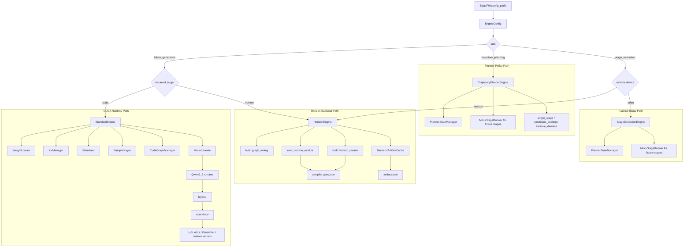
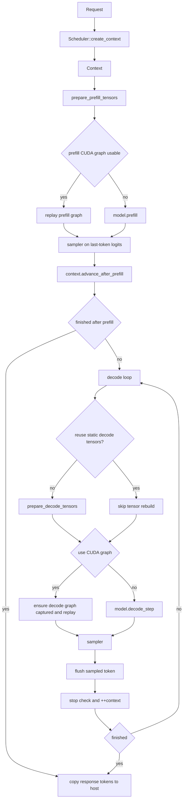
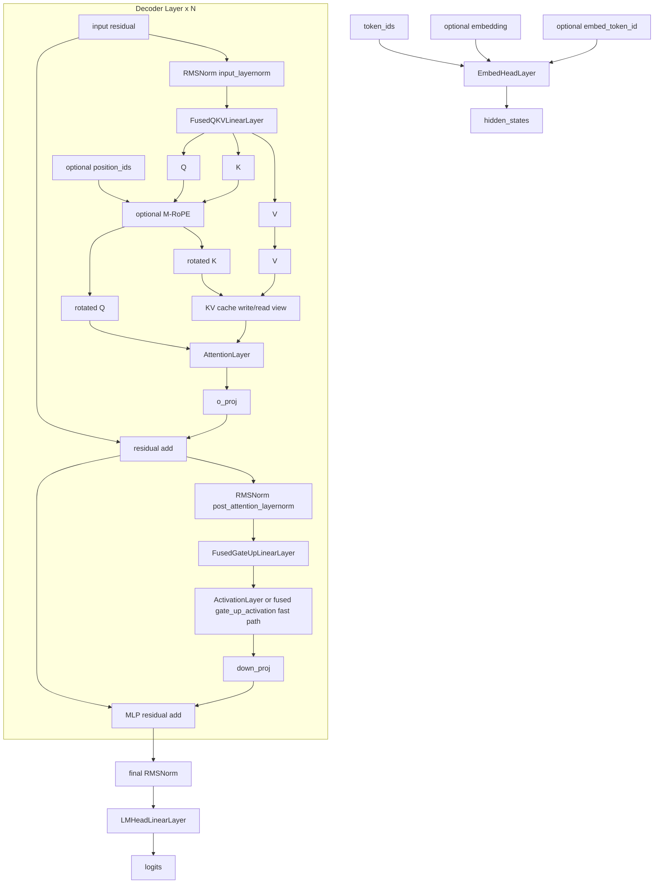
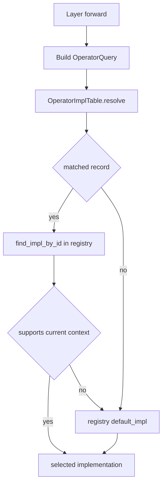
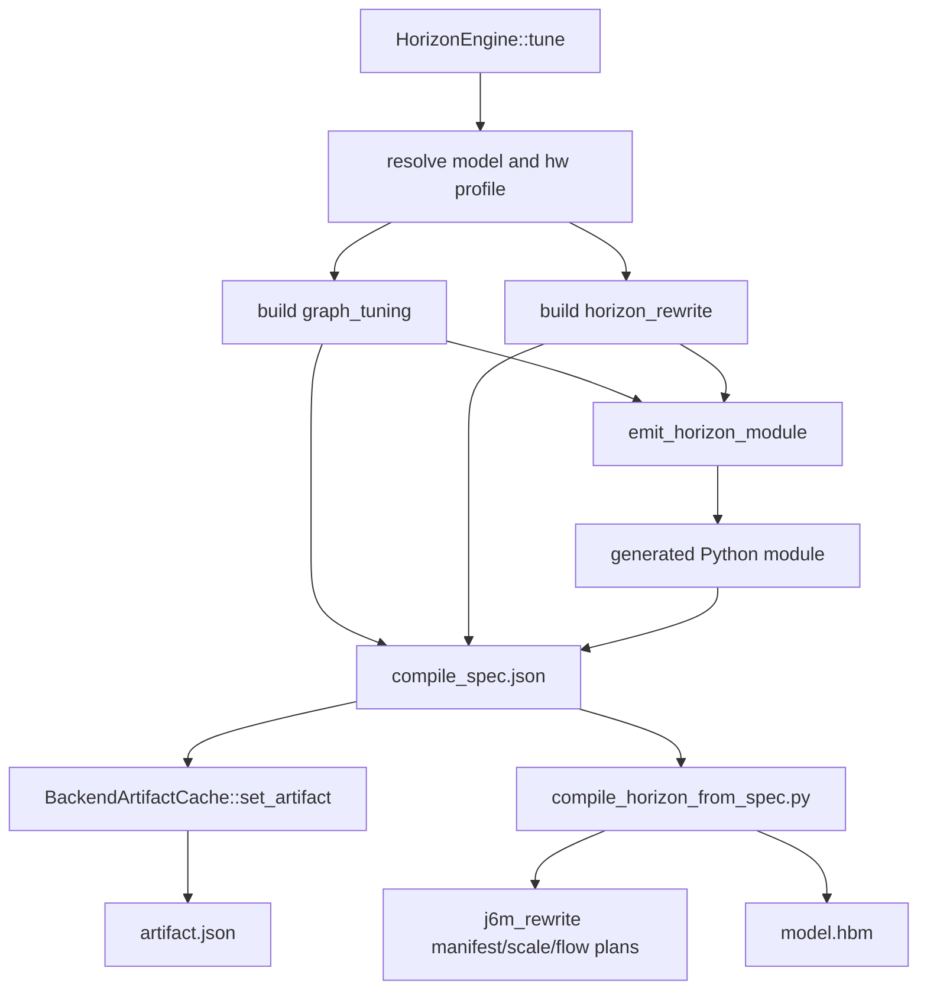

# EdgeFM Design Notes

This document describes the actual structure and operational boundaries of the current codebase. Its content is based on the code already implemented in `src/`, and it no longer retains the outdated abstractions from early plans.

All architecture diagrams in this document use Mermaid and do not depend on additional `png` or `jpeg` resources.

## 1. Scope and Current Status

The current behavior of the `EdgeFM` facade is as follows:

- CUDA inference is handled by `StandardEngine`.
- Horizon is handled by `HorizonEngine`; it generates a compile spec, and when a compiled `.hbm` artifact exists, it initializes the internal whole-graph runtime backend.
- The supported token generation model names include `qwen2_5` and `qwen2_5_vl`. Planner- and stage-related model names include `trajectory_planner`, `sparsedrive_v2`, `lingxi_sparsedrive_planner`, as well as the Horizon compile-prep path for `smolvla`.
- `qwen2_5` and `qwen2_5_vl` currently share the same `Qwen2_5` runtime.
- The `EagleEngine` prototype code is still kept under `src/engine/experimental/speculative/`, but the current `EdgeFM(config_path)` rejects `speculative.enabled=true`.

Therefore, the current codebase exposes three categories of task:

- `token_generation`: loads weights, allocates the KV cache, performs token prefill + decode, optionally captures a CUDA graph, and exposes `generate()`. The legacy `text_generation` configuration is normalized to this task.
- `trajectory_planning`: executes the tensor planner policy stage, and exposes `plan()` through the request-local `PlannerStateManager`.
- `stage_execution`: executes named tensor stages, and exposes `run_stage()`; `prefill()` and `decode()` are compatibility entry points that are internally equivalent to named stage calls.

Beneath these tasks there are still two categories of concrete backend:

- CUDA runtime path: loads weights, allocates the KV cache, performs prefill + decode, and optionally captures a CUDA graph.
- Horizon backend path: derives graph metadata, generates a Python lowering module, writes the compile spec and artifact cache, prepares J6M rewrite diagnostics, and initializes HBM runtime I/O metadata when the runtime SDK/artifact is present.

## 2. Design Principles

The current design follows these constraints:

1. `engine.json` must explicitly declare `model_name`. The runtime does not infer the model family from the checkpoint directory structure.
2. The main CUDA execution path neither builds nor executes a generic IR.
3. The request hot path does not perform online autotuning. The explicit `tune()` only generates the operator table tuning cache; operator selection at request execution time is done through the operator table and registry fallback.
4. The source code is split by responsibility:
   - `engine/`: facade dispatch, config/factory logic, and the task engines under `engine/tasks/`.
   - `engine/tasks/token_generation/`: `generate()`, KV cache management, scheduler, compact vocab, and token generation runtime state.
   - `engine/tasks/trajectory_planning/`: planner policy runtime, `PlannerStateManager`, and planner tensor utilities.
   - `engine/tasks/stage_execution/`: the named stage facade, and the mock stage runner used by fixtures.
   - `models/`: model-specific runtime.
   - `layers/`: model layer semantics and fused weight organization.
   - `operators/`: implementation lookup, operator registry, concrete operator entrypoints, and low-level kernels.
   - `backends/`: backend artifact generation and cache.
5. Request-time multimodal data is injected through the request contract, rather than through a separate model graph IR.

In the CUDA Qwen2.5 path, the production prefill acceleration capability sits behind the layer/operator boundary. The model code no longer calls the TensorRT engine bridge to handle prefill MLP or QKV/OProj. The current 3060 path selects source-op CUTLASS/CUDA implementations through the operator table; `edge_fm_trt` is kept only as a standalone `TRT-Edge-LLM` benchmark/reference Python module.

## 3. System Architecture



Key points:

- `EdgeFM` first selects the engine based on `EngineConfig::task()`, and then selects the backend.
- The CUDA path first loads the model weights, then constructs the `StandardEngine`.
- The Horizon path does not load CUDA runtime state; it produces backend artifacts and uses the whole-graph runtime boundary instead of CUDA layers/operators.
- `Model::create()` currently resolves both `qwen2_5` and `qwen2_5_vl` to the same `Qwen2_5` implementation.
- `MockStageRunner` is not a backend runtime; it is only used for the deterministic `backend=mock` tensor stages in planner/stage tests. Real TensorRT/Horizon stage adapters should use explicit backend runner names, and should not be hidden under a generalized runtime label.

## 4. Configuration and Scheduling

### 4.1 Required Configuration

The public entry point remains unchanged:

```python
engine = edge_fm.EdgeFM("/path/to/engine.json")
```

For `task=token_generation`, `engine.json` requires at least:

- `model_name`
- `prefill_model_path`
- `runtime.device`

For `task=trajectory_planning` or `task=stage_execution`, `prefill_model_path` can be omitted, because the engine may be driven solely by named stage artifacts.

The core structure in `examples/config/base/engine_default.json` is as follows:

```json
{
  "model_name": "Qwen2.5",
  "runtime": {
    "device": "cuda",
    "device_id": 0,
    "use_cuda_graph": false,
    "hw_profile": ""
  },
  "operator_impl_table_path": "",
  "prefill_model_path": "/models/qwen_prefill",
  "decode_model_path": null
}
```

### 4.2 Normalization Rules

`EngineConfig` normalizes:

- `model_name`
  - `Qwen2.5`, `qwen2_5`, `qwen25`, `qwen2` -> `qwen2_5`
  - `Qwen2.5-VL`, `qwen2_5_vl`, `qwen25vl` -> `qwen2_5_vl`
  - `SmolVLA`, `smolvla`, `smol_vla` -> `smolvla`
- `task`
  - A Qwen configuration with task omitted -> `token_generation`
  - A planner model name with task omitted, e.g. `sparsedrive_v2` -> `trajectory_planning`
  - `smolvla` with task omitted -> `stage_execution`
  - Explicit values: `token_generation`, `trajectory_planning`, `stage_execution`
  - Compatibility aliases: `text_generation`, `multimodal_generation`, `vlm_generation`, `llm`, `generation` -> `token_generation`
- `runtime.hw_profile`
  - If explicitly set, the normalized value is used.
  - If omitted on CUDA, `cuda_smXX` is derived from device properties, falling back to `cuda` on failure.
  - If omitted on Horizon, `horizon` is used.

### 4.3 Model Configuration Loading

The checkpoint-side `config.json` is still read, but only for model-local metadata, for example:

- `num_hidden_layers`
- `hidden_size`
- `vocab_size`
- `torch_dtype`
- attention head layout
- `rope_theta`
- VLM `text_config`

For VLM checkpoints, `prefill_model_config()` and `decode_model_config()` expand `text_config` so that the runtime sees the text-tower layout.

### 4.4 Backend Dispatch and Current Limitations

The current `EdgeFM` facade behavior in `src/edge-fm.cpp` is as follows:

- If `task == "trajectory_planning"`, construct a `TrajectoryPlannerEngine`.
- If `task == "stage_execution"` and `runtime.device == "horizon"`, construct a `HorizonEngine`.
- If `task == "stage_execution"` and not Horizon, construct a `StageExecutionEngine`.
- Otherwise, follow the existing CUDA/Horizon backend dispatch as `token_generation`.
- If `speculative.enabled == true`, throw immediately.

Therefore, although prototype code exists in the tree, speculative decoding is currently not a publicly supported runtime mode.

### 4.5 Planner and Stage Configuration

Planner policy inference remains tensor-in/tensor-out. It does not introduce training loss, visual preprocessing, request queues, or a diffusion serving scheduler. The currently implemented planner kinds include:

- `single_stage`: runs a single stage, e.g. `plan`, and returns `trajectory`.
- `candidate_scoring`: runs a scoring stage, selects `candidate_scores.argmax`, and returns `selected_index` and the selected `trajectory`.
- `iterative_denoise`: optionally runs `context`, loops over the `step` stage, and applies a `euler_flow`- or `ddim`-style replacement update to the planner state.

When `planner.kind` is omitted, `planner.method` can serve as a short alias:

- `scoring` -> `candidate_scoring`
- `flow`, `flow_matching`, `diffusion`, `diffusion_policy` -> `iterative_denoise`

For `iterative_denoise`, the caller can explicitly pass in a state tensor, e.g. `current_actions`. If omitted, the engine initializes it from `planner.trajectory_shape`, `planner.noise_sigma`, and `planner.seed`. Each step also receives a float32 timestep tensor, whose name is specified by `planner.timestep_tensor` (default `timestep`), with a value range from `timestep_start` to `timestep_end`.

TensorRT `.engine` planner stages are also expected to plug into the same `run_stage()` boundary, but the C++ TensorRT stage adapter is intentionally left for a later fixture-backed implementation, in order to keep the first version of the planner policy layer backend-neutral and free of regression impact.

The flow-matching trajectory planning reference uses GoalFlow / arXiv 2503.05689; the repository no longer keeps that paper's PDF artifact under `doc/`.

Mock configuration example:

```json
{
  "task": "trajectory_planning",
  "model_name": "lingxi_sparsedrive_planner",
  "runtime": {"device": "cpu"},
  "planner": {
    "kind": "iterative_denoise",
    "method": "flow",
    "sampler": "euler_flow",
    "num_steps": 3,
    "state_tensor": "current_actions",
    "step_stage": "step",
    "step_output_tensor": "velocity",
    "output_tensor": "trajectory"
  },
  "stages": {
    "step": {
      "backend": "mock",
      "outputs": {
        "velocity": {
          "dtype": "float32",
          "shape": [1, 2, 2],
          "values": [3.0, 6.0, 9.0, 12.0]
        }
      }
    }
  }
}
```

`PlannerStateManager` is request-local state. `run_stage()` resolves inputs in the following order: explicit call inputs, cached tensors for the same `request_id`, and stage `defaults` / `default_inputs`. It is analogous to how `KVManager` manages token KV state in an LLM, except that it stores generic context/action/candidate tensors rather than an attention KV cache.

## 5. CUDA Runtime Path

### 5.1 Runtime Objects

`StandardEngine` owns or coordinates:

- `Model`
- `KVManager`
- `Scheduler`
- `SamplerLayer`
- `CudaGraphManager`

`Scheduler::create_context()` constructs a `Context` for each request. A `Context` contains:

- the request pointer
- the response buffer
- per-layer KV read/write pointers
- the tensor map used by the model runtime
- model-specific state, e.g. cached `mrope_last_pos`

### 5.2 Warmup Behavior

`StandardEngine::warmup()` does two things:

1. For slots configured with prefix tokens, it runs a single prefill to materialize the prefix KV cache.
2. If the CUDA graph is enabled and the decode graph has not yet been captured, it captures the decode graph using the warmed-up slot.

Therefore warmup is not only a performance warmup; it is also the point at which the prefix KV state and optional decode graph state are prepared.

### 5.3 Generation Flow



Important current behaviors:

- Prefill only samples the logits of the last token of the prompt.
- Decode runs token by token.
- When the CUDA graph is active and the model exposes static decode runtime tensors, the engine can skip repeated decode tensor setup.
- Decode graph replay updates the dynamic KV write target, while keeping the device buffer addresses of the token ids, KV length, and model-managed decode state stable.

### 5.4 Tensor Preparation Responsibilities

`prepare_prefill_tensors()` is responsible for:

- the prompt token tensor
- the optional multimodal embedding tensor
- the optional `embed_token_id`
- the optional `position_ids`
- the model workspace tensors
- the sampler output buffer
- the per-layer KV cache write/read views

`prepare_decode_tensors()` is responsible for:

- the stable single-token decode input buffer
- the stable device-side KV length buffer
- the stable decode `position_ids` buffer used when the model requires it
- the per-layer decode KV read/write views

This division of responsibility matters because decode graph replay relies on the decode-side addresses being stable.

### 5.5 `tune()` Semantics on CUDA

On the CUDA path, `StandardEngine::tune()` is config-driven operator-table tuning/preparation:

- Resolves the model name and hardware profile through `EngineConfig`.
- Loads the current operator table and generates `cuda_operator_tuning/operator_impl_table.json` and `tuning_report.json` in the cache directory.
- Runs a lightweight benchmark sweep over candidates that do not require recompilation: currently covering FlashInfer attention parameters and the cuBLASLt linear `algo_index`.
- Does not automatically generate, compile, or search CUTLASS/source-op kernels; this kind of continuous optimization is done through the offline `$edge-fm-cuda-kernel-optimizer` flow, with results then migrated back to `src/operators`, `src/layers`, or the operator table.

Therefore `tune()` is still part of the API surface, but its semantics are operator-table tuning in an explicit preparation phase, rather than kernel autotuning on the request hot path.

## 6. Qwen2.5 Runtime and Model Structure

### 6.1 Runtime Scope

`Qwen2_5` is currently the only production model runtime, shared by the following models:

- text-only `qwen2_5`
- multimodal `qwen2_5_vl`

The main difference between the two lies in the request-side data:

- A text-only request provides only `token_ids`.
- A VLM request can additionally provide `embedding`, `embed_token_id`, and `position_ids`.

### 6.2 Layer Inventory

The layer building blocks currently used by `Qwen2_5`:

| Component | Role |
| --- | --- |
| `EmbedHeadLayer` | token embedding and optional embedding injection |
| `RMSNormLayer` | input norm, post-attention norm, final norm |
| `AttentionLayer` | prefill/decode attention, working together with M-RoPE |
| `FusedQKVLinearLayer` | fused Q/K/V projection |
| `LinearLayer` | `o_proj`, `down_proj`, and other plain linear paths |
| `FusedGateUpLinearLayer` | fused SwiGLU gate/up projection |
| `ActivationLayer` | `silu_and_mul` |
| `LMHeadLinearLayer` | final logits projection; can reuse the embedding table where applicable |

### 6.3 Model Structure



### 6.4 Prefill and Decode Behavior

Prefill path:

- The input is the full non-prefix prompt span.
- The fused QKV projection writes the entire prompt segment into the KV cache.
- Attention runs in prefill mode.
- The LM head only projects the last token needed for the first sampling.

Decode path:

- The input length is always `1`.
- Attention reads the accumulated KV cache and appends a new K/V slot.
- Model-managed decode state, e.g. M-RoPE `position_ids`, advances in place.
- CUDA graph replay can reuse the same decode graph across steps.

### 6.5 Multimodal and M-RoPE

For VLM requests:

- Custom embeddings are injected by `EmbedHeadLayer`.
- The injection position is specified by `embed_token_id`.
- M-RoPE `position_ids` can be carried by the request.

For M-RoPE models:

- Prefill rotates `Q/K` using the `position_ids` provided by the request.
- Decode derives the starting 3D position from the request state and increments it on the device after each step.

## 7. Layers and Operators Layering

### 7.1 The Boundary

`layers/` is responsible for model semantics:

- tensor contract
- residual structure
- fused HF weight organization
- model-level forward structure

`operators/` is responsible for implementation dispatch:

- operator registry
- implementation lookup
- table-driven selection
- vendor library entrypoints
- repo-local kernels under `operators/kernels/`

Therefore the layer code answers "what operation happens here", and the operator code answers "which implementation actually runs".

### 7.2 Op Kinds Currently Routed Through the Operator Table

The current operator table no longer covers only linear; it is also queried for the following op kinds:

- `linear`
- `attention`
- `norm`
- `activation`
- `fused_gate_up_activation`

### 7.3 Selection Flow



The query key includes:

- `model_name`
- `hw_profile`
- `op_kind`
- `layer_role`
- `op_name`
- `stage`
- `shape_sig`

Matching prefers more specific records:

- An exact `op_name` match takes priority over a wildcard.
- An exact `layer_role` match takes priority over a wildcard.
- An exact `shape_sig` match takes priority over a wildcard.
- An exact `stage` match takes priority over a wildcard.
- An exact `hw_profile` match takes priority over a generic profile.

### 7.4 Builtin Defaults and External Overlay

`OperatorImplTable` always loads the builtin defaults first, then appends the records from `operator_impl_table_path`.

The current builtin defaults include:

- `linear -> cublasLt`
- `attention -> flashinfer_attention`
- `norm -> flashinfer_norm`
- `activation -> flashinfer_silu_and_mul`

Because external records are appended after the builtins, the resolver keeps the last best match when scores are equal or more specific, so an external table can naturally override the builtin defaults.

### 7.5 Practical Implications

This design allows:

- selecting the linear algorithm by hardware.
- configuring attention tuning records by shape.
- later integrating offline-validated generated/CUTLASS kernels.
- optionally enabling decode fast paths such as `fused_gate_up_activation`.

All while not requiring the model-layer code to understand vendor-specific kernels.

## 8. Horizon Backend Path

`HorizonEngine` is the whole-graph backend boundary. CUDA requests still use `StandardEngine`; Horizon requests do not instantiate CUDA layers/operators/model graph. In builds without Horizon SDK support, runtime initialization returns an explicit "not compiled" error, but compile-spec generation remains usable.

### 8.1 Tune Flow



`graph_tuning` currently contains:

- `attention_type`
- `kv_cache.dtype`
- `kv_cache.layout`
- `uses_mrope`
- `uses_embedding_injection`
- `linear_operator_table`
- `target_hw_constraints`
- When a `horizon_rewrite` exists, it is embedded into the generated module metadata.

The generated compile spec uses the schema `edgefm_horizon_compile_spec_v2`.

### 8.2 J6M Rewrite Preparation

`scripts/horizon/compile_horizon_from_spec.py` accepts `--horizon-rewrite`, with values `auto`, `on`, or `off`. On J6M/SmolVLA specs, it writes out:

- `horizon_j6m_rewrite_manifest.json`
- `scale_check_config.json`
- `flow_matching_export_plan.json`

For SmolVLA, `scripts/horizon/j6m_rewrite.py` also provides Python-level rewrites targeting the LeRobot source-of-truth model:

- boolean/int16-safe attention mask construction
- using a bounded negative mask fill instead of `finfo(float32).min`
- explicit fp32 RoPE sin/cos computation
- piecewise tanh-GELU replacement to avoid activation overflow
- parameter scale diagnostics and per-step flow-matching bin export plan

The generated SmolVLA Horizon module calls `SmolVLAPolicy.from_pretrained()` from LeRobot, applies the rewrites above, and exports the phase-1 LLM path as two whole-model stages: `prefill` and `decode`.

### 8.3 Tensor Stage API

A whole-model backend can expose tensor-in/tensor-out stages through the following interfaces:

- `EdgeFM::run_stage(request_id, stage_name, inputs)`
- `EdgeFM::prefill(request_id, inputs)`
- `EdgeFM::decode(request_id, inputs)`

`prefill()` and `decode()` are compatibility wrappers for `run_stage("prefill")` and `run_stage("decode")`. Planner and whole-stage artifacts can declare additional stage names such as `context`, `step`, `score` in the stage manifest / compile spec.

For SmolVLA phase 1, `prefill` produces `prefix_kv_layer_*` tensors and stores them in the engine-side request cache. `decode` consumes the suffix inputs, and can either reuse the KV tensors cached under the same `request_id` or have the caller explicitly pass in `prefix_kv_layer_*`. Horizon stage outputs are merged back into the request cache by tensor name, so subsequent stages do not discard existing tensors unless they overwrite a tensor of the same name.

For usage examples, see `doc/smolvla_phase1_horizon_usage.md`.

### 8.4 Current `generate()` Behavior

`HorizonEngine::generate()` currently:

1. Validates the request.
2. Checks whether the backend artifact is already cached or injected internally.
3. Checks whether the expected `model.hbm` exists.
4. When compiled, initializes the `HorizonRuntimeBackend` and records the runtime I/O names and shapes.
5. Throws `Horizon generate I/O mapping is not implemented in this interface phase`.

Therefore Horizon runtime ownership and I/O discovery are already wired up, but token/action mapping is intentionally left for a later interface phase.

## 9. Source Code Boundaries

The current source code layout:

- `src/edge-fm.cpp`
  - The public `EdgeFM` facade.
- `src/tensor.cpp`, `src/utils/device/tensor_*.cpp`
  - The public `Tensor` implementation, and the CPU/CUDA device memory ops selected by CMake.
- `src/engine/`
  - `engine.*`, `engine_factory.*`: `EngineConfig`, the base `Engine`, and the engine factory.
  - `tasks/token_generation/`: token-generation helpers shared by the backend engines, including compact vocab, `KVManager`, and the scheduler.
  - `tasks/trajectory_planning/`: the planner facade engine, `PlannerStateManager`, and planner tensor helpers.
  - `tasks/stage_execution/`: the generic named stage facade engine, and the `MockStageRunner` used by deterministic fixture stages.
  - `tasks/token_generation/cuda/`: the CUDA token-generation backend implementation.
  - `tasks/stage_execution/horizon/`: the Horizon stage/backend engine implementation.
  - `tasks/token_generation/cuda/tuning/`: the CUDA token-generation operator-table preparation used by `StandardEngine::tune()`.
  - `experimental/speculative/`: the speculative engine prototype code, not wired into the public facade.
- `src/backends/`
  - Holds only platform/backend infrastructure: artifact cache, Horizon module emitter, backend target enum, whole-graph runtime backend wrapper.
  - Task-level `Engine` implementations do not go here; they live under `src/engine/tasks/<task>/<backend>/`.
- `src/models/`
  - Model dispatch and model runtime.
- `src/models/qwen2_5/`
  - The current production runtime, covering both text and VL.
- `src/layers/`
  - Semantic layer building blocks.
- `src/operators/`
  - Operator registry, table lookup, concrete operator entrypoints.
- `src/operators/kernels/`
  - The low-level CUDA kernels used by operator implementations.
- `src/utils/`
  - memory, CUDA graph helpers, weight loading, logging, device utilities.

## 10. Current Non-Goals and Limitations

The current code intentionally does not do the following:

- The CUDA path does not introduce a generic runtime IR.
- It does not perform benchmark-based tuning on the request hot path.
- It does not expose speculative decoding through `EdgeFM`.
- The Horizon token/action generation loop is not yet exposed; currently only HBM I/O discovery is available.
- It does not infer the model family from checkpoint naming or file layout.

In exchange, the code maintains a tighter mapping between:

- engine config
- the concrete model runtime
- layer semantics
- operator implementation selection
- backend-specific lowering artifacts

This is the main design direction of the current repository.
