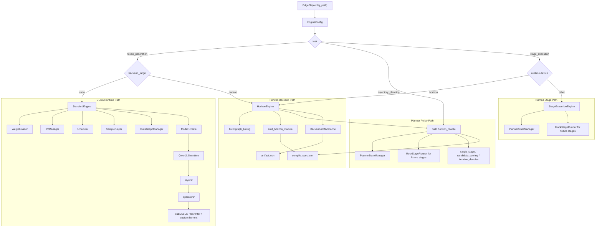
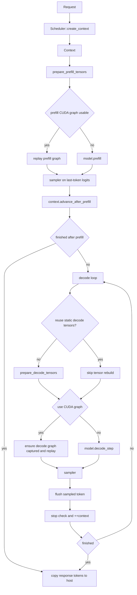
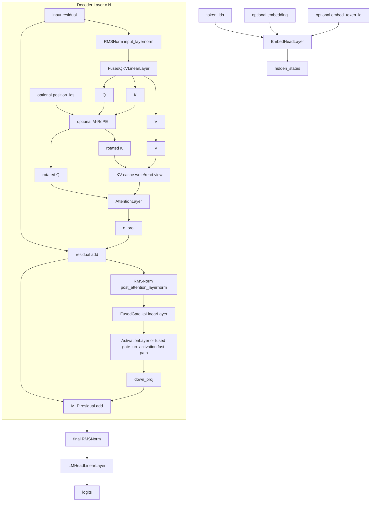
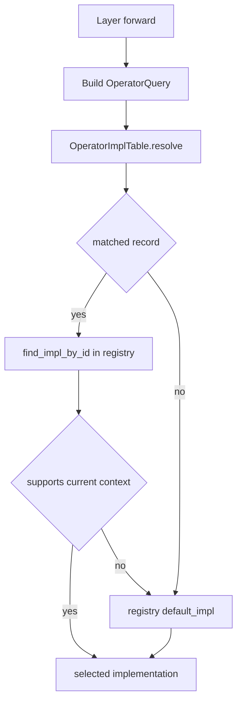
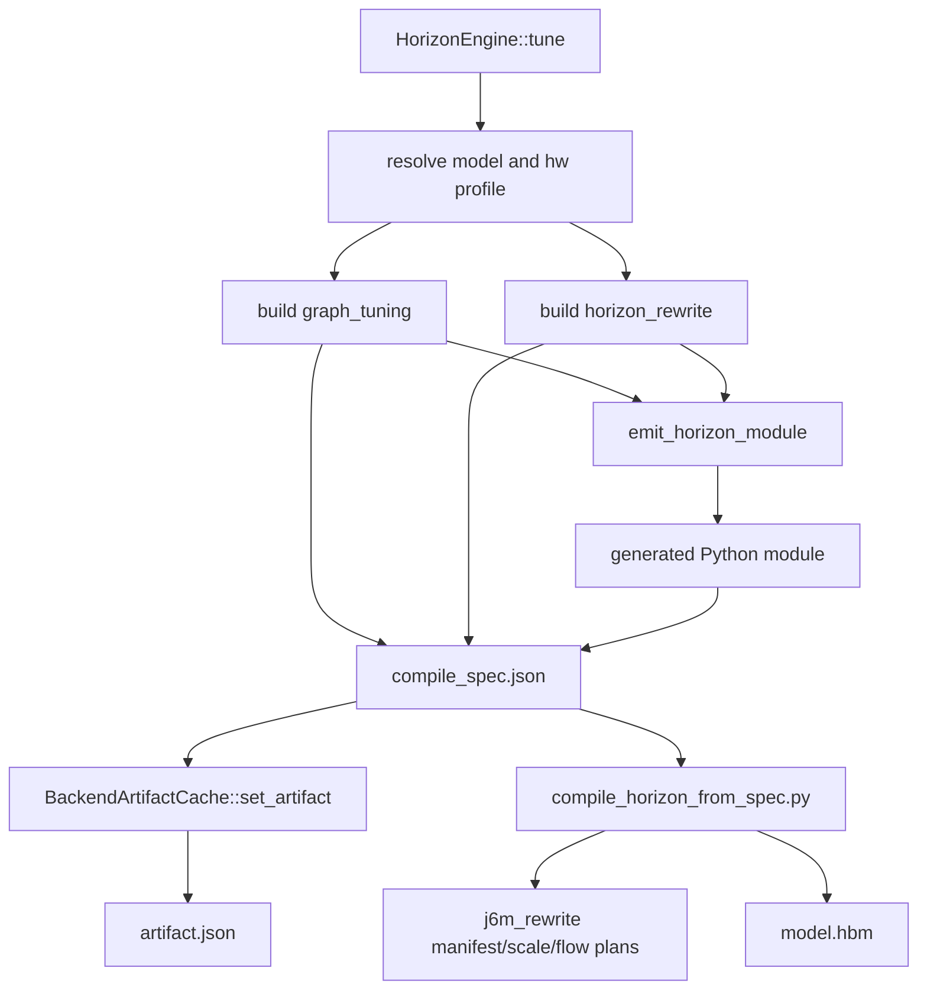

# EdgeFM Design

This document describes the current codebase as it exists today. It is intentionally biased toward what is already implemented under `src/`, not older planned abstractions.

All architecture diagrams below use Mermaid. No external `png` or `jpeg` assets are required.

## 1. Scope and Current Status

Current `EdgeFM` facade behavior:

- CUDA inference is served by `StandardEngine`.
- Horizon is served by `HorizonEngine`; it emits compile specs and can initialize
  the internal whole-graph runtime backend when a compiled `.hbm` artifact exists.
- Supported token-generation model names are `qwen2_5` and `qwen2_5_vl`. Planner
  and stage-oriented names include `trajectory_planner`, `sparsedrive_v2`,
  `lingxi_sparsedrive_planner`, and the Horizon compile-prep path for `smolvla`.
- `qwen2_5` and `qwen2_5_vl` currently share the same `Qwen2_5` runtime.
- `src/engine/experimental/speculative/` still contains `EagleEngine`
  prototype code, but `EdgeFM(config_path)` rejects
  `speculative.enabled=true` today.

This means the codebase is split into three user-facing task families:

- `token_generation`: loads weights, allocates KV cache, runs token prefill +
  decode, optionally captures CUDA graphs, and exposes `generate()`. Legacy
  `text_generation` configs are normalized to this task.
- `trajectory_planning`: runs tensor planner policy stages and exposes `plan()`
  with request-local `PlannerStateManager` state.
- `stage_execution`: runs named tensor stages and exposes `run_stage()`;
  `prefill()` and `decode()` are compatibility wrappers over stage names.

There are still two concrete backend families underneath those tasks:

- CUDA runtime path: loads weights, allocates KV cache, runs prefill + decode, optionally captures CUDA graphs.
- Horizon backend path: derives graph metadata, emits a Python lowering module,
  writes compile spec and artifact cache entries, prepares J6M rewrite diagnostics,
  and initializes HBM runtime I/O metadata when the runtime SDK/artifact is present.

## 2. Design Principles

The current design follows these constraints:

1. `engine.json` must declare `model_name` explicitly. The runtime does not infer the model family from checkpoint structure.
2. The main CUDA execution path does not build or execute a generic IR.
3. Runtime tuning is no longer benchmark-driven. Operator selection is table-driven with registry fallback.
4. The source tree is split by responsibility:
   - `engine/`: facade dispatch, task engines, stage runtime, and backend engine adapters
   - `models/`: model-specific runtime
   - `layers/`: model-layer semantics and fused weight organization
   - `operators/`: implementation lookup, operator registries, concrete operator entrypoints, low-level kernels
   - `backends/`: backend-specific artifact emission and cache
5. Request-time multimodal data is injected through the request contract, rather than via a separate model graph IR.

## 3. System Architecture



Key points:

- `EdgeFM` chooses the engine from `EngineConfig::task()` first, then the backend.
- The CUDA path eagerly loads model weights before constructing `StandardEngine`.
- The Horizon path does not load CUDA runtime state; it produces backend artifacts
  and uses a whole-graph runtime boundary instead of CUDA layers/operators.
- `Model::create()` currently resolves both `qwen2_5` and `qwen2_5_vl` to the same `Qwen2_5` implementation.
- `MockStageRunner` is not a backend runtime. It only runs deterministic
  `backend=mock` tensor stages for planner/stage tests; `HorizonEngine` exposes
  the same named-stage facade for HBM artifacts. Real TensorRT/Horizon stage
  adapters should use explicit backend runner names instead of hiding behind a
  generic runtime label.

## 4. Configuration and Dispatch

### 4.1 Required configuration

The public entry remains:

```python
engine = edge_fm.EdgeFM("/path/to/engine.json")
```

For `task=token_generation`, `engine.json` needs:

- `model_name`
- `prefill_model_path`
- `runtime.device`

For `task=trajectory_planning` or `task=stage_execution`, `prefill_model_path`
is optional because the engine may be backed only by named stage artifacts.

Relevant default structure from `examples/config/base/engine_default.json`:

```json
{
  "model_name": "Qwen2.5",
  "runtime": {
    "device": "cuda",
    "device_id": 0,
    "use_cuda_graph": false,
    "hw_profile": ""
  },
  "operator_impl_table_path": "",
  "prefill_model_path": "/models/qwen_prefill",
  "decode_model_path": null
}
```

### 4.2 Normalization rules

`EngineConfig` normalizes:

- `model_name`
  - `Qwen2.5`, `qwen2_5`, `qwen25`, `qwen2` -> `qwen2_5`
  - `Qwen2.5-VL`, `qwen2_5_vl`, `qwen25vl` -> `qwen2_5_vl`
  - `SmolVLA`, `smolvla`, `smol_vla` -> `smolvla`
- `task`
  - omitted Qwen configs -> `token_generation`
  - omitted planner model names such as `sparsedrive_v2` -> `trajectory_planning`
  - omitted `smolvla` -> `stage_execution`
  - explicit values: `token_generation`, `trajectory_planning`, `stage_execution`
  - compatibility aliases such as `text_generation`, `multimodal_generation`,
    `vlm_generation`, `llm`, and `generation` -> `token_generation`
- `runtime.hw_profile`
  - if explicitly set, use the normalized value
  - if omitted on CUDA, derive `cuda_smXX` from device properties, with `cuda` fallback
  - if omitted on Horizon, use `horizon`

### 4.3 Model config loading

Checkpoint-side `config.json` is still read, but only for model-local metadata such as:

- `num_hidden_layers`
- `hidden_size`
- `vocab_size`
- `torch_dtype`
- attention head layout
- `rope_theta`
- VLM `text_config`

For VLM checkpoints, `prefill_model_config()` and `decode_model_config()` unwrap `text_config` so the runtime still sees the text tower layout.

### 4.4 Backend dispatch and current limitations

Current `EdgeFM` facade behavior in `src/edge-fm.cpp`:

- if `task == "trajectory_planning"`, build `TrajectoryPlannerEngine`
- if `task == "stage_execution"` and `runtime.device == "horizon"`, build `HorizonEngine`
- if `task == "stage_execution"` for other devices, build `StageExecutionEngine`
- otherwise `token_generation` follows the existing CUDA/Horizon backend dispatch
- if `speculative.enabled == true`, throw immediately

So speculative decoding is not a supported public runtime mode yet, even though the prototype code exists in the tree.

### 4.5 Planner and stage configuration

Planner-policy inference is intentionally tensor-in/tensor-out. It does not add
training losses, visual preprocessing, request queues, or a diffusion serving
scheduler. The first implemented planner kinds are:

- `single_stage`: run one stage such as `plan` and return `trajectory`
- `candidate_scoring`: run a scoring stage, choose `candidate_scores.argmax`,
  and return `selected_index` plus the selected `trajectory`
- `iterative_denoise`: optionally run `context`, loop a `step` stage, and update
  the planner state with `euler_flow` or `ddim`-style replacement

`planner.method` is accepted as a short alias when `planner.kind` is omitted:
`scoring` maps to `candidate_scoring`, while `flow`, `flow_matching`,
`diffusion`, and `diffusion_policy` map to `iterative_denoise`.

For `iterative_denoise`, callers can pass the state tensor explicitly, for
example `current_actions`. If it is omitted, the engine initializes it from
`planner.trajectory_shape`, `planner.noise_sigma`, and `planner.seed`. Each
step also receives a float32 timestep tensor named by `planner.timestep_tensor`
(default `timestep`) over the configured `timestep_start` to `timestep_end`
range.

TensorRT `.engine` planner stages are expected to plug into this same
`run_stage()` boundary, but the C++ TensorRT stage adapter is intentionally left
for a fixture-backed follow-up so the first planner policy layer can stay
backend-neutral and regression-safe.

The local flow-matching trajectory-planning reference paper used for this
planner-policy shape is stored at `doc/papers/2503.05689v6.pdf`.

Example mock config:

```json
{
  "task": "trajectory_planning",
  "model_name": "lingxi_sparsedrive_planner",
  "runtime": {"device": "cpu"},
  "planner": {
    "kind": "iterative_denoise",
    "method": "flow",
    "sampler": "euler_flow",
    "num_steps": 3,
    "state_tensor": "current_actions",
    "step_stage": "step",
    "step_output_tensor": "velocity",
    "output_tensor": "trajectory"
  },
  "stages": {
    "step": {
      "backend": "mock",
      "outputs": {
        "velocity": {
          "dtype": "float32",
          "shape": [1, 2, 2],
          "values": [3.0, 6.0, 9.0, 12.0]
        }
      }
    }
  }
}
```

`PlannerStateManager` is request-local. `run_stage()` resolves inputs in this
order: explicit call inputs, cached tensors for the same `request_id`, then
stage `defaults` / `default_inputs`. This is the planner analogue of keeping
LLM token KV state inside `KVManager`, but it stores generic
context/action/candidate tensors instead of attention KV cache.

## 5. CUDA Runtime Path

### 5.1 Runtime objects

`StandardEngine` owns or coordinates:

- `Model`
- `KVManager`
- `Scheduler`
- `SamplerLayer`
- `CudaGraphManager`

`Scheduler::create_context()` builds a `Context` for each request. `Context` carries:

- request pointer
- response buffer
- per-layer KV read/write pointers
- tensor map used by the model runtime
- model-specific state such as cached `mrope_last_pos`

### 5.2 Warmup behavior

`StandardEngine::warmup()` does two things:

1. For slots with configured prefix tokens, it runs a prefill pass to materialize prefix KV cache.
2. If CUDA graph is enabled and decode graph is not yet captured, it uses a warmed-up slot to capture the decode graph.

So warmup is not only a performance nicety; it is also the moment when prefix KV state and optional decode graph state are prepared.

### 5.3 Generate flow



Important current behaviors:

- Prefill samples only the last prompt token's logits.
- Decode runs token-by-token.
- When CUDA graph is active and the model exposes static decode runtime tensors, the engine can skip repeated decode tensor setup.
- Decode graph replay updates dynamic KV write destinations while keeping stable device buffers for token ids, KV length, and model-managed decode state.

### 5.4 Tensor preparation responsibilities

`prepare_prefill_tensors()` is responsible for:

- prompt token tensor
- optional multimodal embedding tensor
- optional `embed_token_id`
- optional `position_ids`
- model workspace tensors
- sampler output buffer
- per-layer KV cache write/read views

`prepare_decode_tensors()` is responsible for:

- stable single-token decode input buffer
- stable device-side KV length buffer
- stable decode `position_ids` buffer for models that need it
- per-layer decode KV read/write views

This split is important because CUDA graph replay depends on stable decode-side addresses.

### 5.5 `tune()` semantics on CUDA

On the CUDA path, `StandardEngine::tune()` is now a lightweight validation/preparation step:

- it resolves model name and hardware profile through `EngineConfig`
- it forces operator table loading/parsing
- it does not benchmark kernels
- it does not generate a CUDA-specific tuning cache

So `tune()` remains part of the API surface, but its meaning is now "static preparation" rather than "online autotuning".

## 6. Qwen2.5 Runtime and Model Architecture

### 6.1 Runtime scope

`Qwen2_5` is the only production model runtime today. It is shared by:

- text-only `qwen2_5`
- multimodal `qwen2_5_vl`

The difference is primarily request-side data:

- text-only requests provide only `token_ids`
- VLM requests may additionally provide `embedding`, `embed_token_id`, and `position_ids`

### 6.2 Layer inventory

Current layer building blocks inside `Qwen2_5`:

| Component | Role |
| --- | --- |
| `EmbedHeadLayer` | token embedding and optional embedding injection |
| `RMSNormLayer` | input norm, post-attention norm, final norm |
| `AttentionLayer` | prefill/decode attention, with M-RoPE cooperation |
| `FusedQKVLinearLayer` | fused Q/K/V projection |
| `LinearLayer` | `o_proj`, `down_proj`, and other plain linear paths |
| `FusedGateUpLinearLayer` | fused SwiGLU gate/up projection |
| `ActivationLayer` | `silu_and_mul` |
| `LMHeadLinearLayer` | final logits projection, tied to embedding table when applicable |

### 6.3 Model structure



### 6.4 Prefill vs decode behavior

Prefill path:

- input is the full non-prefix prompt span
- fused QKV projection writes a whole prompt segment into KV cache
- attention runs in prefill mode
- LM head only projects the final token needed for the first sampling step

Decode path:

- input length is always `1`
- attention reads the accumulated KV cache and appends one more K/V slot
- model-managed decode state such as M-RoPE `position_ids` is advanced in-place
- CUDA graph replay can reuse the same decode graph across steps

### 6.5 Multimodal and M-RoPE notes

For VLM requests:

- custom embeddings are injected by `EmbedHeadLayer`
- injection is keyed by `embed_token_id`
- M-RoPE `position_ids` can be carried on the request

For M-RoPE models:

- prefill rotates `Q/K` using request-provided `position_ids`
- decode derives the starting 3D position from request state and increments it on device after each step

## 7. Layers vs Operators

### 7.1 Boundary

`layers/` owns model semantics:

- tensor contracts
- residual structure
- fused HF weight organization
- forward structure at the model-layer level

`operators/` owns implementation dispatch:

- operator registries
- implementation lookup
- table-driven selection
- vendor library entrypoints
- repo-local kernels under `operators/kernels/`

This means the layer code answers "what operation happens here", while operator code answers "which implementation actually runs".

### 7.2 Operator kinds currently routed through the table

Today the operator table is not limited to linear anymore. It is consulted by:

- `linear`
- `attention`
- `norm`
- `activation`
- `fused_gate_up_activation`

### 7.3 Selection flow



The query key space is:

- `model_name`
- `hw_profile`
- `op_kind`
- `layer_role`
- `op_name`
- `stage`
- `shape_sig`

Matching prefers more specific records:

- `op_name` exact match over wildcard
- `layer_role` exact match over wildcard
- `shape_sig` exact match over wildcard
- `stage` exact match over wildcard
- `hw_profile` exact match over generic profile

### 7.4 Builtin defaults and external overlay

`OperatorImplTable` always loads builtin defaults first, then appends records from `operator_impl_table_path`.

Current builtin defaults include:

- `linear -> cublasLt`
- `attention -> flashinfer_attention`
- `norm -> flashinfer_norm`
- `activation -> flashinfer_silu_and_mul`

Because external records are appended after builtin records and the resolver keeps the last best-scoring match, external tables naturally override builtin defaults when they are equally specific or more specific.

### 7.5 Practical meaning

This design allows:

- per-hardware linear algorithm selection
- shape-specific attention tuning records
- future generated kernels such as `cutile`
- optional fused decode fast paths such as `fused_gate_up_activation`

without forcing model-layer code to know about vendor-specific kernels.

## 8. Horizon Backend Path

`HorizonEngine` is a whole-graph backend boundary. CUDA requests still use
`StandardEngine`; Horizon requests never instantiate CUDA layers/operators/model
graphs. In a build without Horizon SDK support, runtime initialization reports a
clear "not compiled" error while compile-spec generation remains available.

### 8.1 Tune flow



`graph_tuning` currently includes:

- `attention_type`
- `kv_cache.dtype`
- `kv_cache.layout`
- `uses_mrope`
- `uses_embedding_injection`
- `linear_operator_table`
- `target_hw_constraints`
- `horizon_rewrite` is embedded in the generated module metadata when present

The generated compile spec uses schema `edgefm_horizon_compile_spec_v2`.

### 8.2 J6M rewrite preparation

`scripts/horizon/compile_horizon_from_spec.py` accepts `--horizon-rewrite`
(`auto`, `on`, or `off`). On J6M/SmolVLA specs it writes:

- `horizon_j6m_rewrite_manifest.json`
- `scale_check_config.json`
- `flow_matching_export_plan.json`

For SmolVLA, `scripts/horizon/j6m_rewrite.py` also provides Python-level
rewrites for the LeRobot source-of-truth model:

- boolean/int16-safe attention mask construction
- bounded negative mask fill instead of `finfo(float32).min`
- explicit fp32 RoPE sin/cos computation
- piecewise tanh-GELU replacement to avoid activation overflow
- parameter scale diagnostics and a per-step flow-matching bin export plan

The generated SmolVLA Horizon module loads `SmolVLAPolicy.from_pretrained()`
from LeRobot, applies those rewrites, and exports the phase-1 LLM path as two
whole-model stages: `prefill` and `decode`.

### 8.3 Tensor stage API

Whole-model backends can expose tensor-in/tensor-out stages through:

- `EdgeFM::run_stage(request_id, stage_name, inputs)`
- `EdgeFM::prefill(request_id, inputs)`
- `EdgeFM::decode(request_id, inputs)`

`prefill()` and `decode()` are compatibility wrappers for
`run_stage("prefill")` and `run_stage("decode")`. Planner and whole-stage
artifacts may expose additional names such as `context`, `step`, or `score`
when those names are declared in the stage manifest / compile spec.

For SmolVLA phase 1, `prefill` produces `prefix_kv_layer_*` tensors and stores
them in the engine-side request cache. `decode` consumes suffix inputs and can
either reuse the cached KV tensors for the same `request_id` or accept explicit
`prefix_kv_layer_*` inputs from the caller. Horizon stage outputs are merged
into the request cache by tensor name, so a later stage does not discard
previous stage tensors unless it overwrites the same name.

Usage examples are in `doc/smolvla_phase1_horizon_usage.md`.

### 8.4 Current behavior of `generate()`

`HorizonEngine::generate()` currently:

1. validates the request
2. checks whether a backend artifact is already cached or injected internally
3. checks whether the expected `model.hbm` exists
4. initializes `HorizonRuntimeBackend` when compiled and logs runtime I/O names/shapes
5. throws `Horizon generate I/O mapping is not implemented in this interface phase`

So Horizon runtime ownership and I/O discovery are wired, while token/action
mapping is intentionally left out of this interface phase.

## 9. Source Tree Boundaries

Current source layout:

- `src/edge-fm.cpp`
  - public `EdgeFM` facade
- `src/tensor.cpp`, `src/utils/device/tensor_*.cpp`
  - public `Tensor` implementation and CMake-selected CPU/CUDA device memory ops
- `src/engine/`
  - `engine.*`, `engine_factory.*`: `EngineConfig`, base `Engine`, and engine factory
  - `tasks/token_generation/`: token-generation helpers shared by backend engines,
    including compact vocab, `KVManager`, and scheduler
  - `tasks/trajectory_planning/`: planner facade engine
    plus `PlannerStateManager` and planner tensor helpers
  - `tasks/stage_execution/`: generic named-stage facade engine and `MockStageRunner`
    for deterministic fixture stages
  - `tasks/token_generation/cuda/`: CUDA token-generation backend implementation
  - `tasks/stage_execution/horizon/`: Horizon stage/backend engine implementation
  - `tasks/token_generation/cuda/tuning/`: CUDA token-generation operator-table
    preparation used by `StandardEngine::tune()`
  - `experimental/speculative/`: prototype speculative engine code, not wired into public facade
- `src/backends/`
  - platform/backend infrastructure only: artifact cache, Horizon module emitter,
    backend target enum, and whole-graph runtime backend wrapper
  - no task-level `Engine` implementations live here; those stay under
    `src/engine/tasks/<task>/<backend>/`
- `src/models/`
  - model dispatch and model runtimes
- `src/models/qwen2_5/`
  - current production runtime for both text and VL
- `src/layers/`
  - semantic layer building blocks
- `src/operators/`
  - operator registries, table lookup, concrete operator entrypoints
- `src/operators/kernels/`
  - low-level CUDA kernels used by operator implementations
- `src/utils/`
  - memory, CUDA graph helpers, weight loading, logging, device utilities

## 10. Current Non-Goals and Limitations

The current code intentionally does not do the following:

- no generic runtime IR on the CUDA path
- no benchmark-based runtime tuning
- no public speculative decoding through `EdgeFM`
- no public Horizon token/action generation loop yet; HBM I/O discovery is present
- no model-family inference from checkpoint naming or file layout

In exchange, the code keeps a much tighter mapping between:

- engine config
- concrete model runtime
- layer semantics
- operator implementation selection
- backend-specific lowering artifacts

That is the main design direction of the current repository.
