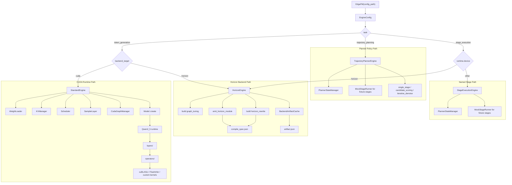
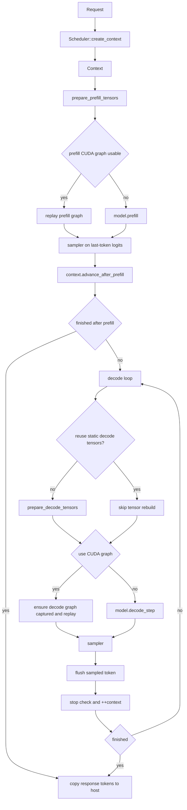
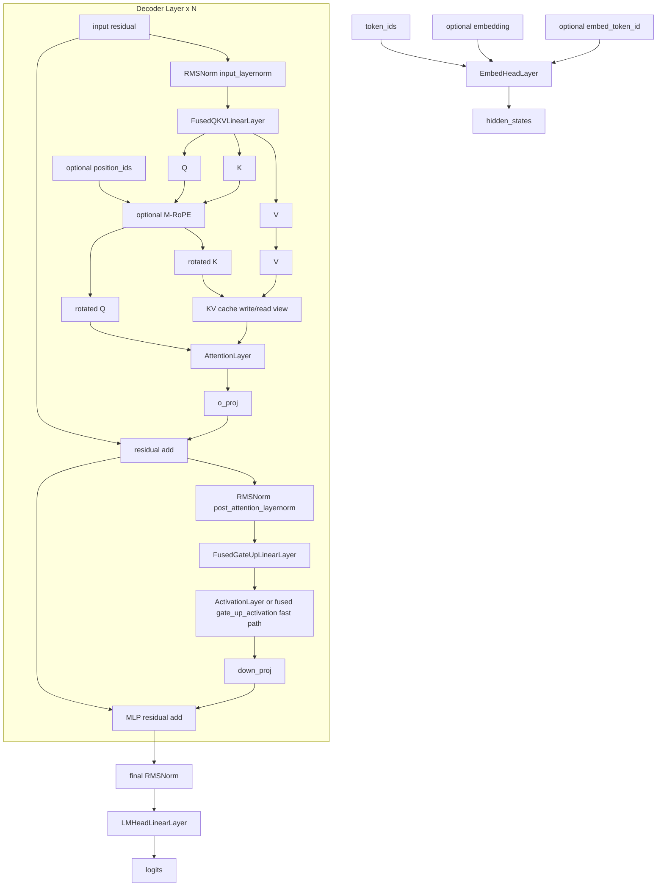
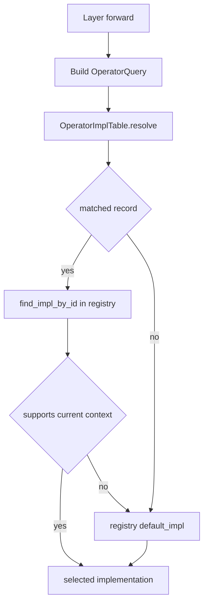
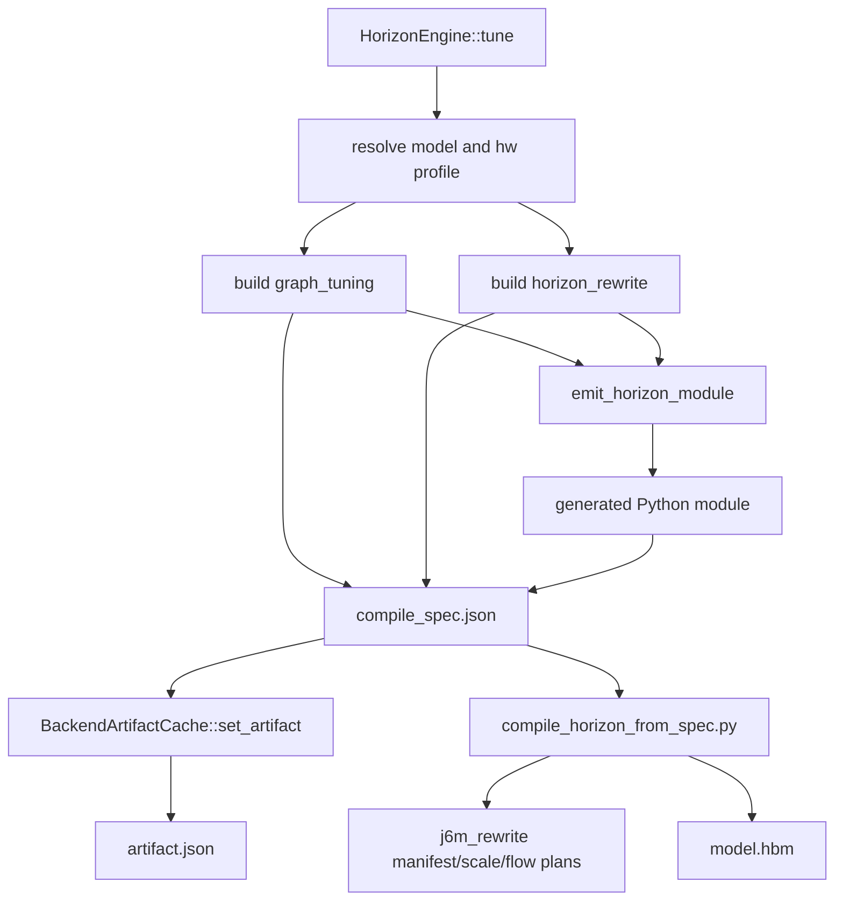

# EdgeFM 设计说明

本文描述当前代码库的真实结构和运行边界，内容以 `src/` 中已经实现的代码为准，不再保留早期计划中的过时抽象。

本文中的架构图均使用 Mermaid，不依赖额外的 `png` 或 `jpeg` 资源。

## 1. 范围和当前状态

当前 `EdgeFM` facade 的行为如下：

- CUDA 推理由 `StandardEngine` 承载。
- Horizon 由 `HorizonEngine` 承载；它会生成 compile spec，并且在存在已编译 `.hbm` artifact 时初始化内部 whole-graph runtime backend。
- 已支持的 token generation 模型名包括 `qwen2_5` 和 `qwen2_5_vl`。Planner 和 stage 相关模型名包括 `trajectory_planner`、`sparsedrive_v2`、`lingxi_sparsedrive_planner`，以及 `smolvla` 的 Horizon compile-prep 路径。
- `qwen2_5` 和 `qwen2_5_vl` 当前共用同一个 `Qwen2_5` runtime。
- `src/engine/experimental/speculative/` 中仍保留 `EagleEngine` 原型代码，但当前 `EdgeFM(config_path)` 会拒绝 `speculative.enabled=true`。

因此，当前代码库对外分成三类 task：

- `token_generation`：加载权重、分配 KV cache、执行 token prefill + decode、可选捕获 CUDA graph，并暴露 `generate()`。旧的 `text_generation` 配置会被归一化为该 task。
- `trajectory_planning`：执行 tensor planner policy stage，并通过 request-local 的 `PlannerStateManager` 暴露 `plan()`。
- `stage_execution`：执行命名 tensor stage，并暴露 `run_stage()`；`prefill()` 和 `decode()` 是兼容入口，内部等价于命名 stage 调用。

这些 task 下面仍有两类具体 backend：

- CUDA runtime 路径：加载权重、分配 KV cache、执行 prefill + decode，并可选捕获 CUDA graph。
- Horizon backend 路径：推导 graph metadata、生成 Python lowering module、写入 compile spec 和 artifact cache、准备 J6M rewrite 诊断，并在 runtime SDK/artifact 存在时初始化 HBM runtime I/O metadata。

## 2. 设计原则

当前设计遵循以下约束：

1. `engine.json` 必须显式声明 `model_name`。runtime 不从 checkpoint 目录结构推断模型家族。
2. CUDA 主执行路径不构建也不执行通用 IR。
3. runtime tuning 不再依赖线上 benchmark。算子选择通过 operator table 和 registry fallback 完成。
4. 源码按职责拆分：
   - `engine/`：facade dispatch、config/factory 逻辑，以及 `engine/tasks/` 下的 task engine。
   - `engine/tasks/token_generation/`：`generate()`、KV cache 管理、scheduler、compact vocab 和 token generation runtime 状态。
   - `engine/tasks/trajectory_planning/`：planner policy runtime、`PlannerStateManager` 和 planner tensor 工具。
   - `engine/tasks/stage_execution/`：命名 stage facade，以及 fixture 使用的 mock stage runner。
   - `models/`：模型专属 runtime。
   - `layers/`：模型层语义和融合权重组织。
   - `operators/`：实现查找、operator registry、具体 operator entrypoint 和底层 kernel。
   - `backends/`：backend artifact 生成和 cache。
5. 请求时的多模态数据通过 request contract 注入，而不是通过独立的模型图 IR 注入。

CUDA Qwen2.5 路径中，生产 prefill 加速能力位于 layer/operator 边界之后。模型代码不再调用 TensorRT engine bridge 来处理 prefill MLP 或 QKV/OProj。当前 3060 路径通过 operator table 选择 source-op CUTLASS/CUDA 实现；`edge_fm_trt` 仅作为独立的 `TRT-Edge-LLM` benchmark/reference Python 模块保留。

## 3. 系统架构



关键点：

- `EdgeFM` 优先根据 `EngineConfig::task()` 选择 engine，再选择 backend。
- CUDA 路径会先加载模型权重，再构造 `StandardEngine`。
- Horizon 路径不加载 CUDA runtime 状态；它产生 backend artifact，并使用 whole-graph runtime 边界，而不是 CUDA layers/operators。
- `Model::create()` 当前会把 `qwen2_5` 和 `qwen2_5_vl` 都解析到同一个 `Qwen2_5` 实现。
- `MockStageRunner` 不是 backend runtime，只用于 planner/stage 测试中的 deterministic `backend=mock` tensor stage。真实 TensorRT/Horizon stage adapter 应使用明确 backend runner 名称，不应隐藏在泛化 runtime 标签下。

## 4. 配置和调度

### 4.1 必要配置

公开入口保持不变：

```python
engine = edge_fm.EdgeFM("/path/to/engine.json")
```

对于 `task=token_generation`，`engine.json` 至少需要：

- `model_name`
- `prefill_model_path`
- `runtime.device`

对于 `task=trajectory_planning` 或 `task=stage_execution`，`prefill_model_path` 可以省略，因为 engine 可能只由命名 stage artifact 驱动。

`examples/config/base/engine_default.json` 中的核心结构如下：

```json
{
  "model_name": "Qwen2.5",
  "runtime": {
    "device": "cuda",
    "device_id": 0,
    "use_cuda_graph": false,
    "hw_profile": ""
  },
  "operator_impl_table_path": "",
  "prefill_model_path": "/models/qwen_prefill",
  "decode_model_path": null
}
```

### 4.2 归一化规则

`EngineConfig` 会归一化：

- `model_name`
  - `Qwen2.5`、`qwen2_5`、`qwen25`、`qwen2` -> `qwen2_5`
  - `Qwen2.5-VL`、`qwen2_5_vl`、`qwen25vl` -> `qwen2_5_vl`
  - `SmolVLA`、`smolvla`、`smol_vla` -> `smolvla`
- `task`
  - 省略 task 的 Qwen 配置 -> `token_generation`
  - 省略 task 的 planner 模型名，例如 `sparsedrive_v2` -> `trajectory_planning`
  - 省略 task 的 `smolvla` -> `stage_execution`
  - 显式值：`token_generation`、`trajectory_planning`、`stage_execution`
  - 兼容别名：`text_generation`、`multimodal_generation`、`vlm_generation`、`llm`、`generation` -> `token_generation`
- `runtime.hw_profile`
  - 若显式设置，则使用归一化后的值。
  - 若 CUDA 上省略，则从 device properties 推导 `cuda_smXX`，失败时 fallback 为 `cuda`。
  - 若 Horizon 上省略，则使用 `horizon`。

### 4.3 模型配置加载

checkpoint 侧的 `config.json` 仍会被读取，但只用于模型本地 metadata，例如：

- `num_hidden_layers`
- `hidden_size`
- `vocab_size`
- `torch_dtype`
- attention head layout
- `rope_theta`
- VLM `text_config`

对于 VLM checkpoint，`prefill_model_config()` 和 `decode_model_config()` 会展开 `text_config`，让 runtime 看到文本塔布局。

### 4.4 Backend 派发和当前限制

`src/edge-fm.cpp` 中当前 `EdgeFM` facade 行为如下：

- 若 `task == "trajectory_planning"`，构造 `TrajectoryPlannerEngine`。
- 若 `task == "stage_execution"` 且 `runtime.device == "horizon"`，构造 `HorizonEngine`。
- 若 `task == "stage_execution"` 且不是 Horizon，构造 `StageExecutionEngine`。
- 其他情况按 `token_generation` 走现有 CUDA/Horizon backend dispatch。
- 若 `speculative.enabled == true`，立即抛错。

因此，虽然树中有原型代码，speculative decoding 目前仍不是公开支持的 runtime 模式。

### 4.5 Planner 和 Stage 配置

Planner policy 推理保持 tensor-in/tensor-out。它不引入训练 loss、视觉预处理、请求队列或 diffusion serving scheduler。当前已实现的 planner kind 包括：

- `single_stage`：运行一个 stage，例如 `plan`，并返回 `trajectory`。
- `candidate_scoring`：运行 scoring stage，选择 `candidate_scores.argmax`，返回 `selected_index` 和选中的 `trajectory`。
- `iterative_denoise`：可选运行 `context`，循环执行 `step` stage，并用 `euler_flow` 或 `ddim` 风格替换更新 planner state。

当 `planner.kind` 省略时，`planner.method` 可作为短别名：

- `scoring` -> `candidate_scoring`
- `flow`、`flow_matching`、`diffusion`、`diffusion_policy` -> `iterative_denoise`

对于 `iterative_denoise`，调用者可以显式传入 state tensor，例如 `current_actions`。如果省略，engine 会根据 `planner.trajectory_shape`、`planner.noise_sigma` 和 `planner.seed` 初始化。每一步还会收到一个 float32 timestep tensor，名称由 `planner.timestep_tensor` 指定，默认是 `timestep`，数值范围来自 `timestep_start` 到 `timestep_end`。

TensorRT `.engine` planner stage 预期也接入同一个 `run_stage()` 边界，但 C++ TensorRT stage adapter 故意留给后续 fixture-backed 实现，以保证第一版 planner policy 层保持 backend-neutral 且不影响回归。

Flow-matching 轨迹规划参考使用 GoalFlow / arXiv 2503.05689；仓库不再在 `doc/` 下保存该论文 PDF artifact。

Mock 配置示例：

```json
{
  "task": "trajectory_planning",
  "model_name": "lingxi_sparsedrive_planner",
  "runtime": {"device": "cpu"},
  "planner": {
    "kind": "iterative_denoise",
    "method": "flow",
    "sampler": "euler_flow",
    "num_steps": 3,
    "state_tensor": "current_actions",
    "step_stage": "step",
    "step_output_tensor": "velocity",
    "output_tensor": "trajectory"
  },
  "stages": {
    "step": {
      "backend": "mock",
      "outputs": {
        "velocity": {
          "dtype": "float32",
          "shape": [1, 2, 2],
          "values": [3.0, 6.0, 9.0, 12.0]
        }
      }
    }
  }
}
```

`PlannerStateManager` 是 request-local 状态。`run_stage()` 按以下顺序解析输入：显式调用输入、同一 `request_id` 的 cached tensor、stage `defaults` / `default_inputs`。它类似 LLM 中 `KVManager` 对 token KV 状态的管理，但保存的是通用 context/action/candidate tensor，而不是 attention KV cache。

## 5. CUDA 运行时路径

### 5.1 运行时对象

`StandardEngine` 拥有或协调：

- `Model`
- `KVManager`
- `Scheduler`
- `SamplerLayer`
- `CudaGraphManager`

`Scheduler::create_context()` 为每个请求构造一个 `Context`。`Context` 包含：

- request 指针
- response buffer
- 每层 KV read/write 指针
- model runtime 使用的 tensor map
- 模型专属状态，例如 cached `mrope_last_pos`

### 5.2 预热行为

`StandardEngine::warmup()` 做两件事：

1. 对配置了 prefix tokens 的 slot，运行一次 prefill，将 prefix KV cache 物化出来。
2. 如果启用了 CUDA graph 且 decode graph 尚未捕获，则使用 warmup 后的 slot 捕获 decode graph。

因此 warmup 不只是性能预热；它也是 prefix KV 状态和可选 decode graph 状态准备完成的时间点。

### 5.3 生成流程



当前重要行为：

- Prefill 只采样 prompt 最后一个 token 的 logits。
- Decode 逐 token 执行。
- 当 CUDA graph 激活且模型暴露 static decode runtime tensor 时，engine 可以跳过重复 decode tensor setup。
- Decode graph replay 会更新动态 KV write 目标，同时保持 token ids、KV length 和模型管理 decode state 的 device buffer 地址稳定。

### 5.4 Tensor 准备职责

`prepare_prefill_tensors()` 负责：

- prompt token tensor
- 可选 multimodal embedding tensor
- 可选 `embed_token_id`
- 可选 `position_ids`
- model workspace tensor
- sampler output buffer
- 每层 KV cache write/read view

`prepare_decode_tensors()` 负责：

- 稳定的单 token decode input buffer
- 稳定的 device-side KV length buffer
- 模型需要时使用的稳定 decode `position_ids` buffer
- 每层 decode KV read/write view

这个分工很重要，因为 CUDA graph replay 依赖 decode 侧地址稳定。

### 5.5 CUDA 上的 `tune()` 语义

在 CUDA 路径上，`StandardEngine::tune()` 现在只是轻量 validation/preparation：

- 通过 `EngineConfig` 解析 model name 和 hardware profile。
- 强制加载并解析 operator table。
- 不 benchmark kernel。
- 不生成 CUDA 专属 tuning cache。

因此 `tune()` 仍属于 API surface，但语义已经从“在线 autotuning”变成“静态准备”。

## 6. Qwen2.5 运行时和模型结构

### 6.1 运行时范围

`Qwen2_5` 是当前唯一生产模型 runtime，由以下模型共享：

- 纯文本 `qwen2_5`
- 多模态 `qwen2_5_vl`

两者主要差异在 request 侧数据：

- 纯文本请求只提供 `token_ids`。
- VLM 请求可以额外提供 `embedding`、`embed_token_id` 和 `position_ids`。

### 6.2 层清单

`Qwen2_5` 当前使用的 layer building block：

| Component | Role |
| --- | --- |
| `EmbedHeadLayer` | token embedding 和可选 embedding 注入 |
| `RMSNormLayer` | input norm、post-attention norm、final norm |
| `AttentionLayer` | prefill/decode attention，并配合 M-RoPE |
| `FusedQKVLinearLayer` | 融合 Q/K/V projection |
| `LinearLayer` | `o_proj`、`down_proj` 和其他普通 linear 路径 |
| `FusedGateUpLinearLayer` | 融合 SwiGLU gate/up projection |
| `ActivationLayer` | `silu_and_mul` |
| `LMHeadLinearLayer` | 最终 logits projection；可在适用时复用 embedding table |

### 6.3 模型结构



### 6.4 Prefill 与 decode 行为

Prefill 路径：

- 输入是完整的非 prefix prompt span。
- fused QKV projection 会把整个 prompt segment 写入 KV cache。
- attention 运行在 prefill mode。
- LM head 只 projection 第一次采样需要的最后一个 token。

Decode 路径：

- 输入长度始终为 `1`。
- attention 读取累积 KV cache，并追加一个新的 K/V slot。
- 模型管理的 decode state，例如 M-RoPE `position_ids`，会原地前进。
- CUDA graph replay 可以跨 step 复用同一个 decode graph。

### 6.5 多模态和 M-RoPE

对于 VLM 请求：

- custom embedding 由 `EmbedHeadLayer` 注入。
- 注入位置由 `embed_token_id` 指定。
- M-RoPE `position_ids` 可以由 request 携带。

对于 M-RoPE 模型：

- prefill 使用 request 提供的 `position_ids` 旋转 `Q/K`。
- decode 从 request state 推导起始 3D position，并在每一步后于 device 上递增。

## 7. Layers 与 Operators 分层

### 7.1 边界

`layers/` 负责模型语义：

- tensor contract
- residual 结构
- 融合 HF 权重组织
- 模型层级的 forward 结构

`operators/` 负责实现派发：

- operator registry
- implementation lookup
- table-driven selection
- vendor library entrypoint
- `operators/kernels/` 下的 repo-local kernel

因此 layer 代码回答“这里发生什么操作”，operator 代码回答“实际运行哪个实现”。

### 7.2 当前通过 operator table 路由的 op kind

当前 operator table 不再只覆盖 linear，也会被以下 op kind 查询：

- `linear`
- `attention`
- `norm`
- `activation`
- `fused_gate_up_activation`

### 7.3 选择流程



查询 key 包括：

- `model_name`
- `hw_profile`
- `op_kind`
- `layer_role`
- `op_name`
- `stage`
- `shape_sig`

匹配会优先选择更具体的记录：

- `op_name` 精确匹配优先于 wildcard。
- `layer_role` 精确匹配优先于 wildcard。
- `shape_sig` 精确匹配优先于 wildcard。
- `stage` 精确匹配优先于 wildcard。
- `hw_profile` 精确匹配优先于 generic profile。

### 7.4 内置默认和外部 overlay

`OperatorImplTable` 总是先加载 builtin defaults，再追加 `operator_impl_table_path` 中的记录。

当前 builtin defaults 包括：

- `linear -> cublasLt`
- `attention -> flashinfer_attention`
- `norm -> flashinfer_norm`
- `activation -> flashinfer_silu_and_mul`

由于外部记录追加在 builtin 之后，resolver 在分数相同或更具体时保留最后一个 best match，因此外部表可以自然覆盖 builtin defaults。

### 7.5 实际意义

这种设计允许：

- 按硬件选择 linear algorithm。
- 按 shape 配置 attention tuning record。
- 后续接入 `cutile` 等 generated kernel。
- 可选接入 `fused_gate_up_activation` 等 decode fast path。

同时不要求 model-layer 代码理解 vendor-specific kernel。

## 8. Horizon 后端路径

`HorizonEngine` 是 whole-graph backend 边界。CUDA 请求仍使用 `StandardEngine`；Horizon 请求不会实例化 CUDA layers/operators/model graph。在没有 Horizon SDK 支持的构建中，runtime 初始化会返回明确的 “not compiled” 错误，但 compile-spec 生成仍可使用。

### 8.1 Tune 流程



`graph_tuning` 当前包含：

- `attention_type`
- `kv_cache.dtype`
- `kv_cache.layout`
- `uses_mrope`
- `uses_embedding_injection`
- `linear_operator_table`
- `target_hw_constraints`
- 存在 `horizon_rewrite` 时，它会被嵌入到 generated module metadata 中。

生成的 compile spec 使用 schema `edgefm_horizon_compile_spec_v2`。

### 8.2 J6M rewrite 准备

`scripts/horizon/compile_horizon_from_spec.py` 接受 `--horizon-rewrite`，取值为 `auto`、`on` 或 `off`。在 J6M/SmolVLA spec 上，它会写出：

- `horizon_j6m_rewrite_manifest.json`
- `scale_check_config.json`
- `flow_matching_export_plan.json`

对于 SmolVLA，`scripts/horizon/j6m_rewrite.py` 还提供针对 LeRobot source-of-truth 模型的 Python 级 rewrite：

- boolean/int16-safe attention mask construction
- 使用有界 negative mask fill，而不是 `finfo(float32).min`
- 显式 fp32 RoPE sin/cos 计算
- piecewise tanh-GELU 替换，避免 activation overflow
- parameter scale diagnostics 和 per-step flow-matching bin export plan

生成的 SmolVLA Horizon module 会从 LeRobot 调用 `SmolVLAPolicy.from_pretrained()`，应用上述 rewrite，并将 phase-1 LLM 路径导出为两个 whole-model stage：`prefill` 和 `decode`。

### 8.3 Tensor stage API

Whole-model backend 可以通过以下接口暴露 tensor-in/tensor-out stage：

- `EdgeFM::run_stage(request_id, stage_name, inputs)`
- `EdgeFM::prefill(request_id, inputs)`
- `EdgeFM::decode(request_id, inputs)`

`prefill()` 和 `decode()` 是 `run_stage("prefill")`、`run_stage("decode")` 的兼容包装。Planner 和 whole-stage artifact 可以在 stage manifest / compile spec 中声明 `context`、`step`、`score` 等额外 stage 名。

对于 SmolVLA phase 1，`prefill` 产生 `prefix_kv_layer_*` tensor，并把它们存入 engine 侧 request cache。`decode` 消费 suffix inputs，可以复用同一 `request_id` 下缓存的 KV tensor，也可以由调用者显式传入 `prefix_kv_layer_*`。Horizon stage output 会按 tensor name merge 回 request cache，因此后续 stage 不会丢弃已有 tensor，除非覆盖同名 tensor。

使用示例见 `doc/smolvla_phase1_horizon_usage.md`。

### 8.4 当前 `generate()` 行为

`HorizonEngine::generate()` 当前会：

1. 校验 request。
2. 检查 backend artifact 是否已缓存或由内部注入。
3. 检查预期 `model.hbm` 是否存在。
4. 在已编译时初始化 `HorizonRuntimeBackend`，并记录 runtime I/O 名称和 shape。
5. 抛出 `Horizon generate I/O mapping is not implemented in this interface phase`。

因此 Horizon runtime ownership 和 I/O discovery 已经接好，但 token/action mapping 有意留到后续 interface phase。

## 9. 源码边界

当前源码布局：

- `src/edge-fm.cpp`
  - 公开 `EdgeFM` facade。
- `src/tensor.cpp`、`src/utils/device/tensor_*.cpp`
  - 公开 `Tensor` 实现，以及由 CMake 选择的 CPU/CUDA device memory ops。
- `src/engine/`
  - `engine.*`、`engine_factory.*`：`EngineConfig`、base `Engine` 和 engine factory。
  - `tasks/token_generation/`：backend engine 共享的 token-generation helper，包括 compact vocab、`KVManager` 和 scheduler。
  - `tasks/trajectory_planning/`：planner facade engine、`PlannerStateManager` 和 planner tensor helper。
  - `tasks/stage_execution/`：通用命名 stage facade engine，以及 deterministic fixture stage 使用的 `MockStageRunner`。
  - `tasks/token_generation/cuda/`：CUDA token-generation backend 实现。
  - `tasks/stage_execution/horizon/`：Horizon stage/backend engine 实现。
  - `tasks/token_generation/cuda/tuning/`：`StandardEngine::tune()` 使用的 CUDA token-generation operator-table preparation。
  - `experimental/speculative/`：speculative engine 原型代码，未接入公开 facade。
- `src/backends/`
  - 只放平台/backend 基础设施：artifact cache、Horizon module emitter、backend target enum、whole-graph runtime backend wrapper。
  - task-level `Engine` 实现不放在这里，而是位于 `src/engine/tasks/<task>/<backend>/`。
- `src/models/`
  - 模型 dispatch 和 model runtime。
- `src/models/qwen2_5/`
  - 当前生产 runtime，覆盖 text 和 VL。
- `src/layers/`
  - 语义层 building block。
- `src/operators/`
  - operator registry、table lookup、具体 operator entrypoint。
- `src/operators/kernels/`
  - operator implementation 使用的底层 CUDA kernel。
- `src/utils/`
  - memory、CUDA graph helper、weight loading、logging、device utilities。

## 10. 当前非目标和限制

当前代码有意不做以下事情：

- CUDA 路径不引入通用 runtime IR。
- 不做 benchmark-based runtime tuning。
- 不通过 `EdgeFM` 公开 speculative decoding。
- Horizon token/action generation loop 尚未公开；当前只具备 HBM I/O discovery。
- 不从 checkpoint 命名或文件布局推断模型家族。

作为交换，代码保持了更紧的映射关系：

- engine config
- 具体 model runtime
- layer semantics
- operator implementation selection
- backend-specific lowering artifacts

这是当前仓库的主要设计方向。
