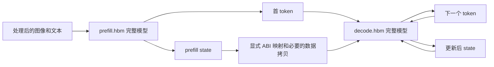

# J6P VLM：两个完整 HBM 与 KV Cache

更新：2026-09-21。示例模型为 Qwen3.5-0.8B；模型名称不代表已完成 J6P 编译。

部署单位固定为两个完整模型：`prefill.hbm`（包含视觉编码和完整语言 prefill）
与 `decode.hbm`（完整语言模型的单 token decode）。Python 只调用这两个模型，
不调度 layer，不实现 attention/GEMM kernel，也不依赖自定义算子。

[Python 示例](../vlaforge/examples/j6p_vlm_kv_cache.py) 提供预处理、两次调用间的
cache 映射、生成循环与失败处理；[测试](../vlaforge/tests/unit/test_j6p_vlm_kv_cache_example.py)
只验证编排契约。目前 `J6PCompleteHbmProviderImpl` 的三个设备方法明确抛出
`NotImplementedError`，需要接入真实 SDK。仓库还没有这两个 VLM HBM 及经过验证
的 J6P provider，因此不能直接在板上运行本例得到文本。

## 1. 两个完整模型的输入输出

| 项目 | prefill.hbm | decode.hbm |
|---|---|---|
| 计算 | 视觉编码、视觉 token 注入、全部语言层、输出 head | 单 token embedding、全部语言层、cache 更新、输出 head |
| 序列长度 | 固定 prompt 长度 P | 每次 1 个 token |
| 新请求输入 | 图像和 prompt 的处理后张量及位置元数据 | 当前 token、cache_position、RoPE/有效长度元数据、历史 state |
| 历史 KV 输入 | 本例没有；每个请求从空历史开始 | 必须输入当前历史缓存 |
| 输出 | 首 token 或 logits、prefill state、位置元数据 | 下一个 token 或 logits、更新后的 state |
| 算子集合 | 视觉与语言 prefill 图 | 单 token 语言 decode 图；不同于 prefill |
| 编译要求 | 完整图可编译，无自定义算子 | 完整图可编译，无自定义算子 |



两图使用同一 checkpoint，但输入参数、cache 形状、算子和物理内存计划可能不同。
不要求二者共享权重内存，也不能把两个 HBM 都加载时的权重占用只计算一次。
是否包含 argmax 由导出合同确定；若 HBM 输出 logits，provider 可在 CPU 做明确的
greedy 选择并计入主机开销，这不是向 HBM 添加自定义算子。本例返回独立 Python
整数 token，避免后续推理覆盖上一轮输出 buffer。

## 2. Prefill 与 Decode 的 cache 参数差异

设 P 为无 padding 的 prompt token 数（含视觉 token），C 为 decode cache 容量。

| 接口 | 逻辑内容 | 一种可能的导出形状 |
|---|---|---|
| prefill 输出 K/V | P 个 prompt token 的历史 | `[B,Hkv,P,D]` 或导出时填充为 `[B,Hkv,C,D]` |
| decode 输入 K/V | 截至当前写入位置之前的历史 | 固定 `[B,Hkv,C,D]`，另传有效长度/mask |
| decode 输出 K/V | 本次单 token 更新后的完整缓存 | 固定 `[B,Hkv,C,D]` |

有的 decode 导出只输出 `[B,Hkv,1,D]` 的增量。这需要额外的显式写回合同；不能
把增量当完整缓存传入下一次调用。本例选择完整缓存输出，并在不兼容时拒绝。

每个 HBM 保留自己的端口名称、顺序、shape、dtype 和 layout。使用两张映射表：

```python
# destination port -> source port；这里只展示某个 full-attention 层的两项
prefill_to_decode = {"past_k": "present_k", "past_v": "present_v"}
decode_to_decode = {"past_k": "updated_k", "past_v": "updated_v"}
```

这两张表描述整模型边界的数据连接，不是 layer 调度。真实表要列出全部状态。
示例分别使用 `state_inputs` 和 `state_outputs`，按 decode 输入顺序重排句柄，
校验两侧 shape/dtype/layout；名字和排列可以不同，物理表示不能静默改变。

若 prefill 输出 P 长度、decode 需要 C 长度，可在导出时用支持的标准算子填充到 C；
也可在 provider 中明确执行一次 buffer 初始化、拷贝前 P 个位置及 layout 转换，
并保留有效长度。后者属于主机数据搬运，不是第三个 HBM 或自定义算子。本例的
直接映射不实现这个转换，遇到长度不匹配会报 `state ABI mismatch`。
量化缓存还必须核对 scale、zero point、量化轴及存储格式，不能仅因都是 INT16
就直接连接。本例元数据检查不替代 SDK 对真实 tensor 的校验。

## 3. Qwen3.5 不只有 K/V

当前 [Qwen 状态适配器](../vlaforge/python/vlaforge/adapters/qwen3_5/qwen3_5_state.py)
按 `layer_types` 展开状态，层级信息仅用于描述两个整模型的 ABI。

| 状态 | 逻辑布局 | 更新 |
|---|---|---|
| Full attention K/V | `[B,Hkv,C,D]` | 向 cache_position 写入新 K/V，屏蔽未使用槽位 |
| Linear attention convolution | `[B,conv_dim,K]` | 滚动保存历史卷积输入 |
| Linear attention recurrent | `[B,Hv,Dk,Dv]` | 每 token 更新完整循环状态 |
| RoPE 元数据 | 按模型导出约定 | prefill 后保留，用于生成位置输入 |

通常 `conv_dim = 2*Hk*Dk + Hv*Dv`；应读取具体模型的 `in_proj_qkv`/conv 参数
与实际导出端口。当前 `state_spec()` 使用 `3*Hk*Dk`，隐含 key/value 总维度相等
的假设，不能复制这个公式作为任意 Qwen 配置的通用保证。

当前 H20 的正式结果来自 `Qwen3_5GenerateExact`，full-attention cache 在展开图中
采用动态增长；固定容量的 `Qwen3_5ExplicitDecode` 使用不同的 mask/更新计算。
已有 H20 byte-exact 结果不证明固定容量 J6P 版本也等价，更不证明两图都可编译。

## 4. 一次请求的 token 位置

prefill 已经产生第 1 个输出 token。生成 N 个新 token 只需要 N-1 次 decode。

```python
prefill = provider.prefill(...)
tokens = [prefill.first_token]
state = bind_prefill_to_decode(prefill.state)
for i in range(1, N):
    result = provider.decode(
        token=tokens[-1], cache_position=P + i - 1,
        rope_deltas=prefill.rope_deltas, state=state,
    )
    tokens.append(result.next_token)
    state = bind_decode_to_decode(result.state)
```

上段是流程说明，实际可执行编排在示例的 `generate()` 中。首个 decode 写入
位置 P，结束时缓存有效长度为 P+N-1，最后一个输出 token 尚未写入 cache。
必须满足 `P+N-1 <= C`。N=1 时只执行 prefill。多轮聊天继续使用最后 token
之前必须处理这个位置约定；本例每个请求 reset，不实现多轮续写或 EOS 早停。

`cache_position` 与模型的 RoPE `position_ids` 不可混为一谈。Qwen 多模态位置
还依赖图像网格和 `rope_deltas`，provider 按模型合同生成位置 tensor。

## 5. Python 使用方式

从仓库根目录运行，先把 examples 加入导入路径：

```bash
PYTHONPATH=vlaforge/examples python your_vlm_app.py
```

`your_vlm_app.py` 的写法如下。`profile.json` 与两份 manifest 必须由自己的
实际 J6P 导出结果提供，不能从 H20 的 TorchScript bundle 改后缀得到。

```python
import json
from pathlib import Path
from PIL import Image
from transformers import AutoProcessor
from j6p_vlm_kv_cache import (
    CompleteHbmManifest, J6PVLMDeployment, load_complete_hbm_provider,
    prepare_qwen35,
)

root = Path("/data/models/qwen35_08b")
profile = json.loads((root / "profile.json").read_text())
processor = AutoProcessor.from_pretrained(root / "processor", local_files_only=True)
with Image.open("/data/input.jpg") as source:
    prepared = prepare_qwen35(processor, source.convert("RGB"), "Describe this image.")

# 本仓库此 factory 仅构造适配骨架；先补齐 SDK 方法才能运行 generate。
provider = load_complete_hbm_provider(
    prefill_manifest=CompleteHbmManifest.from_json(root / "prefill_manifest.json"),
    decode_manifest=CompleteHbmManifest.from_json(root / "decode_manifest.json"),
    model_id=profile["model_id"],
    prompt_length=profile["prompt_length"],
    max_sequence_length=profile["max_sequence_length"],
    prefill_to_decode=profile["prefill_to_decode"],
    decode_to_decode=profile["decode_to_decode"],
)
result = J6PVLMDeployment(provider).generate(prepared, new_tokens=16)
print(processor.decode(list(result.tokens), skip_special_tokens=True))
```

每份 manifest 的示例 schema 如下。端口清单省略了实际模型的全部状态；不能
把下面片段作为完整 Qwen manifest。`state_inputs`/`state_outputs` 中每项必须
包含 `name`、`shape`、`dtype`、`layout`，且 name 存在于对应端口清单。

```json
{
  "stage": "prefill",
  "hbm": "prefill.hbm",
  "inputs": ["input_ids", "attention_mask", "pixel_values"],
  "outputs": ["first_token", "present_k"],
  "state_inputs": [],
  "state_outputs": [{"name": "present_k", "shape": [1, 2, 384, 128],
                     "dtype": "fp16", "layout": "B,Hkv,C,D"}],
  "custom_ops": false
}
```

`custom_ops: false` 是配置声明，不是编译证明。provider 必须用实际 HBM
model_info、编译报告和 SDK 端口信息核对；完整模型合法性不能靠文件存在判定。
生产包还需记录 checkpoint/HBM hash、processor 版本、算子放置和量化参数。

## 6. 当前适配器的固定 profile 限制

- batch=1、无 padding；示例预处理拒绝非全 1 attention mask。当前 prefill
  的 forward 虽接收 mask，但未参与实际 attention 计算，不能靠补零支持变长。
- 当前 prefill 构造时固定 `position_ids`、`rope_deltas` 和 vision grid 常量。
  图像网格或视觉 token 位置变化时，reset 不会改变这些常量。provider 必须
  比较请求的网格/位置与已编译 profile，不匹配则选择另一个完整 HBM 对或拒绝。
- Python 接口的字段不一定都是 HBM 动态输入：固定元数据可能已经被编译进图。
  provider 必须使用真实端口清单绑定，不能凭上述语义参数名臆造 HBRT 输入。
- 示例校验长度与 state 连接；真实输入张量的 shape/dtype/stride、网格和位置
  检查仍由接入的 provider 完成。不能把目前的 Python 测试当作板端验收。

## 7. 所有权、reset 与缓存复用

两个 HBM 在同一 Session 生命周期内常驻。cache buffer 必须在 BPU completion
后才能读写或复用。除非 SDK 和完整图明确支持读写别名，decode 输入与输出
使用独立 buffer，完成后切换；必要的数据搬运、同步和 cache coherency 计入
开销。对 CPU fallback 也要用实际放置报告说明。

每个 Session 的可写状态独立；不要让不同用户复用同一 KV buffer。示例每次
请求 reset，失败或取消时丢弃请求状态并重新 prefill。这是失效恢复，**不等于**
保留旧状态的原子回滚。`cache_key` 仅为诊断摘要，不授权跨请求命中缓存。

若以后增加 prefix reuse，key 至少绑定两份 HBM/checkpoint/processor/profile
身份以及文本、图像、mask、位置数据。缓存应保存不可变的 prefill 快照，不能
复用已经被 decode 改写的 buffer。当前例子不实现这项优化。

## 8. 内存和验收

单套 full-attention cache 字节数为 `2 * L_full * B * Hkv * C * D * itemsize`。
每层 linear state 另加 `B*conv_dim*K*conv_itemsize + B*Hv*Dk*Dv*state_itemsize`。
双 buffer、HBM 权重/workspace、输出 logits、stride 对齐及 CPU 内存另算；实际
端口 dtype 决定 itemsize，不假设所有循环状态都允许半精度。

验收两个完整图分别编译、真实 prefill 输出连接 decode、完整 N-token 输出、
新请求 reset 和失败重试。时延分别报告：模型加载、HBM prefill、单次 decode、
request TTFT、固定长度总耗时。decode throughput 为 `(N-1)/decode_time`，
N=1 时不适用；全请求吞吐为 `N/total_time`，必须明确是否包含预处理和拷贝。

当前工作不新增板端实验。J6M SmolVLA 和 H20 Qwen 的既有结果不替代 J6P 验收。

## 参考

- [现有 Python InvocationBuilder 与状态语义](../vlaforge/spec/python-invocation.md)：
  日后可把两个完整 HBM 包装为两个 TensorRegion；provider 在图外适配官方 runtime，
  并非添加 HBM 自定义算子。当前编译链还不能通过设置 `device="bpu"` 自动完成。
- [Board handoff 现状](specs/board_target_handoff_v1.md) 与
  [H20 Qwen 固定配置结果](reports/qwen35_native_formal_20260910.md)。
- [Hugging Face 缓存与位置说明](https://huggingface.co/docs/transformers/v4.50.0/en/cache_explanation)。
- [Horizon 模型推理开发指南](https://doc.oe.horizon.auto/en/guide/model_deployment/board_deployment/runtime_dev.html)。
