# SmolVLA Model Architecture Explained

## 1. Overall Architecture Overview

SmolVLA is a lightweight Vision-Language-Action (VLA) foundation model released by HuggingFace for robot control. It consists of three core components:

1. **Vision Encoder (SigLIP)** — extracts image features
2. **VLM (SmolVLM2 / Llama)** — understands visual and language inputs, generates contextual features
3. **Action Expert + Flow Matching** — predicts continuous actions based on contextual features

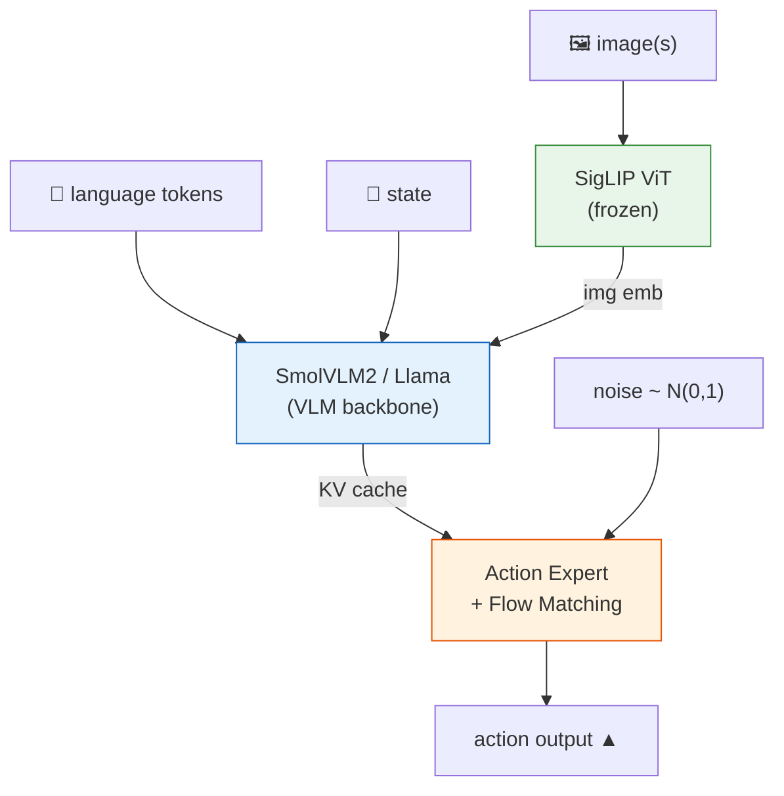
```mermaid
graph TB
    IMG["🖼 image(s)"]
    LANG["💬 language tokens"]
    STATE["🤖 state"]
    NOISE["noise ~ N(0,1)"]

    SIGLIP["SigLIP ViT<br/>(frozen)"]
    VLM["SmolVLM2 / Llama<br/>(VLM backbone)"]
    EXPERT["Action Expert<br/>+ Flow Matching"]

    ACTIONS["action output ▲"]

    IMG --> SIGLIP
    LANG --> VLM
    STATE --> VLM
    SIGLIP -->|"img emb"| VLM
    VLM -->|"KV cache"| EXPERT
    NOISE --> EXPERT
    EXPERT --> ACTIONS

    style SIGLIP fill:#e8f5e9,stroke:#388e3c
    style VLM fill:#e3f2fd,stroke:#1565c0
    style EXPERT fill:#fff3e0,stroke:#e65100
```

### Data Flow

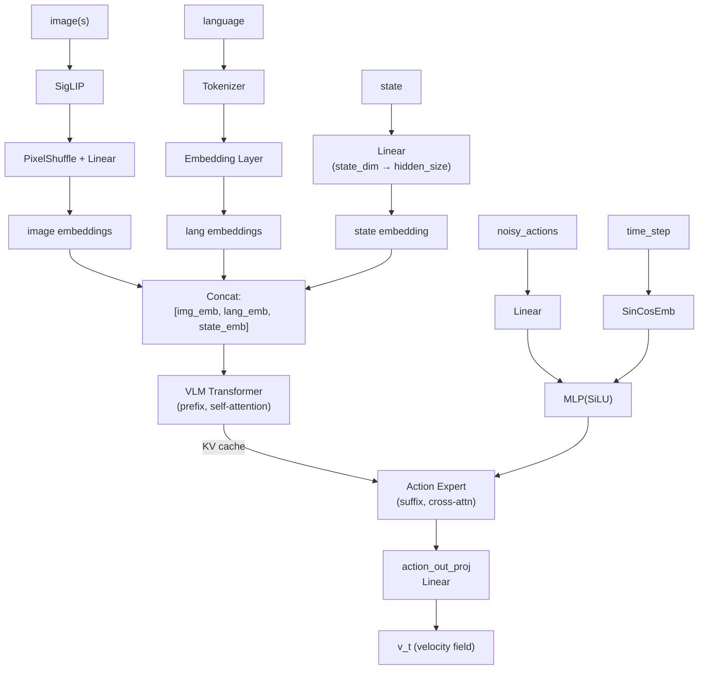
```mermaid
graph TB
    IMG["image(s)"]
    SIGLIP["SigLIP"]
    PXSHUFFLE["PixelShuffle + Linear"]
    IMG_EMB["image embeddings"]

    LANG["language"]
    TOK["Tokenizer"]
    LEMB["Embedding Layer"]
    LANG_EMB["lang embeddings"]

    STATE["state"]
    SPROJ["Linear<br/>(state_dim → hidden_size)"]
    STATE_EMB["state embedding"]

    CONCAT["Concat:<br/>[img_emb, lang_emb, state_emb]"]
    VLM_FWD["VLM Transformer<br/>(prefix, self-attention)"]

    NOISY["noisy_actions"]
    AINPROJ["Linear"]
    TIME["time_step"]
    SINEMB["SinCosEmb"]
    MLP["MLP(SiLU)"]

    EXPERT_FWD["Action Expert<br/>(suffix, cross-attn)"]

    AOUTPROJ["action_out_proj<br/>Linear"]
    VT["v_t (velocity field)"]

    IMG --> SIGLIP --> PXSHUFFLE --> IMG_EMB --> CONCAT
    LANG --> TOK --> LEMB --> LANG_EMB --> CONCAT
    STATE --> SPROJ --> STATE_EMB --> CONCAT

    CONCAT --> VLM_FWD -->|"KV cache"| EXPERT_FWD

    NOISY --> AINPROJ --> MLP --> EXPERT_FWD
    TIME --> SINEMB --> MLP

    EXPERT_FWD --> AOUTPROJ --> VT
```

---

## 2. Detailed Architecture Diagram (Mermaid)

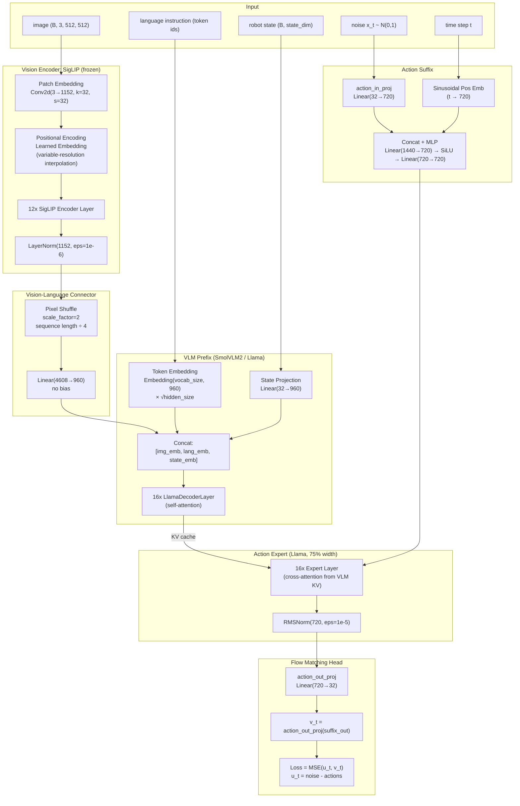
```mermaid
graph TB
    subgraph Input["Input"]
        IMG["image (B, 3, 512, 512)"]
        LANG["language instruction (token ids)"]
        STATE["robot state (B, state_dim)"]
        NOISE["noise x_t ~ N(0,1)"]
        TIME["time step t"]
    end

    subgraph VisionEncoder["Vision Encoder: SigLIP (frozen)"]
        PATCH["Patch Embedding<br/>Conv2d(3→1152, k=32, s=32)"]
        POS_EMB_V["Positional Encoding<br/>Learned Embedding<br/>(variable-resolution interpolation)"]
        VIT_LAYERS["12x SigLIP Encoder Layer"]
        VIT_NORM["LayerNorm(1152, eps=1e-6)"]
    end

    subgraph Connector["Vision-Language Connector"]
        PS["Pixel Shuffle<br/>scale_factor=2<br/>sequence length ÷ 4"]
        PROJ["Linear(4608→960)<br/>no bias"]
    end

    subgraph VLMPrefix["VLM Prefix (SmolVLM2 / Llama)"]
        LANG_EMB["Token Embedding<br/>Embedding(vocab_size, 960)<br/>× √hidden_size"]
        STATE_PROJ["State Projection<br/>Linear(32→960)"]
        PREFIX_CONCAT["Concat:<br/>[img_emb, lang_emb, state_emb]"]
        VLM_LAYERS["16x LlamaDecoderLayer<br/>(self-attention)"]
    end

    subgraph ActionSuffix["Action Suffix"]
        ACT_IN["action_in_proj<br/>Linear(32→720)"]
        TIME_EMB["Sinusoidal Pos Emb<br/>(t → 720)"]
        ACT_TIME["Concat + MLP<br/>Linear(1440→720) → SiLU → Linear(720→720)"]
    end

    subgraph ActionExpert["Action Expert (Llama, 75% width)"]
        EXPERT_LAYERS["16x Expert Layer<br/>(cross-attention from VLM KV)"]
        EXPERT_NORM["RMSNorm(720, eps=1e-5)"]
    end

    subgraph FlowMatching["Flow Matching Head"]
        ACT_OUT["action_out_proj<br/>Linear(720→32)"]
        V_T["v_t = action_out_proj(suffix_out)"]
        LOSS["Loss = MSE(u_t, v_t)<br/>u_t = noise - actions"]
    end

    IMG --> PATCH --> POS_EMB_V --> VIT_LAYERS --> VIT_NORM
    VIT_NORM --> PS --> PROJ

    LANG --> LANG_EMB
    PROJ --> PREFIX_CONCAT
    LANG_EMB --> PREFIX_CONCAT
    STATE --> STATE_PROJ --> PREFIX_CONCAT

    PREFIX_CONCAT --> VLM_LAYERS
    VLM_LAYERS -->|KV cache| EXPERT_LAYERS

    NOISE --> ACT_IN
    TIME --> TIME_EMB
    ACT_IN --> ACT_TIME
    TIME_EMB --> ACT_TIME
    ACT_TIME --> EXPERT_LAYERS

    EXPERT_LAYERS --> EXPERT_NORM --> ACT_OUT --> V_T --> LOSS
```

---

## 3. Detailed Structure of Each Component

### 3.1 Vision Encoder: SigLIP

SigLIP is a standard Vision Transformer that supports variable-resolution inputs based on [Patch n' Pack (NaViT)](https://arxiv.org/abs/2307.06304).

| Parameter | Value |
|---|---|
| hidden_size | 1152 |
| intermediate_size | 3072 |
| num_hidden_layers | 12 |
| num_attention_heads | 16 |
| head_dim | 72 (1152/16) |
| patch_size | 32×32 |
| image_size | 224 (variable resolution) |
| activation | GELU (gelu_pytorch_tanh) |
| normalization | LayerNorm (eps=1e-6) |
| attention | bidirectional, no causal mask |

**SigLIP Encoder Layer:**

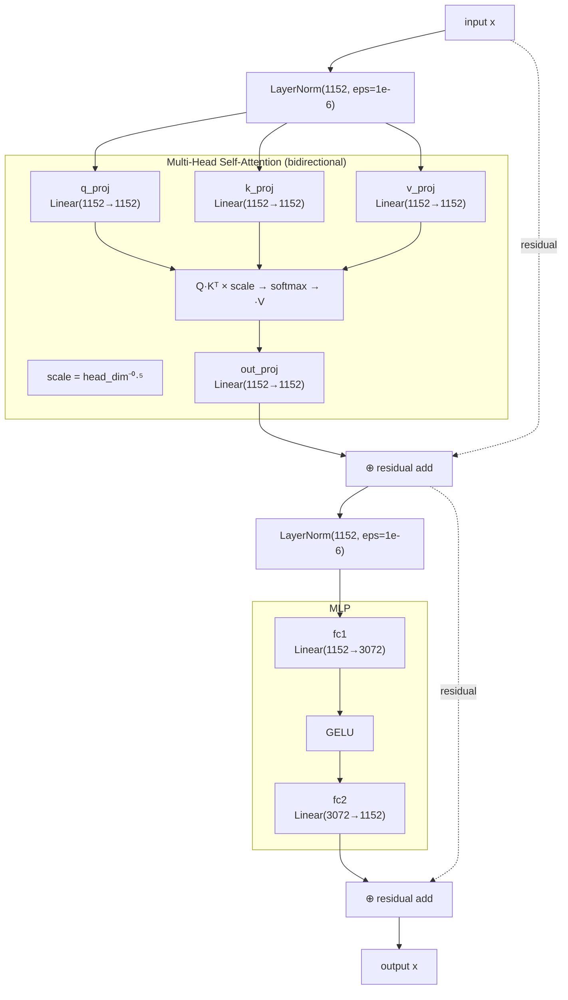
```mermaid
graph TB
    IN["input x"] --> LN1
    LN1["LayerNorm(1152, eps=1e-6)"]

    subgraph SelfAttn["Multi-Head Self-Attention (bidirectional)"]
        Q["q_proj<br/>Linear(1152→1152)"]
        K["k_proj<br/>Linear(1152→1152)"]
        V["v_proj<br/>Linear(1152→1152)"]
        SCALED["scale = head_dim⁻⁰·⁵"]
        ATTN["Q·Kᵀ × scale → softmax → ·V"]
        OUT["out_proj<br/>Linear(1152→1152)"]
        Q --> ATTN
        K --> ATTN
        V --> ATTN
        ATTN --> OUT
    end

    LN1 --> Q & K & V
    OUT --> RES1["⊕ residual add"]

    RES1 --> LN2["LayerNorm(1152, eps=1e-6)"]

    subgraph MLP["MLP"]
        FC1["fc1<br/>Linear(1152→3072)"]
        GELU["GELU"]
        FC2["fc2<br/>Linear(3072→1152)"]
        FC1 --> GELU --> FC2
    end

    LN2 --> FC1
    FC2 --> RES2["⊕ residual add"]
    RES2 --> OUT_X["output x"]

    IN -.->|"residual"| RES1
    RES1 -.->|"residual"| RES2
```

**Patch Embedding + Positional Encoding:**

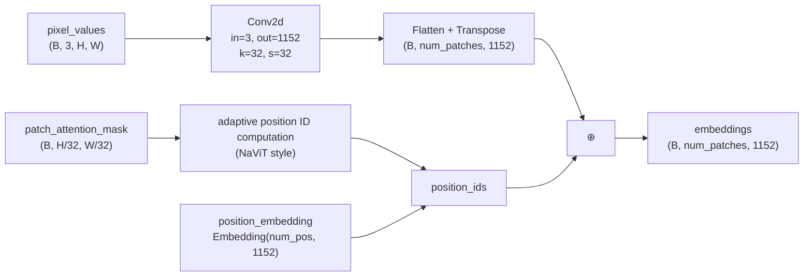
```mermaid
graph LR
    PIXEL["pixel_values<br/>(B, 3, H, W)"] --> CONV["Conv2d<br/>in=3, out=1152<br/>k=32, s=32"]
    CONV --> FLATTEN["Flatten + Transpose<br/>(B, num_patches, 1152)"]

    MASK["patch_attention_mask<br/>(B, H/32, W/32)"] --> ADAPT["adaptive position ID computation<br/>(NaViT style)"]
    ADAPT --> POS_IDS["position_ids"]

    FLATTEN --> ADD["⊕"]
    POS_EMB["position_embedding<br/>Embedding(num_pos, 1152)"] --> POS_IDS --> ADD
    ADD --> EMB_OUT["embeddings<br/>(B, num_patches, 1152)"]
```

**Vision Model Overall:**

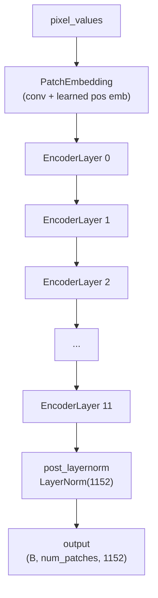
```mermaid
graph TB
    PIXEL["pixel_values"] --> EMB["PatchEmbedding<br/>(conv + learned pos emb)"]
    EMB --> L0["EncoderLayer 0"]
    L0 --> L1["EncoderLayer 1"]
    L1 --> L2["EncoderLayer 2"]
    L2 --> DOT["..."]
    DOT --> L11["EncoderLayer 11"]
    L11 --> NORM["post_layernorm<br/>LayerNorm(1152)"]
    NORM --> OUT["output<br/>(B, num_patches, 1152)"]
```

---

### 3.2 Vision-Language Connector

The Connector is responsible for projecting the image embeddings output by SigLIP into the embedding space of the language model, while reducing the sequence length.

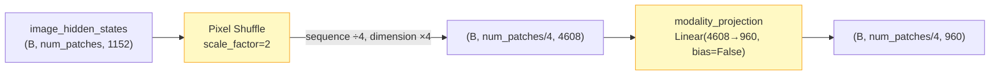
```mermaid
graph LR
    IN["image_hidden_states<br/>(B, num_patches, 1152)"]
    IN --> PS["Pixel Shuffle<br/>scale_factor=2"]
    PS -->|"sequence ÷4, dimension ×4"| MID["(B, num_patches/4, 4608)"]
    MID --> PROJ["modality_projection<br/>Linear(4608→960, bias=False)"]
    PROJ --> OUT["(B, num_patches/4, 960)"]

    style PS fill:#fff9c4,stroke:#f9a825
    style PROJ fill:#fff9c4,stroke:#f9a825
```

- 4608 = 1152 × scale_factor² = 1152 × 4
- 960 = text_config.hidden_size

---

### 3.3 VLM Text Model: Llama (SmolVLM2-500M backbone)

The text model of SmolVLM2-500M is based on the **Llama** architecture (not Gemma2), using GQA and a SwiGLU FFN.

| Parameter | Value |
|---|---|
| model_type | llama |
| hidden_size | 960 |
| intermediate_size | 2560 |
| num_hidden_layers | 16 (SmolVLA defaults to trimming to this) |
| num_attention_heads | 15 |
| num_key_value_heads | 5 |
| head_dim | 64 |
| vocab_size | 49152 |
| max_position_embeddings | 4096 |
| hidden_act | silu |
| rms_norm_eps | 1e-5 |
| attention_bias | False |
| rope_theta | 100000.0 |

> **Note**: The parameters above are the actual configuration of SmolVLM2-500M. SmolVLA defaults to `num_vlm_layers=16` (i.e., the full 16 layers).

**Llama Decoder Layer:**

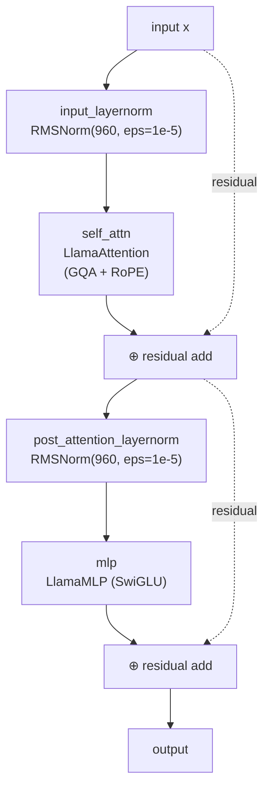
```mermaid
graph TB
    X["input x"] --> LN1["input_layernorm<br/>RMSNorm(960, eps=1e-5)"]
    LN1 --> ATTN["self_attn<br/>LlamaAttention<br/>(GQA + RoPE)"]
    ATTN --> RES1["⊕ residual add"]

    RES1 --> LN2["post_attention_layernorm<br/>RMSNorm(960, eps=1e-5)"]
    LN2 --> FFN["mlp<br/>LlamaMLP (SwiGLU)"]
    FFN --> RES2["⊕ residual add"]
    RES2 --> OUT["output"]

    X -.->|"residual"| RES1
    RES1 -.->|"residual"| RES2
```

**Llama Attention (GQA + RoPE):**

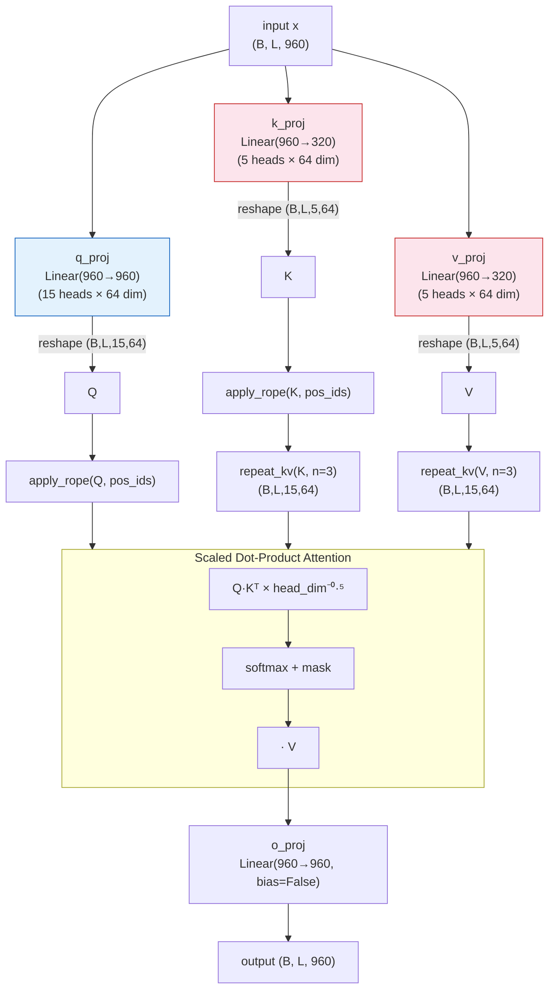
```mermaid
graph TB
    X["input x<br/>(B, L, 960)"] --> QP["q_proj<br/>Linear(960→960)<br/>(15 heads × 64 dim)"]
    X --> KP["k_proj<br/>Linear(960→320)<br/>(5 heads × 64 dim)"]
    X --> VP["v_proj<br/>Linear(960→320)<br/>(5 heads × 64 dim)"]

    QP -->|"reshape (B,L,15,64)"| QR["Q"]
    KP -->|"reshape (B,L,5,64)"| KR["K"]
    VP -->|"reshape (B,L,5,64)"| VR["V"]

    QR --> ROPE_Q["apply_rope(Q, pos_ids)"]
    KR --> ROPE_K["apply_rope(K, pos_ids)"]

    ROPE_Q --> ATTN
    ROPE_K --> REPEAT_K["repeat_kv(K, n=3)<br/>(B,L,15,64)"]
    REPEAT_K --> ATTN

    VR --> REPEAT_V["repeat_kv(V, n=3)<br/>(B,L,15,64)"]
    REPEAT_V --> ATTN

    subgraph ATTN["Scaled Dot-Product Attention"]
        SCORES["Q·Kᵀ × head_dim⁻⁰·⁵"]
        SOFTMAX["softmax + mask"]
        WEIGHTED["· V"]
        SCORES --> SOFTMAX --> WEIGHTED
    end

    WEIGHTED --> OPROJ["o_proj<br/>Linear(960→960, bias=False)"]
    OPROJ --> OUT["output (B, L, 960)"]

    style QP fill:#e3f2fd,stroke:#1565c0
    style KP fill:#fce4ec,stroke:#c62828
    style VP fill:#fce4ec,stroke:#c62828
```

Key point: In GQA, 15 Q heads / 5 KV heads = a 3:1 ratio, where each KV head is shared by 3 Q heads.

**RoPE Positional Encoding:**

```
RoPE (θ = 100000.0):
  # compute inverse frequencies
  inv_freq = 1.0 / (100000.0 ^ (arange(0, 64, 2) / 64))
  # inv_freq shape: (32,)

  forward(x, position_ids):
    freqs = position_ids^T @ inv_freq       # (B, L, 32)
    emb = cat(freqs, freqs, dim=-1)          # (B, L, 64)
    cos = emb.cos()
    sin = emb.sin()

    # apply rotation
    x1, x2 = x[..., :32], x[..., 32:]
    Q = cat(x1 * cos - x2 * sin, x1 * sin + x2 * cos)
    return Q, K

# Simplified apply_rope in SmolVLA (smolvlm_with_expert.py):
apply_rope(x, positions, max_wavelength=10000):
  d_half = x.shape[-1] // 2
  freq_exponents = (2.0 / D) * arange(d_half)
  timescale = max_wavelength ^ freq_exponents
  radians = positions / timescale
  sin, cos = sin(radians), cos(radians)
  x1, x2 = split(x, d_half)
  res[..., :d_half] = x1 * cos - x2 * sin
  res[..., d_half:] = x2 * cos + x1 * sin
  return res
```

**Llama FFN (SwiGLU / Gated GeGLU):**

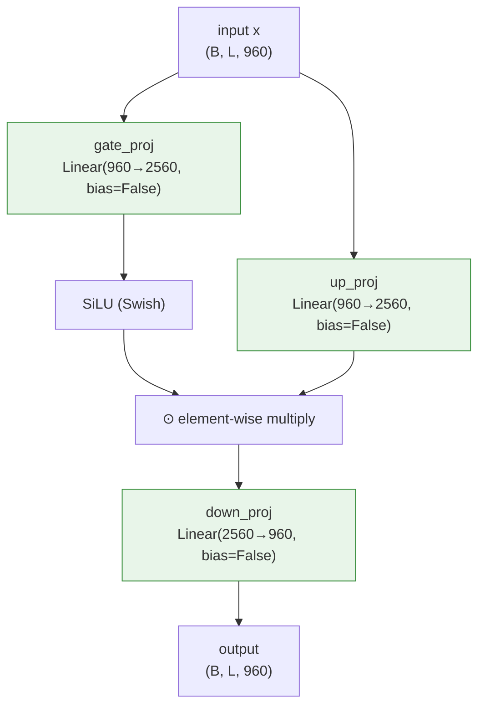
```mermaid
graph TB
    X["input x<br/>(B, L, 960)"]

    X --> GATE["gate_proj<br/>Linear(960→2560, bias=False)"]
    X --> UP["up_proj<br/>Linear(960→2560, bias=False)"]

    GATE --> SILU["SiLU (Swish)"]
    SILU --> MUL["⊙ element-wise multiply"]
    UP --> MUL

    MUL --> DOWN["down_proj<br/>Linear(2560→960, bias=False)"]
    DOWN --> OUT["output<br/>(B, L, 960)"]

    style GATE fill:#e8f5e9,stroke:#388e3c
    style UP fill:#e8f5e9,stroke:#388e3c
    style DOWN fill:#e8f5e9,stroke:#388e3c
```

Formula: `output = down_proj(SiLU(gate_proj(x)) ⊙ up_proj(x))`

**RMSNorm:**

```
RMSNorm(hidden_size=960, eps=1e-5):
  weight = Parameter(ones(960))

  forward(x):
    variance = x.pow(2).mean(-1, keepdim=True)
    x = x * rsqrt(variance + eps)
    return weight * x
```

---

### 3.4 Action Expert

The Action Expert is a narrower Llama model that obtains contextual information from the VLM's KV cache via Cross-Attention.

| Parameter | Value | Computation |
|---|---|---|
| hidden_size | 720 | 960 × 0.75 |
| intermediate_size | 1920 | `get_intermediate_size(720)` = aligned to a multiple of 256 |
| num_hidden_layers | 16 | same as the number of VLM layers (default) |
| num_attention_heads | same as VLM | inherited from the VLM's head structure |
| num_key_value_heads | same as VLM | inherited from the VLM's KV head structure |
| head_dim | 64 | same as VLM |
| expert_width_multiplier | 0.75 | SmolVLA default value |

**Computation of intermediate_size:**

```python
def get_intermediate_size(hidden_dim, ffn_dim_multiplier=4, multiple_of=256):
    hidden_dim = int(2 * hidden_dim / 3)        # 720 * 2/3 = 480
    hidden_dim = int(ffn_dim_multiplier * hidden_dim)  # 4 * 480 = 1920
    hidden_dim = multiple_of * ((hidden_dim + multiple_of - 1) // multiple_of)  # align to 256
    return hidden_dim  # 1920
```

**Layer Correspondence Between Expert and VLM:**

SmolVLA supports two attention modes: `self_attn` and `cross_attn` (the default is `cross_attn`).

In `cross_attn` mode:
- Every `self_attn_every_n_layers=2` layers, the Expert layer performs self-attention once
- The remaining layers perform cross-attention: the Expert's Q comes from action tokens, and K/V come from the VLM's KV cache

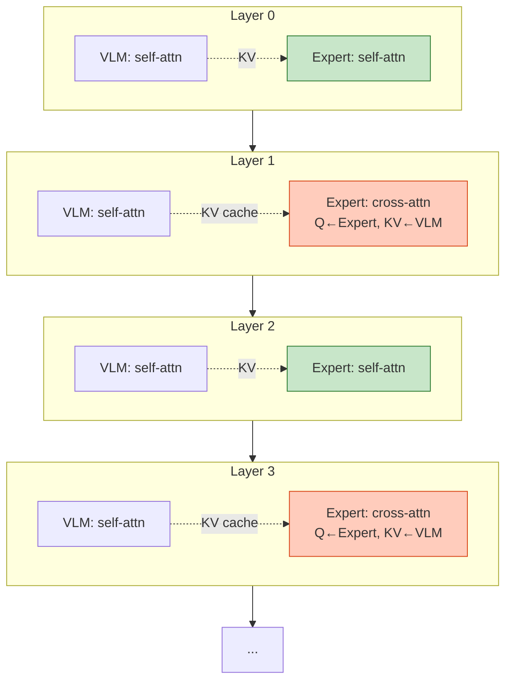
```mermaid
graph TB
    subgraph Layer0["Layer 0"]
        V0["VLM: self-attn"]
        E0["Expert: self-attn"]
        V0 -.->|"KV"| E0
    end

    subgraph Layer1["Layer 1"]
        V1["VLM: self-attn"]
        E1["Expert: cross-attn<br/>Q←Expert, KV←VLM"]
        V1 -.->|"KV cache"| E1
    end

    subgraph Layer2["Layer 2"]
        V2["VLM: self-attn"]
        E2["Expert: self-attn"]
        V2 -.->|"KV"| E2
    end

    subgraph Layer3["Layer 3"]
        V3["VLM: self-attn"]
        E3["Expert: cross-attn<br/>Q←Expert, KV←VLM"]
        V3 -.->|"KV cache"| E3
    end

    Layer0 --> Layer1 --> Layer2 --> Layer3 --> DOT["..."]

    style E0 fill:#c8e6c9,stroke:#2e7d32
    style E1 fill:#ffccbc,stroke:#d84315
    style E2 fill:#c8e6c9,stroke:#2e7d32
    style E3 fill:#ffccbc,stroke:#d84315
```

- Green = self-attn layer (triggered every 2 layers)
- Orange = cross-attn layer (Q comes from Expert, K/V come from VLM KV cache)

**Cross-Attention Mechanism:**

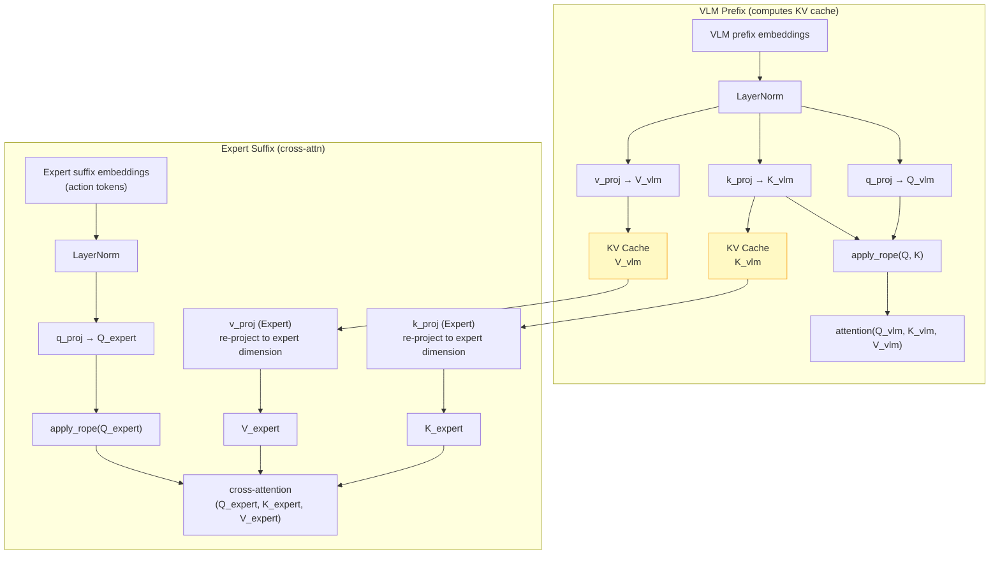
```mermaid
graph TB
    subgraph VLMPrefix["VLM Prefix (computes KV cache)"]
        VP_EMB["VLM prefix embeddings"] --> VP_LN["LayerNorm"]
        VP_LN --> VP_Q["q_proj → Q_vlm"]
        VP_LN --> VP_K["k_proj → K_vlm"]
        VP_LN --> VP_V["v_proj → V_vlm"]
        VP_Q --> VP_ROPE["apply_rope(Q, K)"]
        VP_K --> VP_ROPE
        VP_ROPE --> VP_ATTN["attention(Q_vlm, K_vlm, V_vlm)"]
        VP_K --> CACHE_K["KV Cache<br/>K_vlm"]
        VP_V --> CACHE_V["KV Cache<br/>V_vlm"]
    end

    subgraph ExpertSuffix["Expert Suffix (cross-attn)"]
        EX_EMB["Expert suffix embeddings<br/>(action tokens)"] --> EX_LN["LayerNorm"]
        EX_LN --> EX_Q["q_proj → Q_expert"]
        EX_Q --> EX_ROPE["apply_rope(Q_expert)"]

        CACHE_K --> EX_KPROJ["k_proj (Expert)<br/>re-project to expert dimension"]
        CACHE_V --> EX_VPROJ["v_proj (Expert)<br/>re-project to expert dimension"]

        EX_ROPE --> EX_ATTN["cross-attention<br/>(Q_expert, K_expert, V_expert)"]
        EX_KPROJ --> EX_K["K_expert"]
        EX_VPROJ --> EX_V["V_expert"]
        EX_K --> EX_ATTN
        EX_V --> EX_ATTN
    end

    style CACHE_K fill:#fff9c4,stroke:#f9a825
    style CACHE_V fill:#fff9c4,stroke:#f9a825
```

Key: The Expert's hidden_size is smaller (720 vs 960), so additional k_proj / v_proj are needed to project the VLM's KV cache into the Expert's dimensional space.

---

### 3.5 Flow Matching Head

SmolVLA uses **Flow Matching** (rather than Diffusion/DDPM) to predict continuous actions.

**Training (Forward Pass):**

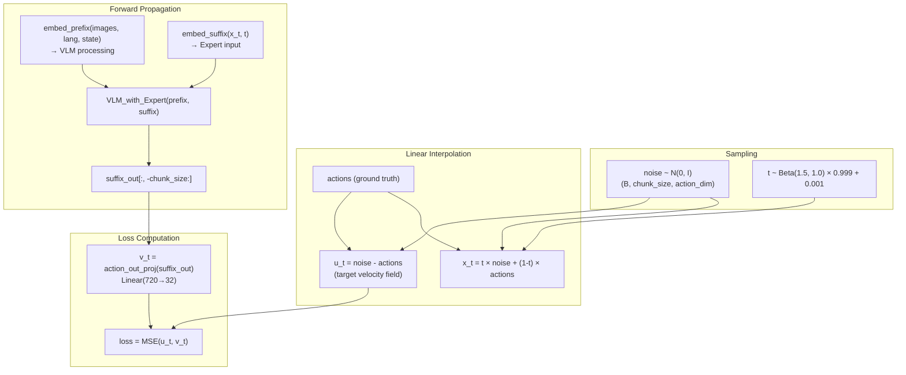
```mermaid
graph TB
    subgraph Sample["Sampling"]
        NOISE["noise ~ N(0, I)<br/>(B, chunk_size, action_dim)"]
        TIME["t ~ Beta(1.5, 1.0) × 0.999 + 0.001"]
    end

    subgraph Interpolate["Linear Interpolation"]
        ACTIONS["actions (ground truth)"]
        XT["x_t = t × noise + (1-t) × actions"]
        UT["u_t = noise - actions<br/>(target velocity field)"]
        NOISE --> XT
        TIME --> XT
        ACTIONS --> XT
        NOISE --> UT
        ACTIONS --> UT
    end

    subgraph Forward["Forward Propagation"]
        PREFIX["embed_prefix(images, lang, state)<br/>→ VLM processing"]
        SUFFIX["embed_suffix(x_t, t)<br/>→ Expert input"]
        VLM_EXP["VLM_with_Expert(prefix, suffix)"]
        SUFFIX_OUT["suffix_out[:, -chunk_size:]"]
        PREFIX --> VLM_EXP
        SUFFIX --> VLM_EXP
        VLM_EXP --> SUFFIX_OUT
    end

    subgraph Loss["Loss Computation"]
        VT["v_t = action_out_proj(suffix_out)<br/>Linear(720→32)"]
        MSE["loss = MSE(u_t, v_t)"]
        SUFFIX_OUT --> VT
        UT --> MSE
        VT --> MSE
    end
```

**Inference (Sampling):**

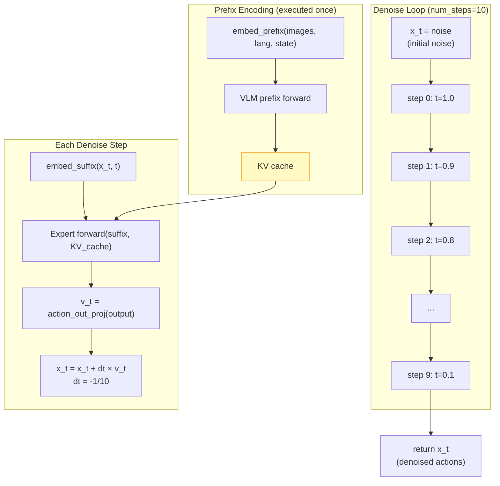
```mermaid
graph TB
    subgraph PrefixEncode["Prefix Encoding (executed once)"]
        P_EMB["embed_prefix(images, lang, state)"]
        P_FWD["VLM prefix forward"]
        KV["KV cache"]
        P_EMB --> P_FWD --> KV
    end

    subgraph DenoiseLoop["Denoise Loop (num_steps=10)"]
        INIT["x_t = noise<br/>(initial noise)"]
        INIT --> STEP0

        STEP0["step 0: t=1.0"] --> STEP1["step 1: t=0.9"]
        STEP1 --> STEP2["step 2: t=0.8"]
        STEP2 --> DOT["..."]
        DOT --> STEPN["step 9: t=0.1"]
    end

    subgraph EachStep["Each Denoise Step"]
        S_EMB["embed_suffix(x_t, t)"]
        E_FWD["Expert forward(suffix, KV_cache)"]
        V_T["v_t = action_out_proj(output)"]
        UPDATE["x_t = x_t + dt × v_t<br/>dt = -1/10"]
        S_EMB --> E_FWD --> V_T --> UPDATE
    end

    KV --> E_FWD
    STEPN --> ACTIONS["return x_t<br/>(denoised actions)"]

    style KV fill:#fff9c4,stroke:#f9a825
```

**Action Suffix Embedding:**

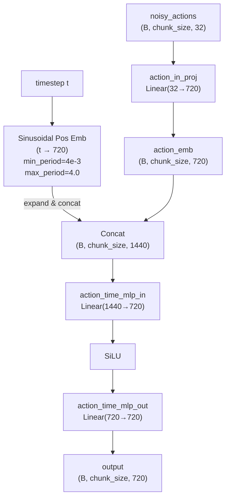
```mermaid
graph TB
    NOISY["noisy_actions<br/>(B, chunk_size, 32)"]
    TIME["timestep t"]
    TIME --> SINEMB["Sinusoidal Pos Emb<br/>(t → 720)<br/>min_period=4e-3<br/>max_period=4.0"]

    NOISY --> AINPROJ["action_in_proj<br/>Linear(32→720)"]
    AINPROJ --> ACT_EMB["action_emb<br/>(B, chunk_size, 720)"]

    SINEMB -->|"expand & concat"| CAT["Concat<br/>(B, chunk_size, 1440)"]
    ACT_EMB --> CAT

    CAT --> MLP_IN["action_time_mlp_in<br/>Linear(1440→720)"]
    MLP_IN --> SILU["SiLU"]
    SILU --> MLP_OUT["action_time_mlp_out<br/>Linear(720→720)"]
    MLP_OUT --> OUT["output<br/>(B, chunk_size, 720)"]
```

---

### 3.6 Attention Mask Strategy

SmolVLA uses a carefully designed attention mask to control the information flow between different tokens:

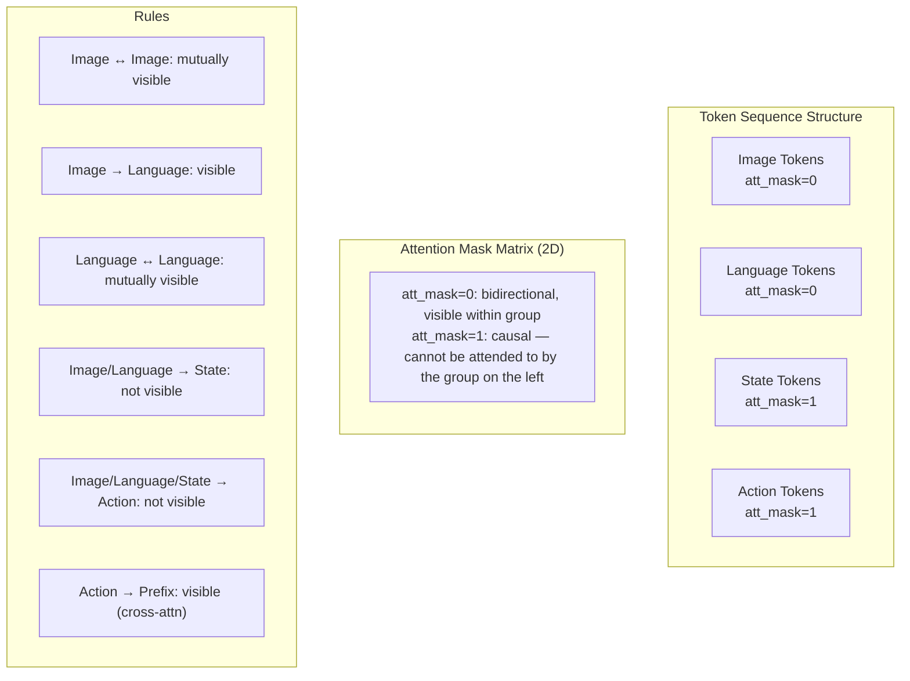
```mermaid
graph TB
    subgraph TokenSequence["Token Sequence Structure"]
        direction LR
        IMG_T["Image Tokens<br/>att_mask=0"]
        LANG_T["Language Tokens<br/>att_mask=0"]
        STATE_T["State Tokens<br/>att_mask=1"]
        ACT_T["Action Tokens<br/>att_mask=1"]
    end

    subgraph MaskMatrix["Attention Mask Matrix (2D)"]
        direction TB
        M_DESC["att_mask=0: bidirectional, visible within group<br/>att_mask=1: causal — cannot be attended to by the group on the left"]
    end

    subgraph Rules["Rules"]
        R1["Image ↔ Image: mutually visible"]
        R2["Image → Language: visible"]
        R3["Language ↔ Language: mutually visible"]
        R4["Image/Language → State: not visible"]
        R5["Image/Language/State → Action: not visible"]
        R6["Action → Prefix: visible (cross-attn)"]
    end
```

Mask computation formula:

```
make_att_2d_masks(pad_masks, att_masks):
  cumsum = cumsum(att_masks, dim=1)
  att_2d = cumsum[:, None, :] <= cumsum[:, :, None]  # causal structure
  pad_2d = pad_masks[:, None, :] & pad_masks[:, :, None]
  return att_2d & pad_2d
```

---

## 4. Complete SmolVLA Structure Diagram (Layered)


```mermaid
graph TB
    subgraph SmolVLA["SmolVLA = SmolVLAPolicy + VLAFlowMatching"]
        direction TB

        subgraph VLAFlowMatching["VLAFlowMatching"]
            direction TB

            subgraph VLMWithExpert["SmolVLMWithExpertModel"]
                direction TB

                subgraph SigLIP["SigLIP Vision Encoder (frozen)"]
                    direction LR
                    V_PATCH["PatchConv<br/>3→1152, k=32"]
                    V_POS["Learned Pos Emb"]
                    V_LAYERS["12× EncoderLayer<br/>LN→MHA→Res→LN→MLP→Res"]
                    V_FINAL["LayerNorm"]
                end

                subgraph Connector["Connector"]
                    direction LR
                    C_PS["PixelShuffle<br/>(÷4 seq len)"]
                    C_PROJ["Linear<br/>4608→960"]
                end

                subgraph VLM["VLM Text Model (Llama, 16 layers)"]
                    direction TB
                    T_EMB["Token Embedding<br/>× √960"]
                    T_LAYERS["16× LlamaDecoderLayer"]
                    T_NORM["RMSNorm(960)"]

                    subgraph VLM_LAYER["LlamaDecoderLayer"]
                        direction TB
                        VL_LN1["RMSNorm"]
                        VL_ATTN["GQA Self-Attn<br/>Q:15×64 K/V:5×64<br/>+ RoPE(θ=100000)"]
                        VL_RES1["Residual Add"]
                        VL_LN2["RMSNorm"]
                        VL_FFN["SwiGLU FFN<br/>gate:960→2560<br/>up:960→2560<br/>down:2560→960"]
                        VL_RES2["Residual Add"]
                    end
                end

                subgraph Expert["Action Expert (Llama, 75% width)"]
                    direction TB
                    E_LAYERS["16× ExpertDecoderLayer"]
                    E_NORM["RMSNorm(720)"]

                    subgraph EXPERT_LAYER["ExpertDecoderLayer"]
                        direction TB
                        EL_LN1["RMSNorm"]
                        EL_SELF["Self-Attn<br/>(every 2 layers)"]
                        EL_CROSS["Cross-Attn<br/>Q:from Expert<br/>K/V:from VLM cache<br/>(remaining layers)"]
                        EL_RES1["Residual Add"]
                        EL_LN2["RMSNorm"]
                        EL_FFN["SwiGLU FFN<br/>gate:720→1920<br/>up:720→1920<br/>down:1920→720"]
                        EL_RES2["Residual Add"]
                    end
                end
            end

            subgraph FlowMatchingHead["Flow Matching Head"]
                direction TB
                STATE_PROJ["state_proj<br/>Linear(32→960)"]
                ACT_IN["action_in_proj<br/>Linear(32→720)"]
                TIME_EMB["Sinusoidal Emb<br/>(t→720)"]
                TIME_MLP["action_time_mlp<br/>Linear(1440→720)→SiLU→Linear(720→720)"]
                ACT_OUT["action_out_proj<br/>Linear(720→32)"]
            end
        end
    end

    V_PATCH --> V_POS --> V_LAYERS --> V_FINAL --> C_PS --> C_PROJ
    C_PROJ --> VLM
    VLM_LAYERS -->|KV cache| EXPERT_LAYER
```

---

## 5. Summary of Key Design Choices

### 5.1 Model Scale

| Component | Parameters (approx.) | Trained? |
|---|---|---|
| SigLIP Vision Encoder | ~93M | Frozen |
| VLM (Llama 16L) | ~350M | Frozen (train_expert_only=True) |
| Action Expert (Llama 16L, 75%) | ~100M | **Trainable** |
| state_proj + action_in/out_proj | ~1M | **Trainable** |
| action_time_mlp | ~2M | **Trainable** |
| **Total** | **~450M** | |

### 5.2 Core Design Choices

1. **Cross-Attention instead of Self-Attention**: Most layers of the Action Expert obtain context from the VLM's KV cache via cross-attention, avoiding mixing action tokens and vision/language tokens in the same sequence and reducing the computational overhead at inference time.

2. **KV Cache Prefix Caching**: At inference time, the VLM prefix only needs to be executed once, and subsequent denoising steps only need to execute the Expert's cross-attention, providing a significant speedup.

3. **Flow Matching instead of Diffusion**: It uses a Continuous Normalizing Flow (Flow Matching) to predict the velocity field v_t, rather than DDPM's noise prediction, resulting in more stable training and fewer inference steps (10 steps).

4. **SwiGLU FFN**: It uses a Gated Linear Unit + SiLU activation, which performs better than a standard FFN but has slightly more parameters.

5. **GQA (Grouped Query Attention)**: 15 Q heads / 5 KV heads (a 3:1 ratio), reducing the KV cache size and improving inference efficiency.

6. **NaViT Variable Resolution**: SigLIP supports NaViT-style variable-resolution inputs, adapting to different image sizes via 2D positional encoding interpolation.

7. **Pixel Shuffle to Reduce Sequence Length**: The Connector uses pixel shuffle (scale=2) to reduce the number of image tokens by a factor of 4, while expanding the embedding dimension by a factor of 4 before projecting it through a linear layer.

---

## 6. Code-Level Walkthrough: Connecting Prefill and the Action Expert

### 6.1 Two-Stage Inference Flow

SmolVLA inference (`VLAFlowMatching.sample_actions`) is divided into **two stages**:

**Stage 1 — Prefill** (executed only once):

```python
# modeling_smolvla.py:822-835
prefix_embs, prefix_pad_masks, prefix_att_masks = self.embed_prefix(...)
_, past_key_values = self.vlm_with_expert.forward(
    inputs_embeds=[prefix_embs, None],   # ← only prefix, expert input is None
    use_cache=True,
    fill_kv_cache=True,                  # ← fill the KV cache
)
```

- The VLM's 16 self-attention layers process `[image_emb, lang_emb, state_emb]`
- The K/V produced by each layer are stored in `past_key_values[layer_idx]`
- The Expert does not participate in this stage (`inputs_embeds[1] = None`)

**Stage 2 — Denoise Loop** (executes `num_steps=10` steps):

```python
# modeling_smolvla.py:840-868
for step in range(num_steps):   # 10 steps
    v_t = self.denoise_step(x_t, prefix_pad_masks, past_key_values, timestep)
    x_t = x_t + dt * v_t
```

Each `denoise_step` call:

```python
# modeling_smolvla.py:896-903
outputs_embeds, _ = self.vlm_with_expert.forward(
    inputs_embeds=[None, suffix_embs],   # ← VLM input is None, only Expert
    past_key_values=past_key_values,     # ← reuse the KV cache from prefill
    use_cache=True,
    fill_kv_cache=False,                 # ← read the cache, do not write
)
```

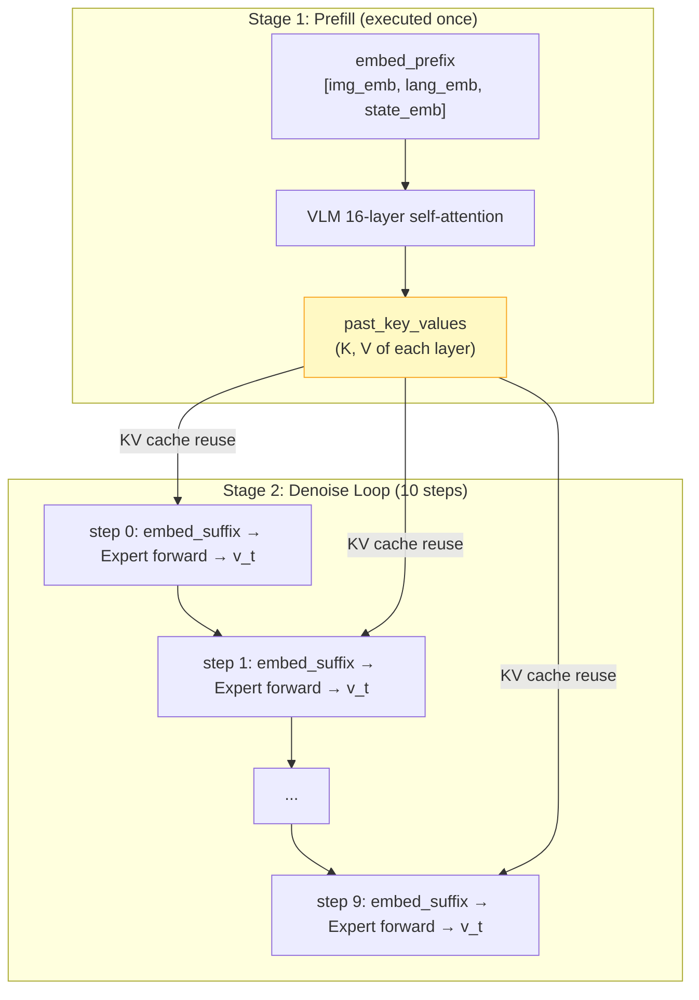
```mermaid
graph TB
    subgraph Prefill["Stage 1: Prefill (executed once)"]
        P_EMB["embed_prefix<br/>[img_emb, lang_emb, state_emb]"]
        P_FWD["VLM 16-layer self-attention"]
        P_KV["past_key_values<br/>(K, V of each layer)"]
        P_EMB --> P_FWD --> P_KV
    end

    subgraph Denoise["Stage 2: Denoise Loop (10 steps)"]
        D0["step 0: embed_suffix → Expert forward → v_t"]
        D1["step 1: embed_suffix → Expert forward → v_t"]
        DD["..."]
        D9["step 9: embed_suffix → Expert forward → v_t"]
        D0 --> D1 --> DD --> D9
    end

    P_KV -->|"KV cache reuse"| D0
    P_KV -->|"KV cache reuse"| D1
    P_KV -->|"KV cache reuse"| D9

    style P_KV fill:#fff9c4,stroke:#f9a825
```

---

### 6.2 Full Breakdown of a Single Denoise Step

`denoise_step` (`modeling_smolvla.py:875-908`) is the core function that loops 10 times during the inference stage. Stripping away auxiliary logic such as mask construction, it actually consists of only **3 steps**:

**Step 1 — `embed_suffix(x_t, t)`: Encode the noisy actions and time step into the Expert input**

```
x_t (B, chunk_size, 32)
  │
  ├── action_in_proj:  Linear(32 → 720)         → action_emb
  │
t (scalar, e.g., t=1.0 at step=0)
  │
  ├── SinCosEmb:      t → (720,)                → time_emb
  │                                            expand → (B, chunk_size, 720)
  │
  ├── concat [action_emb, time_emb]              → (B, chunk_size, 1440)
  │
  ├── action_time_mlp_in:  Linear(1440 → 720)    → SiLU
  ├── action_time_mlp_out: Linear(720 → 720)     → suffix_embs
```

Pure linear projections + a small MLP, with no attention, requiring very little computation.

**Step 2 — `vlm_with_expert.forward()`: The Expert's 16-layer transformer**

```
inputs_embeds = [None, suffix_embs]    # VLM is skipped, only the Expert runs
past_key_values = KV cached from prefill

for layer_idx in 0..15:
    even layers (0,2,4...):  Expert self-attn   (concat VLM prefix KV + Expert KV)
    odd layers (1,3,5...):   Expert cross-attn  (Q←Expert, KV←VLM cache + re-projection)
    → RMSNorm → FFN (SwiGLU)

→ RMSNorm → suffix_out
```

This is the most computationally intensive part, but it only involves the Expert (75% width, 720 dimensions); the VLM does not run at all.

**Step 3 — `action_out_proj`: Project out the velocity field v_t**

```
suffix_out[:, -chunk_size:]           # take the last chunk_size tokens
  → .to(float32)
  → action_out_proj:  Linear(720 → 32)
  → v_t                                # velocity field prediction
```

Returning to `sample_actions` (`modeling_smolvla.py:868`), the Euler step update is performed:

```
x_t = x_t + dt * v_t                  # dt = -1/10
```

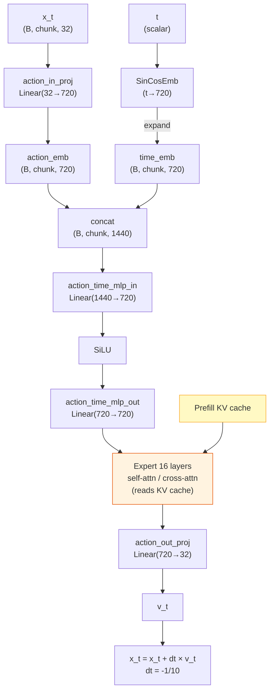
```mermaid
graph TB
    XT_IN["x_t<br/>(B, chunk, 32)"]
    T_IN["t<br/>(scalar)"]

    XT_IN --> AIN["action_in_proj<br/>Linear(32→720)"]
    T_IN --> SIN["SinCosEmb<br/>(t→720)"]

    AIN --> ACT_EMB["action_emb<br/>(B, chunk, 720)"]
    SIN -->|"expand"| TIME_EMB["time_emb<br/>(B, chunk, 720)"]

    ACT_EMB --> CAT["concat<br/>(B, chunk, 1440)"]
    TIME_EMB --> CAT

    CAT --> MLP_IN["action_time_mlp_in<br/>Linear(1440→720)"]
    MLP_IN --> SILU["SiLU"]
    SILU --> MLP_OUT["action_time_mlp_out<br/>Linear(720→720)"]

    MLP_OUT --> EXPERT["Expert 16 layers<br/>self-attn / cross-attn<br/>(reads KV cache)"]
    KV["Prefill KV cache"] --> EXPERT

    EXPERT --> AOUT["action_out_proj<br/>Linear(720→32)"]
    AOUT --> VT["v_t"]
    VT --> EULER["x_t = x_t + dt × v_t<br/>dt = -1/10"]

    style KV fill:#fff9c4,stroke:#f9a825
    style EXPERT fill:#fff3e0,stroke:#e65100
```

**Comparison of Computation per Step**:

| Step | Operation | Computation |
|---|---|---|
| embed_suffix | `Linear(32→720)` + SinCosEmb + `MLP(1440→720→720)` | very small |
| Expert forward | 16-layer Expert (720-dim, cross-attn reading the KV cache) | **main overhead** |
| action_out_proj | `Linear(720→32)` | minimal |
| Euler step | `x_t += dt * v_t` | minimal |

**Conclusion**: Within a denoise step, apart from `vlm_with_expert.forward()`, there are only two Linears + one small MLP + one addition, with almost no additional overhead. The computational bottleneck lies entirely in the Expert's 16-layer attention + FFN.

---

### 6.3 Layer-Level Routing: Self-Attn vs Cross-Attn

The core routing logic is in `SmolVLMWithExpertModel.forward` (`smolvlm_with_expert.py:437-467`):

```python
for layer_idx in range(num_layers):
    if (fill_kv_cache
        or "cross" not in self.attention_mode
        or (self.self_attn_every_n_layers > 0 and layer_idx % self.self_attn_every_n_layers == 0)):
        att_outputs, past_key_values = self.forward_attn_layer(...)       # self-attention
    else:
        att_outputs, past_key_values = self.forward_cross_attn_layer(...)  # cross-attention
```

With the default configuration `attention_mode="cross_attn"`, `self_attn_every_n_layers=2`, so:

| Layer | Prefill (`fill_kv_cache=True`) | Denoise (`fill_kv_cache=False`) |
|---|---|---|
| 0, 2, 4, ... | `forward_attn_layer` (VLM self-attn, store KV) | `forward_attn_layer` (Expert self-attn) |
| 1, 3, 5, ... | `forward_attn_layer` (VLM self-attn, store KV) | `forward_cross_attn_layer` (Expert cross-attn) |

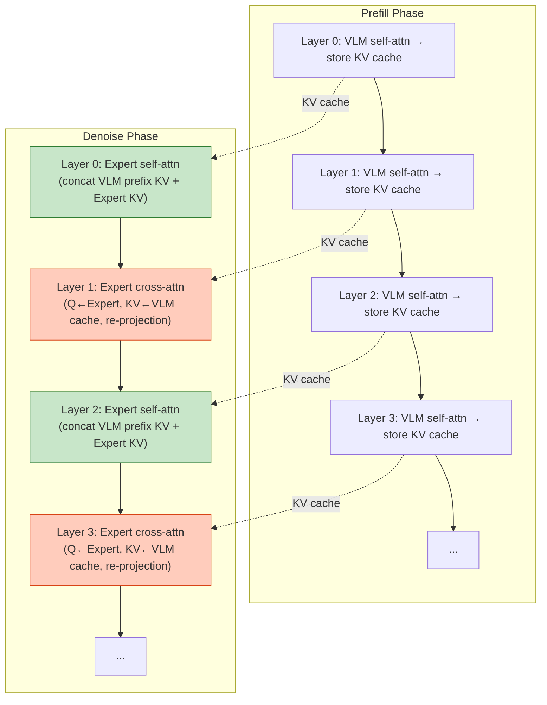
```mermaid
graph TB
    subgraph PrefillPhase["Prefill Phase"]
        direction TB
        PL0["Layer 0: VLM self-attn → store KV cache"]
        PL1["Layer 1: VLM self-attn → store KV cache"]
        PL2["Layer 2: VLM self-attn → store KV cache"]
        PL3["Layer 3: VLM self-attn → store KV cache"]
        PDOT["..."]
        PL0 --> PL1 --> PL2 --> PL3 --> PDOT
    end

    subgraph DenoisePhase["Denoise Phase"]
        direction TB
        DL0["Layer 0: Expert self-attn<br/>(concat VLM prefix KV + Expert KV)"]
        DL1["Layer 1: Expert cross-attn<br/>(Q←Expert, KV←VLM cache, re-projection)"]
        DL2["Layer 2: Expert self-attn<br/>(concat VLM prefix KV + Expert KV)"]
        DL3["Layer 3: Expert cross-attn<br/>(Q←Expert, KV←VLM cache, re-projection)"]
        DDOT["..."]
        DL0 --> DL1 --> DL2 --> DL3 --> DDOT
    end

    PL0 -.->|"KV cache"| DL0
    PL1 -.->|"KV cache"| DL1
    PL2 -.->|"KV cache"| DL2
    PL3 -.->|"KV cache"| DL3

    style DL0 fill:#c8e6c9,stroke:#2e7d32
    style DL1 fill:#ffccbc,stroke:#d84315
    style DL2 fill:#c8e6c9,stroke:#2e7d32
    style DL3 fill:#ffccbc,stroke:#d84315
```

---

### 6.4 Denoise Behavior of Self-Attention Layers

For even layers (0, 2, 4...), `forward_attn_layer` is called during the Denoise stage with `inputs_embeds=[None, suffix_embs]`.

At this point the VLM's `hidden_states=None`, so it is skipped, and only the Expert participates in self-attention.

When `fill_kv_cache=False`, the Expert's new K/V are **concat**enated with the VLM's prefix K/V in `past_key_values` (`smolvlm_with_expert.py:276-277`):

```python
key_states = torch.cat([past_key_values[layer_idx]["key_states"], key_states], dim=1)
value_states = torch.cat([past_key_values[layer_idx]["value_states"], value_states], dim=1)
```

This allows the Expert's self-attn to attend to both the prefix context (the KV produced by the VLM) and its own suffix (the KV of the action tokens).

```mermaid
graph LR
    subgraph SelfAttnDenoise["Self-Attn Layer (Denoise Phase)"]
        VLM_KV["VLM prefix KV<br/>(from cache)<br/>(B, prefix_len, H, D)"]
        EXPERT_KV["Expert suffix KV<br/>(computed this step)<br/>(B, suffix_len, H, D)"]
        CAT_K["Concat K"]
        CAT_V["Concat V"]
        EXPERT_Q["Expert Q"]

        VLM_KV --> CAT_K
        EXPERT_KV --> CAT_K
        VLM_KV --> CAT_V
        EXPERT_KV --> CAT_V

        CAT_K --> ATTN["Attention"]
        CAT_V --> ATTN
        EXPERT_Q --> ATTN
    end

    style VLM_KV fill:#fff9c4,stroke:#f9a825
```

---

### 6.5 Denoise Behavior of Cross-Attention Layers

For odd layers (1, 3, 5...), `forward_cross_attn_layer` is called during the Denoise stage.

Key code (`smolvlm_with_expert.py:286-399`):

```python
# directly read the VLM's KV cache (no longer run a VLM forward)
key_states = past_key_values[layer_idx]["key_states"]
value_states = past_key_values[layer_idx]["value_states"]

# the Expert's Q comes from the suffix embeddings
expert_query_state = expert_layer.self_attn.q_proj(expert_hidden_states)

# key: use the Expert's own k_proj/v_proj to re-project the VLM's KV into the Expert dimension space
expert_key_states = expert_layer.self_attn.k_proj(key_states)    # VLM dim → Expert dim
expert_value_states = expert_layer.self_attn.v_proj(value_states) # VLM dim → Expert dim

# Expert Q attends to the re-projected KV
att_output = attention(expert_Q, expert_K, expert_V)
```

**Dimension Projection Details**:

- The dimensions of the VLM KV cache: `(B, prefix_len, num_kv_heads_vlm, head_dim)` = `(B, prefix_len, 5, 64)`
- After flattening, fed into the Expert's `k_proj`: `(B, prefix_len, 320)` → `(B, prefix_len, expert_kv_dim)`
- The Expert's `head_dim=64`, which is the same as the VLM, so the projection only changes the number/total dimension of the KV heads

```mermaid
graph TB
    subgraph CrossAttnDenoise["Cross-Attn Layer (Denoise Phase)"]
        VLM_K["VLM K cache<br/>(B, L_prefix, 5, 64)"]
        VLM_V["VLM V cache<br/>(B, L_prefix, 5, 64)"]

        FLATTEN_K["Flatten → (B, L_prefix, 320)"]
        FLATTEN_V["Flatten → (B, L_prefix, 320)"]

        EXPERT_KPROJ["Expert k_proj<br/>Linear(320 → expert_kv_dim)"]
        EXPERT_VPROJ["Expert v_proj<br/>Linear(320 → expert_kv_dim)"]

        EXPERT_K["Expert K<br/>(B, L_prefix, expert_kv_heads, 64)"]
        EXPERT_V["Expert V<br/>(B, L_prefix, expert_kv_heads, 64)"]
        EXPERT_Q["Expert Q<br/>(B, L_suffix, expert_q_heads, 64)"]

        VLM_K --> FLATTEN_K --> EXPERT_KPROJ --> EXPERT_K
        VLM_V --> FLATTEN_V --> EXPERT_VPROJ --> EXPERT_V

        EXPERT_Q --> ATTN["Cross-Attention<br/>Q × Kᵀ → softmax → × V"]
        EXPERT_K --> ATTN
        EXPERT_V --> ATTN
    end

    style VLM_K fill:#fff9c4,stroke:#f9a825
    style VLM_V fill:#fff9c4,stroke:#f9a825
```

**Initialization of k_proj/v_proj**: In `SmolVLMWithExpertModel.__init__` (`smolvlm_with_expert.py:122-134`), the k_proj/v_proj of the cross-attn layers are replaced with new Linear layers whose input dimension matches the VLM:

```python
# only replace for cross-attn layers (skip self-attn layers)
for layer_idx in range(len(self.lm_expert.layers)):
    if self.self_attn_every_n_layers > 0 and layer_idx % self.self_attn_every_n_layers == 0:
        continue  # self-attn layers remain unchanged

    # new k_proj: input dim = VLM's total KV dim, output dim = Expert's total KV dim
    self.lm_expert.layers[layer_idx].self_attn.k_proj = nn.Linear(
        config.text_config.num_key_value_heads * config.text_config.head_dim,  # 5 × 64 = 320
        lm_expert_config.num_key_value_heads * lm_expert_config.head_dim,
        bias=lm_expert_config.attention_bias,
    )
    # v_proj is the same
```

---

### 6.6 Comparison of Training Path

During training (`VLAFlowMatching.forward`), the prefix and suffix are **input simultaneously**, completed in a single forward pass:

```python
# modeling_smolvla.py:789-796
(_, suffix_out), _ = self.vlm_with_expert.forward(
    inputs_embeds=[prefix_embs, suffix_embs],  # ← both input simultaneously
    use_cache=False,                            # ← do not use KV cache
    fill_kv_cache=False,                        # ← do not cache
)
```

- All 16 layers go through `forward_attn_layer` (because `fill_kv_cache=False` and there are no `past_key_values`)
- The VLM prefix tokens and the Expert suffix tokens are concatenated and computed together in self-attn
- It does not distinguish between self-attn / cross-attn — **during training this is equivalent to a single unified self-attention sequence**

---

### 6.7 Differences in Attention Masks Between the Two Stages

**Prefill Stage**: Only prefix tokens are processed, and the mask is computed by `make_att_2d_masks(prefix_pad_masks, prefix_att_masks)`.

- Image tokens (`att_mask=0`): bidirectionally visible within the group
- Language tokens (`att_mask=0`): bidirectionally visible within the group, and can also see images
- State tokens (`att_mask=1`): causal, image/language cannot see state

**Denoise Stage**: Needs to handle the cross-attention of the Expert suffix to the VLM prefix:

```python
# modeling_smolvla.py:888-892
# 1. the prefix part only uses a pad mask (no causal restriction)
prefix_pad_2d_masks = prefix_pad_masks[:, None, :].expand(batch_size, suffix_len, prefix_len)

# 2. the suffix part uses the full att_2d_masks
suffix_att_2d_masks = make_att_2d_masks(suffix_pad_masks, suffix_att_masks)

# 3. concatenate: the suffix can see all of the prefix + causal suffix
full_att_2d_masks = torch.cat([prefix_pad_2d_masks, suffix_att_2d_masks], dim=2)
```

```mermaid
graph TB
    subgraph MaskMatrix["Attention Mask (Denoise Phase)"]
        direction TB
        MAT["┌─────────────────┬──────────────┐<br/>│ Prefix × Prefix  │ Prefix × Suf │<br/>│  (unused, VLM skipped) │  (unused)    │<br/>├─────────────────┼──────────────┤<br/>│ Suffix × Prefix  │ Suffix × Suf │<br/>│  ✅ all visible      │  ✅ causal    │<br/>└─────────────────┴──────────────┘"]
    end
```

---

## 7. KV Cache Reuse Analysis and Optimization

### 7.1 Currently Implemented Reuse

**Within a single inference**: The KV cache produced by Prefill is **fully reused** across the 10-step denoise loop. This is currently the most significant cache optimization.

```mermaid
graph LR
    PREFILL["Prefill<br/>computed once"]
    D0["Denoise 0<br/>reuse KV"]
    D1["Denoise 1<br/>reuse KV"]
    D2["..."]
    D9["Denoise 9<br/>reuse KV"]

    PREFILL -->|"KV cache"| D0
    PREFILL -->|"KV cache"| D1
    PREFETCH -->|"KV cache"| D2
    PREFILL -->|"KV cache"| D9

    style PREFILL fill:#c8e6c9,stroke:#2e7d32
```

### 7.2 Cross-Call Reuse Not Currently Implemented

**Across inference calls**: Each `sample_actions()` recomputes the KV cache of the entire prefix. However, in an actual control loop:

- **Images**: usually unchanged within an episode (or change very little)
- **Language instruction**: unchanged for the entire episode
- **Robot state (state)**: changes at every step

Currently, state is embedded in the **prefix** (`modeling_smolvla.py:696-707`):

```python
state_emb = self.state_proj(state)   # state is part of the prefix
embs.append(state_emb)
# ... concatenated together with image_emb, lang_emb
```

This causes **the entire prefix KV cache to become invalid when state changes**, and it must all be recomputed.

```mermaid
graph TB
    subgraph Current["Current Implementation: state in the prefix"]
        direction TB
        CP["Prefix = [img, lang, state]"]
        CF1["Call 1: Prefill → KV cache → Denoise × 10"]
        CF2["Call 2: Prefill → KV cache → Denoise × 10<br/>(state changed, recompute everything!)"]
        CF3["Call 3: Prefill → KV cache → Denoise × 10<br/>(state changed again, recompute everything!)"]
        CP --> CF1
        CP --> CF2
        CP --> CF3
    end

    style CF2 fill:#ffccbc,stroke:#d84315
    style CF3 fill:#ffccbc,stroke:#d84315
```

### 7.3 Feasible Optimization: Move state from the prefix to the suffix

```
Current prefix: [img_emb, lang_emb, state_emb]  → any state change requires recomputing everything
Optimized prefix: [img_emb, lang_emb]              → unchanged across calls, cacheable
Optimized suffix: [state_emb, action_time_emb]     → recomputed each step (low cost)
```

**Optimized Flow**:

```mermaid
graph TB
    subgraph Optimized["Optimized Implementation: state moved to the suffix"]
        direction TB
        OP["Prefix = [img, lang]<br/>(unchanged within an episode)"]
        OS1["Call 1: Prefill → KV cache → Denoise × 10"]
        OS2["Call 2: reuse KV cache → Denoise × 10<br/>(only re-embed state!)"]
        OS3["Call 3: reuse KV cache → Denoise × 10<br/>(only re-embed state!)"]
        OP --> OS1
        OP -.->|"KV cache reuse"| OS2
        OP -.->|"KV cache reuse"| OS3
    end

    style OS2 fill:#c8e6c9,stroke:#2e7d32
    style OS3 fill:#c8e6c9,stroke:#2e7d32
```

**Computation Saved**:

| Stage | Current computation per step | Computation per step after optimization |
|---|---|---|
| SigLIP forward | every time ✅ | only the first time ✅ |
| VLM 16 layers (image + lang tokens) | every time ✅ | only the first time ✅ |
| VLM 16 layers (state token, 1) | every time ✅ (mixed into the prefix) | ❌ (moved to the suffix) |
| Expert 16 layers | every time ✅ | every time ✅ (unchanged) |

**Points to Note for the Changes**:

1. **Attention mask**: state currently has `att_mask=1` (causal); after moving it to the suffix it naturally satisfies the causal constraint, but the concatenation logic of `embed_prefix` and `embed_suffix` needs to be adjusted
2. **KV concat in self-attn layers**: the KV of the state token moves from the VLM prefix cache into the Expert suffix's KV, and the prefix_len concatenated in the self-attn layers becomes shorter
3. **K/V projection in cross-attn layers**: the VLM KV cache no longer contains state, so the projection input is slightly shorter
4. **Representation quality**: state moves from the VLM self-attn context into the Expert context; the VLM no longer directly processes state information, which may slightly affect the Expert's understanding of state

**Quantitative Estimate**: Assuming ~49 image tokens, ~20 lang tokens, and state being only 1 token, moving state out of the prefix can avoid a 16-layer VLM forward + SigLIP forward over ~70 tokens, yielding significant gains in real-time control scenarios (10-30 calls per second).

### 7.4 Further Optimization Ideas

| Optimization Direction | Description | Difficulty | Benefit |
|---|---|---|---|
| Static Cache pre-allocation | There is already a TODO comment in the code (`smolvlm_with_expert.py:273-275`); pre-allocate a fixed-size cache to avoid the per-step `torch.cat` | Low | Reduces GPU memory fragmentation and copying |
| Cross-episode KV cache | When images are unchanged, only prefill on the first time of an episode and reuse it in subsequent episodes | Medium | Saves SigLIP + part of the VLM computation |
| Replace eager with Flash Attention | Currently uses `eager_attention_forward`, which can be replaced with `flash_attn` | Low | 2-4x attention speedup |
| Reduce Expert self-attention layers | Currently self_attn_every_n_layers=2, which can be increased to reduce the proportion of self-attention layers | Low | Reduces Expert computation |
| KV Cache quantization | Quantize the cached K/V from bf16 to int8 | Medium | Reduces the memory bandwidth bottleneck |
