# SmolVLA 模型结构详解

## 1. 整体架构概览

SmolVLA 是 HuggingFace 推出的轻量级视觉-语言-动作 (VLA) 基础模型，用于机器人控制。它由三大核心组件构成：

1. **Vision Encoder (SigLIP)** — 提取图像特征
2. **VLM (SmolVLM2 / Llama)** — 理解视觉和语言输入，生成上下文特征
3. **Action Expert + Flow Matching** — 基于上下文特征预测连续动作

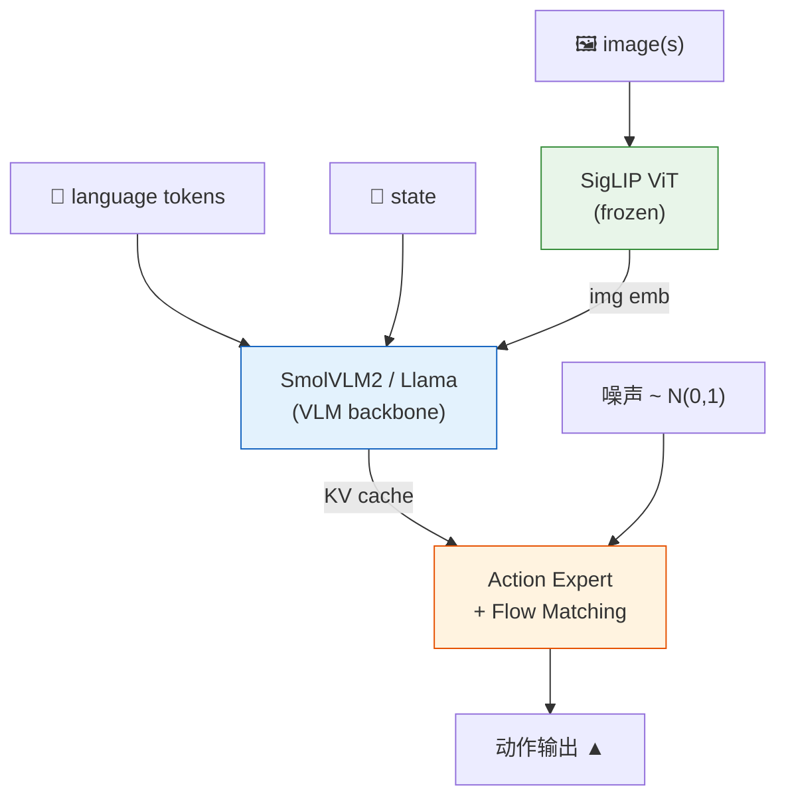
```mermaid
graph TB
    IMG["🖼 image(s)"]
    LANG["💬 language tokens"]
    STATE["🤖 state"]
    NOISE["噪声 ~ N(0,1)"]

    SIGLIP["SigLIP ViT<br/>(frozen)"]
    VLM["SmolVLM2 / Llama<br/>(VLM backbone)"]
    EXPERT["Action Expert<br/>+ Flow Matching"]

    ACTIONS["动作输出 ▲"]

    IMG --> SIGLIP
    LANG --> VLM
    STATE --> VLM
    SIGLIP -->|"img emb"| VLM
    VLM -->|"KV cache"| EXPERT
    NOISE --> EXPERT
    EXPERT --> ACTIONS

    style SIGLIP fill:#e8f5e9,stroke:#388e3c
    style VLM fill:#e3f2fd,stroke:#1565c0
    style EXPERT fill:#fff3e0,stroke:#e65100
```

### 数据流

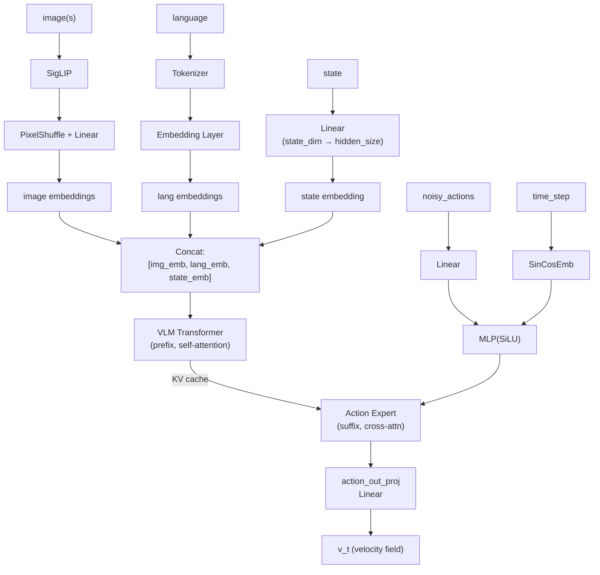
```mermaid
graph TB
    IMG["image(s)"]
    SIGLIP["SigLIP"]
    PXSHUFFLE["PixelShuffle + Linear"]
    IMG_EMB["image embeddings"]

    LANG["language"]
    TOK["Tokenizer"]
    LEMB["Embedding Layer"]
    LANG_EMB["lang embeddings"]

    STATE["state"]
    SPROJ["Linear<br/>(state_dim → hidden_size)"]
    STATE_EMB["state embedding"]

    CONCAT["Concat:<br/>[img_emb, lang_emb, state_emb]"]
    VLM_FWD["VLM Transformer<br/>(prefix, self-attention)"]

    NOISY["noisy_actions"]
    AINPROJ["Linear"]
    TIME["time_step"]
    SINEMB["SinCosEmb"]
    MLP["MLP(SiLU)"]

    EXPERT_FWD["Action Expert<br/>(suffix, cross-attn)"]

    AOUTPROJ["action_out_proj<br/>Linear"]
    VT["v_t (velocity field)"]

    IMG --> SIGLIP --> PXSHUFFLE --> IMG_EMB --> CONCAT
    LANG --> TOK --> LEMB --> LANG_EMB --> CONCAT
    STATE --> SPROJ --> STATE_EMB --> CONCAT

    CONCAT --> VLM_FWD -->|"KV cache"| EXPERT_FWD

    NOISY --> AINPROJ --> MLP --> EXPERT_FWD
    TIME --> SINEMB --> MLP

    EXPERT_FWD --> AOUTPROJ --> VT
```

---

## 2. 详细架构图 (Mermaid)

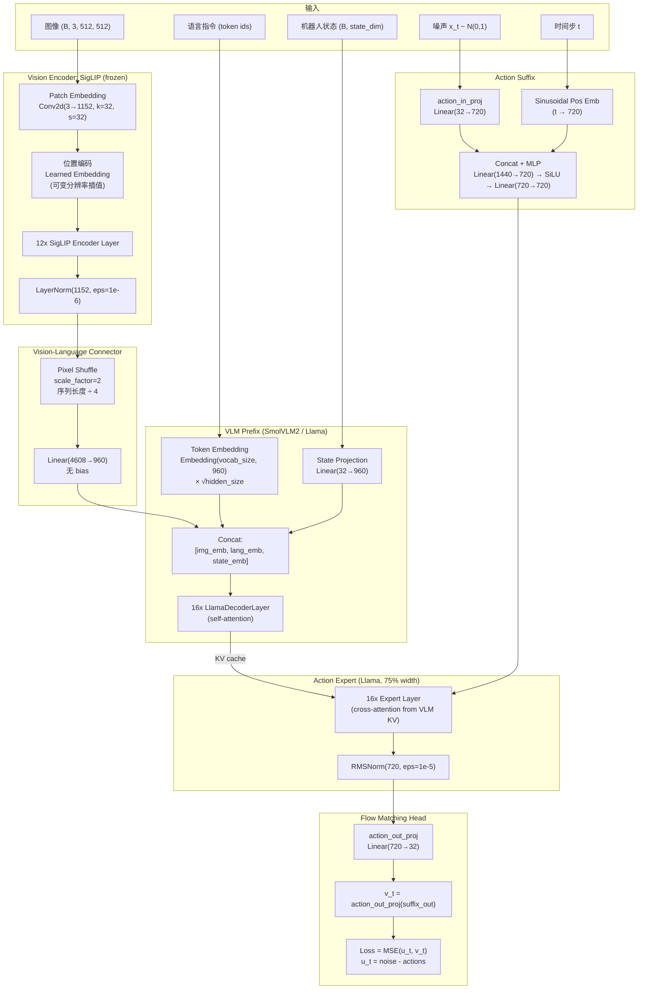
```mermaid
graph TB
    subgraph Input["输入"]
        IMG["图像 (B, 3, 512, 512)"]
        LANG["语言指令 (token ids)"]
        STATE["机器人状态 (B, state_dim)"]
        NOISE["噪声 x_t ~ N(0,1)"]
        TIME["时间步 t"]
    end

    subgraph VisionEncoder["Vision Encoder: SigLIP (frozen)"]
        PATCH["Patch Embedding<br/>Conv2d(3→1152, k=32, s=32)"]
        POS_EMB_V["位置编码<br/>Learned Embedding<br/>(可变分辨率插值)"]
        VIT_LAYERS["12x SigLIP Encoder Layer"]
        VIT_NORM["LayerNorm(1152, eps=1e-6)"]
    end

    subgraph Connector["Vision-Language Connector"]
        PS["Pixel Shuffle<br/>scale_factor=2<br/>序列长度 ÷ 4"]
        PROJ["Linear(4608→960)<br/>无 bias"]
    end

    subgraph VLMPrefix["VLM Prefix (SmolVLM2 / Llama)"]
        LANG_EMB["Token Embedding<br/>Embedding(vocab_size, 960)<br/>× √hidden_size"]
        STATE_PROJ["State Projection<br/>Linear(32→960)"]
        PREFIX_CONCAT["Concat:<br/>[img_emb, lang_emb, state_emb]"]
        VLM_LAYERS["16x LlamaDecoderLayer<br/>(self-attention)"]
    end

    subgraph ActionSuffix["Action Suffix"]
        ACT_IN["action_in_proj<br/>Linear(32→720)"]
        TIME_EMB["Sinusoidal Pos Emb<br/>(t → 720)"]
        ACT_TIME["Concat + MLP<br/>Linear(1440→720) → SiLU → Linear(720→720)"]
    end

    subgraph ActionExpert["Action Expert (Llama, 75% width)"]
        EXPERT_LAYERS["16x Expert Layer<br/>(cross-attention from VLM KV)"]
        EXPERT_NORM["RMSNorm(720, eps=1e-5)"]
    end

    subgraph FlowMatching["Flow Matching Head"]
        ACT_OUT["action_out_proj<br/>Linear(720→32)"]
        V_T["v_t = action_out_proj(suffix_out)"]
        LOSS["Loss = MSE(u_t, v_t)<br/>u_t = noise - actions"]
    end

    IMG --> PATCH --> POS_EMB_V --> VIT_LAYERS --> VIT_NORM
    VIT_NORM --> PS --> PROJ

    LANG --> LANG_EMB
    PROJ --> PREFIX_CONCAT
    LANG_EMB --> PREFIX_CONCAT
    STATE --> STATE_PROJ --> PREFIX_CONCAT

    PREFIX_CONCAT --> VLM_LAYERS
    VLM_LAYERS -->|KV cache| EXPERT_LAYERS

    NOISE --> ACT_IN
    TIME --> TIME_EMB
    ACT_IN --> ACT_TIME
    TIME_EMB --> ACT_TIME
    ACT_TIME --> EXPERT_LAYERS

    EXPERT_LAYERS --> EXPERT_NORM --> ACT_OUT --> V_T --> LOSS
```

---

## 3. 各组件详细结构

### 3.1 Vision Encoder: SigLIP

SigLIP 是一个标准的 Vision Transformer，基于 [Patch n' Pack (NaViT)](https://arxiv.org/abs/2307.06304) 支持可变分辨率输入。

| 参数 | 值 |
|---|---|
| hidden_size | 1152 |
| intermediate_size | 3072 |
| num_hidden_layers | 12 |
| num_attention_heads | 16 |
| head_dim | 72 (1152/16) |
| patch_size | 32×32 |
| image_size | 224 (可变分辨率) |
| activation | GELU (gelu_pytorch_tanh) |
| normalization | LayerNorm (eps=1e-6) |
| attention | 双向 (bidirectional), 无 causal mask |

**SigLIP Encoder Layer:**

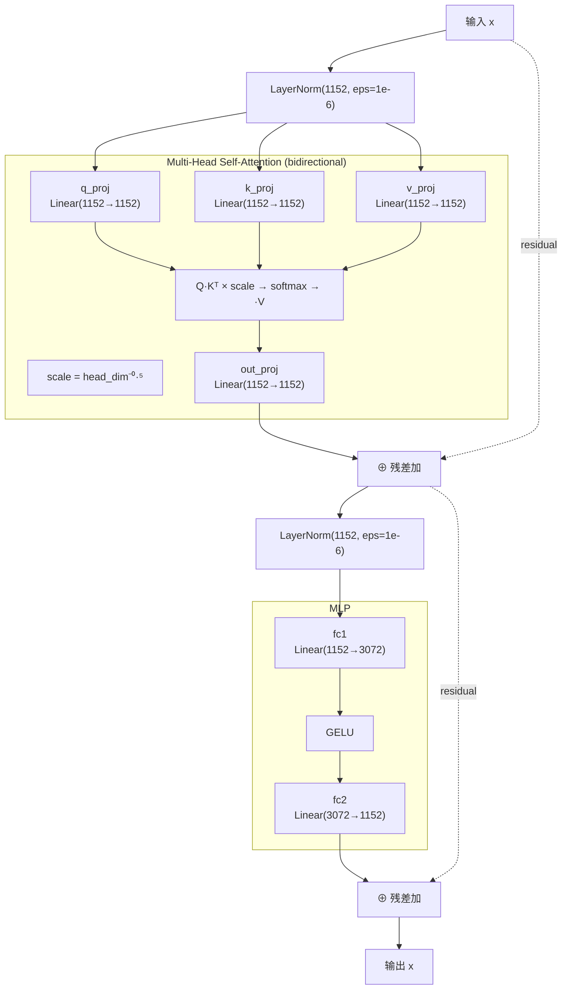
```mermaid
graph TB
    IN["输入 x"] --> LN1
    LN1["LayerNorm(1152, eps=1e-6)"]

    subgraph SelfAttn["Multi-Head Self-Attention (bidirectional)"]
        Q["q_proj<br/>Linear(1152→1152)"]
        K["k_proj<br/>Linear(1152→1152)"]
        V["v_proj<br/>Linear(1152→1152)"]
        SCALED["scale = head_dim⁻⁰·⁵"]
        ATTN["Q·Kᵀ × scale → softmax → ·V"]
        OUT["out_proj<br/>Linear(1152→1152)"]
        Q --> ATTN
        K --> ATTN
        V --> ATTN
        ATTN --> OUT
    end

    LN1 --> Q & K & V
    OUT --> RES1["⊕ 残差加"]

    RES1 --> LN2["LayerNorm(1152, eps=1e-6)"]

    subgraph MLP["MLP"]
        FC1["fc1<br/>Linear(1152→3072)"]
        GELU["GELU"]
        FC2["fc2<br/>Linear(3072→1152)"]
        FC1 --> GELU --> FC2
    end

    LN2 --> FC1
    FC2 --> RES2["⊕ 残差加"]
    RES2 --> OUT_X["输出 x"]

    IN -.->|"residual"| RES1
    RES1 -.->|"residual"| RES2
```

**Patch Embedding + 位置编码:**

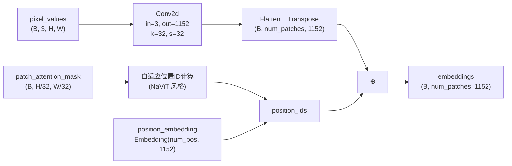
```mermaid
graph LR
    PIXEL["pixel_values<br/>(B, 3, H, W)"] --> CONV["Conv2d<br/>in=3, out=1152<br/>k=32, s=32"]
    CONV --> FLATTEN["Flatten + Transpose<br/>(B, num_patches, 1152)"]

    MASK["patch_attention_mask<br/>(B, H/32, W/32)"] --> ADAPT["自适应位置ID计算<br/>(NaViT 风格)"]
    ADAPT --> POS_IDS["position_ids"]

    FLATTEN --> ADD["⊕"]
    POS_EMB["position_embedding<br/>Embedding(num_pos, 1152)"] --> POS_IDS --> ADD
    ADD --> EMB_OUT["embeddings<br/>(B, num_patches, 1152)"]
```

**Vision Model 整体:**

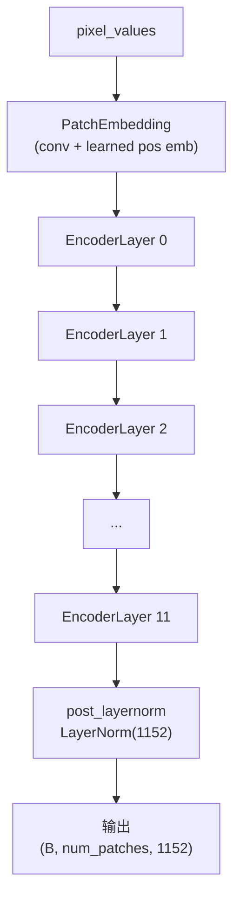
```mermaid
graph TB
    PIXEL["pixel_values"] --> EMB["PatchEmbedding<br/>(conv + learned pos emb)"]
    EMB --> L0["EncoderLayer 0"]
    L0 --> L1["EncoderLayer 1"]
    L1 --> L2["EncoderLayer 2"]
    L2 --> DOT["..."]
    DOT --> L11["EncoderLayer 11"]
    L11 --> NORM["post_layernorm<br/>LayerNorm(1152)"]
    NORM --> OUT["输出<br/>(B, num_patches, 1152)"]
```

---

### 3.2 Vision-Language Connector

Connector 负责将 SigLIP 输出的图像嵌入投影到语言模型的嵌入空间，同时降低序列长度。

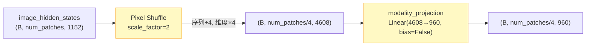
```mermaid
graph LR
    IN["image_hidden_states<br/>(B, num_patches, 1152)"]
    IN --> PS["Pixel Shuffle<br/>scale_factor=2"]
    PS -->|"序列÷4, 维度×4"| MID["(B, num_patches/4, 4608)"]
    MID --> PROJ["modality_projection<br/>Linear(4608→960, bias=False)"]
    PROJ --> OUT["(B, num_patches/4, 960)"]

    style PS fill:#fff9c4,stroke:#f9a825
    style PROJ fill:#fff9c4,stroke:#f9a825
```

- 4608 = 1152 × scale_factor² = 1152 × 4
- 960 = text_config.hidden_size

---

### 3.3 VLM Text Model: Llama (SmolVLM2-500M backbone)

SmolVLM2-500M 的文本模型基于 **Llama** 架构（非 Gemma2），使用 GQA 和 SwiGLU FFN。

| 参数 | 值 |
|---|---|
| model_type | llama |
| hidden_size | 960 |
| intermediate_size | 2560 |
| num_hidden_layers | 16 (SmolVLA 默认裁剪为此) |
| num_attention_heads | 15 |
| num_key_value_heads | 5 |
| head_dim | 64 |
| vocab_size | 49152 |
| max_position_embeddings | 4096 |
| hidden_act | silu |
| rms_norm_eps | 1e-5 |
| attention_bias | False |
| rope_theta | 100000.0 |

> **注**: 上述参数为 SmolVLM2-500M 的实际配置。SmolVLA 默认使用 `num_vlm_layers=16`（即完整 16 层）。

**Llama Decoder Layer:**

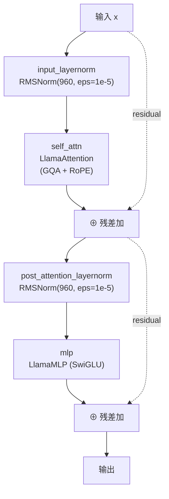
```mermaid
graph TB
    X["输入 x"] --> LN1["input_layernorm<br/>RMSNorm(960, eps=1e-5)"]
    LN1 --> ATTN["self_attn<br/>LlamaAttention<br/>(GQA + RoPE)"]
    ATTN --> RES1["⊕ 残差加"]

    RES1 --> LN2["post_attention_layernorm<br/>RMSNorm(960, eps=1e-5)"]
    LN2 --> FFN["mlp<br/>LlamaMLP (SwiGLU)"]
    FFN --> RES2["⊕ 残差加"]
    RES2 --> OUT["输出"]

    X -.->|"residual"| RES1
    RES1 -.->|"residual"| RES2
```

**Llama Attention (GQA + RoPE):**

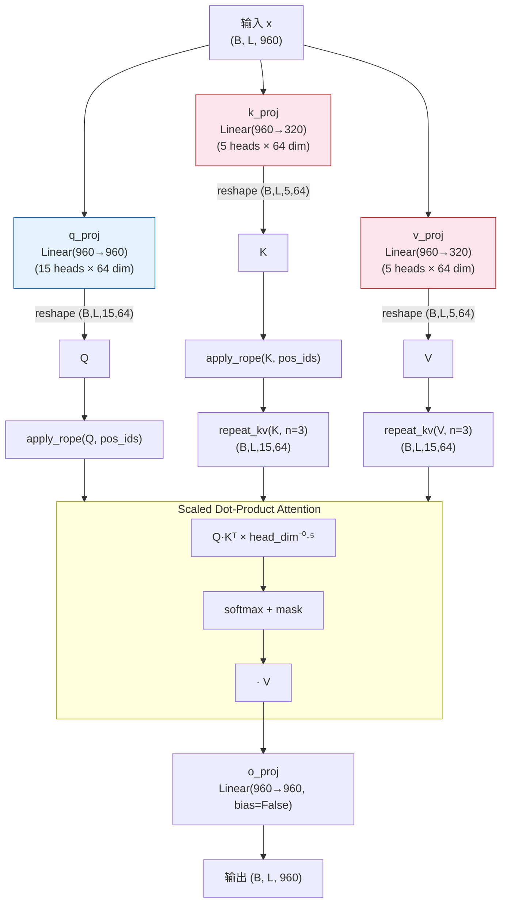
```mermaid
graph TB
    X["输入 x<br/>(B, L, 960)"] --> QP["q_proj<br/>Linear(960→960)<br/>(15 heads × 64 dim)"]
    X --> KP["k_proj<br/>Linear(960→320)<br/>(5 heads × 64 dim)"]
    X --> VP["v_proj<br/>Linear(960→320)<br/>(5 heads × 64 dim)"]

    QP -->|"reshape (B,L,15,64)"| QR["Q"]
    KP -->|"reshape (B,L,5,64)"| KR["K"]
    VP -->|"reshape (B,L,5,64)"| VR["V"]

    QR --> ROPE_Q["apply_rope(Q, pos_ids)"]
    KR --> ROPE_K["apply_rope(K, pos_ids)"]

    ROPE_Q --> ATTN
    ROPE_K --> REPEAT_K["repeat_kv(K, n=3)<br/>(B,L,15,64)"]
    REPEAT_K --> ATTN

    VR --> REPEAT_V["repeat_kv(V, n=3)<br/>(B,L,15,64)"]
    REPEAT_V --> ATTN

    subgraph ATTN["Scaled Dot-Product Attention"]
        SCORES["Q·Kᵀ × head_dim⁻⁰·⁵"]
        SOFTMAX["softmax + mask"]
        WEIGHTED["· V"]
        SCORES --> SOFTMAX --> WEIGHTED
    end

    WEIGHTED --> OPROJ["o_proj<br/>Linear(960→960, bias=False)"]
    OPROJ --> OUT["输出 (B, L, 960)"]

    style QP fill:#e3f2fd,stroke:#1565c0
    style KP fill:#fce4ec,stroke:#c62828
    style VP fill:#fce4ec,stroke:#c62828
```

关键点: GQA 中 15 个 Q heads / 5 个 KV heads = 3:1 比例，每个 KV head 被 3 个 Q head 共享。

**RoPE 位置编码:**

```
RoPE (θ = 100000.0):
  # 计算逆频率
  inv_freq = 1.0 / (100000.0 ^ (arange(0, 64, 2) / 64))
  # inv_freq shape: (32,)

  forward(x, position_ids):
    freqs = position_ids^T @ inv_freq       # (B, L, 32)
    emb = cat(freqs, freqs, dim=-1)          # (B, L, 64)
    cos = emb.cos()
    sin = emb.sin()

    # 应用旋转
    x1, x2 = x[..., :32], x[..., 32:]
    Q = cat(x1 * cos - x2 * sin, x1 * sin + x2 * cos)
    return Q, K

# SmolVLA 中的简化版 apply_rope (smolvlm_with_expert.py):
apply_rope(x, positions, max_wavelength=10000):
  d_half = x.shape[-1] // 2
  freq_exponents = (2.0 / D) * arange(d_half)
  timescale = max_wavelength ^ freq_exponents
  radians = positions / timescale
  sin, cos = sin(radians), cos(radians)
  x1, x2 = split(x, d_half)
  res[..., :d_half] = x1 * cos - x2 * sin
  res[..., d_half:] = x2 * cos + x1 * sin
  return res
```

**Llama FFN (SwiGLU / Gated GeGLU):**

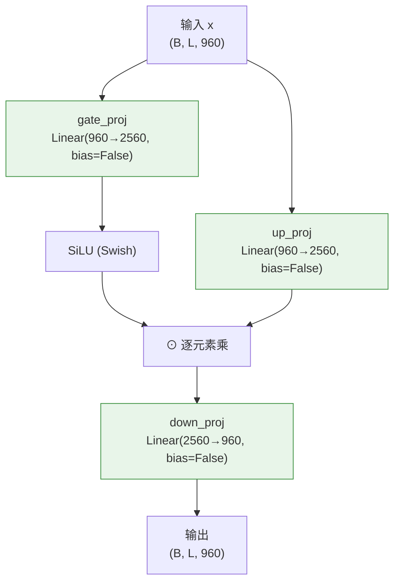
```mermaid
graph TB
    X["输入 x<br/>(B, L, 960)"]

    X --> GATE["gate_proj<br/>Linear(960→2560, bias=False)"]
    X --> UP["up_proj<br/>Linear(960→2560, bias=False)"]

    GATE --> SILU["SiLU (Swish)"]
    SILU --> MUL["⊙ 逐元素乘"]
    UP --> MUL

    MUL --> DOWN["down_proj<br/>Linear(2560→960, bias=False)"]
    DOWN --> OUT["输出<br/>(B, L, 960)"]

    style GATE fill:#e8f5e9,stroke:#388e3c
    style UP fill:#e8f5e9,stroke:#388e3c
    style DOWN fill:#e8f5e9,stroke:#388e3c
```

公式: `output = down_proj(SiLU(gate_proj(x)) ⊙ up_proj(x))`

**RMSNorm:**

```
RMSNorm(hidden_size=960, eps=1e-5):
  weight = Parameter(ones(960))

  forward(x):
    variance = x.pow(2).mean(-1, keepdim=True)
    x = x * rsqrt(variance + eps)
    return weight * x
```

---

### 3.4 Action Expert

Action Expert 是一个更窄的 Llama 模型，通过 Cross-Attention 从 VLM 的 KV cache 获取上下文信息。

| 参数 | 值 | 计算方式 |
|---|---|---|
| hidden_size | 720 | 960 × 0.75 |
| intermediate_size | 1920 | `get_intermediate_size(720)` = 对齐到 256 的倍数 |
| num_hidden_layers | 16 | 与 VLM 层数相同 (默认) |
| num_attention_heads | 同 VLM | 继承自 VLM 的 head 结构 |
| num_key_value_heads | 同 VLM | 继承自 VLM 的 KV head 结构 |
| head_dim | 64 | 同 VLM |
| expert_width_multiplier | 0.75 | SmolVLA 默认值 |

**intermediate_size 的计算:**

```python
def get_intermediate_size(hidden_dim, ffn_dim_multiplier=4, multiple_of=256):
    hidden_dim = int(2 * hidden_dim / 3)        # 720 * 2/3 = 480
    hidden_dim = int(ffn_dim_multiplier * hidden_dim)  # 4 * 480 = 1920
    hidden_dim = multiple_of * ((hidden_dim + multiple_of - 1) // multiple_of)  # 对齐到 256
    return hidden_dim  # 1920
```

**Expert 与 VLM 的层对应关系:**

SmolVLA 支持两种注意力模式：`self_attn` 和 `cross_attn`（默认使用 `cross_attn`）。

在 `cross_attn` 模式下：
- 每隔 `self_attn_every_n_layers=2` 层，Expert 层执行一次 self-attention
- 其余层执行 cross-attention：Expert 的 Q 来自 action tokens，K/V 来自 VLM 的 KV cache

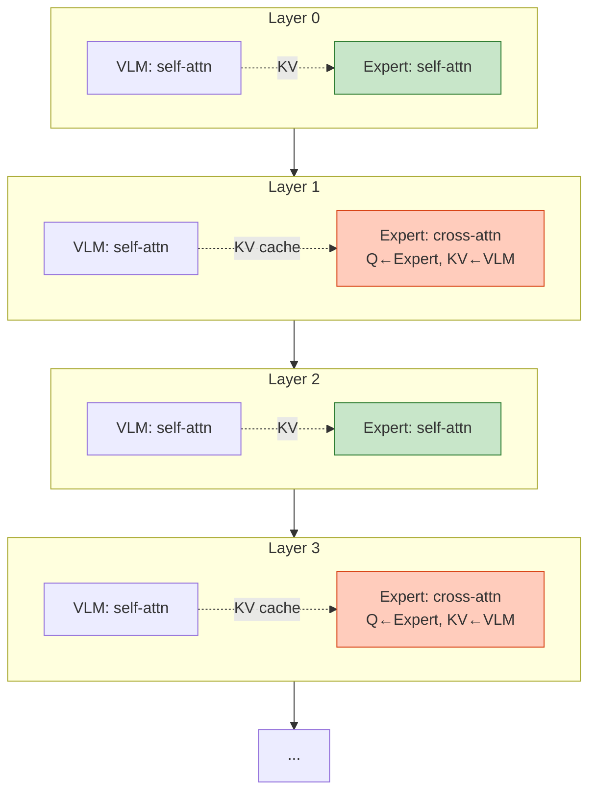
```mermaid
graph TB
    subgraph Layer0["Layer 0"]
        V0["VLM: self-attn"]
        E0["Expert: self-attn"]
        V0 -.->|"KV"| E0
    end

    subgraph Layer1["Layer 1"]
        V1["VLM: self-attn"]
        E1["Expert: cross-attn<br/>Q←Expert, KV←VLM"]
        V1 -.->|"KV cache"| E1
    end

    subgraph Layer2["Layer 2"]
        V2["VLM: self-attn"]
        E2["Expert: self-attn"]
        V2 -.->|"KV"| E2
    end

    subgraph Layer3["Layer 3"]
        V3["VLM: self-attn"]
        E3["Expert: cross-attn<br/>Q←Expert, KV←VLM"]
        V3 -.->|"KV cache"| E3
    end

    Layer0 --> Layer1 --> Layer2 --> Layer3 --> DOT["..."]

    style E0 fill:#c8e6c9,stroke:#2e7d32
    style E1 fill:#ffccbc,stroke:#d84315
    style E2 fill:#c8e6c9,stroke:#2e7d32
    style E3 fill:#ffccbc,stroke:#d84315
```

- 绿色 = self-attn 层（每 2 层触发一次）
- 橙色 = cross-attn 层（Q 来自 Expert, K/V 来自 VLM KV cache）

**Cross-Attention 机制:**

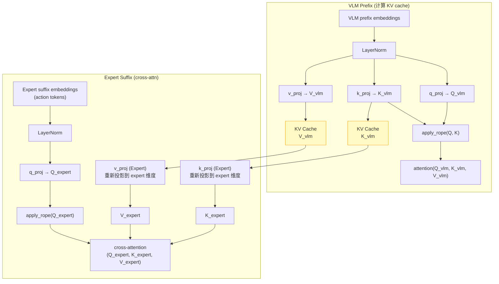
```mermaid
graph TB
    subgraph VLMPrefix["VLM Prefix (计算 KV cache)"]
        VP_EMB["VLM prefix embeddings"] --> VP_LN["LayerNorm"]
        VP_LN --> VP_Q["q_proj → Q_vlm"]
        VP_LN --> VP_K["k_proj → K_vlm"]
        VP_LN --> VP_V["v_proj → V_vlm"]
        VP_Q --> VP_ROPE["apply_rope(Q, K)"]
        VP_K --> VP_ROPE
        VP_ROPE --> VP_ATTN["attention(Q_vlm, K_vlm, V_vlm)"]
        VP_K --> CACHE_K["KV Cache<br/>K_vlm"]
        VP_V --> CACHE_V["KV Cache<br/>V_vlm"]
    end

    subgraph ExpertSuffix["Expert Suffix (cross-attn)"]
        EX_EMB["Expert suffix embeddings<br/>(action tokens)"] --> EX_LN["LayerNorm"]
        EX_LN --> EX_Q["q_proj → Q_expert"]
        EX_Q --> EX_ROPE["apply_rope(Q_expert)"]

        CACHE_K --> EX_KPROJ["k_proj (Expert)<br/>重新投影到 expert 维度"]
        CACHE_V --> EX_VPROJ["v_proj (Expert)<br/>重新投影到 expert 维度"]

        EX_ROPE --> EX_ATTN["cross-attention<br/>(Q_expert, K_expert, V_expert)"]
        EX_KPROJ --> EX_K["K_expert"]
        EX_VPROJ --> EX_V["V_expert"]
        EX_K --> EX_ATTN
        EX_V --> EX_ATTN
    end

    style CACHE_K fill:#fff9c4,stroke:#f9a825
    style CACHE_V fill:#fff9c4,stroke:#f9a825
```

关键: Expert 的 hidden_size 更小 (720 vs 960)，所以需要额外的 k_proj / v_proj 将 VLM 的 KV cache 投影到 Expert 的维度空间。

---

### 3.5 Flow Matching Head

SmolVLA 使用 **Flow Matching**（而非 Diffusion/DDPM）来预测连续动作。

**训练 (Forward Pass):**

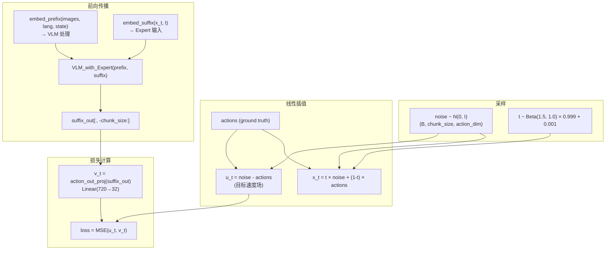
```mermaid
graph TB
    subgraph Sample["采样"]
        NOISE["noise ~ N(0, I)<br/>(B, chunk_size, action_dim)"]
        TIME["t ~ Beta(1.5, 1.0) × 0.999 + 0.001"]
    end

    subgraph Interpolate["线性插值"]
        ACTIONS["actions (ground truth)"]
        XT["x_t = t × noise + (1-t) × actions"]
        UT["u_t = noise - actions<br/>(目标速度场)"]
        NOISE --> XT
        TIME --> XT
        ACTIONS --> XT
        NOISE --> UT
        ACTIONS --> UT
    end

    subgraph Forward["前向传播"]
        PREFIX["embed_prefix(images, lang, state)<br/>→ VLM 处理"]
        SUFFIX["embed_suffix(x_t, t)<br/>→ Expert 输入"]
        VLM_EXP["VLM_with_Expert(prefix, suffix)"]
        SUFFIX_OUT["suffix_out[:, -chunk_size:]"]
        PREFIX --> VLM_EXP
        SUFFIX --> VLM_EXP
        VLM_EXP --> SUFFIX_OUT
    end

    subgraph Loss["损失计算"]
        VT["v_t = action_out_proj(suffix_out)<br/>Linear(720→32)"]
        MSE["loss = MSE(u_t, v_t)"]
        SUFFIX_OUT --> VT
        UT --> MSE
        VT --> MSE
    end
```

**推理 (Sampling):**

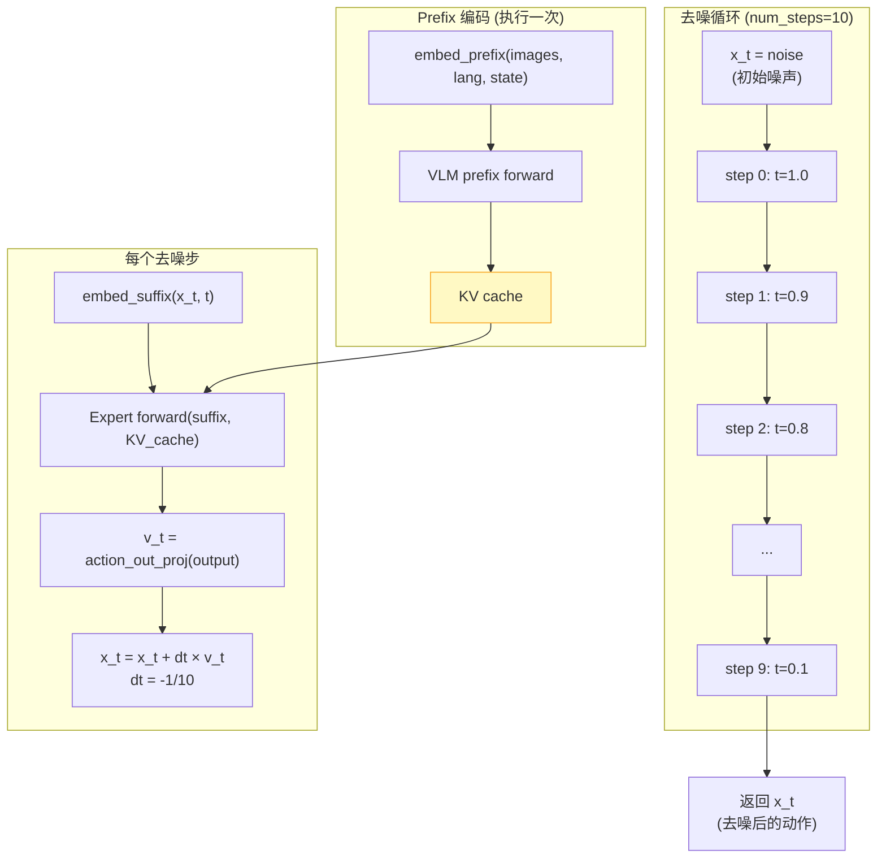
```mermaid
graph TB
    subgraph PrefixEncode["Prefix 编码 (执行一次)"]
        P_EMB["embed_prefix(images, lang, state)"]
        P_FWD["VLM prefix forward"]
        KV["KV cache"]
        P_EMB --> P_FWD --> KV
    end

    subgraph DenoiseLoop["去噪循环 (num_steps=10)"]
        INIT["x_t = noise<br/>(初始噪声)"]
        INIT --> STEP0

        STEP0["step 0: t=1.0"] --> STEP1["step 1: t=0.9"]
        STEP1 --> STEP2["step 2: t=0.8"]
        STEP2 --> DOT["..."]
        DOT --> STEPN["step 9: t=0.1"]
    end

    subgraph EachStep["每个去噪步"]
        S_EMB["embed_suffix(x_t, t)"]
        E_FWD["Expert forward(suffix, KV_cache)"]
        V_T["v_t = action_out_proj(output)"]
        UPDATE["x_t = x_t + dt × v_t<br/>dt = -1/10"]
        S_EMB --> E_FWD --> V_T --> UPDATE
    end

    KV --> E_FWD
    STEPN --> ACTIONS["返回 x_t<br/>(去噪后的动作)"]

    style KV fill:#fff9c4,stroke:#f9a825
```

**Action Suffix 嵌入:**

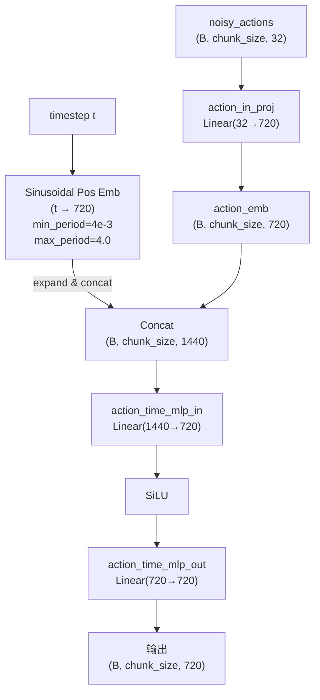
```mermaid
graph TB
    NOISY["noisy_actions<br/>(B, chunk_size, 32)"]
    TIME["timestep t"]
    TIME --> SINEMB["Sinusoidal Pos Emb<br/>(t → 720)<br/>min_period=4e-3<br/>max_period=4.0"]

    NOISY --> AINPROJ["action_in_proj<br/>Linear(32→720)"]
    AINPROJ --> ACT_EMB["action_emb<br/>(B, chunk_size, 720)"]

    SINEMB -->|"expand & concat"| CAT["Concat<br/>(B, chunk_size, 1440)"]
    ACT_EMB --> CAT

    CAT --> MLP_IN["action_time_mlp_in<br/>Linear(1440→720)"]
    MLP_IN --> SILU["SiLU"]
    SILU --> MLP_OUT["action_time_mlp_out<br/>Linear(720→720)"]
    MLP_OUT --> OUT["输出<br/>(B, chunk_size, 720)"]
```

---

### 3.6 注意力掩码策略

SmolVLA 使用精心设计的注意力掩码来控制不同 token 之间的信息流：

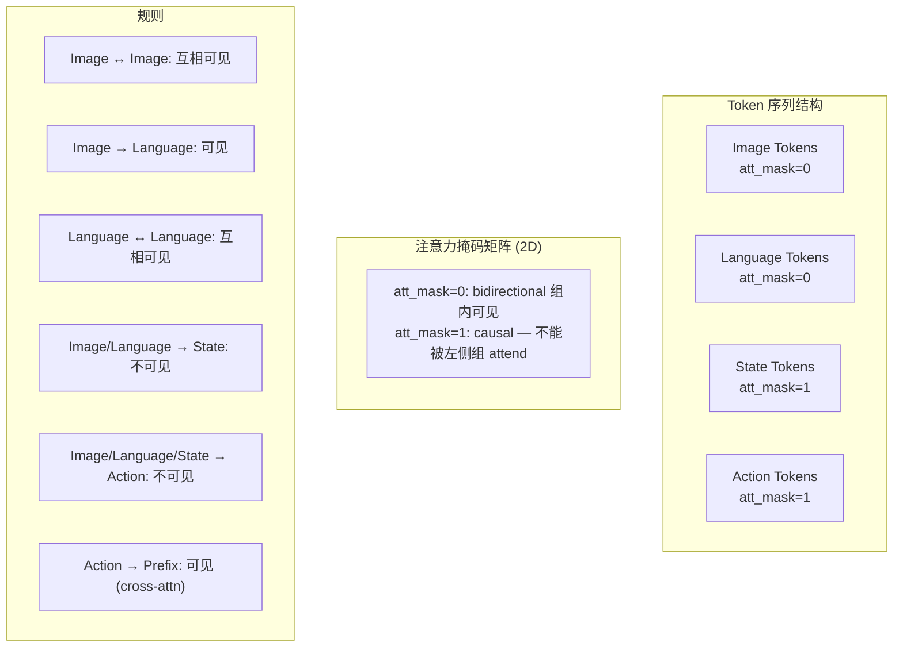
```mermaid
graph TB
    subgraph TokenSequence["Token 序列结构"]
        direction LR
        IMG_T["Image Tokens<br/>att_mask=0"]
        LANG_T["Language Tokens<br/>att_mask=0"]
        STATE_T["State Tokens<br/>att_mask=1"]
        ACT_T["Action Tokens<br/>att_mask=1"]
    end

    subgraph MaskMatrix["注意力掩码矩阵 (2D)"]
        direction TB
        M_DESC["att_mask=0: bidirectional 组内可见<br/>att_mask=1: causal — 不能被左侧组 attend"]
    end

    subgraph Rules["规则"]
        R1["Image ↔ Image: 互相可见"]
        R2["Image → Language: 可见"]
        R3["Language ↔ Language: 互相可见"]
        R4["Image/Language → State: 不可见"]
        R5["Image/Language/State → Action: 不可见"]
        R6["Action → Prefix: 可见 (cross-attn)"]
    end
```

掩码计算公式:

```
make_att_2d_masks(pad_masks, att_masks):
  cumsum = cumsum(att_masks, dim=1)
  att_2d = cumsum[:, None, :] <= cumsum[:, :, None]  # causal 结构
  pad_2d = pad_masks[:, None, :] & pad_masks[:, :, None]
  return att_2d & pad_2d
```

---

## 4. SmolVLA 完整结构图 (分层)


```mermaid
graph TB
    subgraph SmolVLA["SmolVLA = SmolVLAPolicy + VLAFlowMatching"]
        direction TB

        subgraph VLAFlowMatching["VLAFlowMatching"]
            direction TB

            subgraph VLMWithExpert["SmolVLMWithExpertModel"]
                direction TB

                subgraph SigLIP["SigLIP Vision Encoder (frozen)"]
                    direction LR
                    V_PATCH["PatchConv<br/>3→1152, k=32"]
                    V_POS["Learned Pos Emb"]
                    V_LAYERS["12× EncoderLayer<br/>LN→MHA→Res→LN→MLP→Res"]
                    V_FINAL["LayerNorm"]
                end

                subgraph Connector["Connector"]
                    direction LR
                    C_PS["PixelShuffle<br/>(÷4 seq len)"]
                    C_PROJ["Linear<br/>4608→960"]
                end

                subgraph VLM["VLM Text Model (Llama, 16 layers)"]
                    direction TB
                    T_EMB["Token Embedding<br/>× √960"]
                    T_LAYERS["16× LlamaDecoderLayer"]
                    T_NORM["RMSNorm(960)"]

                    subgraph VLM_LAYER["LlamaDecoderLayer"]
                        direction TB
                        VL_LN1["RMSNorm"]
                        VL_ATTN["GQA Self-Attn<br/>Q:15×64 K/V:5×64<br/>+ RoPE(θ=100000)"]
                        VL_RES1["Residual Add"]
                        VL_LN2["RMSNorm"]
                        VL_FFN["SwiGLU FFN<br/>gate:960→2560<br/>up:960→2560<br/>down:2560→960"]
                        VL_RES2["Residual Add"]
                    end
                end

                subgraph Expert["Action Expert (Llama, 75% width)"]
                    direction TB
                    E_LAYERS["16× ExpertDecoderLayer"]
                    E_NORM["RMSNorm(720)"]

                    subgraph EXPERT_LAYER["ExpertDecoderLayer"]
                        direction TB
                        EL_LN1["RMSNorm"]
                        EL_SELF["Self-Attn<br/>(每 2 层)"]
                        EL_CROSS["Cross-Attn<br/>Q:from Expert<br/>K/V:from VLM cache<br/>(其余层)"]
                        EL_RES1["Residual Add"]
                        EL_LN2["RMSNorm"]
                        EL_FFN["SwiGLU FFN<br/>gate:720→1920<br/>up:720→1920<br/>down:1920→720"]
                        EL_RES2["Residual Add"]
                    end
                end
            end

            subgraph FlowMatchingHead["Flow Matching Head"]
                direction TB
                STATE_PROJ["state_proj<br/>Linear(32→960)"]
                ACT_IN["action_in_proj<br/>Linear(32→720)"]
                TIME_EMB["Sinusoidal Emb<br/>(t→720)"]
                TIME_MLP["action_time_mlp<br/>Linear(1440→720)→SiLU→Linear(720→720)"]
                ACT_OUT["action_out_proj<br/>Linear(720→32)"]
            end
        end
    end

    V_PATCH --> V_POS --> V_LAYERS --> V_FINAL --> C_PS --> C_PROJ
    C_PROJ --> VLM
    VLM_LAYERS -->|KV cache| EXPERT_LAYER
```

---

## 5. 关键设计总结

### 5.1 模型规模

| 组件 | 参数量(约) | 是否训练 |
|---|---|---|
| SigLIP Vision Encoder | ~93M | Frozen |
| VLM (Llama 16L) | ~350M | Frozen (train_expert_only=True) |
| Action Expert (Llama 16L, 75%) | ~100M | **Trainable** |
| state_proj + action_in/out_proj | ~1M | **Trainable** |
| action_time_mlp | ~2M | **Trainable** |
| **总计** | **~450M** | |

### 5.2 核心设计选择

1. **Cross-Attention 而非 Self-Attention**: Action Expert 大部分层通过 cross-attention 从 VLM 的 KV cache 获取上下文，避免 action tokens 和 vision/language tokens 混合在同一个序列中，降低推理时的计算开销。

2. **KV Cache 前缀缓存**: 推理时 VLM prefix 只需执行一次，后续的去噪步骤只需执行 Expert 的 cross-attention，大幅加速。

3. **Flow Matching 而非 Diffusion**: 使用连续归一化流 (Flow Matching) 预测速度场 v_t，而非 DDPM 的噪声预测，训练更稳定，推理步骤更少 (10步)。

4. **SwiGLU FFN**: 使用 Gated Linear Unit + SiLU 激活，相比标准 FFN 效果更好但参数略多。

5. **GQA (Grouped Query Attention)**: 15 个 Q heads / 5 个 KV heads (3:1 比例)，减少 KV cache 大小，提升推理效率。

6. **NaViT 可变分辨率**: SigLIP 支持 NaViT 风格的可变分辨率输入，通过 2D 位置编码插值适应不同图像尺寸。

7. **Pixel Shuffle 降低序列长度**: Connector 使用 pixel shuffle (scale=2) 将图像 token 数量减少 4 倍，同时嵌入维度扩大 4 倍后通过线性层投影。

---

## 6. 代码级详解：Prefill 与 Action Expert 的连接

### 6.1 推理两阶段流程

SmolVLA 推理（`VLAFlowMatching.sample_actions`）分为**两阶段**：

**阶段 1 — Prefill**（只执行一次）：

```python
# modeling_smolvla.py:822-835
prefix_embs, prefix_pad_masks, prefix_att_masks = self.embed_prefix(...)
_, past_key_values = self.vlm_with_expert.forward(
    inputs_embeds=[prefix_embs, None],   # ← 只有 prefix，expert 输入为 None
    use_cache=True,
    fill_kv_cache=True,                  # ← 填充 KV cache
)
```

- VLM 的 16 层 self-attention 处理 `[image_emb, lang_emb, state_emb]`
- 每层产出的 K/V 存入 `past_key_values[layer_idx]`
- Expert 不参与此阶段（`inputs_embeds[1] = None`）

**阶段 2 — Denoise 循环**（执行 `num_steps=10` 步）：

```python
# modeling_smolvla.py:840-868
for step in range(num_steps):   # 10 步
    v_t = self.denoise_step(x_t, prefix_pad_masks, past_key_values, timestep)
    x_t = x_t + dt * v_t
```

每次 `denoise_step` 调用：

```python
# modeling_smolvla.py:896-903
outputs_embeds, _ = self.vlm_with_expert.forward(
    inputs_embeds=[None, suffix_embs],   # ← VLM 输入为 None，只有 Expert
    past_key_values=past_key_values,     # ← 复用 prefill 的 KV cache
    use_cache=True,
    fill_kv_cache=False,                 # ← 读缓存，不写
)
```

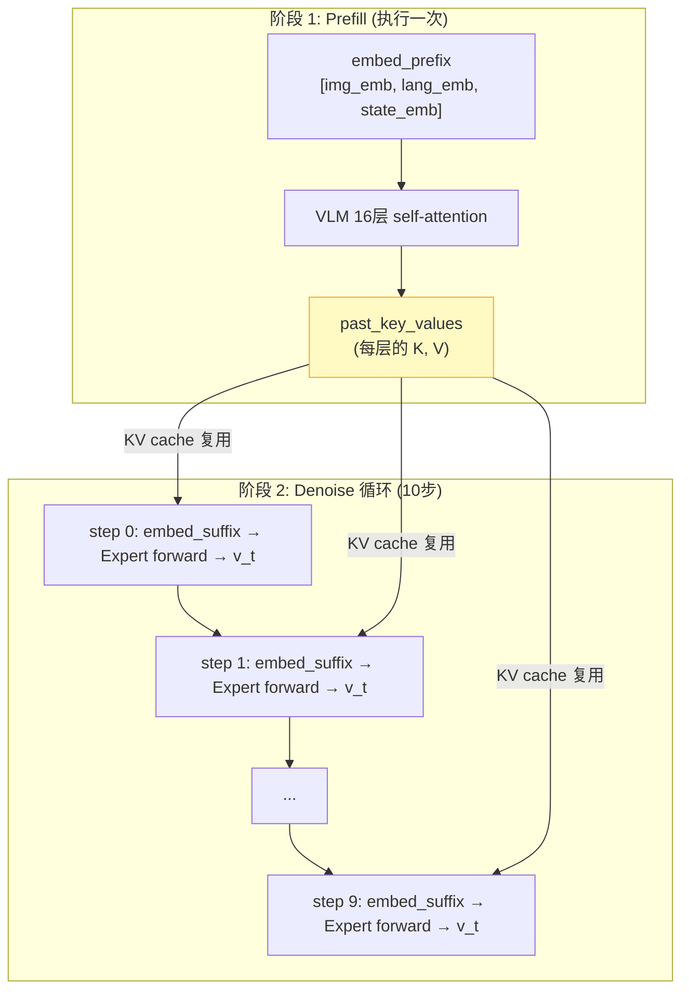
```mermaid
graph TB
    subgraph Prefill["阶段 1: Prefill (执行一次)"]
        P_EMB["embed_prefix<br/>[img_emb, lang_emb, state_emb]"]
        P_FWD["VLM 16层 self-attention"]
        P_KV["past_key_values<br/>(每层的 K, V)"]
        P_EMB --> P_FWD --> P_KV
    end

    subgraph Denoise["阶段 2: Denoise 循环 (10步)"]
        D0["step 0: embed_suffix → Expert forward → v_t"]
        D1["step 1: embed_suffix → Expert forward → v_t"]
        DD["..."]
        D9["step 9: embed_suffix → Expert forward → v_t"]
        D0 --> D1 --> DD --> D9
    end

    P_KV -->|"KV cache 复用"| D0
    P_KV -->|"KV cache 复用"| D1
    P_KV -->|"KV cache 复用"| D9

    style P_KV fill:#fff9c4,stroke:#f9a825
```

---

### 6.2 单次 Denoise Step 完整操作拆解

`denoise_step`（`modeling_smolvla.py:875-908`）是推理阶段循环 10 次的核心函数。去掉掩码构建等辅助逻辑，实际只有 **3 步**：

**步骤 1 — `embed_suffix(x_t, t)`：将噪声动作和时间步编码成 Expert 输入**

```
x_t (B, chunk_size, 32)
  │
  ├── action_in_proj:  Linear(32 → 720)         → action_emb
  │
t (scalar, 如 step=0 时 t=1.0)
  │
  ├── SinCosEmb:      t → (720,)                → time_emb
  │                                            expand → (B, chunk_size, 720)
  │
  ├── concat [action_emb, time_emb]              → (B, chunk_size, 1440)
  │
  ├── action_time_mlp_in:  Linear(1440 → 720)    → SiLU
  ├── action_time_mlp_out: Linear(720 → 720)     → suffix_embs
```

纯线性投影 + 一个小 MLP，没有 attention，计算量很小。

**步骤 2 — `vlm_with_expert.forward()`：Expert 16 层 transformer**

```
inputs_embeds = [None, suffix_embs]    # VLM 跳过，只跑 Expert
past_key_values = prefill 缓存的 KV

for layer_idx in 0..15:
    偶数层 (0,2,4...):  Expert self-attn   (concat VLM prefix KV + Expert KV)
    奇数层 (1,3,5...):  Expert cross-attn  (Q←Expert, KV←VLM cache + 重投影)
    → RMSNorm → FFN (SwiGLU)

→ RMSNorm → suffix_out
```

这是计算量最大的部分，但只涉及 Expert（75% 宽度，720 维），VLM 完全不跑。

**步骤 3 — `action_out_proj`：投影输出速度场 v_t**

```
suffix_out[:, -chunk_size:]           # 取最后 chunk_size 个 token
  → .to(float32)
  → action_out_proj:  Linear(720 → 32)
  → v_t                                # 速度场预测
```

回到 `sample_actions`（`modeling_smolvla.py:868`）做欧拉步更新：

```
x_t = x_t + dt * v_t                  # dt = -1/10
```

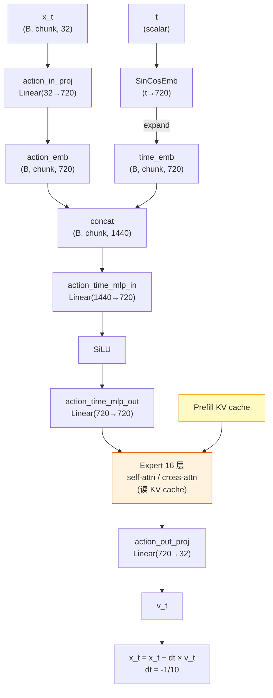
```mermaid
graph TB
    XT_IN["x_t<br/>(B, chunk, 32)"]
    T_IN["t<br/>(scalar)"]

    XT_IN --> AIN["action_in_proj<br/>Linear(32→720)"]
    T_IN --> SIN["SinCosEmb<br/>(t→720)"]

    AIN --> ACT_EMB["action_emb<br/>(B, chunk, 720)"]
    SIN -->|"expand"| TIME_EMB["time_emb<br/>(B, chunk, 720)"]

    ACT_EMB --> CAT["concat<br/>(B, chunk, 1440)"]
    TIME_EMB --> CAT

    CAT --> MLP_IN["action_time_mlp_in<br/>Linear(1440→720)"]
    MLP_IN --> SILU["SiLU"]
    SILU --> MLP_OUT["action_time_mlp_out<br/>Linear(720→720)"]

    MLP_OUT --> EXPERT["Expert 16 层<br/>self-attn / cross-attn<br/>(读 KV cache)"]
    KV["Prefill KV cache"] --> EXPERT

    EXPERT --> AOUT["action_out_proj<br/>Linear(720→32)"]
    AOUT --> VT["v_t"]
    VT --> EULER["x_t = x_t + dt × v_t<br/>dt = -1/10"]

    style KV fill:#fff9c4,stroke:#f9a825
    style EXPERT fill:#fff3e0,stroke:#e65100
```

**各步骤计算量对比**：

| 步骤 | 操作 | 计算量 |
|---|---|---|
| embed_suffix | `Linear(32→720)` + SinCosEmb + `MLP(1440→720→720)` | 很小 |
| Expert forward | 16 层 Expert (720维, cross-attn 读 KV cache) | **主要开销** |
| action_out_proj | `Linear(720→32)` | 极小 |
| 欧拉步 | `x_t += dt * v_t` | 极小 |

**结论**：denoise step 里除了 `vlm_with_expert.forward()` 就只有两个 Linear + 一个小 MLP + 一个加法，几乎没有额外开销。计算瓶颈完全在 Expert 的 16 层 attention + FFN 上。

---

### 6.3 层级路由：Self-Attn vs Cross-Attn

核心路由逻辑在 `SmolVLMWithExpertModel.forward`（`smolvlm_with_expert.py:437-467`）：

```python
for layer_idx in range(num_layers):
    if (fill_kv_cache
        or "cross" not in self.attention_mode
        or (self.self_attn_every_n_layers > 0 and layer_idx % self.self_attn_every_n_layers == 0)):
        att_outputs, past_key_values = self.forward_attn_layer(...)       # self-attention
    else:
        att_outputs, past_key_values = self.forward_cross_attn_layer(...)  # cross-attention
```

默认配置 `attention_mode="cross_attn"`, `self_attn_every_n_layers=2`，所以：

| 层 | Prefill (`fill_kv_cache=True`) | Denoise (`fill_kv_cache=False`) |
|---|---|---|
| 0, 2, 4, ... | `forward_attn_layer` (VLM self-attn, 存 KV) | `forward_attn_layer` (Expert self-attn) |
| 1, 3, 5, ... | `forward_attn_layer` (VLM self-attn, 存 KV) | `forward_cross_attn_layer` (Expert cross-attn) |

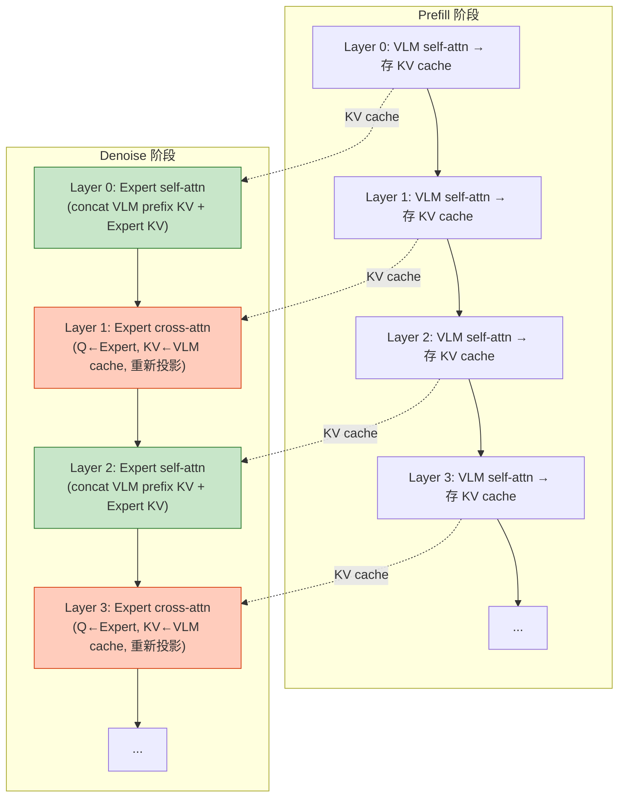
```mermaid
graph TB
    subgraph PrefillPhase["Prefill 阶段"]
        direction TB
        PL0["Layer 0: VLM self-attn → 存 KV cache"]
        PL1["Layer 1: VLM self-attn → 存 KV cache"]
        PL2["Layer 2: VLM self-attn → 存 KV cache"]
        PL3["Layer 3: VLM self-attn → 存 KV cache"]
        PDOT["..."]
        PL0 --> PL1 --> PL2 --> PL3 --> PDOT
    end

    subgraph DenoisePhase["Denoise 阶段"]
        direction TB
        DL0["Layer 0: Expert self-attn<br/>(concat VLM prefix KV + Expert KV)"]
        DL1["Layer 1: Expert cross-attn<br/>(Q←Expert, KV←VLM cache, 重新投影)"]
        DL2["Layer 2: Expert self-attn<br/>(concat VLM prefix KV + Expert KV)"]
        DL3["Layer 3: Expert cross-attn<br/>(Q←Expert, KV←VLM cache, 重新投影)"]
        DDOT["..."]
        DL0 --> DL1 --> DL2 --> DL3 --> DDOT
    end

    PL0 -.->|"KV cache"| DL0
    PL1 -.->|"KV cache"| DL1
    PL2 -.->|"KV cache"| DL2
    PL3 -.->|"KV cache"| DL3

    style DL0 fill:#c8e6c9,stroke:#2e7d32
    style DL1 fill:#ffccbc,stroke:#d84315
    style DL2 fill:#c8e6c9,stroke:#2e7d32
    style DL3 fill:#ffccbc,stroke:#d84315
```

---

### 6.4 Self-Attention 层的 Denoise 行为

对于偶数层 (0, 2, 4...)，在 Denoise 阶段调用 `forward_attn_layer`，`inputs_embeds=[None, suffix_embs]`。

此时 VLM 的 `hidden_states=None`，被跳过，只有 Expert 参与 self-attention。

当 `fill_kv_cache=False` 时，Expert 的新 K/V 与 `past_key_values` 中 VLM 的 prefix K/V **concat**（`smolvlm_with_expert.py:276-277`）：

```python
key_states = torch.cat([past_key_values[layer_idx]["key_states"], key_states], dim=1)
value_states = torch.cat([past_key_values[layer_idx]["value_states"], value_states], dim=1)
```

这使得 Expert 的 self-attn 可以同时 attend 到 prefix 上下文（VLM 产出的 KV）和自身 suffix（action tokens 的 KV）。

```mermaid
graph LR
    subgraph SelfAttnDenoise["Self-Attn 层 (Denoise 阶段)"]
        VLM_KV["VLM prefix KV<br/>(来自 cache)<br/>(B, prefix_len, H, D)"]
        EXPERT_KV["Expert suffix KV<br/>(当前步计算)<br/>(B, suffix_len, H, D)"]
        CAT_K["Concat K"]
        CAT_V["Concat V"]
        EXPERT_Q["Expert Q"]

        VLM_KV --> CAT_K
        EXPERT_KV --> CAT_K
        VLM_KV --> CAT_V
        EXPERT_KV --> CAT_V

        CAT_K --> ATTN["Attention"]
        CAT_V --> ATTN
        EXPERT_Q --> ATTN
    end

    style VLM_KV fill:#fff9c4,stroke:#f9a825
```

---

### 6.5 Cross-Attention 层的 Denoise 行为

对于奇数层 (1, 3, 5...)，在 Denoise 阶段调用 `forward_cross_attn_layer`。

关键代码（`smolvlm_with_expert.py:286-399`）：

```python
# 直接读取 VLM 的 KV cache（不再做 VLM forward）
key_states = past_key_values[layer_idx]["key_states"]
value_states = past_key_values[layer_idx]["value_states"]

# Expert 的 Q 来自 suffix embeddings
expert_query_state = expert_layer.self_attn.q_proj(expert_hidden_states)

# 关键：用 Expert 自己的 k_proj/v_proj 重新投影 VLM 的 KV 到 Expert 维度空间
expert_key_states = expert_layer.self_attn.k_proj(key_states)    # VLM dim → Expert dim
expert_value_states = expert_layer.self_attn.v_proj(value_states) # VLM dim → Expert dim

# Expert Q attend to 重投影后的 KV
att_output = attention(expert_Q, expert_K, expert_V)
```

**维度投影详解**：

- VLM KV cache 的维度：`(B, prefix_len, num_kv_heads_vlm, head_dim)` = `(B, prefix_len, 5, 64)`
- 展平后送入 Expert 的 `k_proj`：`(B, prefix_len, 320)` → `(B, prefix_len, expert_kv_dim)`
- Expert 的 `head_dim=64`，与 VLM 相同，所以投影只改变 KV head 的数量/总维度

```mermaid
graph TB
    subgraph CrossAttnDenoise["Cross-Attn 层 (Denoise 阶段)"]
        VLM_K["VLM K cache<br/>(B, L_prefix, 5, 64)"]
        VLM_V["VLM V cache<br/>(B, L_prefix, 5, 64)"]

        FLATTEN_K["Flatten → (B, L_prefix, 320)"]
        FLATTEN_V["Flatten → (B, L_prefix, 320)"]

        EXPERT_KPROJ["Expert k_proj<br/>Linear(320 → expert_kv_dim)"]
        EXPERT_VPROJ["Expert v_proj<br/>Linear(320 → expert_kv_dim)"]

        EXPERT_K["Expert K<br/>(B, L_prefix, expert_kv_heads, 64)"]
        EXPERT_V["Expert V<br/>(B, L_prefix, expert_kv_heads, 64)"]
        EXPERT_Q["Expert Q<br/>(B, L_suffix, expert_q_heads, 64)"]

        VLM_K --> FLATTEN_K --> EXPERT_KPROJ --> EXPERT_K
        VLM_V --> FLATTEN_V --> EXPERT_VPROJ --> EXPERT_V

        EXPERT_Q --> ATTN["Cross-Attention<br/>Q × Kᵀ → softmax → × V"]
        EXPERT_K --> ATTN
        EXPERT_V --> ATTN
    end

    style VLM_K fill:#fff9c4,stroke:#f9a825
    style VLM_V fill:#fff9c4,stroke:#f9a825
```

**k_proj/v_proj 的初始化**：在 `SmolVLMWithExpertModel.__init__` 中（`smolvlm_with_expert.py:122-134`），cross-attn 层的 k_proj/v_proj 被替换为输入维度匹配 VLM 的新 Linear 层：

```python
# 仅对 cross-attn 层替换（跳过 self-attn 层）
for layer_idx in range(len(self.lm_expert.layers)):
    if self.self_attn_every_n_layers > 0 and layer_idx % self.self_attn_every_n_layers == 0:
        continue  # self-attn 层保持不变

    # 新 k_proj: 输入维度 = VLM 的 KV 总维度, 输出维度 = Expert 的 KV 总维度
    self.lm_expert.layers[layer_idx].self_attn.k_proj = nn.Linear(
        config.text_config.num_key_value_heads * config.text_config.head_dim,  # 5 × 64 = 320
        lm_expert_config.num_key_value_heads * lm_expert_config.head_dim,
        bias=lm_expert_config.attention_bias,
    )
    # v_proj 同理
```

---

### 6.6 训练路径对比

训练时（`VLAFlowMatching.forward`），prefix 和 suffix **同时输入**，一次 forward 完成：

```python
# modeling_smolvla.py:789-796
(_, suffix_out), _ = self.vlm_with_expert.forward(
    inputs_embeds=[prefix_embs, suffix_embs],  # ← 两个同时输入
    use_cache=False,                            # ← 不使用 KV cache
    fill_kv_cache=False,                        # ← 不缓存
)
```

- 所有 16 层都走 `forward_attn_layer`（因为 `fill_kv_cache=False` 且没有 `past_key_values`）
- VLM prefix tokens 和 Expert suffix tokens 在 self-attn 中被 concat 后一起计算
- 不区分 self-attn / cross-attn，**训练时等价于一个统一的 self-attention 序列**

---

### 6.7 注意力掩码在两阶段中的差异

**Prefill 阶段**：只处理 prefix tokens，掩码由 `make_att_2d_masks(prefix_pad_masks, prefix_att_masks)` 计算。

- Image tokens (`att_mask=0`)：组内双向可见
- Language tokens (`att_mask=0`)：组内双向可见，且可见 image
- State tokens (`att_mask=1`)：causal，image/language 不可见 state

**Denoise 阶段**：需要处理 Expert suffix 对 VLM prefix 的 cross-attention：

```python
# modeling_smolvla.py:888-892
# 1. prefix 部分只做 pad mask（不做 causal 限制）
prefix_pad_2d_masks = prefix_pad_masks[:, None, :].expand(batch_size, suffix_len, prefix_len)

# 2. suffix 部分做完整的 att_2d_masks
suffix_att_2d_masks = make_att_2d_masks(suffix_pad_masks, suffix_att_masks)

# 3. 拼接：suffix 可以看到所有 prefix + causal 的 suffix
full_att_2d_masks = torch.cat([prefix_pad_2d_masks, suffix_att_2d_masks], dim=2)
```

```mermaid
graph TB
    subgraph MaskMatrix["注意力掩码 (Denoise 阶段)"]
        direction TB
        MAT["┌─────────────────┬──────────────┐<br/>│ Prefix × Prefix  │ Prefix × Suf │<br/>│  (不使用，VLM跳过) │  (不使用)    │<br/>├─────────────────┼──────────────┤<br/>│ Suffix × Prefix  │ Suffix × Suf │<br/>│  ✅ 全部可见      │  ✅ causal    │<br/>└─────────────────┴──────────────┘"]
    end
```

---

## 7. KV Cache 复用分析与优化

### 7.1 当前已实现的复用

**单次推理内**：Prefill 产出的 KV cache 在 10 步去噪循环中被**完全复用**。这是当前最主要的缓存优化。

```mermaid
graph LR
    PREFILL["Prefill<br/>计算 1 次"]
    D0["Denoise 0<br/>复用 KV"]
    D1["Denoise 1<br/>复用 KV"]
    D2["..."]
    D9["Denoise 9<br/>复用 KV"]

    PREFILL -->|"KV cache"| D0
    PREFILL -->|"KV cache"| D1
    PREFETCH -->|"KV cache"| D2
    PREFILL -->|"KV cache"| D9

    style PREFILL fill:#c8e6c9,stroke:#2e7d32
```

### 7.2 当前未实现的跨调用复用

**跨推理调用**：每次 `sample_actions()` 都重新计算整个 prefix 的 KV cache。但实际控制循环中：

- **图像**：通常在 episode 内不变（或变化很小）
- **语言指令**：整个 episode 不变
- **机器人状态 (state)**：每步都变化

当前 state 被嵌入在 **prefix** 中（`modeling_smolvla.py:696-707`）：

```python
state_emb = self.state_proj(state)   # state 是 prefix 的一部分
embs.append(state_emb)
# ... 与 image_emb, lang_emb 一起 concat
```

这导致 **state 变化时整个 prefix KV cache 失效**，必须全部重算。

```mermaid
graph TB
    subgraph Current["当前实现：state 在 prefix 中"]
        direction TB
        CP["Prefix = [img, lang, state]"]
        CF1["调用 1: Prefill → KV cache → Denoise × 10"]
        CF2["调用 2: Prefill → KV cache → Denoise × 10<br/>(state 变了，全部重算!)"]
        CF3["调用 3: Prefill → KV cache → Denoise × 10<br/>(state 又变了，全部重算!)"]
        CP --> CF1
        CP --> CF2
        CP --> CF3
    end

    style CF2 fill:#ffccbc,stroke:#d84315
    style CF3 fill:#ffccbc,stroke:#d84315
```

### 7.3 可行优化：将 state 从 prefix 移到 suffix

```
当前 prefix: [img_emb, lang_emb, state_emb]  → 任何 state 变化都需全部重算
优化 prefix: [img_emb, lang_emb]              → 跨调用不变，可缓存
优化 suffix: [state_emb, action_time_emb]     → 每步重算（成本低）
```

**优化后的流程**：

```mermaid
graph TB
    subgraph Optimized["优化实现：state 移到 suffix"]
        direction TB
        OP["Prefix = [img, lang]<br/>(episode 内不变)"]
        OS1["调用 1: Prefill → KV cache → Denoise × 10"]
        OS2["调用 2: 复用 KV cache → Denoise × 10<br/>(只重 embed state!)"]
        OS3["调用 3: 复用 KV cache → Denoise × 10<br/>(只重 embed state!)"]
        OP --> OS1
        OP -.->|"KV cache 复用"| OS2
        OP -.->|"KV cache 复用"| OS3
    end

    style OS2 fill:#c8e6c9,stroke:#2e7d32
    style OS3 fill:#c8e6c9,stroke:#2e7d32
```

**节省的计算量**：

| 阶段 | 当前每步计算 | 优化后每步计算 |
|---|---|---|
| SigLIP forward | 每次 ✅ | 仅首次 ✅ |
| VLM 16 层 (image + lang tokens) | 每次 ✅ | 仅首次 ✅ |
| VLM 16 层 (state token, 1个) | 每次 ✅ (混在 prefix 中) | ❌ (移到 suffix) |
| Expert 16 层 | 每次 ✅ | 每次 ✅ (不变) |

**需注意的改动点**：

1. **注意力掩码**：state 当前 `att_mask=1`（causal），移到 suffix 后自然满足 causal 约束，但需要调整 `embed_prefix` 和 `embed_suffix` 的拼接逻辑
2. **self-attn 层中的 KV concat**：state token 的 KV 会从 VLM prefix cache 移到 Expert suffix 的 KV 中，self-attn 层 concat 的 prefix_len 变短
3. **cross-attn 层的 K/V 投影**：VLM KV cache 不再包含 state，投影输入略短
4. **表示质量**：state 从 VLM self-attn 语境移到 Expert 语境，VLM 不再直接处理 state 信息，可能轻微影响 Expert 对 state 的理解

**量化估算**：假设 image tokens ~49 个、lang tokens ~20 个、state 只有 1 个 token。将 state 移出 prefix 可以避免 ~70 个 token 的 16 层 VLM forward + SigLIP forward，在实时控制场景（每秒 10-30 次调用）下收益显著。

### 7.4 更进一步的优化思路

| 优化方向 | 描述 | 难度 | 收益 |
|---|---|---|---|
| Static Cache 预分配 | 代码中已有 TODO 注释（`smolvlm_with_expert.py:273-275`），预先分配固定大小的 cache 避免每步 `torch.cat` | 低 | 减少 GPU 内存碎片和拷贝 |
| 跨 episode KV cache | 图像不变时，只在 episode 首次 prefill，后续 episode 复用 | 中 | 节省 SigLIP + 部分VLM 计算 |
| Flash Attention 替换 eager | 当前使用 `eager_attention_forward`，可替换为 `flash_attn` | 低 | 2-4x attention 加速 |
| 减少 Expert 自注意力层 | 当前 self_attn_every_n_layers=2，可增大以减少自注意力层比例 | 低 | 减少 Expert 计算量 |
| KV Cache 量化 | 将缓存的 K/V 从 bf16 量化为 int8 | 中 | 减少内存带宽瓶颈 |
