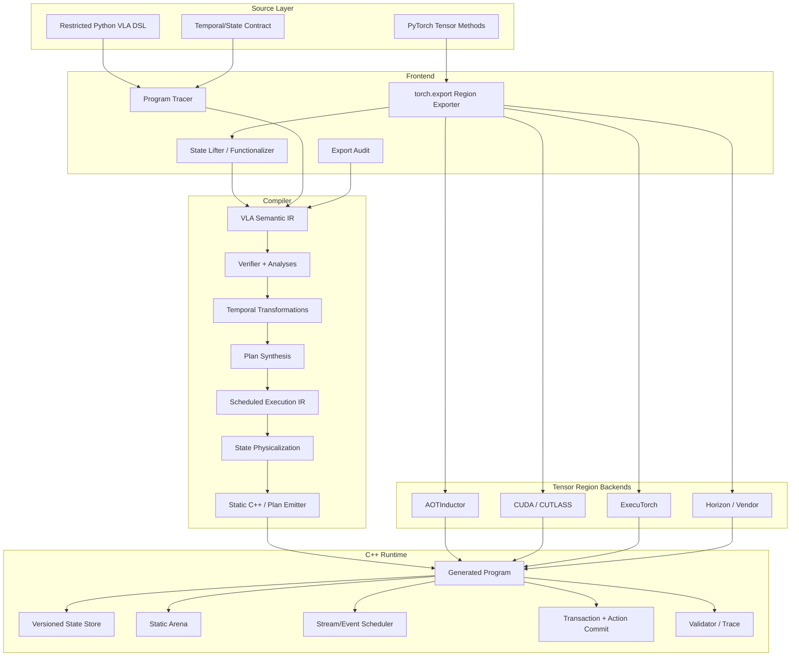

# VLAForge Clean-slate 开发计划：从持续化状态 IR 到高性能 C++ AOT 部署

> 文档状态：开发设计 v1
>
> 更新时间：2026-07-23
>
> 目标：构建独立于现有 EdgeFM 架构的 Stateful VLA Compiler 与轻量 C++ Runtime
>
> 第一优先级：Persistent State / Epoch / Clock / Action Commit IR

## 0. 架构决策摘要

本计划不以兼容当前 EdgeFM `engine -> model -> layer -> operator` 结构为前置约束。推荐建立一个独立的 `vlaforge` compiler/runtime：

- 现有 EdgeFM 只作为可选 CUDA/Horizon/operator backend；
- VLA 高层语义不进入 `OperatorImplTable`；
- 不让当前 `EngineConfig`、MockStageRunner、planner 或 Horizon graph tuning 反向决定 IR；
- 不自研完整 Tensor compiler；
- Tensor Region 使用 `torch.export` 捕获，并由 AOTInductor、ExecuTorch 或厂商 backend 编译；
- VLAForge 负责跨 method、跨 observation、跨 solver iteration 和跨 control tick 的状态、循环、时钟、调度、内存与 C++ codegen。

推荐的五项顶层决策：

1. **两层程序模型**
   - 纯 Tensor Region；
   - 显式 Stateful/Temporal Program。
2. **一层公开 IR，两个内部产物**
   - 唯一公开、可序列化的 VLA Semantic IR；
   - Scheduled Execution 只是编译器内部 lowering 数据结构；
   - Runtime Plan 是部署产物，不再定义第二套用户可见语义。
3. **逻辑状态与物理存储分离**
   - 高层使用不可变 versioned state；
   - lowering 后映射到 bounded ring/double buffer。
4. **双执行形态**
   - Reference Interpreter 用于 correctness/debug；
   - generated static C++ 用于最终部署。
5. **Agent 后置**
   - 在 IR、deterministic passes、C++ codegen 和 benchmark 全部成立前不投入 Agent。

## 1. 项目目标与非目标

### 1.1 目标

#### G1：持续化状态可被编译器理解

只有真实源码在 policy invocation 之间保留、并会影响后续动作的值，才进入
Persistent State IR，例如：

- action queue / queue cursor；
- observation/history cache；
- 跨 tick 复用的 prefix KV（仅当真实实现确实保留）；
- 显式 RNG state；
- previous action / control state（仅当模型真实读取）；
- 影响可观察语义的 backend persistent state。

单次推理内部的 solver sample、临时 KV cache、workspace 和中间 tensor 使用
普通 SSA 或 `vla.for` loop-carried value 表达，不得为了展示 IR 能力而提升为
持久状态。

编译器应知道：

- 状态属于哪个 session/episode/epoch；
- 哪个 region 读取和写入；
- 哪个版本有效；
- 何时失效；
- 需要保留多少版本；
- 是否允许原地更新；
- 是否能安全回滚。

#### G2：自动化生成 C++ 部署程序

输入：

- export-compatible PyTorch Tensor Regions；
- 声明式 temporal/state contract；
- representative inputs/episodes；
- target hardware profile。

输出：

- semantic IR；
- optimized execution plan；
- Tensor Region backend artifacts；
- generated C++ source 或静态 Plan；
- lightweight Runtime library；
- validation evidence；
- 可独立运行的 `.vlabundle`。

目标设备执行时不依赖 Python。

#### G3：Whole-program 优化

在真实模型证明有收益后，按需实现：

- epoch-keyed prefix/cache；
- solver-loop invariant hoisting；
- cross-method/cycle memory planning；
- freshness-safe pipeline（第一阶段保持同步）；
- static state ring/double buffer；
- solver loop/CUDA Graph specialization。

#### G4：新模型不修改核心 Runtime

冻结后接入 held-out model 时：

- 不新增 model-name C++ branch；
- 不手写模型 loop；
- 不修改 scheduler/state/action ABI；
- 只允许 adapter、contract 和编译产物。

#### G5：部署忠实性

支持：

- eager Python；
- ExportedProgram；
- Semantic IR Interpreter；
- generated C++ reference plan；
- optimized plan；

之间的 state/solver/action trace 对齐。

### 1.2 第一篇论文明确不做

- 不编译任意 Python；
- 不自动猜测 robot rate、deadline 或 safety intent；
- 不做通用 hard real-time/WCET proof；
- 不自研 ATen 到 CUDA 的完整 Tensor compiler；
- 不同时首发所有厂商 backend；
- 不让 Agent 自由修改 C++/CUDA Runtime；
- 不声称 action 发布后能够安全撤销；
- 不保证 policy 本身的机器人安全；
- 不支持任意动态 task graph；
- 不把 tokenizer、PIL、网络 I/O 强行塞进 Tensor IR。

## 2. Clean-slate 总体架构



### 2.1 为什么不把所有东西放进一个 IR

Tensor Region 和 VLA Program 的优化粒度不同：

- Tensor Region 内是 operator、shape、layout、fusion、kernel；
- VLA Program 层是 method、state、epoch、clock、loop、action；
- Runtime Plan 层是 device、stream、event、buffer offset 和 artifact。

如果混在一起：

- IR 会过度复杂；
- 被迫重新实现成熟 Tensor compiler；
- backend 适配和 VLA 语义耦合；
- 难以隔离 temporal pass 的贡献。

因此：

```text
Tensor Region:
    torch.export / ATen / backend artifact

VLA Semantic Program:
    state + epoch + clock + loop + action commit

Scheduled Plan:
    placement + stream + event + physical buffer + variant
```

## 3. 一个 VLA Semantic IR 与两个内部表示

### 3.1 Layer 1：VLA Semantic IR

用途：

- 表达用户可观察的 VLA 程序语义；
- 与硬件和具体 buffer 无关；
- 作为论文的核心 IR；
- 支持 parser、printer、verifier、interpreter 和 transformation。

推荐实现为精简 MLIR dialect，原因：

- 原生 SSA 和 region；
- 自定义 types/attributes/ops；
- verifier；
- `MemoryEffectsOpInterface`；
- structured control flow；
- pass manager；
- textual IR 和 bytecode；
- 可 lower 到 `scf`、`async` 或自定义 Plan dialect。

但需要严格限制：

- 第一版不把 Tensor Region lower 到 Linalg/StableHLO；
- Tensor Region 在 VLA IR 中是 opaque pure function symbol；
- 只保存 signature、shape contract、effect summary 和 artifact reference；
- 不把项目绑在 torch-mlir 全图转换上。

### 3.2 内部 Scheduled Execution 表示

用途：

- 表达已经做完 target selection 的执行计划；
- 作为 optimizer、memory planner 和 codegen 的输入。

包含：

- task id；
- Tensor Region variant；
- device/affinity；
- stream/queue；
- dependency event；
- input/output logical buffers；
- state slot/version mapping；
- physical buffer offset；
- loop descriptor；
- shape guard；
- deadline/freshness guard；
- validation point；
- fallback target。

示例：

```text
task 0:
  region = encode
  backend = aoti_cuda
  stream = vision
  inputs = [camera_slot[e]]
  outputs = [prefix_slot[e mod 2]]
  signal = event_encode_e

task 1:
  loop = 10
  region = denoise_step
  backend = cuda_graph
  stream = action
  waits = [event_encode_e]
  carried = [solver_ping, solver_pong]

task 2:
  region = decode_action
  waits = [event_solver_e]
  outputs = [pending_action_slot]

task 3:
  validate = action_contract
  commit = [state_version_e, action_e]
```

这层是实现细节，不提供 parser/printer，不承诺稳定 ABI，也不作为论文的独立
IR 贡献。第一阶段若同步执行已经满足 SmolVLA/OpenVLA，就不引入 stream/event
调度节点。

### 3.3 Runtime Plan 部署数据

用途：

- 序列化到 bundle；
- C++ Runtime 直接加载；
- 不依赖 MLIR 和 Python。

推荐 FlatBuffers：

- task table；
- state table；
- buffer table；
- artifact table；
- dependency index；
- shape guard；
- loop descriptor；
- validation/fallback descriptor；
- versioned schema。

第一版也可以先生成静态 C++，但仍应从同一个 Scheduled IR 产生，避免两套语义。

## 4. Persistent State IR：核心设计

### 4.1 运行时形式模型

把 VLA 定义为响应式、事务化、多时钟状态机：

$$
\mathcal{P} = (\mathcal{C}, \mathcal{I}, \mathcal{S}, \mathcal{R}, \mathcal{A}, \mathcal{K})
$$

- $\mathcal{C}$：clock domains；
- $\mathcal{I}$：带 timestamp/epoch 的输入流；
- $\mathcal{S}$：versioned persistent states；
- $\mathcal{R}$：pure Tensor Regions 和 structured loops；
- $\mathcal{A}$：action chunk 与 commit；
- $\mathcal{K}$：freshness、deadline、numeric contracts。

运行配置：

$$
\Gamma = \langle \Sigma, Q, T, P, O \rangle
$$

- $\Sigma$：已提交状态；
- $Q$：输入事件队列；
- $T$：逻辑时钟和 epoch；
- $P$：尚未提交的 transaction；
- $O$：已经发布的 action trace。

一次 policy tick：

1. 根据 clock relation 锁定输入 snapshot；
2. 建立 committed state read frontier；
3. 执行 pure Tensor Regions 和 solver loop；
4. 新状态写入 transaction staging；
5. 验证 pending state/action；
6. 原子 commit，或者 discard 后进入 reference/degraded plan。

### 4.2 Epoch

运行时结构：

```cpp
struct Epoch {
    uint32_t clock_id;
    uint64_t sequence;
    int64_t timestamp_ns;
};
```

编译期使用 `EpochExpr`：

```text
constant
camera(e)
observation(e)
control(t)
solver(t, k)
action_chunk(t)
next(camera(e))
unknown
```

每个 state read/write、input sample、async task 和 action 都绑定 EpochExpr。

### 4.3 StateSlot

推荐声明：

```mlir
vla.state @prefix_cache
    : tensor<1x576x1024xf16> {
  scope = #vla.scope<session>,
  version_clock = @camera,
  retention = 2,
  consistency = #vla.consistency<snapshot>,
  initializer = @empty_prefix,
  reset = #vla.reset<episode_start>,
  authoritative = false,
  device_hint = #vla.device<cuda>
}
```

字段：

| 字段 | 含义 |
| --- | --- |
| `type` | shape、dtype、layout |
| `scope` | process/session/episode/observation/control/solver |
| `version_clock` | 哪个 clock 推进版本 |
| `retention` | 最少保留多少逻辑版本 |
| `consistency` | exclusive/snapshot/append-only/merge |
| `initializer` | 初始值或外部 provider |
| `reset` | session/episode/error 等 reset 条件 |
| `authoritative` | 是否属于对外可见状态 |
| `freshness` | consumer 可读取的最大 age |
| `ownership` | host/device/backend/external |
| `checkpoint` | always/on-commit/never |

逻辑 state key：

```text
(session_id, state_id, epoch_tuple, version)
```

### 4.4 Snapshot、Pending 与 Commit

推荐类型：

```text
!vla.snapshot<T>
!vla.pending<T>
!vla.transaction
!vla.action<T>
!vla.future<T>
!vla.event
```

语义：

- `snapshot<T>`：不可变的已提交版本；
- `pending<T>`：只存在于 transaction；
- `action<T>`：commit 前不可被机器人读取；
- `future<T>`：显式 await 后才能消费；
- committed state 与 pending state 物理上可以 copy-on-write。

### 4.5 State Effects

最少支持：

```text
ReadState(slot, epoch/version)
StageWrite(slot, target_epoch)
CommitState(slot)
SampleInput(stream, epoch)
PublishAction(action_id)
Await(event)
ExternalIO(resource)
```

Tensor Region 必须是 pure：

```text
(tensor inputs, explicit state inputs)
    -> (tensor outputs, explicit new state)
```

如果 `torch.export` 捕获到 mutable buffer，frontend 必须将其提升为显式 state input/output。

### 4.6 Action Commit

```mlir
%pending = vla.action.create %decoded
    epoch(%control_tick)

vla.state.stage %txn, @prev_action,
    next(%control_tick), %decoded

vla.txn.commit %txn
    states[@prev_action]
    action(%pending)
    if %valid
```

规则：

- commit 是不可跨越的外部 side-effect barrier；
- required futures 必须完成；
- required validators 必须支配 commit；
- 一个成功路径 exactly-once commit；
- pending state/action 不能逃逸；
- action 发布后不能再声称回滚当前 action。

### 4.7 Logical State 到 Physical Storage

这是最重要的 lowering pass。

高层：

```text
prefix<e>
prefix<e+1>
prefix<e+2>
```

lowering：

```text
prefix_ring[e mod K]
```

编译器根据：

- retention；
- 最大 in-flight transaction；
- consumer lag；
- async happens-before；
- fallback snapshot；

推导 $K$。

安全条件：

1. 一个 slot 被新 version 覆盖前，旧 version 的所有 readers 已完成；
2. pending transaction 不覆盖 committed version；
3. fallback 所需 snapshot 仍存在；
4. action commit 前 authoritative state 不被原地覆盖。

如果无法证明：

- 增大 ring；
- 禁止 overlap；
- 使用 copy-on-write；
- 或拒绝编译。

## 5. VLA Semantic IR 示例

```mlir
vla.module @smolvla {
  vla.clock @camera {
    period_ns = 33333333,
    jitter_ns = 5000000
  }

  vla.clock @control {
    period_ns = 20000000,
    deadline_ns = 18000000,
    miss_policy = #vla.miss<hold_last>
  }

  vla.relation @camera to @control {
    sampling = #vla.sample<latest_before>,
    max_age_ns = 50000000
  }

  vla.state @prefix_cache
      : tensor<1x576x1024xf16> {
    scope = #vla.scope<session>,
    version_clock = @camera,
    retention = 2,
    consistency = #vla.consistency<snapshot>
  }

  vla.state @rng : tensor<2xi64> {
    scope = #vla.scope<session>,
    version_clock = @control,
    retention = 2
  }

  vla.region @encode(
      %image: tensor<1x3x480x640xf16>)
      -> tensor<1x576x1024xf16> {
    artifact = "regions/encode.pt2",
    pure
  }

  vla.region @denoise_step(
      %prefix: tensor<1x576x1024xf16>,
      %sample: tensor<1x16x7xf32>,
      %step: i32)
      -> tensor<1x16x7xf32> {
    artifact = "regions/denoise_step.pt2",
    pure
  }

  vla.policy @act
      on @control(%tick: !vla.epoch<@control>) {
    %txn = vla.txn.begin %tick

    %image, %obs_epoch =
      vla.input.latest @camera before %tick
        max_age_ns(50000000)

    %prefix = vla.memo @prefix_cache
        key(%obs_epoch)
        transaction(%txn) {
      ^miss:
        %p = vla.invoke @encode(%image)
        vla.memo.yield %p
    }

    %rng0 = vla.state.read %txn, @rng
    %z0, %rng1 = vla.random.normal %rng0

    %zN = scf.for %k = %c0 to %c10 step %c1
        iter_args(%z = %z0) {
      %next = vla.invoke @denoise_step(
          %prefix, %z, %k)
      scf.yield %next
    }

    %action = vla.invoke @decode_action(%zN)
    %valid = vla.validate %action
        using @action_contract

    %pending = vla.action.create %action
        epoch(%tick)

    vla.state.stage %txn, @rng,
        next(%tick), %rng1

    vla.txn.commit %txn
        if %valid
        action(%pending)
        deadline(%tick, 18000000)
        fallback(@reference_plan)
  }
}
```

## 6. Source Frontend 与自动化边界

### 6.1 Restricted Python DSL

建议用户通过声明而不是编写 YAML 拼图：

```python
@vla.program
class SmolPolicyProgram:
    prefix = vla.State(
        shape=(1, 576, 1024),
        dtype=torch.float16,
        scope="session",
        clock="camera",
        retention=2,
    )

    rng = vla.State(
        shape=(2,),
        dtype=torch.int64,
        scope="session",
        clock="control",
    )

    @vla.region(pure=True)
    def encode(self, image):
        return self.policy.encode(image)

    @vla.region(pure=True)
    def denoise_step(self, prefix, sample, step):
        return self.policy.denoise_step(
            prefix, sample, step)

    @vla.tick(clock="control", deadline_ms=18)
    def act(self, ctx):
        image = ctx.latest(
            "camera", max_age_ms=50)
        prefix = ctx.memo(
            self.prefix,
            key=image.epoch,
            compute=lambda: self.encode(image),
        )
        sample = ctx.random(...)
        for k in vla.range(10):
            sample = self.denoise_step(
                prefix, sample, k)
        ctx.commit(self.decode_action(sample))
```

### 6.2 Frontend 编译步骤

1. 找到 `@vla.region`；
2. 为非 `forward` method 生成 wrapper module；
3. 运行 `torch.export`；
4. 读取 `ExportGraphSignature`；
5. 将 parameters、buffers、mutations 显式化；
6. 生成 shape/domain constraints；
7. 对 `@vla.tick` 做受限 symbolic execution；
8. 将 DSL state/clock/loop/commit 组装为 VLA IR；
9. 输出 Export Audit；
10. 记录所有 escape hatch 和人工 annotation。

### 6.3 可以自动推断什么

可以保守推断：

- Tensor method signature；
- shape/dtype/layout；
- parameter/buffer dependency；
- region 内 read/write；
- static loop count；
- 某些 state dependency；
- shape bucket；
- pure/in-place mutation；
- backend operator coverage。

不能仅从 representative episodes 推断：

- robot control rate；
- action deadline；
- state scope/ownership；
- 允许的 observation staleness；
- action units/safety range；
- cache 是否允许近似；
- action commit 语义；
- episode/reset 语义。

这些必须显式声明。

### 6.4 Export Audit

每次编译生成：

```text
export_report.json
```

包含：

- exported regions；
- graph break/unsupported features；
- specialized Python values；
- shape constraints；
- hidden mutable state；
- custom ops；
- backend coverage；
- host preprocessing boundary；
- adapter LOC；
- semantic annotations；
- non-deterministic ops/RNG。

编译器不得静默特化关键 Python 条件。

## 7. Verifier 与分析

### 7.1 Structure/Type Verifier

- state 必须有 initializer 或 external provider；
- read/write type 与声明一致；
- Tensor Region artifact signature 一致；
- dynamic dimension 有有限上界；
- loop-carried input/output 一致；
- Tensor Region 必须 pure；
- pending/action/future 类型不得非法逃逸。

### 7.2 State Version Analysis

- read-before-init；
- 唯一 producer；
- single writer 或显式 merge；
- state version 单调；
- reset 后旧版本失效；
- pending write 必须 commit/discard；
- transaction 只能读 committed frontier 或自己的 pending value。

### 7.3 Epoch/Freshness Analysis

- 禁止读取未来 epoch；
- 推导 `camera(e) -> control(t)` relation；
- 检查 max age；
- 检查 solver state `solver(t,k) -> solver(t,k+1)`；
- cache key 必须覆盖所有 epoch-varying dependency；
- missing/late input 必须执行显式 overload policy。

### 7.4 Effect/Race Analysis

两个 op 可以并发或重排的基本条件：

$$
W_1 \cap (R_2 \cup W_2) = \varnothing
$$

且：

$$
W_2 \cap (R_1 \cup W_1) = \varnothing
$$

或者证明访问的是不同 logical version。

额外规则：

- async region 不能隐式捕获 mutable storage；
- commit 必须 await required events；
- publish/commit 不能 CSE、复制或跨越；
- backend side effect 必须显式声明。

### 7.5 Liveness/Memory Analysis

- 在 scheduled happens-before graph 上计算 live interval；
- state version、transaction staging、activation/scratch 分开；
- physical alias 必须 dtype/device/alignment/capacity 兼容；
- ring size 覆盖最大 consumer lag；
- fallback snapshot 计入 peak memory；
- dynamic shape 按 bucket 规划。

### 7.6 Deadline Analysis

第一版基于 profile：

- region p50/p95/p99；
- device transfer；
- queue/scheduler overhead；
- critical path；
- predicted commit time。

无法证明 deadline 时：

- 选择其他 plan；
- 减少 overlap/增加 buffer；
- 进入 degraded/hold-last；
- 或拒绝部署。

没有 WCET 时文档和论文只称 deadline-aware。

### 7.7 Validation Contract

每个 transform/variant 标注：

```text
exact
approximate(error_budget)
empirical(test_domain)
```

规则：

- `exact`：需要 rewrite rule、symbolic check 或 deterministic equivalence；
- `approximate`：误差 budget 可组合并最终映射到 action boundary；
- `empirical`：仅表示样本证据；
- intermediate tensor allclose 不能代替 solver/action trace。

## 8. 核心 Compiler Passes

### 8.1 Frontend/Canonicalization

1. `LiftModuleState`
2. `FunctionalizeMutation`
3. `NormalizeEpochExpr`
4. `InferRegionEffects`
5. `CanonicalizeShapeProfile`
6. `MaterializeExplicitRNG`
7. `NormalizeActionCommit`

### 8.2 Epoch-keyed Cache Synthesis

自动识别：

```text
encode(image[e]) -> prefix[e]
```

并生成 persistent cache。

合法条件：

- region pure；
- key 覆盖所有 free dependency；
- state/parameter version 相同；
- RNG 不隐式变化；
- shape/precision contract 匹配。

输出：

- StateSlot；
- cache key；
- invalidation rule；
- miss path；
- retention/ring requirement。

### 8.3 Temporal Loop-Invariant Code Motion

将与 solver iteration $k$ 无关的计算移出 loop。

必须证明：

- EpochExpr 不含 `solver(t,k)`；
- 不读取 loop-carried state；
- 无 side effect；
- value freshness 覆盖完整 loop；
- 数值 contract 允许所选重排。

### 8.4 Cross-method/Cycle Memory Planning

统一规划：

- encode activation；
- prefix state；
- solver ping/pong；
- decode output；
- pending action；
- next observation prefetch。

这是与“每个 exported method 独立 memory planning”最直接的差异。

### 8.5 Freshness-safe Async Pipeline

目标：

```text
execute action[e]
    overlap
encode observation[e+1]
```

编译器负责：

- state version 分离；
- double/ring buffer；
- stream/event；
- age guard；
- late-input policy；
- commit ordering。

### 8.6 State Physicalization

输入：

- logical state versions；
- retention；
- scheduled DAG；
- in-flight transactions；
- fallback policy。

输出：

- ring size；
- buffer offset；
- alias group；
- state copy/pointer-swap；
- COW range。

### 8.7 Loop/CUDA Graph Specialization

- 固定 solver steps；
- bounded shape buckets；
- static input/output address；
- ping-pong carried state；
- graph capture boundary；
- guard failure 时进入 reference variant。

### 8.8 Backend Partition/Fusion

- AOTInductor region；
- custom CUDA/CUTLASS motif；
- ExecuTorch portable region；
- Horizon/vendor artifact；
- device transfer；
- layout conversion hoist；
- kernel implementation selection。

Backend selection 发生在 Plan IR，不污染 VLA Semantic IR。

## 9. C++ AOT Codegen

### 9.1 不重新实现 Tensor codegen

第一版：

```text
torch.export
    -> AOTInductor
    -> .pt2/shared library
```

VLAForge 生成的 C++ 负责：

- session lifecycle；
- state layout；
- input snapshot；
- loop；
- region call；
- stream/event；
- validation；
- action commit；
- fallback；
- telemetry。

论文新意是跨 method 的 state/schedule/memory codegen，而不是 AOTInductor 已有的 Tensor-to-C++。

### 9.2 C++ Runtime ABI

```cpp
struct TensorView {
    void* data;
    int64_t sizes[8];
    int64_t strides[8];
    uint8_t rank;
    DType dtype;
    Device device;
};

struct Epoch {
    uint32_t clock_id;
    uint64_t sequence;
    int64_t timestamp_ns;
};

struct StateView {
    TensorView tensor;
    uint64_t version;
    Epoch epoch;
};

struct RunContext {
    uint64_t session_id;
    int64_t deadline_ns;
    StreamPool* streams;
    Arena* scratch;
    TraceSink* trace;
};
```

Backend ABI：

```cpp
class RegionExecutable {
public:
    virtual Status prepare(
        const RegionDesc&,
        PersistentAllocator&) = 0;

    virtual StatusOr<Event> enqueue(
        RunContext&,
        Span<const TensorView> inputs,
        Span<TensorView> outputs,
        Span<const Event> dependencies) = 0;
};
```

对外 API：

```cpp
BundleHandle vla_bundle_load(...);
SessionHandle vla_session_create(...);
Status vla_input_push(
    SessionHandle,
    InputStreamId,
    TensorView,
    int64_t timestamp_ns);
Event vla_tick_async(
    SessionHandle,
    ClockId,
    int64_t timestamp_ns);
StatusOr<ActionView> vla_action_poll(
    SessionHandle);
Status vla_session_reset(
    SessionHandle,
    ResetReason);
```

ABI 不暴露 `torch::Tensor`。

### 9.3 生成代码示意

```cpp
Status GeneratedPolicy::control_tick(
    const Epoch& tick) {
    Transaction txn =
        state_.begin_transaction(tick);

    auto camera = inputs_.latest_before(
        kCamera, tick, kMaxCameraAgeNs);
    if (!camera.ok()) {
        return handle_missing_input(tick);
    }

    StateVersion prefix =
        prefix_cache_.lookup(camera->epoch);
    if (!prefix.valid()) {
        VLAFORGE_RETURN_IF_ERROR(
            encode_.run(
                camera->tensor,
                txn.stage(kPrefixState)));
        prefix = txn.pending(kPrefixState);
    }

    TensorView solver_a = arena_.view(kSolverA);
    TensorView solver_b = arena_.view(kSolverB);
    VLAFORGE_RETURN_IF_ERROR(
        rng_.normal(txn.read(kRngState), solver_a));

    for (int k = 0; k < kSolverSteps; ++k) {
        VLAFORGE_RETURN_IF_ERROR(
            denoise_step_.run(
                prefix.tensor(),
                solver_a,
                k,
                solver_b,
                streams_.action()));
        std::swap(solver_a, solver_b);
    }

    TensorView pending_action =
        txn.stage(kActionState);
    VLAFORGE_RETURN_IF_ERROR(
        decode_action_.run(
            solver_a, pending_action));

    if (!validator_.validate(
            txn, pending_action)) {
        txn.discard();
        return run_reference_from_snapshot(tick);
    }

    return txn.commit_action(pending_action);
}
```

实际生成代码：

- method id 和 buffer offset 静态；
- 不按字符串查找；
- 无 hot-path JSON；
- 无通用动态 allocation；
- shape/step variant 由 guard 选择；
- C++ emitter 自身必须有 golden tests。

### 9.4 Interpreter 与 Static C++ 的关系

推荐 hybrid：

- Tensor Region 永远 AOT；
- Reference Interpreter 只解释几十个粗粒度 VLA ops；
- Runtime Plan 也只调度粗粒度 task；
- `--emit-static-cpp` 对同一个 Plan IR 做 partial evaluation。

所有执行形态共享：

- StateSchema；
- action contract；
- task dependency；
- buffer plan；
- trace schema。

不能维护两套手写语义。

## 10. Runtime 组件

```text
runtime/
  bundle_loader
  session
  input_stream
  clock_service
  state_store
  transaction
  static_arena
  plan_executor
  event_scheduler
  region_registry
  validator
  fallback
  action_queue
  trace
  telemetry
```

### StateStore

- committed version map；
- state ring；
- epoch metadata；
- snapshot；
- reset；
- multi-session isolation。

### Transaction

- read frontier；
- staged writes；
- COW/pointer swap；
- validation status；
- commit/discard；
- reference replay snapshot。

### StaticArena

内存分四类：

1. weights/artifacts；
2. persistent state ring；
3. transaction staging；
4. activation/scratch。

每个 shape/plan variant 有静态布局。

### EventScheduler

- compiler 已生成 task DAG；
- Runtime 只做 event-driven submission；
- CUDA streams/CPU pool/NPU queue 显式；
- overload policy 由 IR 指定；
- 第一版单 session，后续再考虑 EDF。

### ActionQueue

- pending 与 committed 分离；
- action epoch；
- valid-until；
- hold-last/degraded/emergency policy；
- commit 后才对 robot adapter 可见。

## 11. Backend 策略

### 11.1 推荐顺序

1. **CPU Reference**
   - correctness；
   - CI；
   - fault injection。
2. **AOTInductor CUDA**
   - 最快跑通 PyTorch -> C++；
   - 桌面 CUDA；
   - 首个真实性能 backend。
3. **Jetson AOTI 或自有 CUDA Region**
   - 验证 edge toolchain；
   - 必须先做单 region spike。
4. **ExecuTorch**
   - portable/mobile backend；
   - 不拥有 outer VLA state semantics。
5. **Horizon/EdgeFM**
   - cross-vendor；
   - 通过 RegionExecutable adapter 接入。

### 11.2 Backend Conformance

每个 backend 必须通过统一测试：

- signature；
- shape guard；
- dtype/layout；
- stream/event；
- workspace；
- error code；
- deterministic mode；
- state input/output；
- trace point；
- version compatibility。

### 11.3 EdgeFM 的可复用边界

在核心 IR/Runtime 稳定后，可复用：

- `IRuntimeBackend` 风格的 backend abstraction；
- Horizon HBM loader；
- SmolVLA prefill/decode artifact 生成经验；
- CUDA/CUTLASS kernels；
- operator implementation table；
- benchmark 和 Orin/Horizon 构建基础设施。

不复用为核心抽象：

- `TrajectoryPlannerEngine`；
- `PlannerStateManager`；
- MockStageRunner；
- 当前 model-specific Horizon stage specs；
- 以 model name 为中心的 Program semantics；
- 用 operator table 表达 program-level schedule。

## 12. 目录设计

建议在独立仓库或当前仓库新增隔离顶层：

```text
vlaforge/
  CMakeLists.txt
  pyproject.toml

  python/vlaforge/
    api.py
    annotations.py
    frontend/
      program_tracer.py
      region_exporter.py
      method_wrapper.py
      state_lifter.py
      contract_builder.py
      export_audit.py
    ir/
      bindings.py
      serializer.py
    backends/
      aoti.py
      executorch.py
      horizon.py
    bundle/
      builder.py
      manifest.py
    validation/
      reference_runner.py
      trace_recorder.py
      comparator.py
      fault_mutator.py

  include/VLA/
    Dialect/VLA/IR/
      VLADialect.h
      VLAOps.td
      VLATypes.td
      VLAAttrs.td
    Dialect/VLAPlan/IR/
      VLAPlanDialect.h
      VLAPlanOps.td
    Analysis/
      StateAnalysis.h
      EpochAnalysis.h
      EffectAnalysis.h
      FreshnessAnalysis.h
      LivenessAnalysis.h
      DeadlineAnalysis.h
    Transforms/
    Conversion/
      VLAtoPlan/
      PlanToRuntime/

  lib/
    Dialect/VLA/IR/
    Dialect/VLAPlan/IR/
    Analysis/
    Transforms/
      LiftState.cpp
      EpochCacheSynthesis.cpp
      TemporalLICM.cpp
      MultiRateFactoring.cpp
      AsyncPipeline.cpp
      StatePhysicalization.cpp
      StaticArenaPlanning.cpp
    Conversion/
    Target/
      FlatBufferPlanEmitter.cpp
      StaticCppEmitter.cpp

  schema/
    plan.fbs
    bundle.schema.json
    validation.schema.json
    trace.schema.json

  runtime/
    include/vlaforge/
      api.h
      tensor_view.h
      backend.h
      status.h
    src/
      bundle_loader.cpp
      session.cpp
      input_stream.cpp
      clock_service.cpp
      plan_executor.cpp
      state_store.cpp
      transaction.cpp
      arena.cpp
      scheduler.cpp
      validator.cpp
      fallback.cpp
      action_queue.cpp
      trace.cpp

  backends/
    cpu_reference/
    aoti/
    cuda/
    executorch/
    horizon/
    edgefm/

  tools/
    vlac/
    vla-opt/
    vla-inspect/
    vla-run/
    vla-replay/
    vla-diff/

  tests/
    dialect/
    verifier/
    analysis/
    transforms/
    frontend/
    codegen/
    runtime/
    backend_conformance/
    end_to_end/
    faults/

  examples/
    smolvla/
    second_policy/

  benchmarks/
    capture/
    runtime/
    end_to_end/
    closed_loop/
```

## 13. Bundle 格式

```text
model.vlabundle/
  manifest.json
  semantic.mlirbc
  scheduled_plan.mlirbc
  runtime_plan.fb

  regions/
    encode.pt2
    denoise_step.pt2
    decode_action.pt2

  plans/
    reference.fb
    optimized.fb

  generated/
    policy.generated.h
    policy.generated.cpp

  validation/
    contracts.json
    build_report.json
    export_report.json
    reference_traces.zst
    fault_report.json

  build/
    toolchain.json
    target.json
    hashes.json
```

`manifest.json` 最少固定：

- schema/version；
- PyTorch/ExecuTorch/AOTI commit；
- CUDA/toolchain；
- CPU arch/GPU SM；
- model/weight/method hashes；
- IR/plan hashes；
- shape profiles；
- precision/determinism；
- backend artifacts；
- state/action schema；
- reference/optimized plans；
- validation level。

## 14. 测试策略

### 14.1 IR/Verifier

- textual round-trip；
- bytecode versioning；
- golden IR；
- 每条 verifier rule 的 positive/negative case；
- property-based state/epoch graph；
- mutation testing：
  - 删除 dependency；
  - 篡改 epoch；
  - 双写；
  - stale read；
  - 错误 commit；
  - unsafe alias；
- pass 前后 verifier。

### 14.2 Frontend

- eager vs ExportedProgram；
- buffer/state lifting；
- dynamic shape guard；
- hidden Python specialization；
- unsupported op；
- custom op schema/opcheck；
- adapter LOC 自动统计；
- export report 可重现。

### 14.3 Transform

- Reference Interpreter differential test；
- exact pass 完整 state/action trace 不变；
- approximate pass 逐 solver budget；
- 随机 pass composition；
- pass replay；
- failed candidate ledger；
- legality negative cases。

### 14.4 Codegen

- generated C++ golden；
- generated project clean build；
- ABI compatibility；
- shape variant；
- no hot-path allocation；
- direct method/buffer id；
- static vs interpreted plan trace equivalence。

### 14.5 Runtime

- multi-session isolation；
- reset/episode switch；
- delayed/out-of-order input；
- stale observation；
- deadline miss；
- backend error/NaN/OOM；
- transaction rollback；
- RNG determinism；
- ASAN/TSAN/UBSAN；
- 10k–100k tick soak；
- state leak；
- device memory stability。

### 14.6 E2E

四路对齐：

```text
Python eager
Semantic IR Interpreter
Generated C++ reference plan
Generated C++ optimized plan
```

比较：

- region outputs；
- state version；
- solver steps；
- action chunk；
- commit order/time；
- reset；
- fallback。

## 15. Workstreams 与资源估算

| Workstream | 内容 | 估算 |
| --- | --- | ---: |
| WS0 | 模型语义盘点、benchmark corpus、trace schema | 2 PM |
| WS1 | VLA/VLAPlan dialect、semantics、verifier | 5 PM |
| WS2 | PyTorch frontend、export、state lifting、audit | 4 PM |
| WS3 | C++ codegen、state arena、scheduler/runtime | 6 PM |
| WS4 | AOTI、Jetson、ExecuTorch/Horizon backend | 4 PM |
| WS5 | temporal analyses、passes、plan synthesis | 4 PM |
| WS6 | validation、fault injection、闭环与论文实验 | 5 PM |
| Optional | Agent search/transfer | 3–4 PM |

核心系统合计约 30 person-month。

建议团队：

- E1：compiler/MLIR/formal semantics；
- E2：C++ Runtime/codegen/backend；
- E3：PyTorch frontend/model/evaluation/device；
- 0.25–0.5 FTE：形式化或机器人闭环支持。

日历时间：

- 3 人：10–12 个月；
- 2 人：14–18 个月；
- 单人：20–26 个月；
- 窄版 CUDA、两个模型、无在线 transaction fallback：约 16–20 PM。

## 16. 48 周里程碑

### M0：语义盘点与 Architecture Spike（Week 1–4）

工作：

- 选择至少两个独立 VLA codebase；
- 拆分 Tensor Regions；
- 列出 state、clock、loop、action、reset；
- 定义 trace schema；
- 建 MLIR dialect skeleton；
- 手写一个完整 textual IR；
- 跑通一个 AOTInductor region 的 C++ 加载。

交付：

- `vla-program-model.md`；
- `source-contract.md`；
- `trace-schema.json`；
- VLA dialect skeleton；
- `encode.pt2` + C++ smoke。

Gate G0：

- 两个模型能用同一组通用 constructs 描述；
- 若出现大量 model-named ops，重做 abstraction；
- 若任意 Python capture 不可行，正式冻结 annotated frontend 边界。

### M1：VLA IR v0 与 Reference Interpreter（Week 5–10）

工作：

- clock/state/epoch/region/loop/async/commit；
- parser/printer/bytecode；
- type/state/epoch/effect verifier；
- Python 或 C++ Reference Interpreter；
- golden trace；
- mutation tests。

Gate G1：

- 两个模型不修改 schema 可解释执行；
- verifier 能发现 wrong-version、double-write、stale read、unsafe alias、invalid commit。

### M2：PyTorch Frontend v0（Week 8–14，可与 M1 并行）

工作：

- `@vla.region` wrappers；
- `torch.export`；
- state lifting/functionalization；
- shape profile；
- unsupported report；
- bundle manifest；
- 两个真实 checkpoint capture。

Gate G2：

- 主要 FLOPs 位于 exported regions；
- 外部 Python 只剩 I/O adapter；
- 所有 persistent state 在 StateSchema 中可见；
- 无隐藏 RNG/mutation。

### M3：Plan IR 与 C++ AOT Backend（Week 11–22）

工作：

- VLAPlan dialect；
- RegionExecutable ABI；
- static state arena；
- generated Session API；
- fixed loop；
- streams/events；
- AOTI loader；
- no-Python runner；
- semantic/interpreter/C++ trace diff。

Gate G3：

- 真实模型完成完整 action chunk；
- 逐 solver/state/action 在 contract 内；
- generated/runtime 路径无模型专用分支；
- hot path 无动态字符串 map 和 JSON。

### M4：Whole-program 优化（Week 19–30）

工作：

- state-dependency；
- epoch cache；
- Temporal LICM；
- cross-method arena；
- freshness-safe pipeline；
- state physicalization；
- loop/CUDA Graph specialization；
- deterministic plan search。

Gate G4：

- 至少三个 pass 真正依赖 version/freshness/lifetime；
- 每个 pass 有 legality negative case；
- 同一 leaf backend 下，至少两个模型出现可解释的 p99 latency 或 peak memory 改善；
- 没有 state/action trace regression。

管理建议目标：

- 至少 20% p99 latency 或 peak memory 改善；
- 这只是内部 pivot 阈值，不应提前写入论文结果。

### M5：Portability 与 Frozen Held-out（Week 27–36）

工作：

- Jetson Orin；
- ExecuTorch 或 Horizon 作为第二 backend；
- freeze dialect/compiler/runtime；
- 接入第三个独立 held-out model；
- onboarding ledger。

Gate G5：

- 核心 C++ 修改为 0；
- adapter 目标不超过 300 LOC；
- 首次正确部署目标不超过 3 engineer-days；
- 失败时完整记录 abstraction gap，不能隐藏。

### M6：Validation、Robustness 与完整实验（Week 33–43）

工作：

- trace validator；
- fault mutation suite；
- long-running state/reset/leak；
- p99/jitter/deadline harness；
- paired closed-loop；
- transactional fallback，若资源允许。

Gate G6：

- detection/false accept/overhead 可量化；
- closed-loop non-inferiority 有置信区间；
- fallback 从同一 snapshot 运行；
- clean machine 可重跑核心实验。

### M7：Artifact Freeze 与论文（Week 42–48）

工作：

- Docker/toolchain lock；
- artifact manifest；
- raw data；
- figure generation scripts；
- ablations；
- internal red-team review；
- 外部复现。

交付：

- paper artifact；
- benchmark report；
- model onboarding report；
- compiler/runtime release candidate；
- reproducibility README。

## 17. 前 12 周详细执行计划

### Week 1

- 冻结两个 development model；
- 记录完整 Python execution trace；
- 列出 state、clock、loop 和 action boundary；
- 建 benchmark harness；
- 建 `vlaforge/` skeleton。

### Week 2

- 完成 Program Model RFC；
- 定义 Epoch、StateSlot、Snapshot、Pending、Commit；
- 定义 source DSL v0；
- AOTI 单 region spike。

### Week 3

- VLA MLIR dialect：
  - `vla.clock`
  - `vla.state`
  - `vla.region`
  - `vla.invoke`
- parser/printer；
- state type verifier。

### Week 4

- `vla.policy/tick`；
- `vla.txn`；
- `vla.action.create/commit`；
- 手写 SmolVLA IR；
- G0 review。

### Week 5

- Reference Interpreter；
- input stream 与 logical clock；
- committed state store；
- first golden trace。

### Week 6

- State/Epoch verifier；
- read-before-init、wrong-version；
- pending escape；
- double commit；
- mutation test。

### Week 7

- Python `@vla.region`；
- method wrapper；
- `torch.export`；
- ExportGraphSignature 解析。

### Week 8

- buffer/state lifting；
- explicit RNG；
- shape profile；
- export audit；
- Model A region capture。

### Week 9

- Model B region capture；
- Semantic IR builder；
- eager/export/interpreter region diff。

### Week 10

- Effect/Freshness verifier；
- async event prototype；
- G1/G2 review。

### Week 11

- VLAPlan IR skeleton；
- RegionExecutable ABI；
- FlatBuffer schema；
- static arena layout v0。

### Week 12

- generated C++ session skeleton；
- AOTI loader；
- one-region no-Python invocation；
- first end-to-end integration plan。

## 18. Owner 分工

### E1：Compiler/IR

- dialect；
- parser/printer；
- semantics；
- verifier；
- analyses；
- transformations；
- plan lowering；
- formal properties。

默认不负责：

- CUDA kernel；
- model-specific export fixes；
- robot platform。

### E2：Runtime/Codegen

- Region ABI；
- C++ emitter；
- plan executor；
- state store/transaction；
- arena；
- streams/events；
- AOTI/Jetson；
- sanitizer/soak。

默认不负责：

- DSL semantics；
- PyTorch model adapter；
- Agent。

### E3：Frontend/Evaluation

- source DSL；
- torch.export；
- state lifting；
- models；
- reference traces；
- benchmark；
- backend coverage；
- held-out onboarding；
- closed-loop。

共享边界：

- StateSchema；
- Region ABI；
- TraceSchema；
- Bundle manifest；
- shape/profile semantics。

这些边界需要 RFC 和 versioning，不能由单个 owner 私自修改。

## 19. 风险台账

| 风险 | 概率/影响 | 触发信号 | 缓解 |
| --- | --- | --- | --- |
| 任意 Python 无法恢复 temporal semantics | 高/高 | 大量 AST hack | 明确 restricted annotated frontend |
| IR 只是 metadata | 高/高 | Week 10 只能解释不能变换 | 每个 construct 必须对应 verifier/pass |
| AOTInductor 已覆盖“PyTorch 到 C++” | 高/高 | 论文 claim 重叠 | 聚焦跨 method state/schedule/memory |
| FlashRT/新工作追近 Agent+IR | 高/高 | 宽泛 novelty 消失 | VLA epoch/freshness/commit + deterministic codegen |
| Execution-State Capsules 已覆盖 snapshot/restore/rollback | 高/中 | transaction 被认为仅是已有 runtime 机制 | 把 Capsules 作为可复用实现；创新聚焦 typed temporal semantics、physicalization 和 action commit |
| MLIR 基础设施过重 | 中/高 | M1 延迟超过 4 周 | Tensor Region opaque，不做 ATen lowering |
| Temporal pass 没有性能空间 | 中高/高 | profile 显示单 kernel 完全主导 | 提前选有 cache/loop/multi-rate 的模型；同时报告 memory/automation |
| AOTI edge toolchain不稳定 | 中/高 | Orin 无法编译加载 | Region ABI 解耦，准备自有 CUDA/ExecuTorch |
| dynamic shape/step plan explosion | 中/中 | variant 数快速增长 | 有限 buckets + explicit fallback |
| adapter 隐藏人工 | 高/高 | held-out 需大量 wrapper | freeze + 全量 LOC/时间/失败公开 |
| 数值误差在 solver 中放大 | 高/中 | 单步小误差、action 发散 | 逐 solver/action trace，exact/approx 分级 |
| transaction 内存太大 | 中/高 | KV 双份超预算 | COW、range dirty、低内存 reference |
| fallback 超 deadline | 高/中 | optimized fail 后无时间 | hold-last/degraded policy，报告可用率 |
| 闭环实验噪声 | 中/高 | success 方差大 | paired seeds、bootstrap CI、trace 证据 |
| 多 vendor 拖慢主线 | 高/中 | M3 未完成就并行三个 backend | CUDA/Orin先闭环，第二 backend 后置 |
| Agent scope creep | 高/中 | G4 前开始写 Agent | 明确禁止，deterministic compiler 先成立 |

## 20. Go/No-Go 标准

### 三个月 Gate

必须同时满足：

1. 两个独立模型进入同一 VLA IR；
2. persistent state 全部显式；
3. verifier 能抓典型 state/epoch/commit 错误；
4. 至少一个 Tensor Region AOT C++ 运行；
5. reference interpreter 能完成 action trace。

否则：

- 无法共享 IR constructs：收缩模型 family；
- 无法显式状态：停止性能工作，先解决 source contract；
- AOTI 不可用：切换 Region backend，但保持 ABI。

### 六个月 Gate

必须满足：

1. 无 Python 完成完整 action chunk；
2. generated path 无 model-specific Runtime branch；
3. 逐 solver/state/action 对齐；
4. 至少两个 IR-driven pass；
5. static arena 和 state ring 工作。

否则不能继续声称自动 compiler。

### Full-paper Gate

四项必须同时成立：

1. IR 覆盖至少三种 VLA implementation/family，且无 model-specific op；
2. 至少三项优化依赖 version/freshness/lifetime semantics；
3. frozen held-out model 零核心 C++ 修改；
4. 相对 AOTI/ExecuTorch + handwritten host loop，在 p99、memory 或部署成本上有显著优势。

缺少：

- 1/2：只是 Runtime schema；
- 3：仍是手工框架；
- 4：适合工具/demo或 correctness framing，不足以支撑强 performance compiler claim。

## 21. Definition of Done

项目完成不是“某个模型跑起来”，而是：

- IR spec、textual form 和 schema version 固定；
- parser/printer/verifier 完整；
- 两个 development + 一个 frozen held-out；
- 所有 persistent state 可在 `vla-inspect` 中查看；
- source -> semantic IR -> plan -> C++ 可复现；
- generic Runtime 无模型名；
- Tensor backend 可替换；
- hot path 无 Python、JSON、字符串 dispatch、动态 allocation；
- 三个 temporal pass 有 legality tests 和收益；
- state/solver/action trace 对齐；
- fault mutation 有 detection/false accept 报告；
- p50/p95/p99、jitter、deadline、memory、energy 有统一结果；
- clean machine 一键构建和重跑；
- 所有 adapter、失败尝试和人工成本进入 ledger。

## 22. 建议的第一步

第一阶段不要直接写大 Runtime。先完成四个 RFC 和三个 spike：

### RFC

1. `vla-program-model.md`
2. `vla-ir-semantics.md`
3. `source-contract.md`
4. `region-backend-abi.md`

### Spike

1. 两个模型的 state/clock/loop 盘点；
2. 一个手写 VLA MLIR 程序通过 parser/verifier/interpreter；
3. 一个 `torch.export -> AOTInductor -> C++` Tensor Region。

这三件事能最早暴露：

- IR abstraction 是否通用；
- PyTorch source contract 是否现实；
- C++ AOT toolchain 是否能支撑后续系统。

在这些问题回答之前，不应投入 Agent、在线优化或多厂商 backend。
