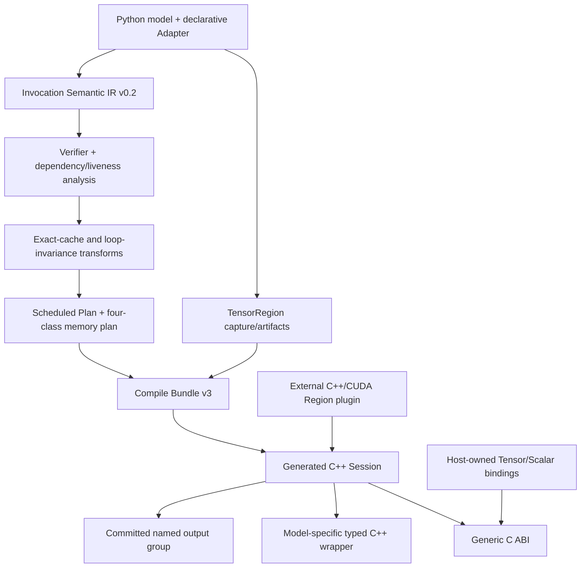

# VLAForge v0.2 开发计划：Stateful Invocation 到无 Python C++ 部署

> 状态：当前权威实施计划
> 更新时间：2026-07-25
> 分支：`codex/vlaforge-paper-artifact`
> 硬件边界：Host/C++ 工作先完成；Orin 编译、真机性能和闭环验证后置

## 1. 目标与边界

VLAForge 是由机器人或自动驾驶底软调用的模型部署编译框架。它把一次
VLA invocation、跨调用模型状态、TensorRegion 和静态 I/O 契约编译为
高性能 C++ Session。

```text
底软准备并同步输入
  -> BindTensor / BindScalar
  -> Session::Run()
  -> ReadOutput / typed Outputs
  -> 底软决定发布、执行前缀、轨迹选择和安全处理
```

VLAForge 不负责：

- 传感器采集、时间同步、历史窗口组装；
- timer、sleep、rate control、deadline 或周期调度；
- 丢帧、ROS/Cyber topic、RPC 和底盘动作发布；
- 任意 Python、任意动态 task graph 或无界动态内存；
- 车辆功能安全层、轨迹仲裁或机器人闭环安全；
- 自研完整 Tensor compiler。

## 2. 总体架构



两层程序模型：

1. `TensorRegion` 表达可由 torch.export/AOTInductor、TensorRT、EdgeFM 或
   自定义 C++/CUDA backend 实现的纯 Tensor/Scalar 计算；
2. Invocation IR 表达 Region 之间真正需要跨调用理解的状态、有限循环、
   分支、缓存合法性和事务输出。

Semantic IR 是唯一公开语义。Scheduled Plan 是 lowering 产物，不再定义第二套
用户语义。

## 3. 核心 IR 设计

### 3.1 声明

```text
Module
  InputPort[]       static Tensor/Scalar, stable ID
  OutputPort[]      named output, stable ID, group
  StateSlot[]       authoritative cross-Run state
  TensorRegion[]    pure typed computation
  Invocation[]      passive bounded program
```

`InputPort` 支持：

- Tensor 或 Scalar/POD；
- required，或 optional + static default；
- static shape/dtype/layout/device/alignment；
- borrowed external ownership；
- optional fixed-shape extension port；
- bounded/ragged profile 的 `valid_count`/mask 关系；
- 调用时可选 `InputStamp(revision, timestamp_ns)`。

`InputRevision` 仅表示数据身份。相同 revision 可命中 exact cache；新 revision
必须失效；未提供 revision 时每次 Bind/Run 生成新的内部身份，禁止不安全跨
Run 复用。timestamp 只进入 metadata/trace，不做同步。

### 3.2 最小 operation 集合

```text
vla.input.read
vla.txn.begin
vla.state.read_latest
vla.snapshot.value
vla.invoke
vla.if
vla.for
vla.yield
vla.state.stage_write
vla.validate
vla.output.create
vla.output.group
vla.txn.commit / vla.txn.abort
vla.return
```

`vla.for` 必须静态有界，autoregressive KV、flow/diffusion sample 都用
loop-carried SSA。模型内部 routing 能保留在 Tensor graph 时留在 Region；
跨 artifact routing 才使用结构化 `if`/variant。

### 3.3 状态与事务

`StateSlot` 只保存不能静默丢弃的 authoritative state：

- action queue/cursor；
- previous action；
- recurrent hidden；
- 显式 RNG。

状态流固定为：

```text
read_latest -> immutable snapshot -> stage_write
            -> validate output group -> txn.commit
```

成功 commit 时，StateStore 为每个 staged slot 分配 `version + 1`，并与
validated named output group 原子可见。abort、Region failure 或 validation
failure 均不增加 version，也不覆盖上一 committed output。

`ResetEpisode(new_episode)` 按 slot 声明 reset/carry state，并清空 committed
output 与 derived cache。episode reset 不是 clock transition。

### 3.4 Generic outputs

核心不硬编码 `action` 或 queue。一个 group 可包含：

- robot action/action chunk；
- trajectory；
- K 条 candidate trajectories 与 scores；
- agent/map prediction、detection、VQA token 等辅助输出。

底软读取 committed output 后自行执行或发布。

### 3.5 四类内存

| 类别 | 生命周期 | 可失效/重算 | 例子 |
|---|---|---:|---|
| External input/output | host contract / committed result | 按 host 契约 | camera、ego、trajectory |
| Per-Run arena | 一次 Run | 是 | activation、loop carry、workspace |
| Authoritative state | 跨 Run | 否 | queue/cursor、hidden、RNG |
| Derived cache | key 有效期间 | 是 | VLM prefix、condition、DiT feature |

Plan memory lowering 只能在 liveness、size 和 alignment 证明后复用 per-Run
buffer。persistent state 与 derived cache 不得伪装成普通 temporary。

### 3.6 Exact cache

```text
key = (
  model_identity,
  artifact_identity,
  region_identity,
  episode,
  transitive InputRevision...,
  transitive StateSnapshot.version...
)
```

exact memoization 必须具有完整 provenance。近似 DiT feature/residual reuse
将来使用显式 `ReuseGuard`，不能冒充 exact cache。

## 4. C++ 部署边界

### 4.1 Generic C ABI

ABI v2 提供稳定入口：

```c
bind_tensor(session, input_id, BoundTensor, InputStamp*)
bind_scalar(session, input_id, ScalarValue, InputStamp*)
run(session)
read_output_tensor(session, output_id, ...)
read_output_scalar(session, output_id, ...)
reset_episode(session, new_episode)
```

输入使用 push binding。CPU/CUDA 外部内存默认
`borrowed-until-Run-returns`，Session 不 retain、free 或回调拉取。匹配
device/layout/alignment 时允许 zero-copy；不匹配时必须由显式
copy/preprocess Region 处理或返回 contract error。

### 4.2 Typed wrapper

每个 bundle 生成：

```cpp
enum class InputId : std::uint32_t { ... };
enum class OutputId : std::uint32_t { ... };
struct ModelInputs { ... };
struct ModelOutputs { ... };
class ModelSession {
 public:
  Status Run(const ModelInputs&, ModelOutputs*);
};
```

input/output schema、稳定 ID 与 `io_schema_digest` 同时写入源码和 bundle。
创建/运行时 schema digest 不匹配必须失败，避免模型升级后的静默错绑。

### 4.3 外部 Region 扩展

`RegionExecutable` ABI v2 接受静态 Tensor/Scalar value，不接受 protobuf、
ROS/Cyber message、`std::any` 或任意宿主对象。客户可以接入：

- NV12/RGB、resize/normalize；
- 点云、BEV、agent/map encoder；
- CAN packing；
- 自定义 postprocess/validator；
- TensorRT、AOTI、EdgeFM 或私有 artifact provider。

未知输入不能在已编译 bundle 中动态增加。新增普通输入需改 Adapter 并重新
编译；预留扩展端口必须在编译期声明。

## 5. 扩展原则

优先级从低成本到高成本：

1. 新增 Adapter 或复用 template；
2. 新增 TensorRegion/backend/artifact；
3. 新增静态 I/O、validator、output group、cache guard 或 variant；
4. 只有新的跨 artifact 控制/状态语义才扩 core opcode。

extension op 必须同时提供 schema/type verifier、reference semantics、
Plan lowering、codegen/runtime、serialization version 和测试。禁止模型名
opcode 或任意未验证 opcode。

共享 Adapter templates：

- `StatelessTrajectory`
- `ChunkedAction`
- `AutoregressiveTrajectory`
- `DiffusionPlanner`
- `HybridVLMPlanner`
- `MultiTaskDriving`

## 6. 代码模块

| 模块 | 职责 |
|---|---|
| `python/vlaforge/ir/{program,types,ops,serializer}.py` | v0.2 声明、类型、op、canonical schema |
| `python/vlaforge/analysis/` | verifier、dependency、liveness |
| `python/vlaforge/interpreter/` | Reference semantics、input revision、cache、state/txn/trace |
| `python/vlaforge/transforms/` | exact cache、loop invariance、canonicalization |
| `python/vlaforge/plan/` | lowering、executor、四类 memory plan |
| `python/vlaforge/frontend/` | Region capture、artifact manifest、state lifting |
| `python/vlaforge/deployment/` | I/O contract、Bundle v3、clean build |
| `python/vlaforge/codegen/` | generated Session、C ABI、typed wrapper、fixtures |
| `include/vlaforge/runtime/` + `runtime/` | C/C++ ABI、StateStore、Transaction、Region plugin |
| `python/vlaforge/adapters/` | 机器人/驾驶模型 Adapter 与 source contract |
| `tests/` | Semantic/Plan/C++ parity、negative contracts、model matrix |

## 7. 模型覆盖与证据纪律

证据分为：

- L0：真实 upstream source/paper contract；
- L1：deterministic executable fixture；
- L2：真实 checkpoint eager/frontend capture parity；
- L3：真实 compiled artifact parity；
- L4：真实 checkpoint 的 generated no-Python C++ Session parity。

`fixture-L4` 只表示 fixture 走通 generated C++，绝不能写成真实模型 L4。
详细状态见 [model_cards/README.md](./model_cards/README.md)。

当前覆盖的机器人范式：

- RT-1-like history/mask + discrete token/detokenize；
- OpenVLA-like bounded autoregressive action token；
- ACT-like Adapter-owned queue/cursor；
- Octo-like optional modality + diffusion action chunk；
- π0/SmolVLA-like prefix + flow loop + continuous chunk；
- GR00T-like multi-camera/multi-embodiment + DiT。

当前覆盖的驾驶范式：

- multi-camera/ego/route stateless trajectory；
- AutoVLA-like AR token + fast/slow branch；
- DiffusionDrive-like two-step denoise + K candidates + score；
- ReCogDrive/DriveVLM-Dual-like external BEV features + multi outputs；
- UniDriveVLA/OpenDriveVLA-like multitask/multi-expert structure。

所有现有 fixture 的新增 core op 数目标和当前结果均为 0。

## 8. 分阶段实施状态

| 阶段 | 交付 | 当前状态 |
|---|---|---|
| P0 | v0.2 架构决策、旧→新 migration map | 完成 |
| P1 | Python IR/parser/serializer/verifier | 完成 |
| P2 | input revision、state/transaction、Reference Interpreter | 完成 |
| P3 | Scheduled Plan、memory lowering、Semantic/Plan parity | 完成 |
| P4 | C++ Session、StateStore、Transaction、C ABI v2 | 完成 |
| P5 | typed wrapper、schema digest、negative input contracts | 完成 |
| P6 | Region plugin ABI v2、clean no-Python build/run | 完成 |
| P7 | robot/driving executable fixtures、fixture C++ parity | 完成 |
| P8 | pinned upstream source audit、Model Adaptation Cards | 完成 |
| P9 | 收敛唯一 production surface，完整回归和报告冻结 | 完成 |
| P10 | 真实 OpenVLA/SmolVLA/DiffusionDrive 等 L2–L4 | SmolVLA、DiffusionDrive 真实 Host-CUDA L4 已完成；OpenVLA 真实 L3 已完成，L4 的 clean bundle/C++ build 通过但执行受 AOTI package loader 资源行为阻塞 |
| P11 | Host CUDA 性能、消融、长稳 | 完成：两真实 L4 模型的 eager/direct/generated 对照、revision/cache 消融、10k Run soak、NSYS/NCU |
| P12 | frozen-core held-out robot/driving 泛化 | 完成：Octo、GR00T N1.7、AutoVLA pinned-source L0 + executable L1，core op delta=0 |
| P13 | JetPack arm64 portability、真机 latency/power/closed-loop | standalone runtime 与 generated Session 已通过；真机待执行 |

## 9. 测试与验收

Host release gate：

1. Session 无 timer/sleep/rate control，外部可连续 Run；
2. required/optional/default，Tensor+Scalar bind；
3. schema digest、unknown ID、shape/dtype/device/layout/alignment 负例；
4. borrowed binding 在 Run 返回后消费，Session 不释放 host 内存；
5. same revision hit、new/missing revision miss；
6. successful commit state version `+1`；
7. abort/backend/validation failure version 不变；
8. episode reset 清 state/output/cache；
9. SmolVLA/ACT queue 跨 Run consume/refill；
10. driving trajectory/candidate/score/aux output group；
11. external C++ Region ABI；
12. typed wrapper 与 generic C ABI 等价；
13. Semantic IR、Plan、generated C++ output/state/trace 等价；
14. invalid `PYTHONHOME/PYTHONPATH` 仍运行，`ldd` 无 Python；
15. 完整 Python tests 与 CTest 通过。

2026-07-25 当前结果：offline Python 199 passed/9 opt-in skipped；real
SmolVLA L4、DiffusionDrive L2/L3/L4 opt-in 均各 1 passed；clean C++ Release、CPU 7/7 CTest、CUDA/AOTI
8/8 CTest 与 install-export 均通过。RTX 3060
`sm_86` 上真实 AOTI
package 已通过 Compile Bundle、generated C++ Session、无效 Python 环境和
no-libpython 审计；该通用对象是 production-path audit Region，不是 real
VLA。另有真实 SmolVLA prefix/solver/trim 三个 package 通过 10 步数值 parity，
并已进入八 Region verified bundle：完整 action chunk direct AOTI/C++
bit-exact，152 次成功 Run、cache revision、CUDA state version、reset、typed/C
ABI 和 validation abort 均通过，证据升级到 real L4。
DiffusionDrive 官方 checkpoint 已严格加载并以五个 Region 完成真实 L2：
官方 forward 与 20 条 candidates、scores、selected trajectory 及三个 aux
outputs 全部 bit-exact，strict export/effect audit 全部通过，新增 core op 为 0。
其五个 `sm_86` AOTI packages 已通过真实 L3：exported program 对 eager
exact，artifact trajectory 最大误差 `7.84e-4`，重复执行 exact。
同一组 artifacts 已进入 verified bundle 和 generated no-Python C++ Session：
六个 named outputs 对 direct AOTI byte-exact，typed/generic ABI 等价，并覆盖
revision cache、reset、validation abort 与事务输出一致性，因此达到真实
Host-CUDA L4，新增 core op 仍为 0。
OpenVLA-7B 已将 logical prefill/decode/detokenize 细化为 36 个
backend-owned two-layer physical Regions，并完成真实 `sm_86` L3：
26.316 GiB artifacts 的逐 Region 最大 NRMSE 为 `0.02688469`，
integer/token 输出 exact；两次完整 pipeline 的 7 个 token bit-exact，
最终 action 相对 L2 reference 最大绝对误差 `1.13e-17`。固定 KV derived
cache 为 140.5 MiB，capture/audit 峰值 CUDA allocated 为
2.686/1.778 GiB，core op delta 仍为 0。OpenVLA L4 已成功生成 38 Region
clean-source verified bundle 和 no-Python runner；真实执行中，重复 AOTI
package load 留下 deleted wrapper mappings，runner 在 24.48GiB RSS、约
82GB package writes、系统盘余 29GiB 时按安全阈值终止。该 blocker 位于
backend package lifecycle，OpenVLA 不升级为 L4。

P11 已在 RTX 3060 `sm_86` 上完成。DiffusionDrive
eager/direct/generated-C++ mean 为 `19.361/16.168/16.304 ms`，
generated 对 direct 的额外开销为 `+0.84%`；SmolVLA 为
`112.912/45.131/45.194 ms`，额外开销为 `+0.14%`。这组对照明确把
AOTI 模型编译收益和 VLAForge whole-program orchestration 分开。
DiffusionDrive same-revision condition cache 获得 `5.533x`，new/missing
revision 均正确 miss。两模型 generated Session 均完成 10,000 连续 Run，
transaction abort 和 CUDA drift 均为 0，RSS drift 分别为 4/52 KiB。
NCU 还定位并消除了 loop-carried scalar 的隐式 aligned copy；该修复只改变
IR storage alignment，不修改任何模型 CUDA kernel。完整证据见
`doc/reports/vlaforge_real_v03/real_cuda_evidence.md`。

P12 将 `766e27b` 定义为 held-out 前 core freeze。Octo、GR00T N1.7 和
AutoVLA 的 Adapter、审计工具和测试落在 `e6f9608`，且 IR、compiler、
Plan、codegen、deployment、runtime 和 C++ headers 的 Git objects 与 freeze
逐路径一致，combined fingerprint 为
`cc2d1b63e2d6cbcd65935b37d69b5f18fae4d2d177c7026a69c6e78f5c80ae6d`。
三个对象都通过 pinned upstream Git-object source audit，以及 verified
compile 后 Semantic/Plan 的 output、state、完整 trace 等价；新增 core op
均为 0。该结果严格标为 L0+L1，不是 checkpoint/artifact/C++ real-model
证据。报告见 `doc/reports/vlaforge_heldout_v01/heldout_audit.md`。

最终 architecture/build-surface negative audit 也已固化为自动测试：
47 个 production source files 中不存在 tick/clock/deadline/period/jitter、
middleware、publish、internal sleep、core action queue 或 Python runtime
依赖。15 个 Semantic IR op 与冻结 v0.2 集合一致。VLAForge 的 3 个 CMake
文件声明 20 个 C/C++ sources，没有 `.cu/.cuh/.ptx`、越界 source/subdirectory
edge 或根 EdgeFM `src/operators` 依赖；可选 CUDA target 只通过
`CUDA::cudart` 执行外部 AOTI artifact。负例测试和论文分析工具中的旧符号
引用被单独列出，不属于 production surface。报告见
`doc/reports/vlaforge_architecture_v01/architecture_surface.md`。

论文 release gate 另要求：

- 至少一个 manipulation、一个 AR VLA、一个 diffusion/flow VLA 和一个
  driving planner 形成真实 L2/L3 证据；
- 核心主张至少由一个真实模型 L4 支撑，不能全部来自 fixture；
- 报告每模型 Adapter LOC、共享模板复用率、新增 core op 数；
- 报告 exact cache、LICM、static arena 的独立消融；
- 报告 output/state failure injection 和 trace fidelity；
- Host CUDA 与 Orin 结果分开，未跑真机不得写真机 claim。

## 10. 剩余开发顺序

1. 运行 Python/C++ clean build、install/export、bundle 和 no-Python
   release gate；
2. OpenVLA L4 的后续重试只在 backend/artifact provider 层实现稳定
   shared-library/cubin mapping 与 per-invocation CUDA weight residency 分离，
   不得扩 core IR，也不得阻塞 held-out；
3. Orin 环境就绪后执行模型专属 SM87 artifact 和真机验证；standalone
   runtime/generated Session 的 JetPack arm64 portability 已通过。

## 11. 风险控制

| 风险 | 处理 |
|---|---|
| IR 再次变成通用 runtime | 新 op admission rule；调度/同步/发布始终在 host |
| action queue 污染 core | 只存在于 ChunkedAction Adapter |
| cache 不安全 | 缺 revision 默认 miss；key 必须含完整 provenance |
| persistent state 被当 cache 丢弃 | 四类 memory verifier 与 failure tests |
| bundle 模型升级错绑 | stable ID + schema digest hard failure |
| fixture 被误报真实支持 | 模型卡 L0–L4 与 fixture-L4 分栏 |
| 真实模型依赖过重 | 先 source audit/L1，再按代表性选择少量模型做到 L2–L4 |
| Orin 阻塞研究代码 | Host/C++ release gate 与真机 evidence 分离 |
