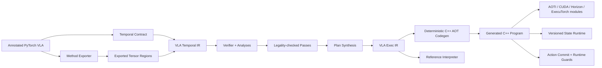

# VLAForge 论文研究方案：持续化状态 VLA 程序的时序编译与高性能边缘部署

> 文档状态：研究方案 v1
>
> 更新时间：2026-07-23
>
> 推荐方向：MLSys / 编译器与机器学习系统
>
> 推荐题目：**VLAForge: Contract-Guided Compilation of Stateful PyTorch VLA Programs**

## 0. 执行摘要

本文建议将研究主线从“Agent 自动优化 VLA”收缩并重构为：

> 将带有显式状态与时间契约的 PyTorch VLA 编译成高性能、可验证的 C++ 边缘执行程序。

核心判断如下。

1. VLA 不是单次调用的无状态 Tensor Graph，而是持续接收 observation、维护跨调用状态、迭代生成 action chunk、并以不同频率执行感知、推理与控制的反应式程序。
2. `torch.export`、AOTInductor、ExecuTorch 等工具能够很好地捕获和编译 Tensor 计算区域，但不能从样例输入自动恢复机器人控制频率、状态所有权、允许的 staleness、action commit 等部署语义。
3. vla.cpp、Embodied.cpp、RTC、VLASH、Reflex、ActionFlow、OxyGen 等工作已经分别覆盖了统一 C++ Runtime、多速率执行、异步 action chunk、cache、pipeline 和专用 VLA 优化；FlashRT 已把 coding agent、persistent-state IR 与自动部署连在一起；Execution-State Capsules 已覆盖执行状态快照、分叉与回滚。因此，“把这些功能组合起来”或单独实现 transaction 都不构成足够强的新颖性。
4. 最值得押注的新抽象是 **Temporal/Stateful VLA IR**：显式表达逻辑状态版本、epoch、clock domain、freshness、effect、loop-carried state 和 action commit。
5. 最值得押注的新机制是 **epoch-aware legality analysis 和 plan synthesis**：编译器能够自动判断 prefix cache、loop invariant hoisting、跨 tick pipeline 和 buffer reuse 是否安全。
6. C++ 部署代码必须由确定性编译器生成，而不是由 Agent 自由编写。Agent 最多作为受约束的搜索策略，在等预算实验中证明价值后再提升为论文贡献。

按当前相关工作格局，单纯实现一个带 JSON 属性的 VLA Runtime 不足以形成强论文；如果能够同时实现下列结果，则创新性足以支撑一篇较强的 MLSys 类论文：

- 有清晰语义和 verifier 的 Temporal VLA IR；
- 至少 3 个依赖 state/epoch 语义才能安全完成的自动优化；
- 从 PyTorch tensor methods 到无 Python C++ Runtime 的确定性 AOT lowering；
- 冻结 compiler/runtime 后，在 held-out VLA 上做到零核心 C++ 修改；
- 对 source 与 generated program 做 solver-state/action-trace 级差分验证。

## 1. 论文要回答的核心问题

### 1.1 现实问题

当前将一个新的 VLA 模型部署到机器人端，仍然经常是一次人工移植：

- 手工拆出 image encoder、VLM prefix、action expert 和 action decoder；
- 手工管理 prefix KV、robot history、solver state 和 action queue；
- 手工编写 flow/diffusion solver loop；
- 手工处理不同 observation rate、inference rate 和 control rate；
- 手工决定 cache 何时有效、state 何时失效；
- 手工安排 CUDA stream、event、buffer 和 CUDA Graph；
- 手工把 Python 数值结果与 C++ 逐层对齐。

这类工作难以迁移，也容易引入以下错误：

- 使用了错误 observation epoch 对应的 prefix；
- 下一帧 vision 写坏当前 action 仍在读取的 buffer；
- 在 flow loop 中错误复用依赖 timestep 的值；
- action chunk 在完成验证前已被控制线程消费；
- reference fallback 从已经被 optimized path 修改过的 state 继续运行；
- 平均延迟降低，但 staleness、jitter 或闭环成功率恶化。

### 1.2 为什么普通 Tensor Graph 不够

Tensor Graph 能表达：

- operator 和 tensor dataflow；
- shape、dtype、layout；
- 局部控制流；
- 单次 invocation 内的 buffer lifetime。

VLA 部署还需要表达：

- 跨 invocation 持续存在的状态；
- observation、solver、control tick、action chunk 等不同 epoch；
- 多个 clock domain 之间的 rate 和 phase；
- state version、freshness 和 invalidation；
- 异步任务对同一逻辑状态不同版本的访问；
- action 何时对外部物理系统可见；
- exact 与 approximate 优化的不同正确性契约。

因此，本论文不重新发明 Tensor IR，而是在 Tensor Region 之上增加一层 VLA Program IR。

### 1.3 论文假设

本文采用以下明确边界：

- 输入是 **annotated、export-compliant PyTorch VLA**，不是任意 Python 程序；
- tokenizer、PIL/OpenCV、机器人网络 I/O 等 host 逻辑可以留在边界 adapter；
- Tensor 计算拆成若干可导出的 method，例如：
  - `encode_observation`
  - `build_prefix`
  - `action_step`
  - `decode_action`
- 状态、clock、deadline、staleness 和 action contract 由轻量声明显式提供；
- 第一版主要支持固定或有界 flow/diffusion loop；
- deadline 默认是 soft real-time 约束；没有 WCET 与 schedulability analysis 时不声称 hard real-time。

## 2. 核心研究洞察

### 2.1 逻辑状态版本与物理存储必须分离

持续化状态最关键的设计不是“在 Runtime 里放一个 `unordered_map<string, Tensor>`”，而是区分：

1. **Logical State Version**
   - 例如 `prefix_kv@observation_epoch=17`；
   - 在高层 IR 中视为不可变值；
   - 用于 correctness、dependency、cache key 和 freshness 分析。
2. **Physical Storage Slot**
   - 例如 GPU arena 中第 0/1 个 prefix KV slot；
   - 在 lowering 后由双缓冲或 ring buffer 承载；
   - 可以被复用，但必须保证旧版本的所有异步消费者已经完成。

高层 IR 可以写成：

```text
prefix_kv<17> = build_prefix(image<17>, language, robot_state<17>)
actions<17>   = solve(prefix_kv<17>, noise<17>)
prefix_kv<18> = build_prefix(image<18>, language, robot_state<18>)
```

物理化后可能得到：

```text
prefix_slot[17 mod 2] = prefix_kv<17>
prefix_slot[18 mod 2] = prefix_kv<18>
```

编译器根据 live epoch 数、异步 schedule 和 retention 自动推导 ring size，而不是由模型 adapter 手写。

### 2.2 Cache 的正确 key 是 state-version signature

一个 region 是否能复用，不应只依赖 shape 或函数名，而应依赖它读取的逻辑状态版本：

```text
cache_key(region) =
    (method_hash,
     shape_profile,
     versions_of_all_read_states,
     exact_or_approx_contract)
```

如果 `build_prefix` 只读取 `image@e`、`language@session` 和 `robot_state@e`，那么同一 observation epoch 内的多个 solver step 可以安全复用其输出。

如果 time embedding 或 normalization 读取了 `solver_step@k`，则不能错误地跨 step cache。

### 2.3 Action commit 是 VLA 程序语义的一部分

传统模型 Runtime 把 output tensor 返回视为结束；VLA 的 action 会影响真实环境，因此需要显式：

```text
prepare action
validate action/state trace
commit action
```

只有 commit 之后，action 才允许进入控制队列。这样才能定义：

- optimized path 失败时是否能回退；
- state 更新何时成为 authoritative；
- shadow execution 比较的对象；
- 当前 action 与下一 observation 的因果关系。

### 2.4 编译器优化的是时序执行计划，而不只是 kernel

VLA 的主要优化机会可能来自：

- observation-scope prefix cache；
- solver-loop invariant hoisting；
- 不同 clock domain 的 pipeline；
- state-version-aware buffer reuse；
- action generation 与当前 action execution overlap；
- shape/step/horizon specialization；
- CUDA Graph 和后端 placement。

这些优化的合法性依赖 VLA Program 的状态与时序语义，而不是单个 kernel 的 tile 参数。

## 3. 论文定位与推荐标题

### 3.1 推荐的一句话定位

> We compile annotated PyTorch VLA policies into temporally scheduled edge programs and optimize them using state-, epoch-, and freshness-aware transformations whose legality is checked against state-action trace contracts.

### 3.2 推荐题目

首选：

> **VLAForge: Contract-Guided Compilation of Stateful PyTorch VLA Programs**

备选：

> **VLAForge: Temporal Compilation for Stateful Vision-Language-Action Policies**

如果最后实时调度结果特别强：

> **VLAForge: Compiling Stateful VLA Programs for Real-Time Edge Execution**

当前不建议使用：

- `Agentic`：除非 Agent 在 equal-budget 下明确优于非 LLM optimizer；
- `Verified`：除非实现机器可检查的 translation validation/refinement，而不只是测试样本；
- `Automatic Compilation of Arbitrary Python VLA`：实际系统需要 export contract 和显式 temporal annotation。

### 3.3 适合的 venue

| Venue | 适合条件 | 风险 |
| --- | --- | --- |
| MLSys | 新 IR、compiler/runtime co-design、多模型硬件实验 | 最匹配当前方案 |
| CGO | IR 语义、legality analysis、lowering 和 codegen 足够深入 | 仅做系统集成不够 |
| ASPLOS | 有强 cross-hardware scheduling/memory/runtime insight | 需要超出单一 VLA workload |
| RTAS | 有 WCET、schedulability、deadline guarantee | p99 latency 不等于 hard real-time |
| RSS/CoRL | 真机控制收益最强，编译机制相对较浅 | 需要强闭环任务结果 |
| PLDI | 有形式语义和 transformation correctness | 工程实现强但形式化弱时不适合 |

## 4. 系统总览



推荐前端 API：

```python
spec = vlaforge.ProgramSpec(
    methods={
        "encode_observation": EncodeWrapper(policy),
        "build_prefix": PrefixWrapper(policy),
        "action_step": ActionStepWrapper(policy),
        "decode_action": DecodeActionWrapper(policy),
    },
    states=[
        StateSpec(
            name="prefix_kv",
            dtype="bf16",
            shape=...,
            scope="observation",
            epoch_domain="observation",
            retention=2,
        ),
        StateSpec(
            name="solver_state",
            dtype="fp32",
            shape=...,
            scope="solver_iteration",
            epoch_domain="solver",
        ),
    ],
    clocks=[
        ClockSpec(name="observation", period_ms=100),
        ClockSpec(name="control", period_ms=20),
    ],
    action=ActionContract(
        horizon=50,
        units="normalized_joint_position",
        commit_deadline_ms=80,
    ),
)

bundle = vlaforge.compile(
    spec,
    representative_episodes=episodes,
    target="jetson-orin",
    backend="aoti-cuda",
)
```

## 5. 推荐的三项论文贡献

### 5.1 Contribution 1：Temporal VLA IR

#### 5.1.1 IR 组成

一个 VLA Program 可以抽象为：

$$
P = (R, S, C, E, A, K)
$$

其中：

- $R$：Tensor/Host Regions；
- $S$：persistent states；
- $C$：clock domains；
- $E$：dependency、effect 和 event edges；
- $A$：action contract 和 commit semantics；
- $K$：exact/approximate validation contracts。

每个 state 定义为：

$$
s = (\tau, d, q, r, o, i)
$$

其中：

- $\tau$：tensor/structured type；
- $d$：epoch domain；
- $q$：scope；
- $r$：retention policy；
- $o$：ownership/consistency；
- $i$：initialization/invalidation rule。

#### 5.1.2 推荐 IR 元素

```text
vla.program
vla.clock
vla.state
vla.input
vla.read
vla.write
vla.call
vla.for
vla.async
vla.await
vla.guard
vla.commit
vla.yield
```

推荐类型：

```text
!vla.epoch<observation>
!vla.version<@prefix_kv>
!vla.state_handle<tensor<...>>
!vla.event
!vla.action_chunk<50x32xf32>
```

#### 5.1.3 示例 IR

```mlir
vla.program @smolvla {
  vla.clock @observation period<100ms>
  vla.clock @control     period<20ms>

  vla.state @prefix_kv
      : tensor<16x2x128x5x64xbf16>
      scope<observation>
      epoch<@observation>
      retention<2>

  vla.state @action_queue
      : !vla.action_chunk<50x32xf32>
      scope<control_tick>
      epoch<@observation>

  vla.on @observation(%obs_epoch: !vla.epoch<observation>) {
    %image = vla.input @camera at %obs_epoch
    %robot = vla.input @robot_state at %obs_epoch

    %prefix = vla.call @build_prefix(%image, %robot)
        reads[@language]
        writes[@prefix_kv at %obs_epoch]
        contract<exact>

    vla.write @prefix_kv[%obs_epoch], %prefix

    %done = vla.async {
      %x0 = vla.call @sample_noise(%obs_epoch)

      %xf = vla.for %k = 0 to 10
          iter_args(%x = %x0) -> tensor<1x50x32xf32> {
        %p = vla.read @prefix_kv[%obs_epoch]
            freshness<0 epochs>
        %v = vla.call @action_step(%p, %x, %k)
            reads[@prefix_kv at %obs_epoch]
            contract<numeric atol=1e-4 rtol=1e-3>
        %next = vla.call @euler_update(%x, %v, %k)
        vla.yield %next
      }

      %chunk = vla.call @decode_action(%xf)
      vla.commit @action_queue[%obs_epoch], %chunk
          before<80ms>
    }

    vla.yield %done
  }
}
```

#### 5.1.4 IR 必须支持的静态分析

1. **State well-formedness**
   - state 是否初始化；
   - 每个 version 是否有唯一 producer；
   - read/write type 是否一致。
2. **Epoch consistency**
   - region 是否读取了错误 observation epoch；
   - state version 是否仍在 retention 范围内。
3. **Freshness analysis**
   - action 是否使用了超过约束的旧 observation；
   - rate crossing 是否显式声明 hold/sample/interpolate。
4. **Effect and race analysis**
   - async regions 是否对同一 state version 产生冲突；
   - buffer alias 是否会覆盖仍在使用的版本。
5. **Loop-carried state verification**
   - loop 的输入输出类型和 version 演化是否一致；
   - RNG 是否作为显式 state token 参与。
6. **Action commit verification**
   - 每条成功路径是否 exactly-once commit；
   - commit 前是否完成要求的 validator；
   - failure path 是否保持 authoritative state 不变。
7. **Deadline feasibility**
   - 基于 profile 的 estimated schedule 是否满足 soft deadline；
   - 无法证明时生成诊断，而不是静默部署。

#### 5.1.5 IR 的新颖性来自哪里

以下元素单独看均不是新概念：

- ONNX/MLIR 已有 loop-carried state；
- MLIR Async/IREE Stream 已有 async execution 和 resource lifetime；
- SDF、Giotto、Lingua Franca 已有 multi-rate、logical time 和 deadline；
- MLIR `ml_program` 已有 mutable global。

本工作的差异应明确落在：

- exported tensor regions 与 VLA-specific temporal semantics 的统一；
- typed epoch/state version；
- action chunk 与 commit semantics；
- 由这些语义驱动的 cache、pipeline、memory 和 fallback legality analysis；
- 自动 lowering 到固定 C++ Runtime。

如果 IR 只是 JSON 字段集合而没有 verifier、analysis 和 IR-dependent pass，这一贡献不足以成立。

### 5.2 Contribution 2：Contract-guided Plan Synthesis

#### 5.2.1 优化问题

给定：

- VLA Program IR；
- target hardware resources；
- method/operator latency profile；
- shape buckets；
- memory capacity；
- freshness 和 deadline contract；

编译器生成：

- region placement；
- cache/hoist 决策；
- stream/event schedule；
- state physicalization；
- buffer allocation；
- graph capture boundary；
- backend/kernel implementation。

一个可实现的目标函数为：

$$
\min_{\pi}
\quad
L_{p99}(\pi)
+ \lambda_m M_{\mathrm{peak}}(\pi)
+ \lambda_s A_{\mathrm{stale}}(\pi)
+ \lambda_c C_{\mathrm{compile}}(\pi)
$$

约束包括：

$$
\begin{aligned}
&\text{dependency and effect legality}, \\
&\text{state version and freshness legality}, \\
&M_{\mathrm{peak}}(\pi) \le M_{\mathrm{device}}, \\
&T_{\mathrm{commit}}(\pi) \le D_{\mathrm{soft}}, \\
&\text{backend and shape compatibility}.
\end{aligned}
$$

#### 5.2.2 必须实现的 IR-driven passes

1. **State Functionalization**
   - 将隐式 mutable state 转换为显式 versioned read/write。
2. **State Dependency Inference**
   - 计算每个 region 的 read/write version signature。
3. **Observation-scope Cache Materialization**
   - 根据 signature 自动生成 prefix/cache state。
4. **Epoch-aware Loop Invariant Code Motion**
   - 只将不依赖 solver epoch 的 region 移出 flow loop。
5. **State Physicalization**
   - 根据 live epoch 和异步消费者推导 double/ring buffer 数量。
6. **Async Pipeline Synthesis**
   - overlap next observation 与 current action，但保持 state version 隔离。
7. **Cross-region Buffer Reuse**
   - 结合 event completion 与 lifetime 做 arena packing。
8. **Shape/Step/Horizon Specialization**
   - 为常见 solver steps、action horizon 和 input size 生成静态 variant。
9. **CUDA Graph Region Formation**
   - 选择 address、shape、control flow 稳定的 region 做 capture。
10. **Backend Partition and Kernel Selection**
    - 将 Tensor Region 交给 AOTInductor、CUDA/CUTLASS、Horizon 或 ExecuTorch。

#### 5.2.3 三个最能证明 IR 必要性的案例

论文至少需要三个“没有 Temporal IR 就无法安全自动完成”的案例。

#### 案例 A：Prefix cache

编译器证明 `build_prefix` 的 read set 在 observation epoch 内保持不变，因此把它从 solver loop 中移出，并将结果 physicalize 为 observation-scoped state。

#### 案例 B：异步 vision/action pipeline

编译器让 `encode(image[e+1])` 与 `solve(prefix[e])` overlap，同时自动选择双缓冲，保证下一 epoch 不覆盖当前 solver 仍在读取的 prefix。

#### 案例 C：Action commit 与 fallback

optimized plan 写入 tentative state/action slot；只有 trace guard 通过后才原子提交。失败时 reference plan 从同一 snapshot 重新执行。

#### 5.2.4 Agent 的正确位置

第一版 optimizer 应先实现：

- deterministic rules；
- profile-guided greedy；
- beam search；
- CP-SAT/ILP 或 TPE/BO baseline。

Agent 只能：

- 在 typed transformation space 中提出候选；
- 选择 pass sequence；
- 根据 profile 检索历史 plan；
- 生成参数建议。

Agent 不能：

- 绕过 verifier；
- 自行批准部署；
- 直接修改 Runtime ABI；
- 在没有 reference 和 contract 的情况下生成自由 C++/CUDA。

只有当 Agent 在相同 candidate 数、编译次数、GPU-hours 和 wall time 下显著优于非 LLM optimizer，才把它提升为正式贡献。

### 5.3 Contribution 3：AOT C++ Lowering 与 State-action Trace Validation

#### 5.3.1 双执行形态

建议同时实现：

1. **Reference Interpreter**
   - 解释执行高层 VLA IR；
   - 用于开发、debug、trace 和 differential test；
   - 不作为最终性能路径。
2. **Generated C++ Program**
   - 从 lowered VLA Exec IR 确定性生成；
   - 静态 method id、buffer offset、loop count、stream/event；
   - 热路径无 JSON、字符串查找和动态内存分配。

#### 5.3.2 Tensor Region lowering

第一版推荐：

- `torch.export` 捕获 Tensor Region；
- AOTInductor 将 region 编译为 `.pt2`/共享库；
- generated C++ 通过固定 ABI 调用；
- 性能关键 motif 可由 CUDA/CUTLASS backend 覆盖；
- ExecuTorch 作为可选 portable backend，而不是高层 VLA 语义的 owner。

AOTInductor 已经能够将 `ExportedProgram` 编译为非 Python 环境可加载的共享库，因此本工作的贡献不是重新实现 Tensor codegen，而是把多个 tensor methods、persistent state、loop 和 schedule 编译为一个持续运行的 C++ program。

#### 5.3.3 Trace 定义

source 与 target 的对比轨迹定义为：

$$
\tau =
\langle
e_{\mathrm{obs}},
s_{\mathrm{in}},
r_0,\ldots,r_n,
s_{\mathrm{solver}}^0,\ldots,s_{\mathrm{solver}}^K,
a_{\mathrm{chunk}},
t_{\mathrm{commit}},
s_{\mathrm{out}}
\rangle
$$

其中：

- $e_{\mathrm{obs}}$：observation epoch；
- $s_{\mathrm{in/out}}$：入口/出口 persistent state；
- $r_i$：关键 Tensor Region 输出；
- $s_{\mathrm{solver}}^k$：第 $k$ 个 solver state；
- $a_{\mathrm{chunk}}$：最终 action chunk；
- $t_{\mathrm{commit}}$：action commit 逻辑/物理时刻。

验证分为：

| Contract | 可接受证据 | 可使用表述 |
| --- | --- | --- |
| exact | formal rewrite rule、symbolic check 或逐元素确定性等价 | translation-validated |
| numeric | 明确输入域、atol/rtol/ULP、逐 solver/action bound | numerically conformant |
| empirical | 代表数据、覆盖说明、最大观测误差 | empirically validated |

没有机器可检查证明时，部署包应称：

- `Validation Evidence Manifest`；
- `Conformance Bundle`；
- `Trace-Validated Bundle`。

不建议称 `Proof Certificate`。

#### 5.3.4 Transactional action commit

```text
snapshot(pre_state)
    ├── optimized plan
    │       ├── validate pass → commit state/action
    │       └── validate fail
    └────────────────────────→ reference plan from pre_state
                                     └── commit
```

该机制保证的是：

- optimized implementation 不会静默污染 authoritative state；
- fallback 从同一个 source state 开始；
- action 在检查完成前不会被控制线程消费。

它不保证 policy 本身安全，也不保证 reference plan 一定满足 deadline。论文必须测量 fallback 的内存和延迟成本。

### 5.4 核心实验证据：Frozen Compiler Held-out Onboarding

“自动接入”不单列为第四种机制，而作为前三项贡献的综合证据。

推荐 protocol：

1. 使用 Model A 和 Model B 开发 IR、compiler、passes、Runtime；
2. 冻结：
   - IR schema；
   - core Runtime；
   - backend ABI；
   - optimization library；
   - validator；
3. 再选择来自独立代码库的 held-out Model C；
4. 允许：
   - 声明式 temporal contract；
   - export wrapper；
   - decomposition；
   - 新编译产物；
5. 不允许：
   - 修改 core scheduler；
   - 增加 model-specific C++ branch；
   - 修改 state/action ABI；
   - 手写新的模型执行 loop。

必须报告：

- core C++ LOC delta；
- Python wrapper/annotation LOC；
- checkpoint conversion LOC；
- unsupported op 数量；
- custom kernel 数量；
- time-to-first-correct；
- time-to-target-performance；
- 全部人工决策记录。

## 6. 论文写作结构

### 6.1 Abstract 写法

Abstract 建议严格采用五段逻辑，不在摘要中堆功能。

1. **Problem**
   - VLA edge deployment remains a model-specific manual port because tensor compilers do not capture persistent state and temporal control semantics.
2. **Insight**
   - A VLA should be compiled as a versioned, multi-rate reactive program rather than a collection of independent tensor graphs.
3. **Approach**
   - Introduce Temporal VLA IR and analyses for epoch-versioned state, freshness, loops and action commit.
4. **System**
   - Lower tensor regions through existing AOT backends and deterministically generate a static C++ execution program.
5. **Results**
   - 填入真实结果：模型数、held-out C++ LOC、端到端加速、内存、deadline miss、trace fidelity。

摘要结果句模板：

> Across [N] independently implemented VLA policies and [M] edge platforms, VLAForge compiles a held-out policy without changes to the core C++ runtime, improves [metric] by [measured value], and preserves solver-state/action traces within [measured contract].

在实验完成前保留占位符，不能提前写数字。

### 6.2 Introduction 的六段逻辑

#### 第 1 段：场景与痛点

说明 VLA 已从离线模型进入持续运行的机器人控制系统，但部署仍被 Python stack、模型专用 Runtime 和高延迟阻碍。

#### 第 2 段：为什么现有编译器不够

说明 Tensor compiler 处理 invocation 内的 graph，而 VLA correctness 依赖 invocation 之间的 state、rate、freshness、loop 和 action visibility。

#### 第 3 段：为什么现有 VLA Runtime 不够

承认 vla.cpp、Embodied.cpp、RTC、VLASH、Reflex 等已经证明 C++ Runtime、cache 和 async execution 的价值；指出它们主要依赖手工 canonical flow、plugin 或专用 schedule。

#### 第 4 段：核心洞察

提出 logical state version 与 physical storage 分离，并把 VLA 编译成 epoch-indexed temporal program。

#### 第 5 段：系统概览

一句话描述 front-end、IR、analysis、plan synthesis、AOT C++ codegen 和 trace validation。

#### 第 6 段：贡献

只列三项：

1. Temporal VLA IR；
2. legality-checked plan synthesis；
3. deterministic AOT lowering + state-action trace validation。

held-out onboarding 写成结果，不作为第四个抽象。

### 6.3 正文章节建议

| Section | 内容 | 关键问题 |
| --- | --- | --- |
| 1 Introduction | gap、insight、system、contributions | 为什么必须有新 compiler layer |
| 2 Background and Motivation | VLA execution、PyTorch export、三个 failure/optimization case | 普通 graph 为什么不够 |
| 3 VLAForge Overview | end-to-end pipeline 和 design goals | 系统边界是什么 |
| 4 Temporal VLA IR | syntax、state version、clock、effect、commit、semantics | 新抽象是什么 |
| 5 Analyses and Plan Synthesis | verifier、cache、LICM、pipeline、physicalization | 新机制如何工作 |
| 6 AOT Lowering and Runtime | tensor backend、C++ codegen、arena、event、bundle | 如何生成高性能代码 |
| 7 Trace Validation | source/target trace、transaction、fault detection | 如何建立可信部署 |
| 8 Implementation | PyTorch/MLIR/C++/CUDA 实现规模 | 系统是否真实可用 |
| 9 Evaluation | RQ、baseline、结果、消融 | claim 是否被证实 |
| 10 Related Work | compiler、runtime、reactive systems、validation | 与先例差异 |
| 11 Limitations | annotation、dynamic control、hard RT、安全边界 | 不夸大能力 |
| 12 Conclusion | 收口主线 | 不重复 feature list |

### 6.4 必需图表

#### Figures

1. **Fig. 1：Manual port vs VLAForge**
   - Python VLA 到多个 model-specific C++ Runtime；
   - 对比一个 compiler + fixed runtime。
2. **Fig. 2：Temporal VLA IR**
   - observation/solver/control 三个 clock/epoch；
   - state version 和 action commit。
3. **Fig. 3：Compiler pipeline**
   - export、IR、analyses、plan、codegen、bundle。
4. **Fig. 4：Epoch-aware pipeline timeline**
   - `vision[e+1]` 与 `action[e]` overlap；
   - 双缓冲与 event。
5. **Fig. 5：Generated C++ Runtime**
   - state arena、method modules、streams、validator、action queue。
6. **Fig. 6：Held-out onboarding protocol**
   - freeze point 和允许/禁止修改的边界。

#### Tables

1. 模型 action-generation family 与 temporal features；
2. 相关工作 capability matrix；
3. 自动接入 LOC/时间/unsupported ops；
4. 端到端 latency、jitter、deadline miss、memory、energy；
5. 各 compiler pass 的收益和合法性条件；
6. Agent 与非 LLM optimizer 的 equal-budget 对比；
7. fault injection 检测率和运行时开销；
8. closed-loop paired success/non-inferiority。

## 7. Evaluation 设计

### 7.1 Research Questions

#### RQ1：IR 是否足够表达不同 VLA？

- 至少三个独立 PyTorch codebase；
- 至少两类 action generation：
  - flow/diffusion；
  - autoregressive/discrete 或另一种独立 continuous head；
- 报告 IR op 使用情况和 model-specific escape hatch。

#### RQ2：能否真正自动生成 C++ 部署？

- frozen compiler/runtime 下接入 held-out model；
- 核心 C++ LOC delta；
- annotation/wrapper/decomposition LOC；
- export coverage；
- time-to-first-correct。

#### RQ3：IR-driven 优化是否提高端到端性能？

- whole-pipeline first-action latency；
- steady-state action frequency；
- p50/p95/p99/max；
- jitter、deadline miss；
- peak RSS/VRAM；
- energy/action；
- compile/tuning time。

#### RQ4：Temporal IR 是否必要？

关键 baseline：

- `ExportedProgram + hand-written host loop`；
- FX pattern + attributes；
- VLA IR without epoch typing；
- VLA IR without freshness；
- VLA IR without action commit；
- full VLAForge。

#### RQ5：优化是否保持状态与行为一致？

- 固定 RNG；
- 逐 solver-step state error；
- final action error；
- action chunk trace；
- closed-loop paired non-inferiority；
- state corruption、stale read、wrong cache、buffer race fault injection。

#### RQ6：Agent/skill transfer 是否必要？

仅在实现 Agent 后评测：

- rules；
- random；
- evolutionary；
- TPE/BO；
- profile-guided greedy；
- direct LLM；
- constrained Agent；
- constrained Agent + transfer memory。

所有方法固定：

- candidate 数；
- compile 次数；
- GPU-hours；
- wall time；
- 允许的 transformation space。

### 7.2 模型矩阵

推荐最低配置：

| 角色 | 模型选择原则 | 用途 |
| --- | --- | --- |
| Development A | 小型、易调试、flow loop 清晰，例如 SmolVLA | IR 和 reference path |
| Development B | 独立代码库、代表性 continuous action expert | 验证通用性 |
| Held-out C | freeze 后选择，不能与 B 共用 importer | 核心自动接入证据 |
| Optional D | 离散/AR action family | 泛化附录 |

不能把同一代码库或同一 importer 的两个 checkpoint 当成两个独立模型 family。

### 7.3 硬件矩阵

最低：

- 一台桌面 NVIDIA GPU：开发与强 PyTorch baseline；
- Jetson AGX Orin：主要 edge 结果。

可选：

- Orin Nano：footprint、长稳和低内存；
- Horizon J6M：cross-vendor；
- Thor：仅在工具链和 baseline 稳定时加入。

只使用 NVIDIA 两档设备时，应称 cross-tier，不应称 cross-platform。

### 7.4 Baselines

#### 编译/Runtime baseline

- PyTorch eager；
- `torch.compile`，固定配置并报告 CUDA Graph/max-autotune；
- AOTInductor；
- ExecuTorch multi-method + 手写 C++ outer loop；
- 手工实现的 model-specific C++ Runtime；
- 当前 EdgeFM VLA path；
- 模型与精度可对齐时比较 vla.cpp、Embodied.cpp。

#### 调度/优化 baseline

- synchronous execution；
- manual cache；
- manual async pipeline；
- RTC/VLASH 类 application scheduling；
- rule-based compiler；
- full plan synthesis。

#### 验证 baseline

- final-output allclose；
- ExecuTorch-style intermediate tensor debugging；
- state/action trace；
- state/action trace + transactional commit。

### 7.5 Metrics

#### 自动化

- export success rate；
- delegated/compiled operator coverage；
- core C++ LOC delta；
- Python adapter/annotation LOC；
- 人工决策次数；
- time-to-first-correct；
- time-to-target-performance。

#### 性能

- first-action latency；
- steady-state action latency/frequency；
- p50/p95/p99/max；
- jitter；
- deadline miss rate；
- stale observation age；
- peak host/device memory；
- bundle size；
- energy/action；
- compile time、search GPU-hours、Agent token/cost。

#### 语义

- region-level abs/rel/ULP error；
- solver-step state divergence；
- final action max error；
- action chunk trajectory error；
- closed-loop success 与置信区间；
- fixed-seed paired non-inferiority。

#### 验证

- fault detection rate；
- false acceptance rate；
- fault localization accuracy；
- validator overhead；
- rollback correctness；
- fallback latency/memory feasibility。

### 7.6 必要消融

1. 无 Temporal IR，仅 host loop；
2. 无 explicit state version；
3. 无 epoch/freshness；
4. 无 effect/race analysis；
5. 无 action commit；
6. 各 pass 单独开启；
7. 手工启用相同优化 vs compiler 自动发现；
8. 无 state physicalization，仅每版本独立分配；
9. rules/random/BO/evolution/Agent equal-budget；
10. final output vs solver trace validation；
11. 无 transaction 的 fallback；
12. cold search vs transferred skills。

## 8. 相关工作与差异

> 本节依据截至 2026-07-23 可检索的公开工作。正式投稿前需要再次更新。

### 8.1 PyTorch/Edge 编译器

#### torch.export 与 AOTInductor

[`torch.export`](https://docs.pytorch.org/docs/main/user_guide/torch_compiler/export/programming_model.html) 捕获规范化 Tensor Graph 和 shape constraints；[AOTInductor](https://docs.pytorch.org/docs/main/user_guide/torch_compiler/torch.compiler_aot_inductor.html) 能将 ExportedProgram 编译为非 Python C++ 环境可加载的 artifact。

差异：

- 它们处理 Tensor method；
- VLAForge 处理多个 method 之间的 persistent state、loop、clock、freshness 和 action commit；
- VLAForge 应复用其 Tensor codegen，而不是重新实现。

#### ExecuTorch

[ExecuTorch Model Export and Lowering](https://docs.pytorch.org/executorch/stable/using-executorch-export.html) 支持 multi-method、state-as-IO、mutable buffer 和 backend partition，但：

- dynamic loop 当前主要由 application code 驱动；
- mutable buffer 跨 method 不共享；
- method activation memory 独立规划；
- backend fallback 主要是编译期未 delegated 部分走 portable kernels。

差异：

- VLAForge 的 temporal layer 位于多个 exported methods 之上；
- 负责跨 method state、rate 和 memory；
- 运行时失败的 reference fallback 由 VLAForge 的事务机制处理。

### 8.2 通用状态、循环与时序 IR

| 工作 | 已有能力 | 对本论文的威胁 | VLAForge 差异 |
| --- | --- | --- | --- |
| [ONNX Loop](https://onnx.ai/onnx/operators/onnx__Loop.html) / [Scan](https://onnx.ai/onnx/operators/onnx__Scan.html) | loop-carried state、scan output | state/loop 不是新概念 | 跨 invocation epoch、clock、freshness、commit |
| [MLIR SCF](https://mlir.llvm.org/docs/Dialects/SCFDialect/) | structured loop/if | LoopRegion 本身不新 | VLA state/effect/time semantics |
| [MLIR Async](https://mlir.llvm.org/docs/Dialects/AsyncDialect/) | token、async value、await | async op 本身不新 | state-version-aware race/physicalization |
| [MLIR ml_program](https://mlir.llvm.org/docs/Dialects/MLProgramOps/) | mutable globals、ordering token | persistent global 不新 | typed epoch、freshness、action visibility |
| [IREE Stream](https://iree.dev/reference/mlir-dialects/Stream/) | async scheduling、resource lifetime、target affinity | 与 schedule/memory 高度重叠 | VLA source semantics 和 contract-driven lowering |
| [SDF](https://ptolemy.berkeley.edu/publications/papers/87/staticscheduling/) | multi-rate、static scheduling/buffer | multi-rate 不新 | dynamic tensor regions、state epochs、action commit |
| [Giotto](https://www.cs.uni-salzburg.at/~ck/content/publications/journals/ProcIEEE03-Giotto.pdf) | time-triggered control、logical execution time | deadline/time abstraction不新 | learned policy tensor compilation |
| [Lingua Franca](https://www.lf-lang.org/docs/next/writing-reactors/time-and-timers/) | stateful reactors、logical time、deadline | reactive Runtime 不新 | PyTorch VLA-specific state and optimization |

论文不能声称首次提出 state、loop、multi-rate 或 deadline IR。应声称：

> VLAForge connects exported tensor regions with VLA-specific epoch, freshness and action-commit semantics and uses them to legalize cross-invocation optimizations and AOT deployment.

### 8.3 VLA C++ Runtime

#### vla.cpp

[vla.cpp](https://arxiv.org/abs/2606.08094) 已提供：

- 统一 C++ Runtime；
- 7 种架构、5 类 backbone、4 类 action head；
- cached prefix；
- flow/diffusion solver；
- self-contained bundle；
- 多档硬件与真机实验。

直接威胁：

- “统一 C++ Runtime”“支持多模型”“prefix cache”“bundle”均不能单独作为本论文创新。

VLAForge 必须证明：

- 从 PyTorch/contract 自动生成；
- freeze 后 held-out model 零核心 C++ 修改；
- 优化由 IR analysis 自动判定，而非 hand-written canonical flow。

#### Embodied.cpp

[Embodied.cpp](https://arxiv.org/abs/2607.02501) 已覆盖：

- portable embodied C++ Runtime；
- multi-rate execution；
- input/sequence/backbone/head/deployment 分层；
- heterogeneous device/robot interface。

直接威胁：

- multi-rate embodied Runtime 已不是空白。

差异：

- VLAForge 是 compiler，而不是插件式 Runtime；
- 核心证据是自动 lowering 和 legality-checked schedule。

#### Execution-State Capsules

[Execution-State Capsules](https://arxiv.org/abs/2606.20537) 将设备上的完整活跃执行状态组织为具名 buffer，并提供 snapshot、restore、fork、rollback 以及与计算图绑定的提交边界，目标也包括 physical AI 场景。这个工作意味着“把状态保存下来并支持事务式回滚”本身不能作为主要创新点。

VLAForge 应把差异明确写成：

- Capsules 更接近 runtime checkpoint/restore 机制；VLAForge 定义的是源程序到部署代码全链路的、带类型的状态时序语义；
- VLAForge 的状态值带 `epoch/version/freshness/ownership`，并进入依赖分析、调度、内存规划和图缓存键；
- VLAForge 区分内部状态提交与不可逆动作提交，并自动生成确定性的 C++ 执行器；
- Capsules 类机制可以被 VLAForge 复用为 runtime 实现，而不是被包装成新的核心贡献。

### 8.4 VLA 调度、Cache 和 Streaming

| 工作 | 主要机制 | 与本方案重叠 | VLAForge 需要证明的差异 |
| --- | --- | --- | --- |
| [RTC](https://arxiv.org/abs/2506.07339) | 执行当前 chunk 时异步生成下一 chunk | action overlap | 从 temporal contract 自动合成并检查 |
| [VLASH](https://arxiv.org/abs/2512.01031) | future-state-aware async inference | staleness/future state | 通用 epoch/freshness IR 与多模型 lowering |
| [VLA-RAIL](https://arxiv.org/abs/2512.24673) | async linker、chunk smoothing/fusion | action queue/continuous control | compiler-generated Runtime 与 state semantics |
| [ActionFlow](https://arxiv.org/abs/2512.20276) | cross-request pipeline、state packed forward、KV ring | pipeline/ring buffer | 自动 state physicalization 和 legality |
| [OxyGen](https://arxiv.org/abs/2603.14371) | 跨 task/frame KV sharing、continuous batching | cache 和 multi-rate | 从 state-version signature 自动生成 |
| [Reflex](https://arxiv.org/abs/2607.14695) | timestep-invariant cache partition、async pipeline、fusion | loop invariant/cache/pipeline | 编译器识别并验证，而非模型专用设计 |
| [ActionCache](https://arxiv.org/abs/2607.06370) | 历史 action cache/warm start | approximate cache | exact/approx contract 和适用域 |
| [XPU Characterization](https://arxiv.org/abs/2604.24447) | DP-Cache、V-AE fusion、async pipeline | cache/fusion/placement | 自动跨 backend plan synthesis |

这些工作说明“实现一个 cache 或 pipeline”已经不足。VLAForge 的论文价值在于：

- 用统一 state/time IR 表达其合法性条件；
- 自动组合多个优化；
- 迁移到 held-out model；
- 生成 C++ plan 并验证 trace。

### 8.5 Agent 与 Kernel 优化

#### FlashRT

[FlashRT](https://arxiv.org/abs/2607.18171) 于 2026-07-20 提交，与原始“Agentic VLA Compiler”设想存在非常直接的重叠：

- coding agent 将参考实现提升为层次化 IR；
- IR 捕获 data dependency 和 persistent-state scope；
- sequential interpreter 验证 IR；
- static analysis 发现并行与 streaming 机会；
- Agent 继续实现、验证和 benchmark 多 GPU 部署。

这意味着以下宽泛主张已经不能安全使用：

- Agent 将 stateful multimodal reference program 转成 IR；
- Agent 根据 IR 自动发现 streaming/parallel deployment；
- interpreter + benchmark gate 保证 Agent 优化正确；
- Agent 自动生成高性能部署。

VLAForge 与 FlashRT 的差异必须落在：

- `torch.export` 驱动的确定性 tensor-region capture；
- VLA-specific observation/action/solver epoch；
- freshness、prediction/execution interval 和 action commit；
- logical state 到 bounded edge buffer 的确定性 physicalization；
- 生成固定 C++ edge program，而不是由 Agent 负责部署实现；
- Agent 是可替换 optimizer，而不是系统 correctness boundary。

#### EdgeFM

[EdgeFM](https://arxiv.org/abs/2604.27476) 已以 agent-tuned reusable skills 和跨硬件 edge inference 为主张。因此新论文不能再次把“Agent 优化 kernel”作为主要新颖性。

#### KernelAgent

[KernelAgent](https://pytorch.org/blog/kernelagent-hardware-guided-gpu-kernel-optimization-via-multi-agent-orchestration/) 已实现：

- profiling feedback；
- multi-agent parallel exploration；
- correctness gate；
- shared optimization memory；
- 与 `torch.compile` 的 kernel 性能比较。

VLAForge 的差异只能是：

- 搜索 temporal execution plan，而非单个 kernel；
- typed precondition/effect；
- state/freshness legality；
- equal-budget cross-model transfer。

如果 Agent 只选择人写好的 pass 参数，建议降为实现技术。

### 8.6 Translation Validation

相关先例：

- [Alive2](https://web.ist.utl.pt/nuno.lopes/pubs.php?id=alive2-pldi21)：LLVM optimization translation validation；
- [Translation Validation of Tensor Programming Languages](https://research.google/pubs/translation-validation-of-tensor-programming-languages/)：Halide refinement mapping 与 SMT；
- [SMT-Based Translation Validation for ML Compiler](https://link.springer.com/chapter/10.1007/978-3-031-13188-2_19)：MLIR transformation validation；
- [CoV](https://2026.cgo.org/details/cgo-2026-papers/17/Compiler-Runtime-Co-operative-Chain-of-Verification-for-LLM-Based-Code-Optimization)：compiler/runtime verification chain、symbolic check、runtime fallback；
- [ExecuTorch Developer Tools](https://docs.pytorch.org/executorch/stable/devtools-overview.html)：ETRecord、ETDump、数值与性能调试。

因此：

- hash、KAT、representative inputs 和 allclose 不是独立创新；
- “certificate”一词容易被理解为 proof-carrying code；
- 新意必须来自 typed state/epoch 语义与 action-effect refinement；transaction 只是实现 pre-commit validation 和安全 fallback 的机制，不是独立创新。

## 9. 创新性是否足够

### 9.1 当前不同实现深度下的判断

| 实现深度 | 创新性判断 | 可能评价 |
| --- | --- | --- |
| JSON manifest + 手工 C++ loop + 一个模型 | 不足 | VLA adapter / engineering |
| IR + interpreter + 多模型 | 中等偏低 | unified Runtime，与 vla.cpp/Embodied.cpp 重叠 |
| IR semantics + verifier + 3 个 IR-dependent passes | 中高 | 有 compiler abstraction |
| 上述能力 + deterministic C++ AOT + held-out 零核心 C++ | 高 | 自动编译 claim 可证伪且有说服力 |
| 再加 state/action trace refinement 和 transaction | 高 | 形成完整证据闭环；transaction 不单独计作创新 |
| 再加 Agent，但无 equal-budget 优势 | 不增反减 | 容易被认为包装热点 |
| Agent equal-budget、cross-model transfer 显著 | 可进一步增强 | 可作为第四结果或后续论文 |

### 9.2 论文成立的必要条件

至少满足：

1. Temporal IR 有正式、可执行的 state/epoch/effect/commit 语义；
2. 存在普通 FX + host loop 无法安全自动生成的优化；
3. 第二个独立模型不需要新增 model-specific Runtime 分支；
4. held-out model 在 freeze 后零核心 C++ 修改；
5. source/reference/generated C++ 能做完整 solver/action trace 对齐；
6. 性能收益来自 IR-driven plan，而不只是已有 CUDA kernel；
7. 所有适配工作透明计入 LOC 与时间。

### 9.3 最危险的审稿意见

#### 攻击 1：Novelty by conjunction

> 每个组件都有先例，只是组合到一起。

应对：

- 把 epoch-versioned state 与 action commit 定义为核心 abstraction；
- 给出 formal semantics；
- 证明它直接产生新的 legality analysis 和 transformation。

#### 攻击 2：重新发明 SDF/Giotto/IREE

应对：

- 明确引用并承认这些基础；
- 说明 VLAForge 不重新发明 logical time 或 resource lifetime；
- 强调 exported tensor methods、learned action loop、state freshness、action visibility 的连接。

#### 攻击 3：IR 只是 manifest

应对：

- parser/printer、verifier、effect interface；
- state physicalization algorithm；
- compiler pass 输入输出；
- invalid program diagnostics；
- IR-only ablation。

#### 攻击 4：自动接入把人工藏到 Python

应对：

- frozen protocol；
- 公开 wrapper、annotation、decomposition、converter 全部 LOC；
- blind held-out model；
- 禁止新增核心 C++。

#### 攻击 5：性能来自 AOTInductor/手写 kernel

应对：

- 相同 tensor backend 下比较 host loop vs VLAForge plan；
- 每个 temporal pass 单独消融；
- 报告 kernel-only 与 plan-level 收益。

#### 攻击 6：Agent 不必要

应对：

- 初稿不将 Agent 写成核心贡献；
- 如实现，进行 equal-budget search；
- 失败则完全移除标题和 contribution。

#### 攻击 7：Validation 不是 proof

应对：

- 分 exact/numeric/empirical contract；
- 谨慎使用 terminology；
- 只对已实现的 rewrite 声称 translation validation；
- 其余称 trace conformance。

#### 攻击 8：实时性只是平均 latency

应对：

- 报告 p99、jitter、deadline miss、stale age 和长稳；
- 不声称 hard real-time；
- 闭环 paired evaluation。

### 9.4 最终创新性结论

推荐方案的创新性足够，但有明确前提：

> 论文必须是一篇“有语义、有 analysis、有 AOT lowering、有 held-out 证据”的编译器论文，而不能只是一篇“把现有优化集成到 EdgeFM”的 Runtime 论文。

最强贡献排序：

1. typed epoch/state version + action commit 的 Temporal VLA IR；
2. state/freshness-aware legality analysis 与 plan synthesis；
3. logical state 到 physical ring/double buffer 的自动 physicalization；
4. deterministic C++ AOT deployment 和 frozen held-out onboarding；
5. state/action trace validation；
6. Agent search，仅在实验证明有效时保留，并明确与 FlashRT 区分。

## 10. 推荐的论文贡献原文

可以在 Introduction 中写为：

> First, we introduce a temporal VLA program IR that composes exported tensor regions with epoch-versioned persistent state, multi-rate clocks, freshness constraints, iterative action generation, and explicit action-commit semantics.

> Second, we develop legality analyses and a contract-guided plan synthesizer that automatically materializes state caches, hoists loop-invariant regions, pipelines adjacent observation epochs, and physicalizes logical state versions into bounded device buffers.

> Third, we deterministically lower optimized VLA programs into Python-free C++ deployments and validate them against source executions using state-, solver-, and action-trace contracts with transactional action commit.

结果贡献在实验完成后补充：

> With the compiler and runtime frozen, VLAForge compiles a held-out VLA implementation without changes to the core C++ runtime while achieving [measured performance] and preserving [measured trace contract].

## 11. 三个月研究 Go/No-Go

三个月后只检查五项：

1. 两个独立 PyTorch VLA 能进入同一 Temporal IR；
2. IR verifier 能发现 wrong epoch、stale read、buffer race 和 invalid commit；
3. C++ reference/generated path 不经过 Python 完成一个完整 action chunk；
4. 至少一个依赖 state/epoch 语义的 pass 有可重复收益；
5. 固定 RNG 下逐 solver-step 与最终 action trace 对齐。

判断：

- 1–5 成功：继续完整论文；
- 1–3 成功、4 失败：可做部署自动化论文，但性能贡献需重新定位；
- 1–2 失败：退回 flow-VLA 专用 Runtime，不再声称通用 compiler；
- 5 失败：暂停性能优化，先修语义与 reference path；
- Agent 失败：不影响主论文，直接删除 Agent claim。

## 12. 最终建议

论文第一优先级应是：

1. 定义并实现 logical state version、epoch 和 action commit；
2. 做 state effect、freshness、race 和 physicalization analysis；
3. 用这些 analysis 自动实现 prefix cache、loop hoist 和 async double-buffer pipeline；
4. 生成静态 C++ program；
5. 冻结系统后验证 held-out onboarding；
6. 最后再决定是否加入 Agent。

这条主线比“Agentic VLA Compiler”更难，但也更可辩护、更容易形成真正的新编译抽象。
