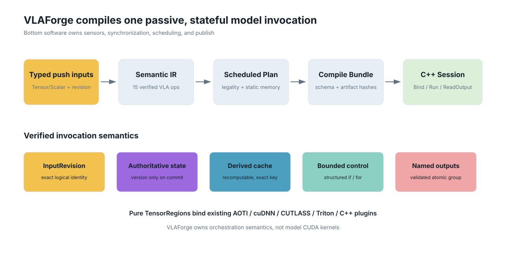
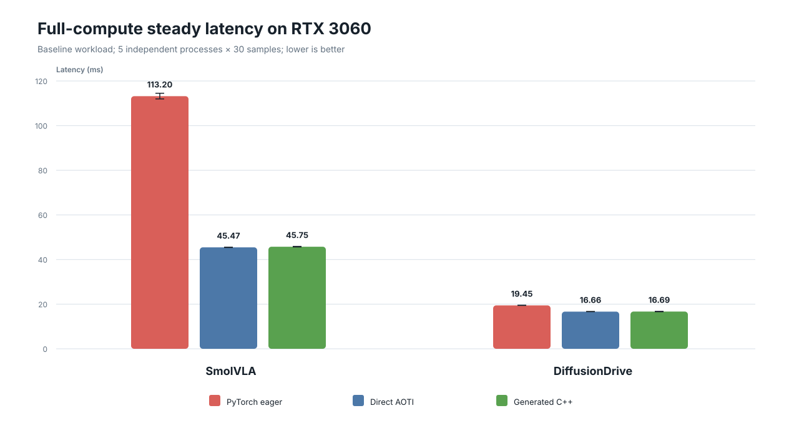
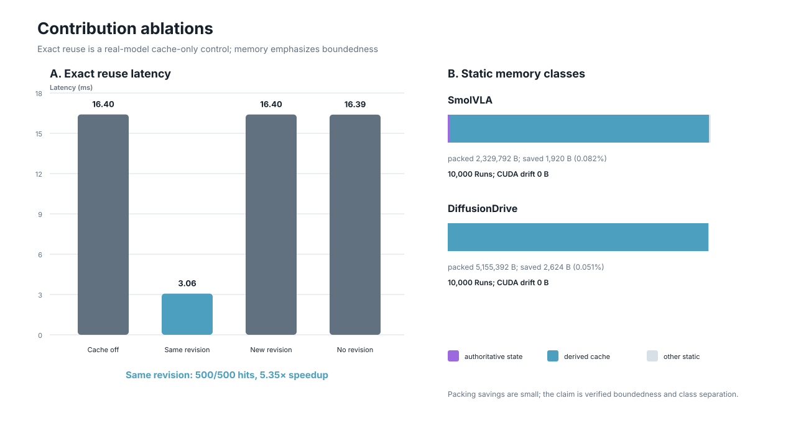

# VLAForge: Stateful Invocation Whole-Program Compilation for
# Vision-Language-Action Deployment

> Full paper draft, revision 0.2, 2026-07-27.
>
> This document is the paper-facing English draft. Exact source data live under
> `doc/reports/`; values in this draft must not be updated by hand without
> updating the corresponding machine-readable report.

## Abstract

Vision-language-action (VLA) deployment is not only a tensor-graph compilation
problem. A deployed policy may preserve action queues or recurrent state across
calls, reuse a visual-language prefix only when its logical inputs are
identical, carry autoregressive or diffusion state through bounded loops, and
return several outputs that must become visible atomically. These semantics are
usually implemented in Python or model-specific C++ glue, outside the scope of
tensor compilers and without a common correctness contract.

We present **VLAForge**, a whole-program compiler for caller-driven, stateful
VLA invocations. Its compact 15-operation Semantic IR represents stamped
external inputs, versioned authoritative state, pure tensor regions,
structured bounded control flow, exact derived-cache reuse, validation, and
transactional named output groups. The compiler derives exact-cache keys from
`InputRevision`, committed state versions, episode identity, and artifact
identity; separates non-discardable model state from recomputable caches; plans
bounded static memory; and generates a verified no-Python C++ Session with a
stable C ABI and model-specific typed wrapper.

We evaluate VLAForge on real SmolVLA and DiffusionDrive checkpoints on an
NVIDIA RTX 3060. Across five deterministic workloads, five fresh processes per
cell, and 30 steady-state samples per process, generated Sessions add
0.43--0.63% overhead over direct AOTInductor for SmolVLA and 0.15--0.71% for
DiffusionDrive, while preserving exact direct-artifact outputs. Safe repeated
input identity yields a 5.35x DiffusionDrive speedup; new or missing revisions
restore full computation. Failure injection confirms that invalid outputs do
not advance authoritative state or replace committed outputs, and 10,000-Run
soaks show zero CUDA-memory drift. A real MindDrive 0.5B deployment further
uses the frozen core for six-camera input, 16 authoritative states, and 10
trajectory/detection/motion outputs: a verified 66-artifact bundle runs through
both typed C++ and generic C APIs without Python, is bit-exact to its compiled
reference, and preserves commit/abort/reset semantics. A held-out real AutoVLA
decoder partition reuses the same core with zero new operations and exact
eager/export/Semantic/Plan trajectory and token outputs. The core therefore
covers robot action chunks and flow matching, autoregressive VLM and driving
trajectory tokens, driving diffusion, and a stateful multimodal driving VLA.
VLAForge does not claim new model kernels or real-time control scheduling; it
compiles the stateful model-invocation contract above existing tensor backends.

## 1. Introduction

Modern VLA policies combine large vision-language backbones with several
action-generation patterns. OpenVLA-style models autoregressively decode action
tokens. SmolVLA and related policies cache a visual-language prefix and solve a
continuous action head. Diffusion planners encode the scene once, carry a
candidate state through bounded denoising steps, score multiple trajectories,
and return perception auxiliaries. Chunked manipulation policies may consume a
persistent action queue across invocations.

Tensor compilers are effective inside each pure region, but the deployment
program extends beyond one `forward()`:

1. Is an external input logically identical to the previous input, or does it
   merely reuse the same address?
2. Which cross-call values are authoritative model state, and which are derived
   values that may be discarded and recomputed?
3. Which values are loop-carried through autoregressive, diffusion, or flow
   steps?
4. When validation or a backend fails, do state and outputs remain mutually
   consistent?
5. Can a bottom-software caller bind statically typed tensors and retrieve
   outputs through a stable ABI without embedding Python?

Today these questions are usually answered by framework-specific Python and
handwritten runtime glue. Pointer identity is not sufficient for safe reuse:
the same buffer can hold new sensor features, while a copied buffer can still
represent the same logical input. An action-queue cursor cannot be silently
discarded like a prefix cache. A trajectory and its score must not become
visible from different failed attempts. These are semantic properties, not
kernel-selection details.

VLAForge addresses this gap with a small, VLA-specific whole-program IR and an
auditable compilation path:

```text
push typed inputs + InputRevision
  -> snapshot authoritative state
  -> invoke pure compiled tensor regions
  -> execute bounded structured control
  -> validate a named output group
  -> atomically commit state and outputs
  -> return through typed C++ or generic C ABI
```

The runtime is passive. It exposes `Bind`, `Run`, and `ReadOutput`; it does not
own sensor acquisition, time synchronization, periodic scheduling, dropped
frames, ROS/Cyber topics, action publication, or a vehicle safety layer.



**Figure 1.** VLAForge compiles one passive stateful model invocation. Tensor
backends implement pure Regions; the compiler owns cross-Region identity,
state/cache, bounded control, output transaction, and the verified deployment
boundary.

This paper makes the following contributions:

1. **A compact VLA invocation IR.** We jointly represent typed stamped inputs,
   authoritative state snapshots, pure tensor regions, bounded `if`/`for`,
   exact reuse, and transactional named outputs in 15 operations. The IR is an
   orchestration layer above tensor backends, not another tensor algebra.
2. **Revision/version-guided reuse legality.** Exact reuse depends on logical
   input revisions, committed state versions, episode, model, and artifact
   identity. Missing revision is safe-by-default and forces change. We make the
   distinction between authoritative persistent state and recomputable derived
   cache explicit in verification and memory planning.
3. **Failure-safe verified C++ deployment.** VLAForge generates a no-Python
   C++ Session, a generic C ABI, and a model-specific typed wrapper. Bundle
   loading verifies schema, ABI, artifact hashes, and target metadata before
   execution; state and named outputs commit transactionally. The same
   verified boundary dynamically loads customer C++/CUDA preprocessing and
   feature Regions through a constrained Tensor/Scalar plugin ABI.
4. **Frozen-core evidence across VLA paradigms.** The same core expresses real
   robot flow/chunk, autoregressive OpenVLA, driving diffusion, and stateful
   MindDrive generated Sessions, a held-out real AutoVLA decoder partition,
   plus deterministic robot and driving fixtures. Held-out adapters add zero
   core operations.
5. **Paper-grade correctness and overhead evidence.** A 150-process-task CUDA
   matrix, four formal ablations, clean-wheel artifact evaluation, failure and
   retry injection, and 10,000-Run soaks quantify performance and semantic
   behavior.

## 2. Motivation and Problem Definition

### 2.1 Tensor graphs stop at the wrong boundary

`torch.export` captures a tensor computation with explicit inputs and outputs,
and AOTInductor packages such a program for non-Python execution. We use these
facilities as TensorRegion frontends and backends. They do not, by themselves,
define whether the output of a prior region may be reused in a later
invocation, how model state changes on a failed invocation, or whether a
multi-output result becomes visible atomically.

The relevant unit is therefore an **invocation**, not a control tick and not an
unbounded serving request:

$$
(\text{typed inputs}, \text{revisions}, \text{state snapshot})
\xrightarrow{\text{bounded region program}}
(\text{new state}, \text{named output group}).
$$

The bottom-software caller decides when to invoke this function. VLAForge
preserves the model semantics of each invocation.

### 2.2 Unsafe reuse is a semantic bug

Consider a cached visual prefix $C=f(X)$. An address-based cache may return
$C$ after a camera-feature buffer has been overwritten in place. A
timestamp-based cache is also insufficient: two buffers may describe the same
logical packed history, and clocks do not define content identity. VLAForge
therefore accepts an optional caller-provided `InputRevision`.

For a pure region $f$, the exact key is

$$
K_f = (\mathit{model}, \mathit{artifact}, \mathit{region},
\mathit{episode}, R_1,\ldots,R_m,V_1,\ldots,V_n),
$$

where $R_i$ are declared input revisions and $V_j$ are committed state
snapshot versions. Reusing a revision means “same logical data” under the
deployment contract. A new revision invalidates the entry. If a revision is
missing, each Bind/Run receives a fresh internal identity and cross-Run reuse is
forbidden.

### 2.3 State and cache have different correctness contracts

We distinguish four memory classes:

| Class | Lifetime and ownership | Examples |
|---|---|---|
| External I/O | caller-owned, borrowed until `Run` returns | images, features, trajectory buffers |
| Per-Run temporary | invocation-local, statically planned where possible | loop values, region intermediates |
| Authoritative state | persistent, versioned, cannot be silently discarded | queue/cursor, recurrent hidden, RNG |
| Derived cache | persistent optimization, may be invalidated/recomputed | VLM prefix/KV, condition encoding |

Discarding a derived cache changes latency but not model semantics. Discarding
authoritative state changes subsequent outputs. Treating both as an opaque
“cache” makes failure recovery and memory pressure unsafe.

### 2.4 Outputs are part of the transaction

An invocation may return an action chunk, one trajectory, $K$ candidate
trajectories and scores, map/detection auxiliaries, or VQA tokens. VLAForge does
not hard-code an `action` or `publish`. It constructs a pending named output
group, validates it, and commits it with staged authoritative state. A region,
backend, or validator failure aborts the attempt:

- state versions do not advance;
- staged state is discarded;
- no partial output group is visible;
- the previous committed output remains available to an explicit fallback
  policy, if configured by the adapter.

## 3. Design

### 3.1 System boundary

The Python Adapter declares a deployment contract; it does not pull sensors.
Each external input is a static Tensor or Scalar/POD with a stable ID, shape,
dtype, layout, device, alignment, ownership, required/optional/default status,
and optional bounded `valid_count` or mask. Ragged driving inputs use a
compile-time maximum profile plus runtime count/mask and never create unbounded
runtime allocation.

The generated C interface follows a stable push model:

```c
bind_tensor(session, input_id, tensor_view, optional_revision);
bind_scalar(session, input_id, scalar_value, optional_revision);
run(session);
read_output(session, output_id, output_view);
```

Code generation layers a model-specific `InputId`, `ModelInputs`,
`ModelOutputs`, and `ModelSession::Run(const Inputs&, Outputs*)` wrapper above
the same ABI. Input/output schemas and their digest are stored in the bundle.
A mismatch is rejected rather than silently rebinding a changed model.

### 3.2 Semantic IR

VLAForge 0.2 has six semantic concepts and 15 core operations:

| Concept | Operations |
|---|---|
| stamped input | `input.read` |
| transaction and snapshots | `txn.begin`, `state.read_latest`, `snapshot.value` |
| tensor computation | `invoke` |
| bounded control | `if`, `for`, `yield` |
| staged effects | `state.stage_write`, `validate`, `output.create`, `output.group` |
| commit and return | `txn.commit`, `txn.abort`, `return` |

There is no timer, clock domain, period, deadline, async scheduler, or publish
operation. An extension operation is admitted only if it cannot be expressed
as a TensorRegion and supplies schema/type verification, reference semantics,
Plan lowering, code generation/runtime support, and a serialization version.

### 3.3 Pure TensorRegions and plugins

A `TensorRegion` is a pure statically typed callable. Strict `torch.export`
capture and an effect audit reject hidden mutation, hidden RNG, and I/O.
Regions may bind AOTInductor, a custom C++/CUDA `RegionExecutable`, or another
verified backend. Preprocessing plugins may implement NV12/RGB conversion,
resize/normalize, point-cloud packing, CAN packing, or external BEV/agent/map
features, but their boundary remains static Tensor/Scalar ABI.

Model-specific routing remains inside a tensor graph when possible. A
cross-artifact fast/slow choice uses structured `if` or a verified artifact
variant; it does not create a model-named core opcode.

### 3.4 Authoritative state protocol

`state.read_latest` returns an immutable `(episode, version, value)` snapshot.
The invocation computes a pending write. `txn.commit` asks `StateStore` to
allocate the next version only after validation and output-group construction
succeed. Abort and failure never consume a version. `ResetEpisode` invalidates
cache entries, restores adapter-declared initial state, and changes episode
identity.

This protocol supports action queues and cursors as an Adapter template, but
does not require them. Stateless driving planners declare no authoritative
state. Autoregressive KV values inside one Run remain loop-carried SSA unless
the model explicitly defines them as cross-invocation state.

### 3.5 Exact and approximate reuse

Only pure regions may request exact memoization. The compiler verifies each
declared dependency and emits a certificate containing input IDs, state IDs,
and all required identity fields. A repeated revision can hit; a new or missing
revision misses. Episode reset and artifact/model identity are included.

Approximate diffusion reuse is a distinct future contract. It must carry loop
state explicitly and invoke a verified `ReuseGuard`; it cannot masquerade as
exact memoization. This paper evaluates exact reuse only.

### 3.6 Structured bounded control

Autoregressive decode, diffusion, and flow matching use a statically bounded
`for` with loop-carried SSA. Condition or prefix regions outside the loop are
eligible for exact cross-Run reuse. A structured `if` selects typed branches
with matching yields. Fixed bounds provide deterministic allocation and reject
unbounded model-side dynamic memory.

### 3.7 Plan lowering and memory

Lowering preserves Semantic IR dependencies and effects in a Scheduled Plan.
The memory planner assigns:

- borrowed external buffers;
- authoritative state rings sized from declared retention;
- non-aliasing derived-cache storage;
- packed per-Run temporary storage with verified live-range non-overlap.

The compilation certificate records semantic/schema/Plan digests, cache
legality, loop-invariance decisions, and baseline versus packed arena sizes.
The runtime never relies on an unsafe dynamic fallback for a declared static
buffer.

### 3.8 Compile Bundle and generated Session

A Compile Bundle contains Semantic IR, Plan, I/O schemas, stable IDs, artifact
manifests, target metadata, and hashes. Loading checks schema digest, ABI,
artifact hashes, target role, and path containment. Generated code uses the
same C ABI as the typed wrapper and returns only committed outputs. A
`RegionExecutable` is selected by verified artifact identity; it is not a
Python callback. External shared-library Regions are hash-checked before
`dlopen`, loaded with local symbol scope, and validated for callable ABI,
target, backend variant, and static Tensor/Scalar contracts.

## 4. Implementation

The reference implementation consists of:

- immutable Python IR classes, parser/serializer, and verifier;
- strict frontend capture and effect audit;
- canonicalization, exact-cache legality, loop analysis, Plan lowering, and
  static memory planning;
- deterministic Semantic IR and Plan interpreters;
- C++ Session, StateStore, exact cache, transaction/output store, artifact
  verifier, generic C ABI, and typed wrapper generator;
- AOTInductor and external C++ Region backends;
- robot and driving Adapter templates.

The frozen Semantic IR contains 15 operations. Real-model adapters do not
modify the core. VLAForge owns orchestration semantics and generated glue, not
the CUDA kernels inside AOTInductor, cuDNN, CUTLASS, Triton, or model-specific
backend artifacts.

## 5. Evaluation Methodology

### 5.1 Questions

We ask:

- **Q1 Correctness:** Do eager/exported, Semantic IR, Plan, direct artifact, and
  generated C++ outputs agree within declared numerical contracts?
- **Q2 Overhead:** How much latency does the generated Session add over direct
  invocation of identical compiled artifacts?
- **Q3 Reuse:** Does `InputRevision` produce hits only for identical logical
  input and meaningful end-to-end savings?
- **Q4 Failure safety:** Do validation failure and retry preserve state/output
  atomicity?
- **Q5 Memory:** Is memory bounded and stable, and does the planner keep
  authoritative state separate from derived cache?
- **Q6 Generality:** Can a frozen core cover robot and driving VLA paradigms,
  including generic multi-output planners?

### 5.2 Hardware and software

Experiments use one NVIDIA GeForce RTX 3060 (12 GiB, compute capability 8.6)
and Linux 6.8. Performance experiments use CUDA 12.8 and PyTorch
2.10.0+cu128. MindDrive deployment correctness uses LibTorch 2.4.1+cu118 on
the same CUDA 12.8 driver host. This is Host-CUDA evidence, not an Orin,
cross-GPU, power, thermal, or embedded-real-time claim.

### 5.3 Real models and evidence levels

| Model | Paradigm | Evidence used in this paper | Core op delta |
|---|---|---:|---:|
| SmolVLA | VLM prefix + flow action expert + chunk queue | real L4 | 0 |
| DiffusionDrive | condition encoder + two-step $K$-candidate diffusion | real L4 | 0 |
| OpenVLA | autoregressive VLM action tokens | real L4 | 0 |
| MindDrive 0.5B | six-camera VLM planner + 16-state map/detection memory | real L4 | 0 |
| AutoVLA | driving autoregressive trajectory tokens | held-out real L2 decoder partition | 0 |

We use the following evidence labels: L0 source/contract mapping; L1
deterministic executable fixture; L2 real frontend/eager parity; L3 real
compiled-artifact parity; and L4 real generated no-Python C++ Session parity.
Fixtures are never reported as real-model evidence.

### 5.4 Statistical protocol

For SmolVLA and DiffusionDrive, we evaluate eager PyTorch, direct CUDA AOTI,
and generated C++ Session on five deterministic workload profiles. Each cell
runs in five independent fresh processes with five warmups and 30 steady-state
measurements. The full matrix therefore has 30 cells, 150 process tasks, and
4,500 steady samples. We report mean, nearest-rank p50/p90/p99, process-mean
standard deviation, throughput, and 95% confidence intervals from 2,000
bootstrap resamples of independent-process clusters.

One timed interval is one complete model invocation with backend
synchronization. Setup, input upload, output probing, and report generation are
outside the interval. Cache hits and SmolVLA queue-consumption fast paths are
excluded from full-compute performance. Fresh-process initialization includes
process/model/artifact setup; first Run is reported separately. We do not force
drop the OS page cache.

## 6. Results

### 6.1 Correctness

All 50 workload/path output-parity cells pass. SmolVLA direct AOTI and generated
C++ produce the same complete `[1,50,6]` action chunk. DiffusionDrive matches
all candidate trajectories, scores, selected trajectory, BEV semantic map,
agent states, and agent labels. Typed C++ and generic C ABI outputs are equal.
MindDrive separately passes exact generated-vs-compiled and typed-vs-generic
parity for trajectory, path, two commands, detection scores/labels/boxes,
motion trajectories, valid mask, and valid count across its five-frame
stateful sequence.

The compiled artifacts use explicit model-specific numerical contracts relative
to eager BF16 execution; generated C++ is byte-exact to direct invocation of
those same artifacts. This separates model compilation numerics from VLAForge
orchestration correctness.

### 6.2 Steady-state performance and orchestration overhead

Baseline-workload results are:

| Model/path | Mean (ms) | p50 | p90 | p99 | process-mean std. | Throughput |
|---|---:|---:|---:|---:|---:|---:|
| SmolVLA eager | 113.198 | 113.064 | 115.454 | 116.585 | 1.662 | 8.83/s |
| SmolVLA direct AOTI | 45.466 | 45.174 | 46.255 | 48.116 | 0.089 | 21.99/s |
| SmolVLA generated Session | 45.752 | 45.359 | 46.489 | 48.634 | 0.176 | 21.86/s |
| DiffusionDrive eager | 19.451 | 19.456 | 19.759 | 19.863 | 0.048 | 51.41/s |
| DiffusionDrive direct AOTI | 16.663 | 16.656 | 17.241 | 17.286 | 0.031 | 60.01/s |
| DiffusionDrive generated Session | 16.688 | 16.711 | 17.288 | 17.349 | 0.109 | 59.92/s |

Across all five workloads, generated-session overhead relative to the direct
artifact is 0.43--0.63% for SmolVLA and 0.15--0.71% for DiffusionDrive. Mean
overhead is 0.508% and 0.509%, respectively. Direct/generated outputs are
exact. The eager-to-generated speedups (2.44--2.49x for SmolVLA and
1.16--1.17x for DiffusionDrive) are attributed to upstream AOTInductor
compilation, not VLAForge-owned CUDA kernels.



**Figure 2.** Full-compute baseline latency. Error bars are 95% bootstrap
confidence intervals over independent-process clusters.

### 6.3 Initialization, first Run, and memory

| Model/path | Fresh-process init. (ms) | First Run (ms) | Peak RSS (MiB) | Peak CUDA (MiB) |
|---|---:|---:|---:|---:|
| SmolVLA eager | 6,825.3 | 350.2 | 3,850.0 | 954.0 |
| SmolVLA direct AOTI | 2,425.8 | 247.3 | 1,925.6 | 50.0 |
| SmolVLA generated Session | 890.0 | 254.4 | 1,651.4 | 1,412.8 |
| DiffusionDrive eager | 2,399.4 | 224.1 | 1,757.9 | 324.0 |
| DiffusionDrive direct AOTI | 1,852.5 | 203.2 | 1,302.3 | 64.0 |
| DiffusionDrive generated Session | 289.1 | 203.0 | 1,027.8 | 884.8 |

These paths have different residency and loader boundaries, so their peak
memory and initialization values should not be read as a controlled allocator
comparison. The controlled performance comparison is generated Session versus
direct invocation of identical artifacts. The table instead documents the
deployment envelope and motivates reporting cold, first, and warm phases
separately.

### 6.4 Exact reuse

DiffusionDrive is the clean cache-only ablation because it has no action queue.

| Mode | Mean latency (ms) | Cache hits/misses | Full/mode speedup |
|---|---:|---:|---:|
| full/cache off control | 16.403 | 0/500 | 1.00x |
| same revision | 3.064 | 500/0 | 5.353x |
| new revision | 16.400 | 0/500 | 1.000x |
| missing revision | 16.391 | 0/500 | 1.001x |

The same-revision result saves the condition encoder and is not reported as
full-model latency. New revision and missing revision both restore full
computation, demonstrating safe invalidation. Every cell uses five independent
processes and 100 steady samples per process.

SmolVLA also shows revision-sensitive behavior, but its non-full modes include
the Adapter-owned queue/cursor fast path and are therefore not used as a
cache-only performance claim.

### 6.5 Static memory and long-run stability

| Model | Unpacked plan | Packed arena | Saved | Authoritative | Derived cache | 10k CUDA drift |
|---|---:|---:|---:|---:|---:|---:|
| SmolVLA | 2,331,712 B | 2,329,792 B | 1,920 B (0.082%) | 2,464 B | 2,314,353 B | 0 B |
| DiffusionDrive | 5,158,016 B | 5,155,392 B | 2,624 B (0.051%) | 0 B | 5,145,296 B | 0 B |

Lifetime packing provides only small byte savings for these two static
partitions; we do not claim a significant compression result. Its value is a
verified bounded allocation and explicit class separation. Both generated
Sessions complete 10,000 Runs with zero CUDA-memory drift; maximum RSS drift is
52 KiB for SmolVLA and 4 KiB for DiffusionDrive.

MindDrive uses a 56,559,808-byte per-Run static arena, a 3,351,680-byte
authoritative-state arena for 16 states, and a 39,321,600-byte derived cache.
Its separate 1,000-Run same-revision generated-Session soak records 16,000
state commits and 1,000 transactional output commits. All 16 state versions
finish at 1001 (one warmup plus 1,000 measured Runs), with zero sampled CUDA-
memory drift and 60 KiB Host-RSS drift.

### 6.6 Transaction failure and retry

We inject a non-finite model output into each real generated Session. Both
models record one transaction abort, preserve the prior committed output, and
then commit one successful retry. SmolVLA's authoritative queue/cursor version
sequence remains valid; the failed attempt advances no state version, while the
successful retry commits two state updates. Stateless DiffusionDrive commits no
state. The retry trace records one cache hit and one miss for each model,
showing that recomputable cache and authoritative state follow separate failure
contracts.



**Figure 3.** Exact InputRevision reuse and static-memory classification. The
same-revision DiffusionDrive path is explicitly a cache-hit result, not
full-compute latency. Arena packing provides small byte savings; boundedness
and class separation are the supported memory claims.

### 6.7 Deployment boundary

The clean-wheel evaluation installs VLAForge without repository test sources,
builds a bundle and generated C++ runner, and runs from a non-Git directory
under invalid `PYTHONHOME/PYTHONPATH`. `ldd` contains no `libpython`. Session-
and invocation-resident variants both pass, with maximum absolute numerical
error $4.34\times10^{-9}$. Eight negative contract cases per variant reject
schema, ABI, target, hash, and related mismatches.

### 6.8 Frozen-core generality

The model matrix covers:

- RT-1-like direct discrete action tokens with history/mask;
- ACT-like Adapter-owned action chunks and queue/cursor;
- Octo-like optional modalities and bounded diffusion;
- OpenVLA-like bounded autoregressive action tokens;
- SmolVLA/$\pi_0$-like prefix plus flow action expert;
- GR00T-like multi-embodiment DiT;
- stateless driving trajectory;
- driving autoregressive fast/slow branch;
- driving diffusion with $K$ candidates and scores;
- hybrid external BEV/agent/map features with multiple named outputs.

All use the same 15-op core. Held-out Octo, GR00T, and AutoVLA source/fixture
audits have `core_op_delta=0`. AutoVLA additionally reaches a real L2 decoder
partition: the released checkpoint supplies the final Qwen MLP, final norm and
action-vocabulary projection, while the released 2,048-entry codebook produces
transactional `trajectory [10,3]` and `action_tokens [10]` outputs. Eager,
strict export, Semantic IR, and Plan outputs are exact; revisions
`[100,100,101]` produce one hit and two misses. Peak CUDA allocated is
533,944,320 bytes and peak Host RSS is 1,473,228,800 bytes. This is a
correctness envelope, not a latency benchmark.

We also compiled the three partition Regions with the predefined conservative
AOTI profile. Tokens remained exact, trajectory maximum absolute error was
$1.91\times10^{-6}$, and repeated artifact runs were bit-exact. The decoder
and logits NRMSE values, however, were $6.65\times10^{-3}$ and
$4.54\times10^{-3}$, above the predeclared $10^{-3}$ Region threshold.
Accordingly we retain the result as L3-candidate and make only the L2 claim.

MindDrive supplies the complete stateful driving path. Its 8 logical Regions
are implemented by two verified static AOTI sequences and six direct raw AOTI
artifacts, for 66 physical artifacts total. The generated Session exposes 13
tensor inputs and 10 named outputs and initializes 16 authoritative state
slots. With invalid `PYTHONHOME/PYTHONPATH`, both the model-specific typed C++
wrapper and generic C ABI return all outputs bit-exact to the real compiled
reference and to each other. An execution audit records one exact cache hit,
eight misses, 128 state commits, eight transaction/output commits, one
validation abort followed by a successful retry, and one episode reset. The
Adapter adds no core operation.

As supplemental generated-L4 evidence, we also run four revision modes in five
independent fresh processes, with one warmup and ten measured Runs per process:

| MindDrive generated Session mode | Init mean | First Run mean | Warm mean | Warm-mean 95% CI |
|---|---:|---:|---:|---:|
| full | 4083.01 ms | 1388.93 ms | 1270.38 ms | [1263.47, 1276.01] ms |
| same | 4082.14 ms | 1392.75 ms | 260.01 ms | [259.86, 260.16] ms |
| new | 4075.96 ms | 1395.93 ms | 1279.27 ms | [1277.59, 1280.66] ms |
| missing | 4073.88 ms | 1398.62 ms | 1281.75 ms | [1281.26, 1282.16] ms |

Every same-revision process records 10 exact-cache hits and no misses; all
other modes record no hits and 10 misses. Same revision is approximately
4.92x faster than new revision. This demonstrates exact-reuse value and
generated-Session stability.

We separately execute an aligned MindDrive three-path control using the same
five real frames, fixed 16-state contract, and 66 physical artifacts. Each
path runs in five independent processes with five stateful warmup Runs and ten
measured Runs:

| MindDrive path | First Run mean | Warm mean | Warm-mean 95% CI |
|---|---:|---:|---:|
| official eager | 1629.26 ms | 1511.66 ms | [1504.59, 1515.41] ms |
| persistent direct AOTI | 1385.84 ms | 1275.17 ms | [1265.51, 1282.75] ms |
| generated no-Python C++ | 1394.94 ms | 1279.71 ms | [1275.59, 1283.34] ms |

Generated C++ adds 0.356% over the direct-artifact path and is 1.181x faster
than official eager. Direct/generated output probes are exact; eager/direct
maximum absolute error is $4.61\times10^{-5}$ under the predeclared
$3\times10^{-3}$ trajectory tolerance. We do not compare initialization
speed because eager includes official frontend preparation, direct includes
all persistent provider loads, and generated Session timing starts after C++
fixture loading.

## 7. Discussion

### 7.1 What VLAForge improves

VLAForge's measured direct-artifact overhead is approximately half a percent.
Its main benefit is not a new GEMM or attention kernel. It moves cross-region
VLA semantics from handwritten glue into a verifiable, serializable, and
code-generatable contract. When exact reuse applies, this semantic information
also enables large end-to-end savings.

### 7.2 Why not a scheduler

VLA scheduling systems address overlapping inference and action execution,
future-state prediction, and multi-rate control. Those problems are
complementary. VLAForge compiles a passive `Run`; the caller owns rate control,
history assembly, and publication. Adding clock/deadline semantics would
conflate the model deployment contract with robot middleware and weaken the
core abstraction.

### 7.3 Why action queues are not core

An action queue is appropriate for chunked manipulation adapters, but driving
planners commonly return a full trajectory or candidates and let an external
planning/control chain choose an execution prefix. Generic transactional output
groups cover both. This is validated by the stateless DiffusionDrive L4 path,
which returns six named outputs and has zero state commits.

## 8. Related Work

### Tensor capture and edge deployment

PyTorch
[`torch.export`](https://docs.pytorch.org/docs/main/user_guide/torch_compiler/export.html)
captures tensor programs, and
[AOTInductor](https://docs.pytorch.org/docs/stable/user_guide/torch_compiler/torch.compiler_aot_inductor.html)
packages them for non-Python execution.
[ExecuTorch](https://docs.pytorch.org/executorch/stable/getting-started-architecture)
provides a general edge AOT/runtime stack and backend delegation. VLAForge uses
such systems below TensorRegion boundaries and contributes the VLA invocation,
state/cache, transaction, and generated-session layer above them.

### VLA inference runtimes

[vla.cpp](https://arxiv.org/abs/2606.08094) is a portable C++ VLA inference
runtime supporting multiple backbone/action-head families, flow/diffusion, and
prefix caching.
[Embodied.cpp](https://arxiv.org/abs/2607.02501) organizes embodied inference
into adapters, sequence builders, backbones, head plugins, and deployment
adapters, and additionally targets heterogeneous multi-rate execution. These
systems demonstrate that portable VLA C++ inference alone is not a sufficient
novelty claim. VLAForge instead studies compiler-visible logical input
identity, authoritative/cache classification, transactional named outputs,
legality certificates, and a generated ABI from a small whole-program IR.

### VLA scheduling and cache optimization

[ActionFlow](https://arxiv.org/abs/2512.20276) pipelines cross-request OpenVLA
prefill/decode and uses a unified KV ring buffer.
[Reflex](https://arxiv.org/abs/2607.14695) partitions static, sliding, and
dynamic flow-VLA context to enable mathematically valid streaming reuse.
[VLASH](https://arxiv.org/abs/2512.01031) predicts future execution state for
asynchronous VLA inference. These works optimize scheduling or model-specific
streaming semantics. VLAForge does not claim their control scope; it provides a
safe passive invocation boundary and currently evaluates exact, not
approximate, reuse.

### Stateful and agent-guided deployment

[FlashRT](https://arxiv.org/abs/2607.18171) uses an agent-guided
chain-of-program process, an IR with persistent-state scopes, a sequential
interpreter, and measurement-gated multi-GPU transformations. Therefore,
“persistent-state IR” or agent-driven deployment is not novel in isolation.
VLAForge narrows its claim to VLA-specific input identity, the semantic split
between authoritative state and derived cache, state/output atomicity, bounded
robot/driving control, and verified bottom-software C/C++ integration.

## 9. Limitations

1. Performance is measured on one RTX 3060, CUDA 12.8, and `sm_86`. We do not
   claim cross-GPU, embedded, power, thermal, or Orin performance.
2. OpenVLA L4 uses invocation-resident weight paging and is reported as a
   correctness/deployment audit. Its 89.61-second runner time is not a latency
   benchmark, a resident-weight comparison, or evidence of edge real-time
   performance.
3. The held-out AutoVLA evidence is a real-weight decoder partition rather than
   full camera/prompt/VLM-prefill capture. Its conservative AOTI attempt is an
   L3-candidate, not promoted L3, because intermediate Region NRMSE exceeds the
   predeclared threshold despite exact tokens and near-exact trajectory.
   Claims must remain partition-scoped.
4. Static arena packing saves few bytes in the evaluated real partitions; its
   demonstrated contribution is boundedness and correctness, not compression.
5. Exact reuse requires a trustworthy caller-provided revision. VLAForge
   enforces safe behavior when it is missing but cannot prove that an external
   producer assigned a truthful revision.
6. Approximate diffusion caching is not evaluated. It requires an explicit
   guard contract and is not interchangeable with exact memoization.
7. We do not evaluate real-vehicle closed loop, sensor synchronization,
   middleware integration, periodic scheduling, dropped frames, publication,
   or vehicle safety. These are intentionally outside the model compiler.
8. A second-machine independent artifact reproduction remains valuable future
   evidence but is not required for the current Host-CUDA claim.

## 10. Reproducibility and Artifact Evaluation

The artifact contains:

- wheel-only installation and clean non-Git evaluation instructions;
- pinned environment and bundle manifests;
- raw JSON/CSV for the 150-task performance matrix;
- raw JSON/CSV for 40 exact-reuse tasks and three other formal ablations;
- the held-out AutoVLA real L2 report and non-promoted L3-candidate audit;
- the MindDrive real L3 held-out index and clean-worktree real L4 generated
  bundle/report, four-mode generated benchmark, and 1,000-Run stateful soak;
- the OpenVLA real L3 artifact audit and clean-worktree weight-paged real L4
  bundle/report with raw-artifact failure/retry evidence;
- checkpoint, source, export, artifact, bundle, and runner hashes;
- generated C/C++ schema and ABI negative tests;
- a dynamically loaded external BEV/agent/route Region fixture with
  typed/generic parity, exact-cache, failure/retry, tamper, and no-Python
  evidence;
- Python, CPU CTest, CUDA CTest, live CUDA AOTI, and no-Python gates.

Large checkpoints, compiled packages, and profiler databases are identified by
SHA-256 and archived separately; they are not committed to Git.

## 11. Claim Boundary

The strongest supported claim is:

> VLAForge compiles a small, stateful VLA invocation program into a verified
> no-Python C++ Session. Explicit input identity, authoritative state versions,
> recomputable derived cache, bounded control, and transactional named outputs
> provide safe cross-Run reuse and failure recovery with approximately 0.5%
> orchestration overhead over identical direct artifacts on two real Host-CUDA
> VLA workloads.

We do **not** claim:

- new or optimized model CUDA kernels;
- the first C++ VLA runtime;
- real-time, power, thermal, or embedded performance;
- ownership of sensor, control-loop, middleware, or safety behavior;
- real support for a model based only on a fixture;
- exact parity between eager BF16 and every compiler backend where the
  declared numerical contract is tolerant.

## 12. Conclusion

VLA deployment requires a program boundary wider than one tensor graph but
narrower than an entire robot stack. VLAForge makes that boundary explicit:
typed stamped inputs, versioned authoritative state, pure compiled regions,
bounded control, exact derived-cache reuse, and transactional named outputs.
The resulting IR remains small, generates a verified C++ Session, and covers
robot and driving VLA paradigms without model-specific core operations. Real
Host-CUDA experiments show that this semantic layer adds about half a percent
over direct artifacts while enabling safe reuse and failure recovery. The
result is a compiler for stateful VLA invocations, not a scheduler or a kernel
library.
